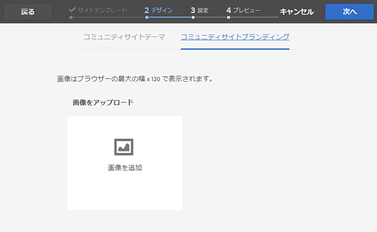

# コミュニティサイトの作成{#author-a-new-community-site}

## コミュニティサイトの作成 {#create-a-community-site}

オーサーインスタンスを使用して、コミュニティサイトを作成します。 AEM オーサーインスタンス上：

1. 管理者権限でログインします。
1. グローバルナビゲーションから、**[!UICONTROL Communities]**/**[!UICONTROL Sites]** に移動します。

コミュニティサイトコンソールには、コミュニティサイトを作成する手順をガイドするウィザードが用意されています。 `Next` のステップに進むか、最後のステップでサイトをコミットする前の前のステップに `Back` すことができます。

コミュニティサイトの作成を開始するには：

* 「`Create`」ボタンを選択します。

### 手順 1：サイトテンプレート {#step-site-template}

[ サイトテンプレートの手順 ](/help/communities/sites-console.md#step2013asitetemplate) で、タイトル、説明、URL の名前を入力し、コミュニティサイトテンプレートを選択します。例：

* **コミュニティサイトのタイトル**: `Getting Started Tutorial`
* **コミュニティ サイトの説明**: `A site for engaging with the community.`
* **コミュニティサイトのルート**:（デフォルトのルート `/content/sites` ートの場合は空白のままにします）
* **クラウド設定**:（クラウド設定が指定されていない場合は空白のままにします）指定したクラウド設定へのパスを指定します。
* **コミュニティサイトのベース言語**:（単一言語の場合は影響はありません：英語）ドロップダウンリストを使用して、利用可能な言語から 1 つ *または複数* ベース言語を選択します（ドイツ語、イタリア語、フランス語、日本語、スペイン語、ポルトガル語（ブラジル）、中国語（繁体字）、中国語（簡体字））。 追加した言語ごとに 1 つのコミュニティサイトが作成され、[ 多言語サイトのコンテンツの翻訳 ](/help/sites-administering/translation.md) に記載されているベストプラクティスに従って、同じサイトフォルダー内に存在します。 各サイトのルートページには、選択した言語のいずれかの言語コード（英語の場合は「en」、フランス語の場合は「fr」など）で命名された子ページが含まれています。

* **コミュニティサイト名**: engage

   * サイトを作成した後で名前を変更することは容易ではないため、名前を再確認してください
   * 最初の URL はコミュニティサイト名の下に表示されます
   * 有効な URL の場合は、ベース言語コード + 「.html」を付加します
   * *例えば* https://localhost:4502/content/sites/のように指定します `engage/en.html`。

* **テンプレート**：プルダウンして `Reference Site` を選択

* 「**次へ**」を選択します。

### 手順 2：デザイン {#step-design}

デザイン手順は、テーマとブランディングバナーを選択する 2 つのセクションで表示されます。

#### コミュニティサイトテーマ {#community-site-theme}

テンプレートに適用するスタイルを選択します。 選択すると、テーマがチェックマークと共にオーバーレイされます。

#### コミュニティサイトのブランディング {#community-site-branding}

（オプション）サイトページ全体に表示するバナー画像をアップロードします。 バナーは、コミュニティサイトのヘッダーとナビゲーションリンクの間で、ブラウザーの左端にピン留めされます。 バナーの高さは 120 ピクセルに切り抜かれます。 ブラウザーの幅と 120 ピクセルの高さに合わせてバナーのサイズを変更することはできません。

「**次へ**」を選択します。

### 手順 3：設定 {#step-settings}

「設定」ステップでは、「`Next`」を選択する前に 7 つのセクションで、ユーザー管理、タグ付け、モデレート、グループ管理、分析および翻訳に関する設定にアクセスできます。

#### User Management {#user-management}

[User Management](/help/communities/sites-console.md#user-management) のすべてのチェックボックスをオンにします。

* サイト訪問者に自己登録を許可するには
* サイト訪問者がログインせずにサイトを表示できるようにするには
* メンバーが他のコミュニティ メンバーとのメッセージの送受信を許可するには
* プロファイルを登録して作成する代わりに、Facebookへのログインを許可するには
* プロファイルを登録して作成する代わりに、Twitterでログインを許可するには

>[!NOTE]
>
>実稼動環境の場合は、カスタムのFacebookとTwitterアプリケーションを作成する必要があります。 [FacebookとTwitterを使用したソーシャルログイン ](/help/communities/social-login.md) を参照してください。

#### タグ設定 {#tagging}

コミュニティコンテンツに適用されるタグは、以前に [ タグ付けコンソール ](/help/sites-administering/tags.md#tagging-console) で定義されたAEM名前空間（[ チュートリアル名前空間 ](/help/communities/setup.md#create-tutorial-tags) など）を選択して制御されます。

先行入力検索を使用すると、名前空間を簡単に見つけることができます。 例：

* 型 `tut`
* `Tutorial` を選択します。

#### 役割 {#roles}

[ コミュニティメンバーの役割 ](/help/communities/users.md) は、「役割」セクションの設定を通じて割り当てられます。

コミュニティメンバー（またはメンバーのグループ）にコミュニティマネージャーとしてサイトを体験させるには、先行入力検索を使用して、ドロップダウンのオプションからメンバーまたはグループ名を選択します。

例：

* 型 `q`
* クイン ハーパーを選択

>[!NOTE]
>
>[ トンネルサービス ](https://helpx.adobe.com/jp/experience-manager/6-3/help/communities/deploy-communities.html#tunnel-service-on-author) を使用すると、パブリッシュ環境にのみ存在するメンバーとグループを選択できます。

#### モデレート {#moderation}

[ モデレート ](/help/communities/sites-console.md#moderation) ユーザー生成コンテンツ（UGC）については、デフォルトのグローバル設定を受け入れます。

#### ANALYTICS {#analytics}

Adobe Analyticsのライセンスが取得されていて、Analytics Cloud サービスおよびフレームワークが設定されている場合は、Analytics を有効にしてフレームワークを選択できます。

[ コミュニティ機能のための Analytics 設定 ](/help/communities/analytics.md) を参照してください。

#### 翻訳 {#translation}

[ 翻訳設定 ](/help/communities/sites-console.md#translation) では、サイトのベース言語と、UGC を翻訳するかどうか、および翻訳する場合はどの言語に翻訳するかを指定します。

* 「**機械翻訳を許可**」にチェックを入れます
* デフォルトの機械翻訳サービスでは、翻訳用にデフォルトの言語を選択したままにします
* デフォルトの翻訳プロバイダーおよび設定のままにする
* 言語コピーがないので、グローバルストアは不要です
* 「**ページ全体を翻訳**」を選択します
* デフォルトの永続性オプションのままにします

### 手順 4:Communities サイトの作成 {#step-create-communities-site}

「**作成**」を選択します。

処理が完了すると、新しいサイトのフォルダーが Communities - Sites コンソールに表示されます。

## コミュニティサイトのPublish {#publish-the-community-site}

作成したサイトは、Communities - Sites コンソール（新しいサイトを作成する場所と同じコンソール）から管理する必要があります。

コミュニティサイトのフォルダーを選択して開いたら、サイトアイコンにマウスポインターを置いて、4 つのアクションアイコンを表示します。

4 番目の省略記号アイコン（その他のアクション）を選択すると、「サイトをエクスポート」および「サイトを削除」オプションが表示されます。

左から右に向かって、次のようになります。

* **サイトをオープン**

  鉛筆アイコンを選択すると、オーサー編集モードでコミュニティサイトが開き、ページコンポーネントを追加または設定できます。

* **サイトの編集**

  プロパティアイコンを選択すると、タイトルやテーマを変更するなど、プロパティを変更するためのコミュニティサイトが開きます。

* **Publish サイト**

  ワールド アイコンを選択すると、コミュニティサイトが公開されます（例えば、公開サーバーがローカルマシンで実行されている場合は、デフォルトで localhost:4503 に公開されます）。

* **サイトのエクスポート**

  書き出しアイコンを選択すると、コミュニティサイトのパッケージが作成され、その両方が [ パッケージマネージャー ](/help/sites-administering/package-manager.md) に保存されてダウンロードされます。 UGC はサイトパッケージには含まれていません。

* **サイトの削除**

  削除アイコンを選択すると、**[!UICONTROL コミュニティ/サイトコンソール]** 内からコミュニティサイトが削除されます。 この操作により、UGC、ユーザーグループ、アセット、データベースレコードなど、サイトに関連付けられているすべての項目が削除されます。

>[!NOTE]
>
>パブリッシュインスタンスにデフォルトポート 4503 を使用しない場合は、デフォルトのレプリケーションエージェントを編集してポート番号を正しい値に設定します。
>
>オーサーインスタンスのメインメニューで、次の操作を行います。
>
>1. **[!UICONTROL ツール]**/**[!UICONTROL オペレーション]**/**[!UICONTROL レプリケーション]** メニューに移動します。
>1. **[!UICONTROL 作成者のエージェント]** を選択します。
>1. **[!UICONTROL デフォルトエージェント（公開）]** を選択します。
>1. **[!UICONTROL 設定]** の横にある「**[!UICONTROL 編集]**」を選択します。
>1. エージェント設定のポップアップダイアログで、「**[!UICONTROL トランスポート]**」タブを選択します。
>1. URI で、ポート番号 4503 を目的のポート番号に変更します。 例えば、ポート 6103 を使用するには、https://localhost:6103/bin/receive?sling:authRequestLogin=1のように指定します。
>1. 「**[!UICONTROL OK]**」を選択します。
>1. （任意）レプリケーションキューをリセットするには、**[!UICONTROL 消去]** または **[!UICONTROL 強制再試行]** を選択します。

### Publishを選択 {#select-publish}

パブリッシュサーバーが実行されていることを確認したら、世界アイコンを選択してコミュニティサイトを公開します。

コミュニティサイトが正常に公開されると、「サイトが公開されました」というメッセージが短時間表示されます。

### 新しいコミュニティユーザーグループ {#new-community-user-groups}

新しいコミュニティサイトと共に、新しいユーザーグループが作成されます。このユーザーグループには、様々な管理機能に対する適切な権限が設定されています。 詳しくは、[ コミュニティサイトのユーザーグループ ](/help/communities/users.md#usergroupsforcommunitysites) を参照してください。

この新しいコミュニティサイトでは、手順 1 で「engage」というサイト名を指定すると、[ グループコンソール ](/help/communities/members.md) （グローバルナビゲーション：コミュニティ、グループ）から 4 つの新しいユーザーグループが表示されます。

* Community Engage コミュニティマネージャー
* Community Engage グループ管理者
* Community Engage メンバー
* Community Engage モデレーター
* Community Engage 特権メンバー
* コミュニティエンゲージメントサイトコンテンツマネージャー

[ アーロン・マクドナルド ](/help/communities/tutorials.md#demo-users) は

* Community Engage コミュニティマネージャー
* Community Engage モデレーター
* Community Engage メンバー（モデレータグループのメンバーとして間接的に）

#### https://localhost:4503/content/sites/engage/en.html {#http-localhost-content-sites-engage-en-html}

## 認証エラーの設定 {#configure-for-authentication-error}

サイトが設定され、公開にプッシュされたら、パブリッシュインスタンスで [ ログインマッピングを設定 ](/help/communities/sites-console.md#configure-for-authentication-error) （`Adobe Granite Login Selector Authentication Handler`）します。 利点は、ログイン資格情報が正しく入力されなかった場合、認証エラーによってコミュニティサイトのログインページがエラーメッセージで再表示されることです。

`Login Page Mapping` を次として追加

* `/content/sites/engage/en/signin:/content/sites/engage/en`

## オプションの手順 {#optional-steps}

### 既定のホーム ページの変更 {#change-the-default-home-page}

デモ目的でパブリッシュサイトを使用する場合は、デフォルトのホームページを新しいサイトに変更すると便利です。

それには、[CRXDE](https://localhost:4503/crx/de) Lite を使用して、公開時に [resource-mapping](/help/sites-deploying/resource-mapping.md) テーブルを編集する必要があります。

開始するには：

1. パブリッシュインスタンスで、管理者権限でログインします。
1. [https://localhost:4503/crx/de](https://localhost:4503/crx/de) を参照します。
1. プロジェクト ブラウザで、`/etc/map.` を展開します。
1. `http` ノードを選択します。

   * 「**ノードを作成：**」を選択します。

      * **名前** localhost.4503
（「:」を使用 *な*）

      * **Type** [sling:Mapping](https://sling.apache.org/documentation/the-sling-engine/mappings-for-resource-resolution.html)

1. 新しく作成された `localhost.4503` ノードが選択された状態：

   * プロパティを追加：

   * **名前** sling:match
      * **型** 文字列
      * **値** localhost.4503/$
（&#39;$&#39;文字で終わる必要があります）

   * プロパティを追加：

      * **名前** sling:internalRedirect
      * **型** 文字列
      * **値** /content/sites/engage/en.html

1. **すべて保存** を選択します。
1. （任意）ブラウジング履歴を削除します。
1. https://localhost:4503/を参照します。

   * https://localhost:4503/content/sites/engage/en.htmlに到着

>[!NOTE]
>
>無効にするには、`sling:match` プロパティの値の前に「x」～「`xlocalhost.4503/$`」と「**すべて保存** を付けるだけです。

#### トラブルシューティング：マップの保存エラー {#troubleshooting-error-saving-map}

変更を保存できない場合は、`localhost` は有効な名前空間プレフィックスではないため、ノード名が `localhost.4503` で、「ドット」区切り文字が `localhost:4503` で、「コロン」区切り文字が使用されていないことを確認してください。

#### トラブルシューティング：リダイレクトに失敗する {#troubleshooting-fail-to-redirect}

正規表現 `sling:match`string の末尾にある「**$**」は重要であり、`https://localhost:4503/` のみがマッピングされます。そうでない場合、リダイレクト値のプレフィックスが URL の server:port の後に存在する可能性のあるパスに設定されます。 そのため、AEMがログインページにリダイレクトしようとすると、失敗します。

### サイトの変更 {#modify-the-site}

サイトが最初に作成されたら、作成者は [ サイトを開くアイコン ](/help/communities/sites-console.md#authoring-site-content) を使用して、標準のAEM オーサリングアクティビティを実行できます。

また、管理者は [ サイトを編集 ](/help/communities/sites-console.md#modifying-site-properties) アイコンを使用して、サイトのプロパティ（タイトルなど）を変更できます。

変更後、必ずサイトを **保存** して **Publish** し直してください。

>[!NOTE]
>
>AEMに詳しくない場合は、[ 基本操作 ](/help/sites-authoring/basic-handling.md) および [ ページのオーサリングのクイックガイド ](/help/sites-authoring/qg-page-authoring.md) に関するドキュメントを参照してください。
