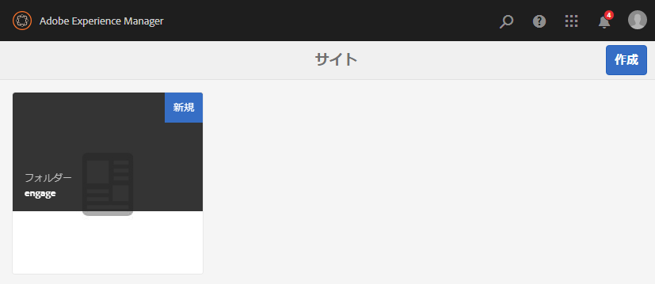

# 新しいコミュニティサイトの作成{#author-a-new-community-site}

## コミュニティサイトの作成 {#create-a-community-site}

オーサーインスタンスを使用してコミュニティサイトを作成します。 AEM オーサーインスタンスで、次の操作を実行します。

1. 管理者権限でサインインします。
1. グローバルナビゲーションから、に移動します。 **[!UICONTROL コミュニティ]** > **[!UICONTROL サイト]**.

コミュニティサイトコンソールでは、コミュニティサイトを作成する手順を案内するウィザードが提供されます。を `Next` 手順または `Back` を前の手順に戻してから、最後の手順でサイトをコミットします。

新しいコミュニティサイトの作成を開始するには：

* を選択します。 `Create` 」ボタンをクリックします。

### 手順 1：サイトテンプレート {#step-site-template}

[「サイトテンプレート」の手順](/help/communities/sites-console.md#step2013asitetemplate)では、URL のタイトル、説明、名前を入力し、コミュニティサイトテンプレートを選択します。次に例を示します。

* **コミュニティサイトのタイトル**: `Getting Started Tutorial`
* **コミュニティサイトの説明**: `A site for engaging with the community.`
* **コミュニティサイトのルート**:（デフォルトのルートの場合は空白のままにします） `/content/sites`)
* **クラウド設定**：（クラウド設定が指定されていない場合は空欄のままにする）指定されたクラウド設定へのパスを入力します。
* **コミュニティサイトの基本言語**:（単一言語の場合は、手を付けないでください）。英語 ) ドロップダウンリストを使用して、1 つを選択します *以上* 使用可能な言語 ( ドイツ語、イタリア語、フランス語、日本語、スペイン語、ポルトガル語（ブラジル）、中国語（繁体字）、中国語（簡体字）)) のベース言語。 追加された言語ごとに 1 つのコミュニティサイトが作成され、 [多言語サイトのコンテンツの翻訳](/help/sites-administering/translation.md). 各サイトのルートページには、選択したいずれかの言語の言語コード（例えば、英語では「en」、フランス語では「fr」）で名付けられた子ページが含まれます。

* **コミュニティサイト名**：engage

   * サイトの作成後に名前が簡単に変更されないので、名前を再確認します。
   * 初期 URL がコミュニティサイト名の下に表示されます
   * 有効な URL に、ベース言語コード+ &quot;.html&quot;を追加します。
   * *例：*, https://localhost:4502/content/sites/ `engage/en.html`

* **テンプレート**:引っ張って選ぶ `Reference Site`

* 「**次へ**」を選択します。

### 手順 2：デザイン {#step-design}

デザインの手順は、テーマとブランディングバナーを選択するための 2 つの節で説明します。

#### コミュニティサイトテーマ {#community-site-theme}

目的のスタイルを選択し、テンプレートに適用します。選択すると、テーマはチェックマークでオーバーレイされます。

#### コミュニティサイトブランディング {#community-site-branding}

（オプション）サイトのページ全体に表示するバナー画像をアップロードします。 バナーは、ブラウザーの左端、コミュニティサイトのヘッダーとナビゲーションリンクの間に固定されています。 バナーの高さは 120 ピクセルに切り詰められます。バナーがブラウザーの幅や 120 ピクセルの高さに合わせてリサイズされることはありません。

「**次へ**」を選択します。

### 手順 3：設定 {#step-settings}

設定ステップで、選択する前に `Next`ユーザー管理、タグ付け、モデレート、グループ管理、分析、翻訳およびイネーブルメントに関する設定にアクセスできる 7 つのセクションがあることに注意してください。

次にアクセス： [AEM Communities使用の手引き](/help/communities/getting-started-enablement.md) イネーブルメント機能を使用する方法を学ぶためのチュートリアルです。

#### ユーザー管理 {#user-management}

「[ユーザー管理](/help/communities/sites-console.md#user-management)」タブのチェックボックスをすべてオンにします。

* サイト訪問者に自己登録を許可するには
* サイト訪問者がサインインせずにサイトを表示できるようにするには
* メンバーが他のコミュニティメンバーからメッセージを送受信できるようにするには
* プロファイルの登録と作成の代わりにFacebookでのログインを許可するには
* プロファイルの登録と作成の代わりにTwitterでのログインを許可するには

>[!NOTE]
>
>実稼動環境では、カスタムの Facebook アプリケーションおよび Twitter アプリケーションを作成する必要があります。[Facebook と Twitter を使用したソーシャルログイン](/help/communities/social-login.md)を参照してください。

#### タグ付け {#tagging}

コミュニティコンテンツに適用できるタグを制御するには、以前に [タグ付けコンソール](/help/sites-administering/tags.md#tagging-console) ( [チュートリアル名前空間](/help/communities/setup.md#create-tutorial-tags)) をクリックします。

名前空間は先行入力検索で簡単に検索できます。例：

* 型 `tut`
* 選択 `Tutorial`

#### 役割 {#roles}

[コミュニティメンバーの役割](/help/communities/users.md) は、「役割」セクションの設定を通じて割り当てられます。

コミュニティメンバー（またはメンバーのグループ）がコミュニティマネージャーとしてサイトを体験するには、先行入力検索を使用して、ドロップダウンのオプションからメンバーまたはグループ名を選択します。

例：

* 型 `q`
* 選択 [クインハーパー](/help/communities/enablement-setup.md#publishcreateenablementmembers)

>[!NOTE]
>
>[トンネルサービス](https://helpx.adobe.com/experience-manager/6-3/help/communities/deploy-communities.html#tunnel-service-on-author) パブリッシュ環境にのみ存在するメンバーとグループを選択できます。

#### モデレート {#moderation}

のデフォルトのグローバル設定を受け入れる [モデレート](/help/communities/sites-console.md#moderation) ユーザー生成コンテンツ (UGC)。

#### ANALYTICS {#analytics}

Adobe Analytics のライセンスを持っていて、Analytics のクラウドサービスおよびフレームワークが設定されている場合は、Analytics を有効にしてフレームワークを選択できます。

[コミュニティ機能のための Analytics の設定](/help/communities/analytics.md)を参照してください。

#### 翻訳 {#translation}

[翻訳設定](/help/communities/sites-console.md#translation)では、サイトの基本言語に加えて、UGC の翻訳を許可するかどうかと、どの言語に翻訳するかを指定します。

* チェック **機械翻訳を許可**
* デフォルトの機械翻訳サービスで翻訳用に選択されたデフォルトの言語をそのまま使用
* デフォルトの翻訳プロバイダーと設定のままにします。
* 言語コピーがないので、グローバルストアは不要です
* 選択 **ページ全体を翻訳**
* デフォルトの永続性オプションをそのままにする

#### イネーブルメント {#enablement}

エンゲージメントコミュニティを作成する場合は空白のままにします。

[イネーブルメントコミュニティ](/help/communities/overview.md#enablement-community)をすばやく作成する方法のチュートリアルについて詳しくは、[イネーブルメントのための AEM Communities 使用の手引き](/help/communities/getting-started-enablement.md)を参照してください。

「**次へ**」を選択します。

### 手順 4：コミュニティサイトの作成 {#step-create-communities-site}

選択 **を作成します。**

プロセスが完了すると、新しいサイトのフォルダーがコミュニティサイトコンソールに表示されます。

## コミュニティサイトを公開 {#publish-the-community-site}

作成したサイトは、コミュニティ - サイトコンソールで管理する必要があります。このコンソールは、新しいサイトを作成するコンソールと同じものです。

コミュニティサイトのフォルダーを選択して開いた後、サイトアイコンにマウスカーソルを合わせると 4 つのアクションアイコンが表示されます。

4 つ目の省略記号アイコン（その他のアクション）を選択すると、「サイトを書き出し」および「サイトを削除」オプションが表示されます。

各アイコンの機能は次のとおりです（左から右の順に説明）。

* **サイトを開く**

   鉛筆アイコンを選択してコミュニティサイトをオーサリング編集モードで開き、ページコンポーネントを追加または設定します。

* **サイトを編集**

   プロパティアイコンを選択してコミュニティサイトを開き、タイトルやテーマの変更などのプロパティを変更します。

* **サイトを公開**

   コミュニティサイトを公開する場合は、世界アイコンを選択します（例えば、公開サーバーがローカルマシンで実行されている場合は、デフォルトで localhost:4503 に公開します）。

* **サイトを書き出し**

   書き出しアイコンを選択して、コミュニティサイトのパッケージを作成します。このパッケージが、[パッケージマネージャー](/help/sites-administering/package-manager.md)に格納され、ダウンロード可能になります。UGC はサイトパッケージに含まれていません。

* **サイトを削除**

   削除アイコンを選択して、内からコミュニティサイトを削除します。 **[!UICONTROL コミュニティ/サイトコンソール]**. サイトを削除すると、UGC やユーザーグループ、アセット、データベースレコードなど、そのサイトに関連付けられているアイテムがすべて削除されます。

>[!NOTE]
>
>パブリッシュインスタンスにデフォルトポートの 4503 を使用していない場合は、デフォルトのレプリケーションエージェントを編集し、ポート番号を正しい値に設定します。
>
>オーサーインスタンスで、メインメニューから：
>
>1. に移動します。 **[!UICONTROL ツール]** > **[!UICONTROL 運用]** > **[!UICONTROL レプリケーション]** メニュー
>1. 選択 **[!UICONTROL 作成者のエージェント]**.
>1. 選択 **[!UICONTROL デフォルトエージェント (publish)]**.
>1. 次の隣 **[!UICONTROL 設定]**&#x200B;を選択します。 **[!UICONTROL 編集]**.
>1. エージェント設定のポップアップダイアログで、 **[!UICONTROL 輸送]** タブをクリックします。
>1. URI で、ポート番号 4503 を目的のポート番号に変更します。 例えば、ポート 6103 を使用するには、次のようにします。https://localhost:6103/bin/receive?sling:authRequestLogin=1
>1. 「**[!UICONTROL OK]**」を選択します。
>1. （オプション）「 」を選択します。 **[!UICONTROL クリア]** または **[!UICONTROL 再試行を強制]** レプリケーションキューをリセットします。

### サイトの公開 {#select-publish}

公開サーバーが実行中であることを確認したら、地球のアイコンを選択して、コミュニティサイトを公開します。

コミュニティサイトが正常に公開されると、「サイトが公開されました」というメッセージが短時間表示されます。

### 新しいコミュニティユーザーグループ {#new-community-user-groups}

新しいコミュニティサイトとともに、新しいユーザーグループが作成されます。各グループには、様々な管理機能に応じて適切な権限が設定されています。詳しくは、 [コミュニティサイトのユーザーグループ](/help/communities/users.md#usergroupsforcommunitysites).

この新しいコミュニティサイトでは、手順 1 で「engage」というサイト名を指定したので、[グループコンソール](/help/communities/members.md)（グローバルナビゲーション：コミュニティ／グループ）で以下に示す 4 つの新しいユーザーグループを確認できます。

* コミュニティエンゲージコミュニティマネージャー
* コミュニティエンゲージグループ管理者
* コミュニティ Engage メンバー
* コミュニティ Engage モデレーター
* コミュニティエンゲージ権限を持つメンバー
* コミュニティエンゲージサイトコンテンツマネージャー

注意： [Aaron McDonald](/help/communities/tutorials.md#demo-users) は、

* コミュニティエンゲージコミュニティマネージャー
* コミュニティ Engage モデレーター
* コミュニティ Engage メンバー（モデレーターグループのメンバーとして間接的に）

#### https://localhost:4503/content/sites/engage/en.html {#http-localhost-content-sites-engage-en-html}

## 認証エラーの設定 {#configure-for-authentication-error}

サイトが設定され、パブリッシュにプッシュされると、 [ログインマッピングの設定](/help/communities/sites-console.md#configure-for-authentication-error) ( `Adobe Granite Login Selector Authentication Handler`) をパブリッシュインスタンスでクリックします。 ログイン資格情報が正しく入力されていない場合、認証エラーによってコミュニティサイトのログインページが再度表示され、エラーメッセージが表示されるという利点があります。

を追加します。 `Login Page Mapping` as

* `/content/sites/engage/en/signin:/content/sites/engage/en`

## オプションの手順 {#optional-steps}

### デフォルトのホームページの変更 {#change-the-default-home-page}

公開サイトをデモ目的で操作するときは、デフォルトのホームページを新しいサイトに変更すると便利です。

そのためには、 [CRXDE](https://localhost:4503/crx/de) を編集するには Lite を使用します。 [resource-mapping](/help/sites-deploying/resource-mapping.md) パブリッシュに関するテーブル。

作業を開始するには：

1. パブリッシュインスタンスで、管理者権限でログインします。
1. 参照先 [https://localhost:4503/crx/de](https://localhost:4503/crx/de).
1. プロジェクトブラウザで、を展開します。 `/etc/map.`
1. を選択します。 `http` ノード：

   * 選択 **ノードを作成：**

      * **名前** localhost.4503 (do) *not* 使用&#39;:&#39;)

      * **タイプ** [sling:Mapping](https://sling.apache.org/documentation/the-sling-engine/mappings-for-resource-resolution.html)

1. 新しく作成された `localhost.4503` 選択されたノード：

   * プロパティの追加:

   * **名前**：sling:match
      * **タイプ**：String
      * **値** localhost.4503/$ （「$」文字で終わる必要があります）
   * プロパティの追加:

      * **名前**：sling:internalRedirect
      * **タイプ**：String
      * **値**：/content/sites/engage/en.html

1. 選択 **すべて保存します。**
1. （オプション）閲覧履歴を削除します。
1. https://localhost:4503/を参照します。

   * https://localhost:4503/content/sites/engage/en.htmlに到着します。

>[!NOTE]
>
>無効にするには、 `sling:match` プロパティ値に「x」を付ける — `xlocalhost.4503/$`  — および **すべて保存**.

#### トラブルシューティング：マップ保存エラー {#troubleshooting-error-saving-map}

変更を保存できない場合は、ノード名が `localhost.4503`（ドット区切り記号を使用し、使用しない） `localhost:4503` 「コロン」区切り文字を使用する場合は、 `localhost`は有効な名前空間のプレフィックスではありません。

#### トラブルシューティング：リダイレクト失敗 {#troubleshooting-fail-to-redirect}

&#39;**$**&#39; （正規表現の末尾） `sling:match`文字列が非常に重要なので、正確に `https://localhost:4503/` がマッピングされている場合、リダイレクト値の前に、URL の server:port の後に存在する可能性のある任意のパスが付きます。 したがって、AEMがログインページにリダイレクトしようとすると、失敗します。

### サイトの変更 {#modify-the-site}

サイトを最初に作成した後、作成者は[サイトを開くアイコン](/help/communities/sites-console.md#authoring-site-content)を使用して、標準的な AEM のオーサリングアクティビティを実行できます。

また、管理者は[サイトを編集アイコン](/help/communities/sites-console.md#modifying-site-properties)を使用して、タイトルなどのサイトプロパティを変更できます。

変更後は、必ず&#x200B;**保存**&#x200B;して再&#x200B;**公開**&#x200B;してください。

>[!NOTE]
>
>AEM に馴染みがない場合は、[基本操作](/help/sites-authoring/basic-handling.md)に関するドキュメントおよび[ページのオーサリングのクイックガイド](/help/sites-authoring/qg-page-authoring.md)を参照してください。
