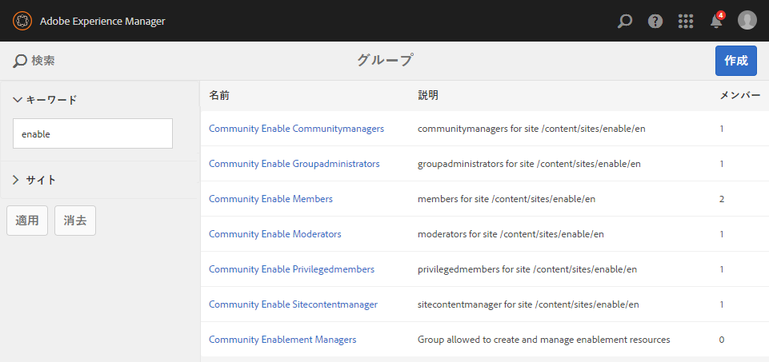

# コミュニティサイトの作成{#author-a-new-community-site}

## コミュニティサイトの作成 {#create-a-community-site}

オーサーインスタンスを使用して、コミュニティサイトを作成します。 AEM オーサーインスタンス上：

1. 管理者権限でログインします。
1. グローバルナビゲーションから、に移動します。 **[!UICONTROL コミュニティ]** > **[!UICONTROL Sites]**.

コミュニティサイトコンソールには、コミュニティサイトを作成する手順をガイドするウィザードが用意されています。 に進むことができます `Next` ステップまたは `Back` 最後の手順でサイトをコミットする前の前の手順に戻します。

コミュニティサイトの作成を開始するには：

* 「」を選択します `Create` ボタン。

### 手順 1：サイトテンプレート {#step-site-template}

日 [サイトテンプレートステップ](/help/communities/sites-console.md#step2013asitetemplate)を入力し、タイトル、説明、URL の名前を入力して、コミュニティサイトテンプレートを選択します。例：

* **コミュニティサイトのタイトル**: `Getting Started Tutorial`
* **コミュニティサイトの説明**: `A site for engaging with the community.`
* **コミュニティサイトのルート**: （デフォルトルートの場合は空白のままにします `/content/sites`）
* **クラウド設定**：指定したクラウド設定へのパスを指定します（クラウド設定が指定されていない場合は空白のままにします）。
* **コミュニティサイトのベース言語**:（単一言語：英語の場合は変更せず）ドロップダウンリストを使用して選択します *またはそれ以上* 利用可能な言語の基本言語（ドイツ語、イタリア語、フランス語、日本語、スペイン語、ポルトガル語（ブラジル）、中国語（繁体字）、中国語（簡体字））。 追加した言語ごとに 1 つのコミュニティ サイトが作成され、に記載されているベスト プラクティスに従って、同じサイト フォルダ内に存在します。 [多言語サイトのコンテンツの翻訳](/help/sites-administering/translation.md). 各サイトのルートページには、選択した言語のいずれかの言語コード（英語の場合は「en」、フランス語の場合は「fr」など）で命名された子ページが含まれています。

* **コミュニティサイト名**：エンゲージ

   * サイトを作成した後で名前を変更することは容易ではないため、名前を再確認してください
   * 最初の URL はコミュニティサイト名の下に表示されます
   * 有効な URL の場合は、ベース言語コード + 「.html」を付加します
   * *例：*, https://localhost:4502/content/sites/ `engage/en.html`

* **Template**：プルダウンして選択 `Reference Site`

* 「**次へ**」を選択します。

### 手順 2：デザイン {#step-design}

デザイン手順は、テーマとブランディングバナーを選択する 2 つのセクションで表示されます。

#### コミュニティサイトテーマ {#community-site-theme}

テンプレートに適用するスタイルを選択します。 選択すると、テーマがチェックマークと共にオーバーレイされます。

#### コミュニティサイトのブランディング {#community-site-branding}

（オプション）サイトページ全体に表示するバナー画像をアップロードします。 バナーは、コミュニティサイトのヘッダーとナビゲーションリンクの間で、ブラウザーの左端にピン留めされます。 バナーの高さは 120 ピクセルに切り抜かれます。 ブラウザーの幅と 120 ピクセルの高さに合わせてバナーのサイズを変更することはできません。

「**次へ**」を選択します。

### 手順 3：設定 {#step-settings}

設定ステップでを選択します。 `Next`には、ユーザー管理、タグ付け、モデレート、グループ管理、分析、翻訳に関わる設定へのアクセスを提供する 7 つのセクションがあります。

#### User Management {#user-management}

のすべてのチェックボックスをオンにする [ユーザー管理](/help/communities/sites-console.md#user-management)

* サイト訪問者に自己登録を許可するには
* サイト訪問者がログインせずにサイトを表示できるようにするには
* メンバーが他のコミュニティ メンバーとのメッセージの送受信を許可するには
* プロファイルを登録して作成する代わりに、Facebookへのログインを許可するには
* プロファイルを登録して作成する代わりに、Twitterでログインを許可するには

>[!NOTE]
>
>実稼動環境の場合は、カスタムのFacebookとTwitterアプリケーションを作成する必要があります。 参照： [facebookとTwitterを使用したソーシャルログイン](/help/communities/social-login.md).

#### タグ設定 {#tagging}

コミュニティコンテンツに適用されるタグは、を通じて以前に定義されたAEM名前空間を選択して制御されます。 [タグ付けコンソール](/help/sites-administering/tags.md#tagging-console) （例： [チュートリアル名前空間](/help/communities/setup.md#create-tutorial-tags)）に設定します。

先行入力検索を使用すると、名前空間を簡単に見つけることができます。 例：

* 型 `tut`
* `Tutorial` を選択します。

#### 役割 {#roles}

[コミュニティメンバーの役割](/help/communities/users.md) 「役割」セクションの設定で割り当てられます。

コミュニティメンバー（またはメンバーのグループ）にコミュニティマネージャーとしてサイトを体験させるには、先行入力検索を使用して、ドロップダウンのオプションからメンバーまたはグループ名を選択します。

例：

* 型 `q`
* クイン ハーパーを選択

>[!NOTE]
>
>[トンネルサービス](https://helpx.adobe.com/experience-manager/6-3/help/communities/deploy-communities.html#tunnel-service-on-author) パブリッシュ環境にのみ存在するメンバーとグループを選択できます。

#### モデレート {#moderation}

のデフォルトのグローバル設定を受け入れる [モデレート](/help/communities/sites-console.md#moderation) ユーザー生成コンテンツ（UGC）

#### ANALYTICS {#analytics}

Adobe Analyticsのライセンスが取得されていて、Analytics Cloud サービスおよびフレームワークが設定されている場合は、Analytics を有効にしてフレームワークを選択できます。

参照： [コミュニティ機能のための Analytics 設定](/help/communities/analytics.md).

#### 翻訳 {#translation}

この [翻訳設定](/help/communities/sites-console.md#translation) サイトのベース言語と、UGC を翻訳するかどうか、および翻訳する場合は言語を指定します。

* チェック **機械翻訳を許可**
* デフォルトの機械翻訳サービスでは、翻訳用にデフォルトの言語を選択したままにします
* デフォルトの翻訳プロバイダーおよび設定のままにする
* 言語コピーがないので、グローバルストアは不要です
* を選択 **ページ全体を翻訳**
* デフォルトの永続性オプションのままにします

### 手順 4:Communities サイトの作成 {#step-create-communities-site}

を選択 **作成。**

処理が完了すると、新しいサイトのフォルダーが Communities - Sites コンソールに表示されます。

## コミュニティサイトを公開 {#publish-the-community-site}

作成したサイトは、Communities - Sites コンソール（新しいサイトを作成する場所と同じコンソール）から管理する必要があります。

コミュニティサイトのフォルダーを選択して開いたら、サイトアイコンにマウスポインターを置いて、4 つのアクションアイコンを表示します。

4 番目の省略記号アイコン（その他のアクション）を選択すると、「サイトをエクスポート」および「サイトを削除」オプションが表示されます。

左から右に向かって、次のようになります。

* **Open Site**

  鉛筆アイコンを選択すると、オーサー編集モードでコミュニティサイトが開き、ページコンポーネントを追加または設定できます。

* **サイトの編集**

  プロパティアイコンを選択すると、タイトルやテーマを変更するなど、プロパティを変更するためのコミュニティサイトが開きます。

* **サイトの公開**

  ワールド アイコンを選択すると、コミュニティサイトが公開されます（例えば、公開サーバーがローカルマシンで実行されている場合は、デフォルトで localhost:4503 に公開されます）。

* **サイトのエクスポート**

  エクスポート アイコンを選択すると、コミュニティサイトのパッケージが作成され、両方とも次の場所に保存されます。 [パッケージマネージャー](/help/sites-administering/package-manager.md) をダウンロードしました。 UGC はサイトパッケージには含まれていません。

* **サイトの削除**

  削除アイコンを選択すると、内からコミュニティサイトが削除されます **[!UICONTROL コミュニティ / サイトコンソール]**. この操作により、UGC、ユーザーグループ、アセット、データベースレコードなど、サイトに関連付けられているすべての項目が削除されます。

>[!NOTE]
>
>パブリッシュインスタンスにデフォルトポート 4503 を使用しない場合は、デフォルトのレプリケーションエージェントを編集してポート番号を正しい値に設定します。
>
>オーサーインスタンスのメインメニューで、次の操作を行います。
>
>1. に移動します。 **[!UICONTROL ツール]** > **[!UICONTROL 運用]** > **[!UICONTROL 複製]** メニュー。
>1. を選択 **[!UICONTROL オーサー環境のエージェント]**.
>1. を選択 **[!UICONTROL デフォルトエージェント（公開）]**.
>1. 次の **[!UICONTROL 設定]**&#x200B;を選択 **[!UICONTROL 編集]**.
>1. エージェント設定のポップアップダイアログで、次の項目を選択します **[!UICONTROL 0.48181894]** タブ。
>1. URI で、ポート番号 4503 を目的のポート番号に変更します。 例えば、ポート 6103 を使用するには、https://localhost:6103/bin/receive?sling:authRequestLogin=1のように指定します。
>1. 「**[!UICONTROL OK]**」を選択します。
>1. （オプション）を選択 **[!UICONTROL 消去]** または **[!UICONTROL 強制的に再試行]** レプリケーションキューをリセットする場合。

### 「公開」を選択します。 {#select-publish}

パブリッシュサーバーが実行されていることを確認したら、世界アイコンを選択してコミュニティサイトを公開します。

コミュニティサイトが正常に公開されると、「サイトが公開されました」というメッセージが短時間表示されます。

### 新しいコミュニティユーザーグループ {#new-community-user-groups}

新しいコミュニティサイトと共に、新しいユーザーグループが作成されます。このユーザーグループには、様々な管理機能に対する適切な権限が設定されています。 詳しくは、次を参照してください： [コミュニティサイトのユーザーグループ](/help/communities/users.md#usergroupsforcommunitysites).

この新しいコミュニティサイトでは、手順 1 で「engage」というサイト名を指定すると、4 つの新しいユーザーグループが [グループコンソール](/help/communities/members.md) （グローバルナビゲーション：コミュニティ、グループ）:

* Community Engage コミュニティマネージャー
* Community Engage グループ管理者
* Community Engage メンバー
* Community Engage モデレーター
* Community Engage 特権メンバー
* コミュニティエンゲージメントサイトコンテンツマネージャー

[アーロン・マクドナルド](/help/communities/tutorials.md#demo-users) 次のメンバーである

* Community Engage コミュニティマネージャー
* Community Engage モデレーター
* Community Engage メンバー（モデレータグループのメンバーとして間接的に）

#### https://localhost:4503/content/sites/engage/en.html {#http-localhost-content-sites-engage-en-html}

## 認証エラーの設定 {#configure-for-authentication-error}

サイトを設定して公開にプッシュすると、 [ログインマッピングの設定](/help/communities/sites-console.md#configure-for-authentication-error) （ `Adobe Granite Login Selector Authentication Handler`）を選択します。 利点は、ログイン資格情報が正しく入力されなかった場合、認証エラーによってコミュニティサイトのログインページがエラーメッセージで再表示されることです。

を追加 `Login Page Mapping` as

* `/content/sites/engage/en/signin:/content/sites/engage/en`

## オプションの手順 {#optional-steps}

### 既定のホーム ページの変更 {#change-the-default-home-page}

デモ目的でパブリッシュサイトを使用する場合は、デフォルトのホームページを新しいサイトに変更すると便利です。

それには、を使用する必要があります。 [CRXDE](https://localhost:4503/crx/de) 編集する Lite [resource-mapping](/help/sites-deploying/resource-mapping.md) パブリッシュ環境のテーブル。

開始するには：

1. パブリッシュインスタンスで、管理者権限でログインします。
1. を参照 [https://localhost:4503/crx/de](https://localhost:4503/crx/de).
1. プロジェクト ブラウザで、を展開します `/etc/map.`
1. 「」を選択します `http` ノード：

   * を選択 **ノードを作成：**

      * **名前** localhost.4503 （実行） *ではない* 「:」を使用）

      * **タイプ** [sling:Mapping](https://sling.apache.org/documentation/the-sling-engine/mappings-for-resource-resolution.html)

1. 新しく作成した `localhost.4503` 選択されたノード :

   * プロパティを追加：

   * **名前** sling:match
      * **タイプ** 文字列
      * **値** localhost.4503/$ （末尾は&#39;$&#39;文字にする必要があります）

   * プロパティを追加：

      * **名前** sling:internalRedirect
      * **タイプ** 文字列
      * **値** /content/sites/engage/en.html

1. を選択 **すべて保存。**
1. （任意）ブラウジング履歴を削除します。
1. https://localhost:4503/を参照します。

   * https://localhost:4503/content/sites/engage/en.htmlに到着

>[!NOTE]
>
>無効にするには、 `sling:match` 「x」を持つプロパティ値 –  `xlocalhost.4503/$`  – および **すべて保存**.

#### トラブルシューティング：マップの保存エラー {#troubleshooting-error-saving-map}

変更を保存できない場合は、ノード名がであることを確認します `localhost.4503`。区切り記号「ドット」を使用し、使用しない `localhost:4503` 「コロン」区切り文字を使用 `localhost`は有効な名前空間プレフィックスではありません。

#### トラブルシューティング：リダイレクトに失敗する {#troubleshooting-fail-to-redirect}

「**$**&#39;正規表現の末尾 `sling:match`文字列が重要なので、 `https://localhost:4503/` がマッピングされない場合、リダイレクト値の前に、URL の server:port の後に存在する可能性のあるパスが付加されます。 そのため、AEMがログインページにリダイレクトしようとすると、失敗します。

### サイトの変更 {#modify-the-site}

サイトを最初に作成した後は、作成者は以下を使用できます [サイトを開くアイコン](/help/communities/sites-console.md#authoring-site-content) 標準のAEM オーサリングアクティビティを実行します。

さらに、管理者は以下を使用できます [サイトを編集アイコン](/help/communities/sites-console.md#modifying-site-properties) ：サイトのプロパティ（タイトルなど）を変更します。

変更後、必ず以下を行ってください **保存** と&#x200B;**公開** サイト。

>[!NOTE]
>
>AEMに詳しくない場合は、次のドキュメントを参照してください [基本操作](/help/sites-authoring/basic-handling.md) および [ページのオーサリングのクイックガイド](/help/sites-authoring/qg-page-authoring.md).
