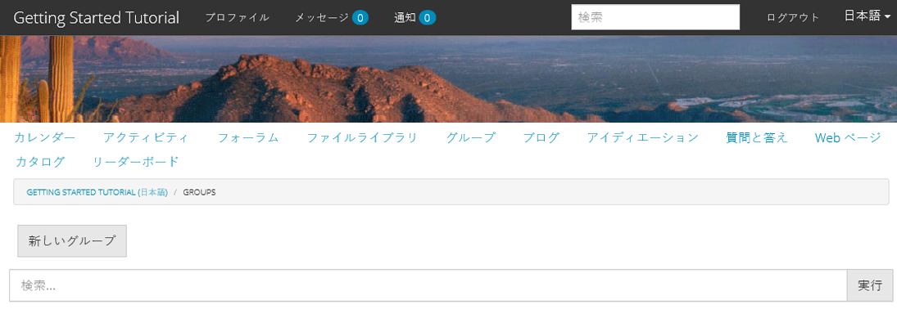
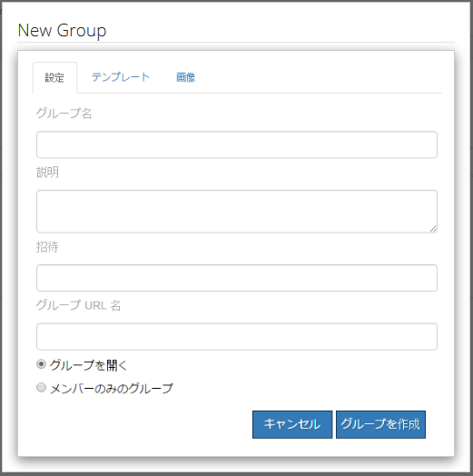
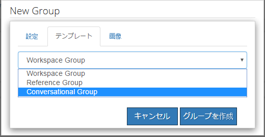
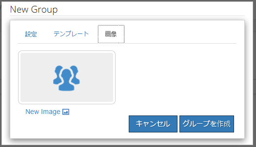
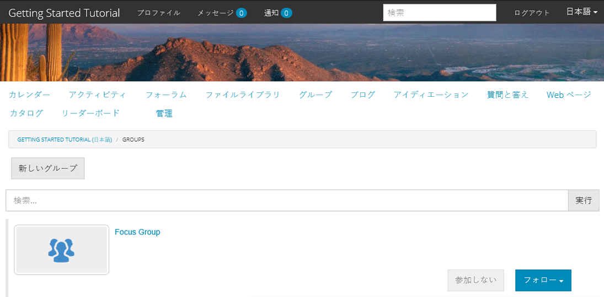
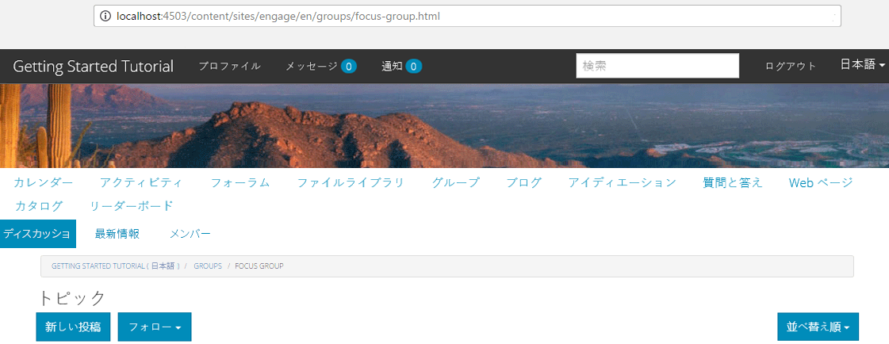

# コミュニティグループ {#community-groups}

コミュニティグループ機能は、サブコミュニティを発行ユーザーと発言者環境から許可されたユーザー（コミュニティのメンバーと発言者）がコミュニティサイト内で動的に作成する機能です。

この機能は、[groups関数](/help/communities/functions.md#groups-function)が[コミュニティサイト](/help/communities/sites-console.md)構造に存在する場合に存在します。

[コミュニティグループテンプレート](/help/communities/tools-groups.md)は、コミュニティグループが動的に作成された場合に、コミュニティグループページのデザインを提供します。

グループ機能をコミュニティサイトの構造またはコミュニティサイトテンプレートに追加すると、1 つ以上のテンプレートがグループ機能用に選択されます。このリストのグループテンプレートは、コミュニティサイト内から動的に新しいグループを作成するメンバーまたは作成者に表示されます。

## 新しいグループの作成 {#creating-a-new-group}

新しいコミュニティグループを作成する機能は、[リファレンスサイトテンプレート](/help/communities/sites.md)で作成したグループ機能など、グループ機能を含むコミュニティサイトの存在に依存します。

次の例では、[AEM Communitiesの使い始めに/](/help/communities/getting-started.md)チュートリアルで説明されているように、`Reference Site Template`から作成したコミュニティサイトを使用します。

これは、**グループ**&#x200B;メニュー項目が選択されている場合に、発行時に読み込まれるページです。

「**新しいグループ**」アイコンを選択すると、編集ダイアログが開きます。

「**設定**」タブでは、グループの基本機能を指定します。

* **Group Name**

   コミュニティサイトに表示するグループのタイトル。

* **説明**

   コミュニティサイトに表示するグループの説明です。

* **招待**

   グループへの参加を招待するリスト。 先行入力検索によって、招待する推奨コミュニティメンバーが表示されます。

* **グループ URL 名**

   URLに含まれるグループページの名前。

* **オープングループ**

   `Open Group`を選択すると、匿名サイト訪問者がコンテンツに表示する可能性があることを示し、`Member Only Group`の選択を解除します。

* **メンバーのみのグループ**

   `Member Only Group`を選択すると、グループのメンバーだけがコンテンツを表示できることを示し、`Open Group`の選択を解除します。

「**テンプレート**」タブの下には、
コミュニティサイトの構造またはコミュニティサイトのテンプレートにグループ機能が含まれていたときに指定したコミュニティグループテンプレートのリストから選択します。

「**画像**」タブでは、コミュニティサイトのグループページにグループ用に表示する画像をアップロードできます。初期設定のスタイルシートでは、画像のサイズが170 x 90ピクセルに設定されます。

「**グループを作成**」ボタンを選択すると、選択したテンプレートをベースとしてグループのページが作成され、ユーザーグループがメンバーシップ用に作成され、新しいサブコミュニティを表示するようにグループページが更新されます。

例えば、画像サムネイルがアップロードされた「Focus Group」というタイトルの新しいサブコミュニティを含むグループページは、次のように表示されます（引き続きコミュニティグループ管理者としてサインインしています）。

`Focus Group`リンクを選択すると、ブラウザーでフォーカスグループページが開きます。このページは、選択したテンプレートに基づいて初期表示され、メインコミュニティサイトのメニューの下にサブメニューが含まれます。

### コミュニティグループメンバーのリストコンポーネント {#community-group-member-list-component}

`Community Group Member List`コンポーネントは、グループテンプレートの開発者が使用することを目的としています。

### 追加情報 {#additional-information}

詳しくは、[Community Group Essentials](/help/communities/essentials-groups.md)ページを参照してください。

コミュニティグループに関連するその他の情報は、[ユーザーとユーザーグループの管理](/help/communities/users.md)を参照してください。
