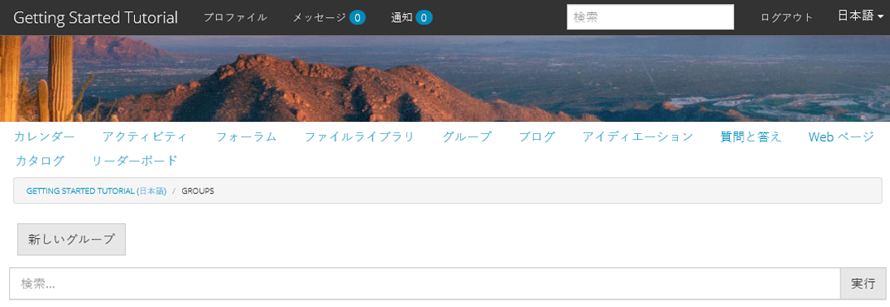
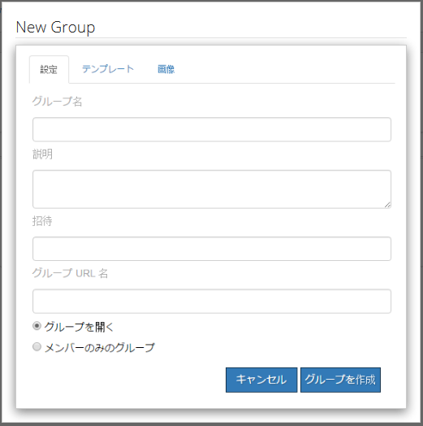
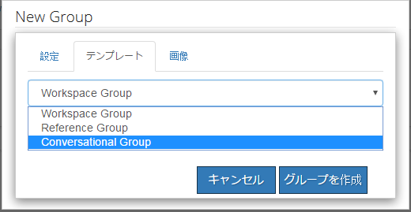
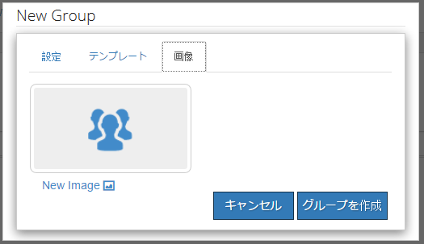
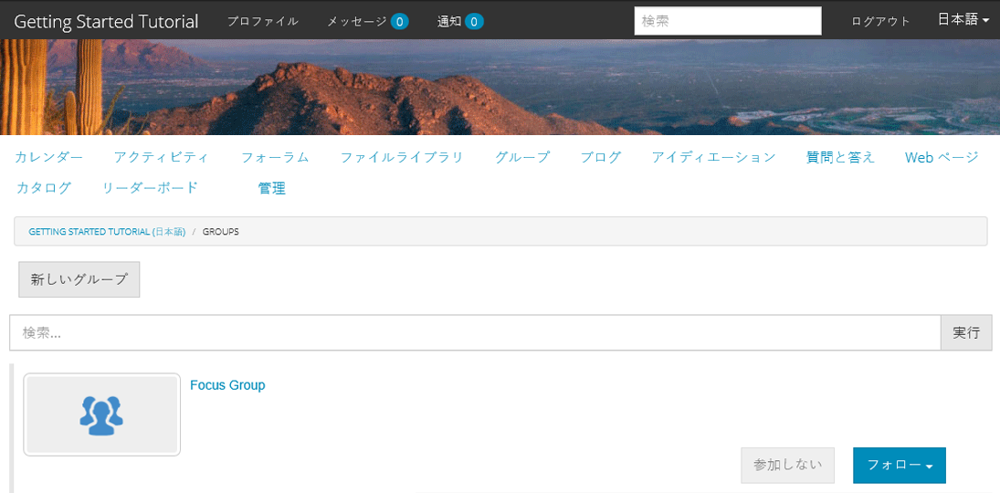
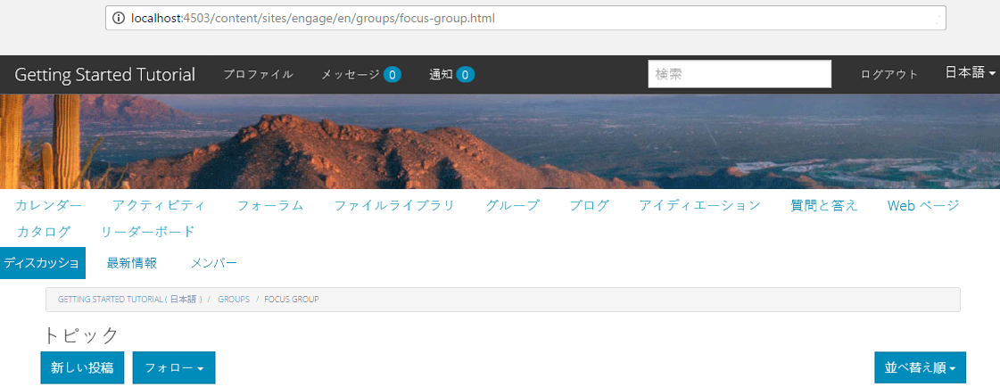

# コミュニティグループ {#community-groups}

コミュニティグループ機能は、パブリッシュ環境とオーサー環境から許可されたユーザー（コミュニティメンバーと作成者）が、コミュニティサイト内でサブコミュニティを動的に作成する機能です。

この機能は、[groups関数](/help/communities/functions.md#groups-function)が[ コミュニティサイト ](/help/communities/sites-console.md)構造に存在する場合に使用できます。

[ コミュニティグループテンプレート ](/help/communities/tools-groups.md)は、コミュニティグループが動的に作成されるときに、コミュニティグループページのデザインを提供します。

コミュニティ サイトの構造またはコミュニティ サイト テンプレートに関数を追加する場合、グループ関数に1つ以上のグループ テンプレートが選択されます。 このグループテンプレートのリストは、コミュニティサイト内から動的にグループを作成するメンバーまたは作成者に表示されます。

## 新しいグループの作成 {#creating-a-new-group}

コミュニティグループを作成する機能は、[参照サイトテンプレート ](/help/communities/sites.md)から作成されたグループ関数など、グループ関数を含むコミュニティサイトの存在に依存しています。

次の例では、[AEM Communitiesの概要](/help/communities/getting-started.md) チュートリアルの説明に従って、`Reference Site Template`から作成されたコミュニティサイトを使用しています。

これは、**グループ** メニュー項目が選択されたときにパブリッシュに読み込まれるページです。

**新規グループ** アイコンを選択すると、編集ダイアログボックスが開きます。

「**設定**」タブで、グループの基本機能を指定します。

* **グループ名**

  コミュニティサイトに表示するグループのタイトル。 グループ名にアンダースコア文字（_）やリソースや設定などのキーワードを使用しないでください。

* **説明**

  コミュニティサイトに表示するグループの説明。

* **招待**

  グループに招待するメンバーのリスト。 先行入力の検索では、招待するコミュニティメンバーの候補が表示されます。

* **グループ URL名**

  URLの一部となるグループページの名前。

* **グループを開く**

  `Open Group`を選択すると、匿名のサイト訪問者がコンテンツを表示できることを示し、`Member Only Group`の選択を解除します。

* **メンバーのみのグループ**

  `Member Only Group`を選択すると、グループのメンバーのみがコンテンツを表示できることを示し、`Open Group`の選択を解除します。

「**テンプレート**」タブで、コミュニティグループテンプレートのリストから選択できます。 これらのテンプレートは、グループ関数がコミュニティサイトの構造またはコミュニティサイトテンプレートに含まれている場合に指定されます。

「**画像**」タブで、コミュニティサイトのグループページにグループ用に表示する画像をアップロードできます。 デフォルトのスタイルシートでは、画像のサイズは170 x 90 ピクセルに設定されています。

**グループを作成**&#x200B;を選択すると、選択したテンプレートに基づいてグループのページが作成され、メンバーシップ用にユーザーグループが作成され、グループ ページが更新されて新しいサブコミュニティが表示されます。

例えば、画像サムネールがアップロードされた「フォーカスグループ」というタイトルの新しいサブコミュニティを持つグループページは、次のように表示されます（まだコミュニティグループ管理者としてサインインしています）。

`Focus Group` リンクを選択すると、ブラウザーでフォーカスグループページが開きます。このページには、選択したテンプレートに基づいた初期の外観が表示され、メインコミュニティサイトのメニューの下にサブメニューが含まれます。

### コミュニティグループメンバーリストコンポーネント {#community-group-member-list-component}

`Community Group Member List` コンポーネントは、グループテンプレートの開発者による使用を目的としています。

### 追加情報 {#additional-information}

詳しくは、開発者向けの[Community Group Essentials](/help/communities/essentials-groups.md) ページを参照してください。

コミュニティグループに関するその他の情報については、[ ユーザーとユーザーグループの管理](/help/communities/users.md)を参照してください。
