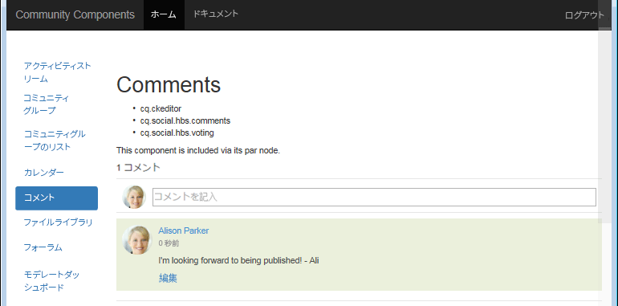
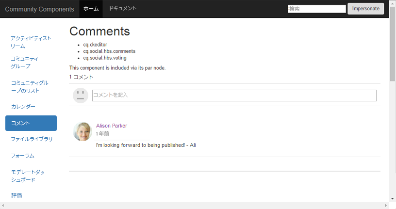
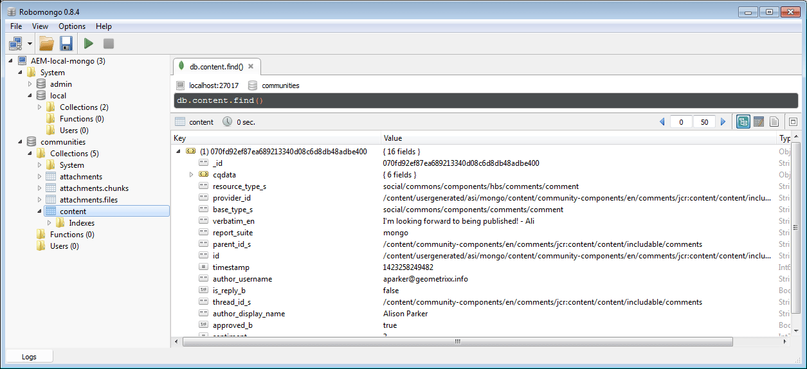

# MongoDBのデモ用の設定方法 {#how-to-setup-mongodb-for-demo}

## はじめに {#introduction}

このチュートリアルでは、*1人のオーサー* インスタンスと&#x200B;*1人のパブリッシュ* インスタンスに[MSRP](msrp.md)を設定する方法について説明します。

この設定では、UGC （ユーザー生成コンテンツ）を転送または逆引きすることなく、オーサー環境とパブリッシュ環境の両方からコミュニティコンテンツにアクセスできます。

この設定は、開発やデモなど、*実稼動以外*&#x200B;環境に適しています。

**A *本番*環境は次のようにする必要があります：**

* レプリカセットを使用したMongoDBの実行
* SolrCloudを使用
* 複数のパブリッシャーインスタンスを含む

## MongoDB {#mongodb}

### MongoDBのインストール {#install-mongodb}

* [https://www.mongodb.com/](https://www.mongodb.com/)からMongoDBをダウンロード

   * OSの選択：

      * Linux®
      * Mac 10.8
      * Windows 7

   * バージョンの選択：

      * 少なくとも、バージョン 2.6を使用する

* 基本設定

   * MongoDBのインストール手順に従います。
   * mongod用に設定：

      * MongosやShardingを設定する必要はありません。

   * インストールされたMongoDB フォルダーは&lt;mongo-install>という名前です。
   * 定義されたデータディレクトリパスは&lt;mongo-dbpath>と呼ばれます。

* MongoDBは、AEMと同じホストで実行することも、リモートで実行することもできます。

### MongoDBを開始 {#start-mongodb}

* &lt;mongo-install>/bin/mongod —dbpath &lt;mongo-dbpath>

これにより、デフォルトポート 27017を使用してMongoDB サーバーが開始されます。

* Macの場合、start arg &#39;ulimit -n 2048&#39;でulimitを増やします

>[!NOTE]
>
>MongoDBが&#x200B;*AEMの後に*&#x200B;開始された場合、**再起動**&#x200B;すべての&#x200B;**AEM** インスタンスを再起動して、MongoDBに正しく接続します。

### デモ実稼動オプション：MongoDB レプリカセットの設定 {#demo-production-option-setup-mongodb-replica-set}

次のコマンドは、localhostで3つのノードを持つレプリカセットを設定する例です。

* `bin/mongod --port 27017 --dbpath data --replSet rs0&`
* `bin/mongo`

   * `cfg = {"_id": "rs0","version": 1,"members": [{"_id": 0,"host": "127.0.0.1:27017"}]}`
   * `rs.initiate(cfg)`

* `bin/mongod --port 27018 --dbpath data1 --replSet rs0&`
* `bin/mongod --port 27019 --dbpath data2 --replSet rs0&`
* `bin/mongo`

   * `rs.add("127.0.0.1:27018")`
   * `rs.add("127.0.0.1:27019")`
   * `rs.status()`

## Solr {#solr}

### Solrのインストール {#install-solr}

* [Apache Lucene](https://archive.apache.org/dist/lucene/solr/)からSolrをダウンロード：

   * 任意のOSに適しています。
   * Solr バージョン 7.0。
   * SolrにはJava™ 1.7以降が必要です。

* 基本設定

   * 「example」 Solr設定に従います。
   * サービスは必要ありません。
   * インストールされたSolr フォルダーは&lt;solr-install>という名前です。

### AEM Communities用にSolrを設定 {#configure-solr-for-aem-communities}

デモ用にMSRPのSolr コレクションを設定するには、次の2つの決定を行う必要があります（詳細については、メインドキュメントへのリンクを選択してください）。

1. スタンドアロンまたは[SolrCloud モード ](msrp.md#solrcloudmode)でSolrを実行します。
1. [standard](msrp.md#installingstandardmls)または[advanced](msrp.md#installingadvancedmls)の多言語検索（MLS）をインストールします。

### スタンドアロン Solr {#standalone-solr}

Solrを実行する方法は、インストールのバージョンと方法によって異なります。 [Solr リファレンスガイド ](https://archive.apache.org/dist/lucene/solr/ref-guide/)は権威あるドキュメントです。

簡単にするために、バージョン 4.10を例として使用すると、スタンドアロンモードでSolrを起動できます。

* &lt;solrinstall>/exampleにcd
* Java™ -jar start.jar

このプロセスは、デフォルトのポート 8983を使用してSolr HTTP サーバーを開始します。 Solr コンソールを参照して、テスト用のSolr コンソールを取得できます。

* デフォルトのSolr コンソール：[http://localhost:8983/solr/](http://localhost:8983/solr/)

>[!NOTE]
>
>Solr Consoleが利用できない場合は、&lt;solrinstall>/example/logsの下にあるログを確認します。 SOLRが解決できない特定のホスト名にバインドしようとしているかどうかを確認します（例：「user-macbook-pro」）。
>
>その場合は、このホスト名の新しいエントリ（127.0.0.1 user-macbook-proなど）を使用して`etc/hosts` ファイルを更新し、Solrを適切に起動します。

### SolrCloud {#solrcloud}

基本的な（実稼動以外の） solrCloud セットアップを実行するには、次のコマンドでsolrを起動します。

* `java -Dbootstrap_confdir=./solr/collection1/conf -Dbootstrap_conf=true -DzkRun -jar start.jar`

## MongoDBを共通ストアとして識別 {#identify-mongodb-as-common-store}

必要に応じて、オーサーインスタンスを起動し、AEM インスタンスを公開します。

MongoDBが開始される前にAEMが実行されていた場合は、AEM インスタンスを再起動する必要があります。

メインのドキュメントページの指示に従います。[MSRP - MongoDB Common Store](msrp.md)

## テスト {#test}

MongoDB共通ストアをテストおよび検証するには、パブリッシュインスタンスにコメントを投稿してオーサーインスタンスで表示し、MongoDBおよびSolrでUGCを表示します。

1. パブリッシュインスタンスで、[ コミュニティコンポーネントガイド ](http://localhost:4503/content/community-components/en/comments.html) ページを参照し、コメントコンポーネントを選択します。
1. ログインしてコメントを投稿：
1. コメントテキストエントリボックスにテキストを入力し、**[!UICONTROL 投稿]**&#x200B;をクリックします

   

1. [ オーサーインスタンス ](http://localhost:4502/content/community-components/en/comments.html)のコメントを表示するだけです（おそらく、まだ管理者/管理者としてサインインしています）。

   

   注意：オーサー上の&#x200B;*asipath*&#x200B;の下にJCR ノードがありますが、これらのノードはSCF フレームワーク用です。 実際のUGCはJCRではなく、MongoDBにあります。

1. mongodb **[!UICONTROL コミュニティ]** > **[!UICONTROL コレクション]** > **[!UICONTROL コンテンツ]**&#x200B;のUGCを表示します

   

1. SolrでのUGCの表示：

   * Solr ダッシュボードを参照：[http://localhost:8983/solr/](http://localhost:8983/solr/)。
   * ユーザー`core selector`が`collection1`を選択します。
   * `Query` を選択します。
   * `Execute Query` を選択します。

   

## トラブルシューティング {#troubleshooting}

### UGCが表示されない {#no-ugc-appears}

1. MongoDBが適切にインストールされ、実行されていることを確認します。

1. MSRPがデフォルトプロバイダーに設定されていることを確認します。

   * すべてのオーサーインスタンスとパブリッシュAEM インスタンスで、[Storage Configuration Console](srp-config.md)を再訪問するか、AEM リポジトリを確認します。

   * JCRでは、[/etc/socialconfig](http://localhost:4502/crx/de/index.jsp#/etc/socialconfig/)に[srpc](http://localhost:4502/crx/de/index.jsp#/etc/socialconfig/srpc) ノードが含まれていない場合、ストレージプロバイダーがJSRPであることを意味します。
   * srpc ノードが存在し、ノード [defaultconfiguration](http://localhost:4502/crx/de/index.jsp#/etc/socialconfig/srpc/defaultconfiguration)が含まれている場合、defaultconfigurationのプロパティでMSRPをデフォルトプロバイダーとして定義する必要があります。

1. MSRPを選択した後にAEMが再起動されたことを確認します。
