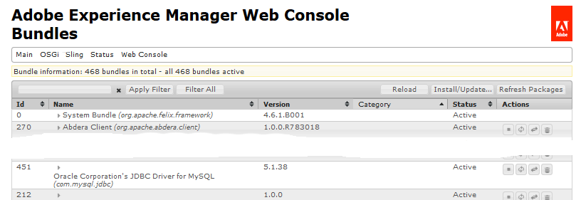
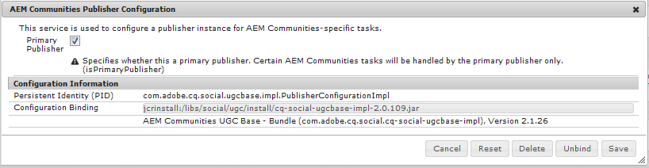
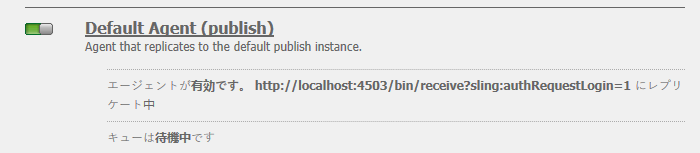
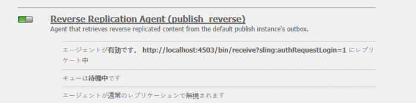
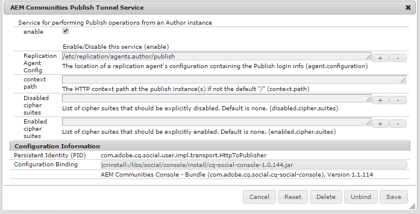
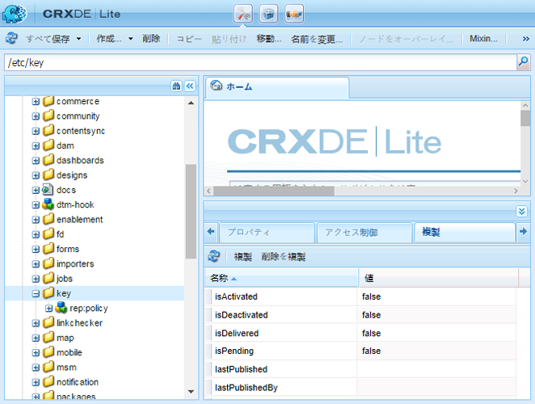
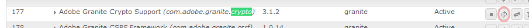

# Communities のデプロイ {#deploying-communities}

## 前提条件 {#prerequisites}

* [AEM 6.5 Platform](/help/sites-deploying/deploy.md)

* AEM Communities ライセンス

* オプションのライセンス：

   * [Adobe Analytics for Communitiesの機能](/help/communities/analytics.md)
   * [MongoDB for MSRP](/help/communities/msrp.md)
   * [Adobe Cloud for ASRP](/help/communities/asrp.md)

## インストール チェックリスト {#installation-checklist}

**[AEM プラットフォーム](/help/sites-deploying/deploy.md#what-is-aem)**&#x200B;の場合

* 最新の[AEM 6.5 アップデート &#x200B;](#aem64updates)をインストールする

* デフォルトのポート（4502、4503）を使用しない場合は、[&#x200B; レプリケーションエージェントの設定](#replication-agents-on-author)
* [暗号化キーのレプリケート](#replicate-the-crypto-key)
* グローバル化をサポートしている場合、[自動翻訳を設定](/help/sites-administering/translation.md)
（開発用にサンプル設定が用意されています）

**[&#x200B; コミュニティ機能](/help/communities/overview.md)**&#x200B;の場合

* [&#x200B; パブリッシングファーム &#x200B;](/help/sites-deploying/recommended-deploys.md#tarmk-farm)をデプロイする場合、[&#x200B; プライマリパブリッシャーを特定](#primary-publisher)

* [トンネルサービスを有効にする](#tunnel-service-on-author)
* [ソーシャルログインを有効にする](/help/communities/social-login.md#adobe-granite-oauth-authentication-handler)
* [Adobe Analytics の設定](/help/communities/analytics.md)
* [既定の電子メール サービス &#x200B;](/help/communities/email.md)を設定する
* [共有UGC ストレージ &#x200B;](/help/communities/working-with-srp.md) （**SRP**）の選択肢を特定

   * MongoDB SRP [&#x200B; （MSRP） &#x200B;](/help/communities/msrp.md)の場合

      * [MongoDBのインストールと設定](/help/communities/msrp.md#mongodb-configuration)
      * [Solrの設定](/help/communities/solr.md)
      * [MSRPを選択](/help/communities/srp-config.md)

   * リレーショナル データベース SRP [&#x200B; （DSRP） &#x200B;](/help/communities/dsrp.md)の場合

      * [MySQL用JDBC ドライバーのインストール](#jdbc-driver-for-mysql)
      * [DSRP用MySQLのインストールと設定](/help/communities/dsrp-mysql.md)
      * [Solrの設定](/help/communities/solr.md)
      * [DSRPの選択](/help/communities/srp-config.md)

   * Adobe SRP [&#x200B; （ASRP） &#x200B;](/help/communities/asrp.md)

      * プロビジョニングについては、アカウント担当者にお問い合わせください
      * [ASRPの選択](/help/communities/srp-config.md)

   * JCR SRP [&#x200B; （JSRP） &#x200B;](/help/communities/jsrp.md)の場合

      * 共有UGC （ユーザー生成コンテンツ）ストアではない：

         * UGCはレプリケートされない
         * UGCは、そのUGCが入力されたAEMインスタンスまたはクラスターでのみ表示されます

         * デフォルトはJSRPです

## 最新リリース {#latest-releases}

AEM 6.5 Communities GAには、Communities パッケージが含まれています。 AEM 6.5 [Communities](/help/release-notes/release-notes.md#experiencemanagercommunities)の更新プログラムについて詳しくは、[AEM 6.5 リリースノート &#x200B;](/help/release-notes/release-notes.md#communities-release-notes.html)を参照してください。

### AEM 6.5のアップデート {#aem-updates}

AEM 6.4以降では、AEMの累積修正パックとサービスパックの一部として、コミュニティの更新が配信されます。

AEM 6.5の最新のアップデートについては、[Adobe Experience Manager 6.4累積修正パックとサービスパック &#x200B;](https://experienceleague.adobe.com/ja/docs/experience-manager-release-information/aem-release-updates/aem-releases-updates)を参照してください。

### バージョン履歴 {#version-history}

AEM 6.4以降と同様に、AEM Communitiesの機能とホットフィックスは、AEM Communitiesの累積修正パックとサービスパックの一部です。 したがって、個別の機能パックはありません。

### MySQL用JDBC ドライバー {#jdbc-driver-for-mysql}

1つのコミュニティ機能では、MySQL データベースを使用します。

* [DSRP](/help/communities/dsrp.md)の場合：UGCを保存しています

MySQL コネクタを取得し、個別にインストールする必要があります。

必要な手順は次のとおりです。

1. [https://dev.mysql.com/downloads/connector/j/](https://dev.mysql.com/downloads/connector/j/)からZIP アーカイブをダウンロードします

   * バージョンは>= 5.1.38である必要があります

1. アーカイブからmysql-connector-java-&lt;version>-bin.jar （バンドル）を抽出します
1. Web コンソールを使用して、バンドルをインストールして起動します。

   * 例：https://localhost:4502/system/console/bundles
   * **`Install/Update`** を選択します。
   * 参照… ダウンロードしたZIP アーカイブから抽出したバンドルを選択します
   * *Oracle CorporationのMySQLcom.mysql.jdbc*&#x200B;用JDBC ドライバーがアクティブであることを確認し、アクティブでない場合は起動します（またはログを確認します）

1. JDBCを設定した後に既存のデプロイメントにインストールする場合は、Web コンソールからJDBC設定を再保存して、JDBCを新しいコネクタに再バインドします。
   * 例：https://localhost:4502/system/console/configMgr
   * `Day Commons JDBC Connections Pool`設定を探します
   * 選択して開く
   * `Save` を選択します。

1. すべてのオーサーインスタンスとパブリッシュインスタンスで手順3と4を繰り返します

バンドルのインストールについて詳しくは、[Web コンソール &#x200B;](/help/sites-deploying/web-console.md) ページを参照してください。

#### 例：インストールされたMySQL コネクタバンドル {#example-installed-mysql-connector-bundle}




### AEM Advanced MLS {#aem-advanced-mls}

SRP コレクション（MSRPまたはDSRP）が高度な多言語検索（MLS）をサポートするには、カスタムスキーマとSolr設定に加えて、新しいSolr プラグインが必要です。 必要なアイテムはすべて、ダウンロード可能なzip ファイルにパッケージ化されます。

高度なMLS ダウンロード （別名`phasetwo`）は、Adobe リポジトリから入手できます。

* AEM-SOLR-MLS-phasetwo

  詳細MLS パッケージを取得するには、ドキュメントのデプロイセクションの[AEMの詳細MLS](deploy-communities.md#aem-advanced-mls)を参照してください。

   * バージョン 1.2.40 （2016年4月6日）
   * AEM-SOLR-MLS-phasetwo-1.2.40.zipをダウンロード

詳細とインストール情報については、[Solr Configuration](/help/communities/solr.md)を参照してください。

### パッケージ共有へのリンクについて {#about-links-to-package-share}

**Adobe AEM Cloudで表示されるパッケージ**

このページのパッケージへのリンクは、`adobeaemcloud.com`のPackage Shareに対して実行されるAEMの実行中のインスタンスを必要としません。 パッケージは表示可能ですが、`Install` ボタンは、パッケージをAdobeでホストされているサイトにインストールするためのものです。 ローカルのAEM インスタンスにインストールする場合、`Install`を選択するとエラーが発生します。

**ローカル AEM インスタンスへのインストール方法**

`adobeaemcloud.com`に表示されるパッケージをローカル AEM インスタンスにインストールするには、最初にパッケージをローカルディスクにダウンロードする必要があります。

* 「**Assets**」タブを選択します
* ディスクへの&#x200B;**ダウンロード**&#x200B;を選択

ローカル AEM インスタンスで、Package Manager （例：[https://localhost:4502/crx/packmgr/](https://localhost:4502/crx/packmgr/)）を使用して、ローカル AEMのパッケージリポジトリにアップロードします。

または、ローカルのAEM インスタンスからPackage Shareを使用してパッケージにアクセスすると（例：[https://localhost:4502/crx/packageshare/](https://localhost:4502/crx/packageshare/)）、`Download` ボタンがローカルのAEM インスタンスのパッケージリポジトリにダウンロードされます。

ローカルのAEM インスタンスのパッケージリポジトリに移動したら、パッケージマネージャーを使用してパッケージをインストールします。

詳しくは、[&#x200B; パッケージの操作方法](/help/sites-administering/package-manager.md#package-share)を参照してください。

## 推奨されるデプロイメント {#recommended-deployments}

AEM Communitiesでは、UGCの保存には共通ストアが使用され、[&#x200B; ストレージリソースプロバイダー（SRP） &#x200B;](/help/communities/working-with-srp.md)と呼ばれることが多いです。 推奨されるデプロイメントでは、共通ストアのSRP オプションを選択することに重点を置きます。

共通ストアは、UGCの[&#x200B; レプリケーション &#x200B;](/help/communities/sync.md)の必要性を排除しながら、公開環境でのUGCのモデレーションと分析をサポートしています。

* [Community Content Store](/help/communities/working-with-srp.md) :AEM CommunitiesのSRP ストレージオプションについて説明します

* [推奨トポロジ &#x200B;](/help/communities/topologies.md)：ユースケースとSRPの選択に応じて使用するトポロジについて説明します

## アップグレード {#upgrading}

以前のバージョンのAEMからAEM 6.5 プラットフォームにアップグレードする場合は、[AEM 6.5](/help/sites-deploying/upgrade.md)へのアップグレードを参照することが重要です。

プラットフォームのアップグレードに加えて、[AEM Communities 6.5](/help/communities/upgrade.md)へのアップグレードを参照して、コミュニティの変更点について確認してください。

## 設定 {#configurations}

### プライマリ発行者 {#primary-publisher}

選択したデプロイメントが[&#x200B; パブリッシュファーム &#x200B;](/help/communities/topologies.md#tarmk-publish-farm)である場合、すべてのインスタンスで発生しないアクティビティについて、1つのAEM パブリッシュインスタンスを&#x200B;**`primary publisher`**&#x200B;として識別する必要があります。 例えば、**notifications**&#x200B;または&#x200B;**Adobe Analytics**&#x200B;に依存する機能があります。

デフォルトでは、`AEM Communities Publisher Configuration` OSGi設定は&#x200B;**`Primary Publisher`** チェックボックスがオンになっている状態で設定され、パブリッシュファーム内のすべてのパブリッシュインスタンスがプライマリとして自己識別されます。

したがって、**`Primary Publisher`** チェックボックスをオフにするには、すべてのセカンダリ公開インスタンス **で設定を**&#x200B;編集する必要があります。



パブリッシュファーム内のその他のすべての（セカンダリ）パブリッシュインスタンスの場合：

* 管理者権限を持ったログイン
* [web コンソール &#x200B;](/help/sites-deploying/configuring-osgi.md)にアクセスする

   * 例：[https://localhost:4503/system/console/configMgr](https://localhost:4503/system/console/configMgr)

* `AEM Communities Publisher Configuration`を探します
* 編集アイコンを選択します
* 「**プライマリ発行者**」ボックスのチェックを外します
* 「**保存**」を選択します

### オーサー上のレプリケーションエージェント {#replication-agents-on-author}

レプリケーションは、パブリッシュ環境で作成されたサイトコンテンツ（コミュニティグループなど）に使用されます。また、[&#x200B; トンネルサービス &#x200B;](#tunnel-service-on-author)を使用して、オーサー環境からメンバーおよびメンバーグループを管理します。

プライマリパブリッシャーの場合、[&#x200B; レプリケーションエージェント設定](/help/sites-deploying/replication.md)が公開サーバーと承認済みユーザーを正しく識別していることを確認します。 既定の承認済みユーザー`admin,`には、既に適切な権限があります（`Communities Administrators`のメンバー）。

他のユーザーが適切な権限を持つには、そのユーザーを`administrators` ユーザーグループのメンバー（`Communities Administrators`のメンバー）として追加する必要があります。

オーサー環境には、トランスポート設定を正しく設定する必要がある2つのレプリケーションエージェントがあります。

* 作成者のレプリケーションコンソールにアクセスする

   * グローバルナビゲーションから、作成者&#x200B;**の**&#x200B;[!UICONTROL &#x200B; ツール &#x200B;]&#x200B;**>**&#x200B;[!UICONTROL &#x200B; デプロイメント &#x200B;]&#x200B;**>**&#x200B;[!UICONTROL &#x200B; レプリケーション &#x200B;]&#x200B;**>** エージェントに移動します

* 両方のエージェントに対して同じ手順に従います。

   * **既定のエージェント （公開）**
   * **リバースレプリケーションエージェント （リバースパブリッシュ）**

      1. エージェントを選択
      1. **編集**&#x200B;を選択
      1. 「**トランスポート**」タブを選択します
      1. ポート `4503`でない場合は、**URI**&#x200B;を編集して、正しいポートを指定します

      1. ユーザー`admin`でない場合は、**ユーザー**&#x200B;と&#x200B;**パスワード**&#x200B;を編集して、`administrators` ユーザーグループのメンバーを指定します

次の画像は、ポートを4503から6103に変更した結果を示しています。

#### Default Agent （publish） {#default-agent-publish}



#### リバースレプリケーションエージェント（リバースパブリッシュ） {#reverse-replication-agent-publish-reverse}



### オーサー上のトンネルサービス {#tunnel-service-on-author}

オーサー環境を使用して[&#x200B; サイトを作成](/help/communities/sites-console.md)、[&#x200B; サイトプロパティを変更](/help/communities/sites-console.md#modifying-site-properties)または[&#x200B; コミュニティメンバーを管理](/help/communities/members.md)する場合、オーサーに登録されたユーザーではなく、パブリッシュ環境に登録されたメンバー（ユーザー）にアクセスする必要があります。

トンネルサービスは、オーサー上のレプリケーションエージェントを使用してこのアクセスを提供します。

トンネルサービスを有効にするには：

* オーサーインスタンスの管理者権限でログインします。
* 発行者がlocalhost:4503でない場合、またはトランスポート ユーザーが`admin`でない場合，
次に、[&#x200B; レプリケーションエージェントを設定](#replication-agents-on-author)

* [Web コンソール &#x200B;](/help/sites-deploying/configuring-osgi.md)へのアクセス

   * 例：[https://localhost:4502/system/console/configMgr](https://localhost:4502/system/console/configMgr)

* `AEM Communities Publish Tunnel Service`を探します
* 編集アイコンを選択します
* **有効** ボックスをオンにします
* 「**保存**」を選択します

  

### 暗号化キーのレプリケート {#replicate-the-crypto-key}

AEM Communitiesには、すべてのAEM サーバーインスタンスで同じ暗号化キーを使用する必要がある2つの機能があります。 これらは[Analytics](/help/communities/analytics.md)および[ASRP](/help/communities/asrp.md)です。

AEM 6.3以降では、キーマテリアルはファイルシステムに保存され、リポジトリには保存されなくなります。

作成者から他のすべてのインスタンスにキーマテリアルをコピーするには、次のことが必要です。

* コピーするキー素材を含むAEM インスタンス（通常はオーサーインスタンス）にアクセスします

   * ローカルファイルシステムで`com.adobe.granite.crypto.file` バンドルを探します。
例：

      * `<author-aem-install-dir>/crx-quickstart/launchpad/felix/bundle21`
      * `bundle.info` ファイルはバンドルを識別します

   * データフォルダーに移動し，
例：

      * `<author-aem-install-dir>/crx-quickstart/launchpad/felix/bundle21/data`

      * hmacおよびプライマリノードファイルのコピー

* AEMインスタンスごとに

   * データフォルダーに移動し，
例：

      * `<publish-aem-install-dir>/crx-quickstart/launchpad/felix/bundle21/data`

   * 以前にコピーした2つのファイルをペーストします
   * 対象のAEM インスタンスが実行中の場合、[Granite Crypto バンドルを更新する必要があります](#refresh-the-granite-crypto-bundle)

>[!CAUTION]
>
>暗号鍵に基づく別のセキュリティ機能が既に設定されている場合、暗号鍵をレプリケートすると設定が破損する可能性があります。 サポートについては、[&#x200B; カスタマーケアにお問い合わせください](https://experienceleague.adobe.com/ja?support-solution=General&lang=ja&support-tab=home#support)。

#### リポジトリレプリケーション {#repository-replication}

AEM 6.2以前の場合と同様に、キーマテリアルをリポジトリに保存しておくと、保存できます。 各AEM インスタンスの最初の起動時にシステムプロパティ `-Dcom.adobe.granite.crypto.file.disable=true`を指定します（最初のリポジトリが作成されます）。

>[!NOTE]
>
>作成者[&#128279;](#replication-agents-on-author)の レプリケーションエージェントが正しく設定されていることを確認します。

キーマテリアルがリポジトリに保存されている場合、クリプトキーをオーサーから他のインスタンスにレプリケートする方法は次のとおりです。

[CRXDE Lite](/help/sites-developing/developing-with-crxde-lite.md)を使用：

* [https://&lt;server>:&lt;port>/crx/de](https://localhost:4502/crx/de)を参照します
* `/etc/key` を選択します。
* `Replication` タブを開く
* `Replicate` を選択します。

* [Granite Crypto バンドルを更新する](#refresh-the-granite-crypto-bundle)

  

#### Granite Crypto バンドルを更新する {#refresh-the-granite-crypto-bundle}

* 各公開インスタンスで、[Web コンソール &#x200B;](/help/sites-deploying/configuring-osgi.md)にアクセスします

   * 例：[https://&lt;server>:&lt;port>/system/console/bundles](https://localhost:4503/system/console/bundles)

* `Adobe Granite Crypto Support` バンドルを探します（com.adobe.granite.crypto）
* **更新**&#x200B;を選択

  

* しばらくすると、**Success** ダイアログが表示されます。
  `Operation completed successfully.`

### Apache HTTP サーバー {#apache-http-server}

Apache HTTP サーバーを使用する場合は、関連するすべてのエントリに正しいサーバー名を使用していることを確認してください。

特に、`RedirectMatch`では`localhost`ではなく、正しいサーバー名を使用するように注意してください。

#### httpd.conf サンプル {#httpd-conf-sample}

```shell
<IfModule alias_module>
     # XAMPP does not have a favicon; this prevents any 404 errors which may arise.
     Redirect 404 /favicon.ico
     <Location /favicon.ico>
         ErrorDocument 404 "No favicon"
     </Location>

    # Return from "Sign Out" generates response header directing you to "/", generating a 404 error
    # The RedirectMatch resolves it correctly when modified for the target Community Site :
    RedirectMatch ^/$ https://[server name]/content/sites/engage/en.html
 ...
 </IfModule>
```

### Dispatcher {#dispatcher}

Dispatcherを使用している場合は、次を参照してください。

* AEM [Dispatcher](https://experienceleague.adobe.com/ja/docs/experience-manager-release-information/aem-release-updates/aem-releases-updates) ドキュメント
* [Dispatcherのインストール](https://experienceleague.adobe.com/ja/docs/experience-manager-dispatcher/using/getting-started/dispatcher-install)
* [Communities 用の Dispatcher の設定](/help/communities/dispatcher.md)
* [既知の問題](/help/communities/troubleshooting.md#dispatcher-refetch-fails)

## 関連するCommunities ドキュメント {#related-communities-documentation}

* コミュニティサイトの作成、コミュニティサイトテンプレートの設定、コミュニティコンテンツの管理、メンバーの管理、メッセージの設定について詳しくは、[&#x200B; コミュニティサイトの管理](/help/communities/administer-landing.md)にアクセスしてください。

* [&#x200B; コミュニティの開発](/help/communities/communities.md)にアクセスして、ソーシャルコンポーネントフレームワーク（SCF）とコミュニティのコンポーネントと機能のカスタマイズについて学ぶことができます。

* [Communities コンポーネントのオーサリング &#x200B;](/help/communities/author-communities.md)にアクセスして、Communities コンポーネントのオーサリングと設定方法を学ぶことができます。
