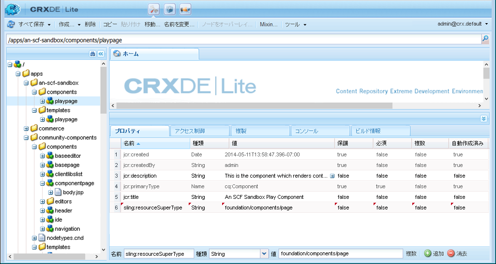
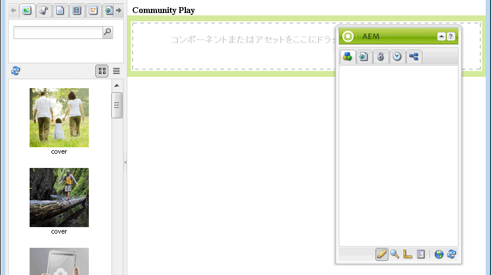

# サンドボックスアプリケーションの開発   {#develop-sandbox-application}

[初期アプリケーション](initial-app.md)の節でテンプレートをセットアップし、[初期コンテンツ](initial-content.md)の節で初期ページを設定したので、ここでは、作成時にコミュニティコンポーネントを使用できるようにするとともに、基盤スクリプトを使用してアプリケーションを開発できます。この節の最後に、Webサイトが機能するようになります。

## 基盤ページスクリプトの使用 {#using-foundation-page-scripts}

デフォルトのスクリプトは、playpage テンプレートをレンダリングするコンポーネントを追加したときに作成されましたが、このスクリプトを変更して、基盤ページの head.jsp およびローカルの body.jsp を含めます。

### スーパーリソースタイプ  {#super-resource-type}

最初の手順は、`/apps/an-scf-sandbox/components/playpage`ノードにリソースのスーパータイププロパティを追加して、スーパータイプのスクリプトとプロパティを継承するようにすることです。

CRXDE Lite を使用して、次の手順を実行します。

1. ノード`/apps/an-scf-sandbox/components/playpage`を選択します。
1. 「プロパティ」タブで、次の値を持つ新しいプロパティを入力します。

   名前：`sling:resourceSuperType`

   型：`String`

   値：`foundation/components/page`

1. 緑色の&#x200B;**[!UICONTROL +追加]**&#x200B;ボタンをクリックします。
1. 「**[!UICONTROL すべて保存]**」をクリックします。

   

### ヘッドとボディスクリプト{#head-and-body-scripts}

1. **CRXDE Lite**&#x200B;エクスプローラペインで、`/apps/an-scf-sandbox/components/playpage`に移動し、ファイル`playpage.jsp`を重複クリックして編集ペインで開きます。

   `/apps/an-scf-sandbox/components/playpage/playpage.jsp`

   ```xml
   <%--
   
     An SCF Sandbox Play Component component.
   
     This is the component which renders content for An SCF Sandbox page.
   
   --%><%
   %><%@include file="/libs/foundation/global.jsp"%><%
   %><%@page session="false" %><%
   %><%
    // TODO add your code here
   %>
   ```

1. スクリプトの開始／終了タグに注意して、「// TODO ...」の代わりに、&lt;html> のヘッダーと本文部分のスクリプトを含めます。

   スーパータイプが`foundation/components/page`の場合、この同じフォルダーに定義されていないスクリプトは、`/apps/foundation/components/page`フォルダー内のスクリプト（存在する場合）に解決され、それ以外の場合は`/libs/foundation/components/page`フォルダー内のスクリプトに解決されます。

   `/apps/an-scf-sandbox/components/playpage/playpage.jsp`

   ```xml
   <%--
   
       An SCF Sandbox Play Component component: playpage.jsp
   
     This is the component which renders content for An SCF Sandbox page.
   
   --%><%
   %><%@include file="/libs/foundation/global.jsp"%><%
   %><%@page session="false" %>
   <html>
     <cq:include script="head.jsp"/>
     <cq:include script="body.jsp"/>
   </html>
   ```

1. 基盤スクリプト `head.jsp` をオーバーレイする必要はありませんが、基盤スクリプト `body.jsp` は空です。

   オーサリングの設定を行うには、`body.jsp`をローカルスクリプトでオーバーレイし、本文に段落システム(parsys)を含めます。

   1. `/apps/an-scf-sandbox/components` に移動します。
   1. `playpage`ノードを選択します。
   1. 右クリックし、`Create > Create File...`を選択します。

      * 名前：**body.jsp**
   1. 「**[!UICONTROL すべて保存]**」をクリックします。

   `/apps/an-scf-sandbox/components/playpage/body.jsp`を開き、次のテキストに貼り付けます。

   ```xml
   <%--
   
       An SCF Sandbox Play Component component: body.jsp
   
     This is the component which renders content for An SCF Sandbox page.
   
   --%><%
   %><%@include file="/libs/foundation/global.jsp"%><%
   %><%@page session="false" %>
   <body>
       <h2>Community Play</h2>
       <cq:include path="par" resourceType="foundation/components/parsys" />
   </body>
   ```

1. 「**[!UICONTROL すべて保存]**」をクリックします。

**ページを編集モードでブラウザーに表示します。**

* 標準 UI：[http://localhost:4502/editor.html/content/an-scf-sandbox/en/play.html](http://localhost:4502/editor.html/content/an-scf-sandbox/en/play.md)

見出し&#x200B;**コミュニティの再生**&#x200B;だけでなく、ページコンテンツ編集用のUIも表示されます。

サイドパネルが開くように切り替え、ウィンドウがサイドコンテンツとページコンテンツの両方を表示するのに十分な大きさである場合、アセット／コンポーネントサイドパネルが表示されます。


* クラシックUI:[http://localhost:4502/cf#/content/an-scf-sandbox/en/play.html](http://localhost:4502/cf#/content/an-scf-sandbox/en/play.html)

以下に、コンテンツファインダー(cf)を含むクラシックUIでの再生ページの表示方法を示します。



## コミュニティコンポーネント {#communities-components}

オーサリング用にコミュニティコンポーネントを使用できるようにするには、まず、次の指示に従ってください。

* [コミュニティコンポーネントへのアクセス](basics.md#accessing-communities-components)

このサンドボックスでは、次の&#x200B;**コミュニティ**&#x200B;コンポーネントから開始します（チェックボックスをオンにして有効にします）。

* コメント
* フォーラム
* 評価
* レビュー
* レビューの概要 (表示)
* 投票

さらに、「**[!UICONTROL 一般]**&#x200B;コンポーネント(

* 画像
* テーブル
* テキスト
* タイトル（基盤）

>[!NOTE]
>
>page parに対して有効になっているコンポーネントは、リポジトリに、`components`
>
>`/etc/designs/an-scf-sandbox/jcr:content/playpage/par` node.

## ランディングページ {#landing-page}

多言語環境では、クライアントからの要求を解析して優先言語を特定するスクリプトがルートページに含まれます。

この単純な例では、ルートページは英語のページにリダイレクトするように静的に設定されています。英語は、今後、再生ページへのリンクを持つメインランディングページとして開発される可能性があります。

ブラウザーの URL をルートページ [http://localhost:4502/editor.html/content/an-scf-sandbox.html](https://locahost:4502/editor.html/content/an-scf-sandbox.html) に変更します。

* ページ情報アイコンを選択します。
* 「**[!UICONTROL プロパティを開く]**」を選択します
* 「詳細」タブ

   * リダイレクトエントリについては、**[!UICONTROL Webサイト]** > **[!UICONTROL SCF Sandboxサイト]** > **[!UICONTROL SCF Sandbox]**&#x200B;を参照します。
   * 「**[!UICONTROL OK]**」をクリックします。

* 「**[!UICONTROL OK]**」をクリックします。

サイトを公開した後、パブリッシュインスタンスでルートページを参照すると、英語のページにリダイレクトされます。

コミュニティのSCFコンポーネントを再生する前の最後の手順は、クライアントライブラリフォルダー(clientlibs)を追加することです。. [追加クライアンリブ](add-clientlibs.md)