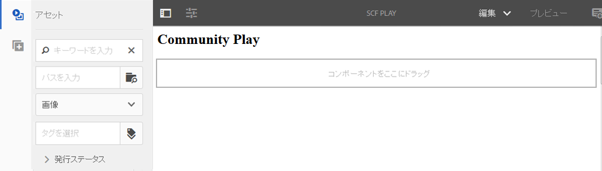

# サンドボックスアプリケーションの開発  {#develop-sandbox-application}

この節では、テンプレートをに設定しました。 [初期適用](initial-app.md) セクションと、で確立された初期ページ [初期コンテンツ](initial-content.md) セクションでは、アプリケーションを開発することができます。 それには、Communities コンポーネントでのオーサリングを有効にする機能を含む、基盤スクリプトを使用します。 この節の最後では、完全に機能する web サイトがあります。

## 基盤ページスクリプトの使用 {#using-foundation-page-scripts}

再生ページテンプレートをレンダリングするコンポーネントを追加すると作成されるデフォルトのスクリプトは、基盤ページの head.jsp とローカルの body.jsp を含むように変更されます。

### スーパーリソースタイプ {#super-resource-type}

最初の手順では、リソースのスーパータイプのプロパティをに追加します。 `/apps/an-scf-sandbox/components/playpage` スーパータイプのスクリプトとプロパティを継承するようにノードします。

CRXDE Liteの使用：

1. ノードを選択 `/apps/an-scf-sandbox/components/playpage`.
1. 「プロパティ」タブで、次の値を持つ新しいプロパティを入力します。

   名前：`sling:resourceSuperType`

   タイプ：`String`

   値：`foundation/components/page`

1. 緑をクリックします **[!UICONTROL +追加]** ボタン。
1. 「**[!UICONTROL すべて保存]**」をクリックします。

   

### head スクリプトと body スクリプト {#head-and-body-scripts}

1. 対象： **CRXDE Lite** エクスプローラーペイン、次に移動します `/apps/an-scf-sandbox/components/playpage` ファイルをダブルクリックします `playpage.jsp` をクリックして、編集ウィンドウで開きます。

   `/apps/an-scf-sandbox/components/playpage/playpage.jsp`

   ```xml
   <%--
   
     An SCF Sandbox Play Component component.
   
     This is the component which renders content for An SCF Sandbox page.
   
   --%><%
   %><%@include file="/libs/foundation/global.jsp"%><%
   %><%@page session="false" %><%
   %><%
    // TODO add your code here
   %>
   ```

1. スクリプトタグを開く/閉じるのは認識されているので、「// TODO ...」をに置き換えます。 `includes` の頭と体の部分のスクリプトの &lt;html>.

   スーパータイプで `foundation/components/page`の場合、この同じフォルダーで定義されていないスクリプトは、 `/apps/foundation/components/page` フォルダー（存在する場合）、または内のスクリプトに対する他のフォルダー `/libs/foundation/components/page` フォルダー。

   `/apps/an-scf-sandbox/components/playpage/playpage.jsp`

   ```xml
   <%--
   
       An SCF Sandbox Play Component component: playpage.jsp
   
     This is the component which renders content for An SCF Sandbox page.
   
   --%><%
   %><%@include file="/libs/foundation/global.jsp"%><%
   %><%@page session="false" %>
   <html>
     <cq:include script="head.jsp"/>
     <cq:include script="body.jsp"/>
   </html>
   ```

1. 基盤スクリプトのオーバーレイ `head.jsp` は必須ではありませんが、基盤スクリプトです `body.jsp` が空である。

   オーサリング用にを設定するには、をオーバーレイします `body.jsp` をローカルスクリプトに追加し、段落システム（parsys）を本文に含めます。

   1. `/apps/an-scf-sandbox/components` に移動します。
   1. `playpage` ノードを選択します。
   1. 右クリックして選択 `Create > Create File...`

      * 名前： **body.jsp**

   1. 「**[!UICONTROL すべて保存]**」をクリックします。

   開く `/apps/an-scf-sandbox/components/playpage/body.jsp` 次のテキストを貼り付けます。

   ```xml
   <%--
   
       An SCF Sandbox Play Component component: body.jsp
   
     This is the component which renders content for An SCF Sandbox page.
   
   --%><%
   %><%@include file="/libs/foundation/global.jsp"%><%
   %><%@page session="false" %>
   <body>
       <h2>Community Play</h2>
       <cq:include path="par" resourceType="foundation/components/parsys" />
   </body>
   ```

1. 「**[!UICONTROL すべて保存]**」をクリックします。

**編集モードでブラウザーにページを表示します。**

* 標準 UI: `http://localhost:4502/editor.html/content/an-scf-sandbox/en/play.html`

見出しのみが表示されるわけではありません **コミュニティプレイ**&#x200B;ただし、ページコンテンツを編集するための UI も同様です。

アセット/コンポーネント サイドパネルは、両方のサイドパネルが開き換えられ、サイドコンテンツとページコンテンツの両方が表示されるほどウィンドウが広い場合に表示されます。



* クラシック UI：`http://localhost:4502/cf#/content/an-scf-sandbox/en/play.html`

コンテンツファインダー（cf）を含むクラシック UI での再生ページの表示方法を次に示します。


## コミュニティコンポーネント {#communities-components}

Communities コンポーネントをオーサリング用に有効にするには、まず次の手順に従います。

* [Communities コンポーネントへのアクセス](basics.md#accessing-communities-components)

このサンドボックスの目的上、次から始めます **コミュニティ** コンポーネント （チェックボックスをオンにして有効にします）:

* コメント
* フォーラム
* レーティング
* レビュー
* レビューの概要 (表示)
* 投票

さらに、を選択します **[!UICONTROL 一般]** コンポーネント（例：）

* 画像
* テーブル
* テキスト
* タイトル （基盤）

>[!NOTE]
>
>ページ部分に対して有効なコンポーネントは、の値としてリポジトリに格納されます。 `components` のプロパティ
>
>ノード `/etc/designs/an-scf-sandbox/jcr:content/playpage/par`.

## ランディングページ {#landing-page}

多言語環境では、ルートページには、クライアントからのリクエストを解析して優先言語を決定するスクリプトが含まれます。

この例では、ルートページは英語ページにリダイレクトするように静的に設定されています。英語ページは今後開発される可能性があり、再生ページへのリンクを含むメインランディングページになります。

ブラウザー URL をルートページに変更します。 `http://localhost:4502/editor.html/content/an-scf-sandbox.html`

* 「ページ情報」アイコンを選択します
* を選択 **[!UICONTROL プロパティを開く]**
* 「詳細」タブで、次の設定を行います

   * リダイレクトエントリの場合は、を参照します **[!UICONTROL Web サイト]** > **[!UICONTROL SCF サンドボックスサイト]** > **[!UICONTROL SCF サンドボックス]**
   * クリック **[!UICONTROL OK]**

* クリック **[!UICONTROL OK]**

サイトが公開されると、パブリッシュインスタンス上のルートページを参照すると、英語のページにリダイレクトされます。

Communities SCF コンポーネントを使用する前の最後の手順は、クライアントライブラリフォルダー（clientlibs）....を追加することです [Clientlibs の追加](add-clientlibs.md)
