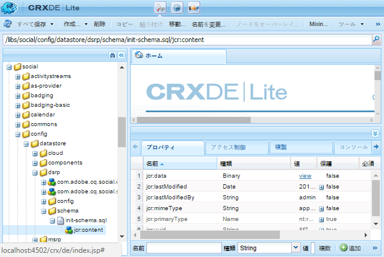

# DSRP 向け MySQL 設定 {#mysql-configuration-for-dsrp}

MySQL は、ユーザー生成コンテンツ（UGC）の保存に使用できるリレーショナルデータベースです。

次の手順で、MySQL サーバーに接続し、UGC データベースを設定する方法について説明します。

## 要件 {#requirements}

* [最新のコミュニティ機能パック](deploy-communities.md#latestfeaturepack)
* [MySQL 用 JDBC ドライバー](deploy-communities.md#jdbc-driver-for-mysql)
* リレーショナルデータベース：

   * [MySQL サーバー](https://dev.mysql.com/downloads/mysql/) Community Server バージョン 5.6 以降

      * AEMと同じホスト上で実行するか、リモートで実行できます
   * [MySQL Workbench](https://dev.mysql.com/downloads/tools/workbench/)

## MySQL のインストール {#installing-mysql}

対象 OS の手順に従い、[MySQL](https://dev.mysql.com/downloads/mysql/) をダウンロードしてインストールする必要があります。

### 小文字のテーブル名 {#lower-case-table-names}

SQL では大文字と小文字が区別されます。大文字と小文字が区別されるオペレーティングシステムでは、すべてのテーブル名を小文字にする設定を含める必要があります。

例えば、Linux OS でテーブル名をすべて小文字に指定するには、

* ファイルを編集 `/etc/my.cnf`
* 内 `[mysqld]` セクションで、次の行を追加します。

   `lower_case_table_names = 1`

### UTF8 文字セット {#utf-character-set}

より優れた多言語対応を実現するには、UTF8 文字セットを使用する必要があります。

以下の操作で MySQL の文字セットを UTF8 に変更します。

* mysql> SET NAMES &#39;utf8&#39;;

以下の操作で MySQL データベースをデフォルトから UTF8 に変更します。

* ファイルを編集 `/etc/my.cnf`
* 内 `[client]` セクションで、次の行を追加します。

   `default-character-set=utf8`

* 内 `[mysqld]` セクションで、次の行を追加します。

   `character-set-server=utf8`

## MySQL Workbench のインストール {#installing-mysql-workbench}

MySQL Workbench には、スキーマと初期データをインストールする SQL スクリプトを実行するための UI が用意されています。

ターゲット OS の手順に従って、MySQL Workbench をダウンロードし、インストールする必要があります。

## Communities の接続 {#communities-connection}

MySQL Workbench を初めて起動したときは（他の目的で既に使用されていない場合）、接続はまだ表示されません。

### 新しい接続の設定 {#new-connection-settings}

1. を選択します。 `+` 右のアイコン `MySQL Connections`.
1. ダイアログ内 `Setup New Connection`、使用するプラットフォームに適した値を入力

   デモ用に、オーサーAEMインスタンスと MySQL を同じサーバー上に配置します。

   * 接続名: `Communities`
   * 接続方法： `Standard (TCP/IP)`
   * Hostname：`127.0.0.1`
   * ユーザー名: `root`
   * パスワード: `no password by default`
   * デフォルトのスキーマ： `leave blank`

1. 選択 `Test Connection` 実行中の MySQL サービスへの接続を検証するには、以下を実行します。

**備考**:

* デフォルトのポートは `3306`
* 選択した接続名が、データソース名としてに入力されます。 [JDBC OSGi 設定](#configurejdbcconnections)

#### 新しい Communities 接続 {#new-communities-connection}

## データベースのセットアップ {#database-setup}

データベースをインストールするには、Communities 接続を開きます。

### SQL スクリプトの取得 {#obtain-the-sql-script}

SQL スクリプトは、AEM リポジトリから取得されます。

1. 参照してCRXDE Lite

   * 例：[http://localhost:4502/crx/de](http://localhost:4502/crx/de)

1. /libs/social/config/datastore/dsrp/schema フォルダーを選択します。
1. ダウンロード `init-schema.sql`

   

スキーマをダウンロードする方法の 1 つは次のとおりです。

* を選択します。 `jcr:content` sql ファイルのノード
* の値 `jcr:data` プロパティは表示リンクです

* データをローカルファイルに保存するには、表示リンクを選択します

### DSRP データベースの作成 {#create-the-dsrp-database}

以下の手順に従って、データベースをインストールします。 データベースのデフォルト名はです。 `communities`.

スクリプトでデータベース名を変更する場合は、[JDBC 設定](#configurejdbcconnections)でも変更してください。

#### Step 1 : open SQL file {#step-open-sql-file}

MySQL Workbench で、以下の設定をおこないます。

* [ ファイル ] プルダウンメニューから、 **[!UICONTROL SQL スクリプトを開く]** オプション
* ダウンロードした `init_schema.sql` スクリプト

#### Step 2 : execute SQL Script {#step-execute-sql-script}

手順 1 で開いたファイルの Workbench ウィンドウで、 `lightening (flash) icon` スクリプトを実行します。

以下の画像では、`init_schema.sql` ファイルは実行可能です。

#### 更新 {#refresh}

スクリプトを実行した後は、 `SCHEMAS` セクション `Navigator` 新しいデータベースを確認するために。 以下のように、「SCHEMAS」の右側にある更新アイコンを使用します。

## JDBC 接続の設定 {#configure-jdbc-connection}

**Day Commons JDBC Connections Pool** の OSGi 設定では、MySQL JDBC ドライバーを設定します。

すべての AEM パブリッシュインスタンスおよびオーサーインスタンスが、同じ MySQL サーバーを指している必要があります。

MySQL をAEMとは異なるサーバーで実行する場合は、JDBC コネクタの「localhost」の代わりにサーバーホスト名を指定する必要があります。

* 各オーサーおよびパブリッシュAEMインスタンス上。
* 管理者権限でサインインしました。
* 次にアクセス： [web コンソール](../../help/sites-deploying/configuring-osgi.md).

   * 例： [http://localhost:4502/system/console/configMgr](http://localhost:4502/system/console/configMgr)

* を `Day Commons JDBC Connections Pool`
* を選択します。 `+` アイコンをクリックして、新しい接続設定を作成します。

   

* 次の値を入力します。

   * **[!UICONTROL JDBC ドライバークラス]**: `com.mysql.jdbc.Driver`
   * **[!UICONTROL JDBC 接続 URI]**: `jdbc:mysql://localhost:3306/communities?characterEncoding=UTF-8`

      MySQL サーバーが「this」AEMサーバーと同じでない場合は、localhost の代わりにサーバーを指定します *コミュニティ* はデフォルトのデータベース（スキーマ）名です。

   * **[!UICONTROL ユーザー名]**: `root`

      MySQL サーバーに設定されているユーザー名（「root」でない場合）を入力します。

   * **[!UICONTROL パスワード]**:

      MySQL のパスワードが設定されていない場合は、このフィールドをクリアします。

      または、MySQL ユーザー名用に設定したパスワードを入力します。

   * **[!UICONTROL データソース名]**:次に対して入力された名前： [MySQL 接続](#new-connection-settings)例えば、「コミュニティ」などです。

* 選択 **[!UICONTROL 保存]**
