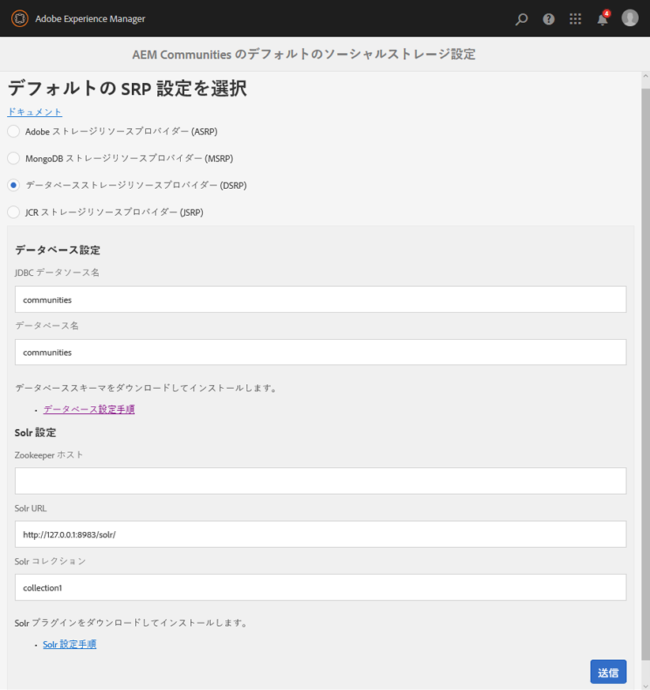

# DSRP - リレーショナルデータベースストレージリソースプロバイダー {#dsrp-relational-database-storage-resource-provider}

## DSRP について {#about-dsrp}

リレーショナルデータベースを共通ストアとして使用するように AEM Communities を設定すると、すべてのオーサーインスタンスとパブリッシュインスタンスからユーザー生成コンテンツ（UGC）にアクセスでき、同期やレプリケーションをおこなう必要はありません。

[SRP オプションの特性](working-with-srp.md#characteristics-of-srp-options)と[推奨されるトポロジ](topologies.md)も参照してください。

## 要件 {#requirements}

* [MySQL](#mysql-configuration)：リレーショナルデータベース.
* [Apache Solr](#solr-configuration)：検索プラットフォーム.

>[!NOTE]
>
>デフォルトのストレージ設定は、etc path (`/conf/global/settings/community/srpc/defaultconfiguration`)ではなくconf path(`/etc/socialconfig/srpc/defaultconfiguration`)に保存されるようになりました。 defaultsrpを期待どおりに機能させるには、 [移行手順に従うようお勧めします](#zerodt-migration-steps) 。

## リレーショナルデータベースの設定 {#relational-database-configuration}

### MySQL 設定 {#mysql-configuration}

別々のデータベース（スキーマ）名と別々の接続（server:port）を使用することで、1 つの MySQL を同じ接続プール内のイネーブルメント機能と共通ストア（DSRP）の間で共有できます。

For installation and configuration details, see [MySQL Configuration for DSRP](dsrp-mysql.md).

### Solr 設定 {#solr-configuration}

別々のコレクションを使用することで、1 つの Solr をノードストア（Oak）と共通ストア（SRP）の間で共有できます。

Oak と SRP のコレクションがどちらも高頻度で使用される場合は、パフォーマンス上の理由から 2 つ目の Solr をインストールすることもできます。

実稼働環境では、SolrCloudモードを使用すると、スタンドアロンモード（ローカルで単一のSolr設定）よりもパフォーマンスが向上します。

インストールと設定について詳しくは、[SRP 向け Solr 設定](solr.md)を参照してください。

### DSRP の選択 {#select-dsrp}

[ストレージ設定コンソール](srp-config.md) では、デフォルトのストレージ設定を選択できます。これにより、使用するSRPの実装が識別されます。

オーサー環境でストレージ設定コンソールにアクセスするには

* 管理者権限でサインインする
* From the **main menu**

   * Select **[!UICONTROL Tools]** (from the left hand pane)
   * Select **[!UICONTROL Communities]**
   * Select **[!UICONTROL Storage Configuration]**

      * As an example, the resulting location is: [http://localhost:4502/communities/admin/defaultsrp](http://localhost:4502/communities/admin/defaultsrp)
      >[!NOTE]
      >
      >デフォルトのストレージ設定は、etc path (`/conf/global/settings/community/srpc/defaultconfiguration`)ではなくconf path(`/etc/socialconfig/srpc/defaultconfiguration`)に保存されるようになりました。 defaultsrpを期待どおりに機能させるには、 [移行手順に従うようお勧めします](#zerodt-migration-steps) 。

   

* Select **[!UICONTROL Database Storage Resource Provider (DSRP)]**
* **データベース設定**

   * **[!UICONTROL JDBC データソース名]**

      MySQL接続に指定する名前は、 [JDBC OSGi設定で入力した名前と同じである必要があります](dsrp-mysql.md#configurejdbcconnections)

      *default*:コミュニティ

   * **[!UICONTROL データベース名]**

      [init_スキーマ.sql](dsrp-mysql.md#obtain-the-sql-script) script内のスキーマに指定された名前

      *default*:コミュニティ

* **SolrConfiguration**

   * **[](https://cwiki.apache.org/confluence/display/solr/Using+ZooKeeper+to+Manage+Configuration+Files)Zookeeper ホスト**

      内部ZooKeeperを使用してSolrを実行する場合は、この値を空白のままにします。 Else, when running in [SolrCloud mode](solr.md#solrcloud-mode) with an external ZooKeeper, set this value to the URI for the ZooKeeper, such as *my.server.com:80*

      *default*: *&lt;空白>*

   * **[!UICONTROL Solr URL]**

      *default*:https://127.0.0.1:8983/solr/

   * **[!UICONTROL Solr コレクション]**

      *デフォルト*：collection1

* 「**[!UICONTROL 送信]**」を選択します。

### defaultsrpのダウンタイムなしの移行手順 {#zerodt-migration-steps}

次の手順に従って、defaultsrpページhttp://localhost:4502/communities/admin/defaultsrp [](http://localhost:4502/communities/admin/defaultsrp) が期待どおりに動作することを確認します。

1. パスの名前をに変更 `/etc/socialconfig` し `/etc/socialconfig_old`ます。これにより、システム設定がjsrp(default)にフォールバックされます。
1. defaultsrpページhttp://localhost:4502/communities/admin/defaultsrp [](http://localhost:4502/communities/admin/defaultsrp)に移動します。ここで、jsrpが設定されています。 「 **[!UICONTROL submit]** 」ボタンをクリックして、新しいデフォルト設定ノードがに作成され `/conf/global/settings/community/srpc`ます。
1. 作成したデフォルト設定を削除 `/conf/global/settings/community/srpc/defaultconfiguration`します。
1. 前の手順で削除したノード( `/etc/socialconfig_old/srpc/defaultconfiguration``/conf/global/settings/community/srpc/defaultconfiguration`)の代わりに、古い設定をコピーします。
1. 古いetcノードを削除し `/etc/socialconfig_old`ます。

## 設定の公開 {#publishing-the-configuration}

すべてのオーサーインスタンスとパブリッシュインスタンスで、DSRP が共通ストアとして指定されている必要があります。

パブリッシュ環境で同一の設定を使用できるようにするには：

* 作成者：

   * Navigate from main menu to **[!UICONTROL Tools]** > **[!UICONTROL Operations]** > **[!UICONTROL Replication]**
   * Double-click **[!UICONTROL Activate Tree]**
   * **開始パス**:

      * 参照先 `/etc/socialconfig/srpc/`
   * が選択され `Only Modified` ていないことを確認します。
   * Select **[!UICONTROL Activate]**.


## ユーザーデータの管理 {#managing-user-data}

For information regarding *users*, *user profiles* and *user groups*, often entered in the publish environment, visit:

* [ユーザーの同期](sync.md)
* [ユーザーとユーザーグループの管理](users.md)

## DSRP の Solr のインデックス再作成 {#reindexing-solr-for-dsrp}

DSRP Solr のインデックスを再作成するには、[MSRP のインデックスの再作成](msrp.md#msrp-reindex-tool)に関するドキュメントの説明に従います。ただし、DSRP のインデックスを再作成する場合は、この URL を使用します：**/services/social/datastore/rdb/reindex**

例えば、DSRP のインデックスを再作成する curl コマンドは次のようになります。

```shell
curl -u admin:password -X POST -F path=/ https://host:port/services/social/datastore/rdb/reindex
```

