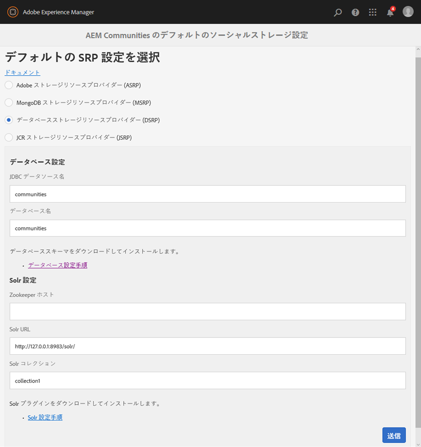

# DSRP - リレーショナルデータベースストレージリソースプロバイダー {#dsrp-relational-database-storage-resource-provider}

## DSRPについて {#about-dsrp}

AEM Communitiesがリレーショナルデータベースを共通ストアとして使用するように設定されている場合、UGC （ユーザー生成コンテンツ）は、同期やレプリケーションを必要とせずに、すべてのオーサーインスタンスとパブリッシュインスタンスからアクセスできます。

[SRP オプションの特性](working-with-srp.md#characteristics-of-srp-options)および[推奨トポロジ &#x200B;](topologies.md)も参照してください。

## 要件 {#requirements}

* [MySQL](#mysql-configuration)、リレーショナルデータベース。
* 検索プラットフォームの[Apache Solr](#solr-configuration)。

>[!NOTE]
>
>既定のストレージ設定は、`etc` パス （`/etc/socialconfig/srpc/defaultconfiguration`）ではなくconf パス （`/conf/global/settings/community/srpc/defaultconfiguration`）に保存されるようになりました。 [移行手順](#zerodt-migration-steps)に従って、defaultsrpを期待どおりに動作させることをお勧めします。

## リレーショナルデータベース設定 {#relational-database-configuration}

### MySQL設定 {#mysql-configuration}

MySQL インストールは、異なるデータベース （スキーマ）名と異なる接続（サーバー:port）を使用して、同じ接続プール内のイネーブルメント機能と共通ストア （DSRP）の間で共有できます。

インストールと設定の詳細については、[MySQL Configuration for DSRP](dsrp-mysql.md)を参照してください。

### Solr 設定 {#solr-configuration}

Solr インストールは、異なるコレクションを使用して、ノードストア（Oak）と共通ストア（SRP）の間で共有できます。

Oak コレクションとSRP コレクションの両方を集中的に使用する場合は、パフォーマンス上の理由から2番目のSolrをインストールできます。

実稼動環境の場合、SolrCloud モードでは、スタンドアロンモード（単一のローカル Solr セットアップ）よりもパフォーマンスが向上します。

インストールと設定の詳細については、[Solr Configuration for SRP](solr.md)を参照してください。

### DSRPの選択 {#select-dsrp}

[&#x200B; ストレージ設定コンソール &#x200B;](srp-config.md)では、使用するSRPの実装を特定するデフォルトのストレージ設定を選択できます。

作成者は、ストレージ設定コンソールにアクセスできます

* 管理者権限でログイン
* **メインメニュー**&#x200B;から

   * **[!UICONTROL ツール]**&#x200B;を選択します（左側のペインから）
   * **[!UICONTROL コミュニティ]**&#x200B;を選択
   * **[!UICONTROL ストレージ設定]**&#x200B;を選択

      * 例えば、結果の場所は[http://localhost:4502/communities/admin/defaultsrp](http://localhost:4502/communities/admin/defaultsrp)です。

     >[!NOTE]
     >
     >既定のストレージ設定は、`etc` パス （`/etc/socialconfig/srpc/defaultconfiguration`）ではなくconf パス （`/conf/global/settings/community/srpc/defaultconfiguration`）に保存されるようになりました。 [移行手順](#zerodt-migration-steps)に従って、defaultsrpを期待どおりに動作させることをお勧めします。

  

* **[!UICONTROL データベースストレージリソースプロバイダー（DSRP）]**&#x200B;を選択
* **データベース設定**

   * **[!UICONTROL JDBC データソース名]**

     MySQL接続に指定する名前は、[JDBC OSGi設定](dsrp-mysql.md#configurejdbcconnections)で入力した名前と同じである必要があります

     *default*: communities

   * **[!UICONTROL データベース名]**

     [init_schema.sql](dsrp-mysql.md#obtain-the-sql-script) スクリプトのスキーマに指定された名前

     *default*: communities

* **SolrConfiguration**

   * **[Zookeeper](https://solr.apache.org/guide/6_6/using-zookeeper-to-manage-configuration-files.html) ホスト**

     内部ZooKeeperを使用してSolrを実行する場合は、この値を空白のままにします。 または、外部ZooKeeperを使用して[SolrCloud モード &#x200B;](solr.md#solrcloud-mode)で実行する場合は、この値を&#x200B;*my.server.com:80*&#x200B;など、ZooKeeperのURIに設定します

     *default*: *&lt;blank>*

   * **[!UICONTROL Solr URL]**

     *default*: https://127.0.0.1:8983/solr/

   * **[!UICONTROL Solr コレクション]**

     *default*: collection1

* 「**[!UICONTROL 送信]**」を選択します。

### defaultsrpのダウンタイム移行手順はゼロ {#zerodt-migration-steps}

defaultsrp ページ [http://localhost:4502/communities/admin/defaultsrp](http://localhost:4502/communities/admin/defaultsrp)が期待どおりに動作することを確認するには、次の手順に従います。

1. システム設定がjsrp （デフォルト）にフォールバックするように、`/etc/socialconfig`のパスの名前を`/etc/socialconfig_old`に変更します。
1. jsrpが設定されているdefaultsrp ページ [http://localhost:4502/communities/admin/defaultsrp](http://localhost:4502/communities/admin/defaultsrp)に移動します。 **[!UICONTROL 送信]** ボタンをクリックして、新しいデフォルト設定ノードを`/conf/global/settings/community/srpc`に作成します。
1. 作成した既定の設定`/conf/global/settings/community/srpc/defaultconfiguration`を削除します。
1. 前の手順で削除したノード （`/conf/global/settings/community/srpc/defaultconfiguration`）の代わりに、古い構成`/etc/socialconfig_old/srpc/defaultconfiguration`をコピーします。
1. 古い`etc` ノード `/etc/socialconfig_old`を削除します。

## 設定の公開 {#publishing-the-configuration}

DSRPは、すべてのオーサーインスタンスとパブリッシュインスタンスの共通ストアとして識別する必要があります。

パブリッシュ環境で同じ設定を使用できるようにするには、次の手順を実行します。

* 作成者：

   * メインメニューから&#x200B;**[!UICONTROL ツール]** > **[!UICONTROL 操作]** > **[!UICONTROL レプリケーション]**&#x200B;に移動します
   * **[!UICONTROL ツリーをアクティブ化]**&#x200B;をダブルクリックします
   * **パスの開始**:

      * `/etc/socialconfig/srpc/`を参照

   * `Only Modified`が選択されていないことを確認します。
   * 「**[!UICONTROL アクティブ化]**」を選択します。

## ユーザーデータの管理 {#managing-user-data}

*ユーザー*、*ユーザープロファイル*&#x200B;および&#x200B;*ユーザーグループ*&#x200B;について、パブリッシュ環境で頻繁に入力される情報については、次のサイトを参照してください。

* [ユーザー同期](sync.md)
* [ユーザーとユーザーグループの管理](users.md)

## DSRPのSolrのインデックス再作成 {#reindexing-solr-for-dsrp}

DSRP Solrのインデックスを再作成するには、[MSRP](msrp.md#msrp-reindex-tool)のインデックス再作成に関するドキュメントに従います。ただし、DSRPのインデックス再作成時には、代わりにこのURLを使用します：**/services/social/datastore/rdb/reindex**

例えば、DSRPのインデックスを再作成するcurl コマンドは次のようになります。

```shell
curl -u admin:password -X POST -F path=/ https://host:port/services/social/datastore/rdb/reindex
```
