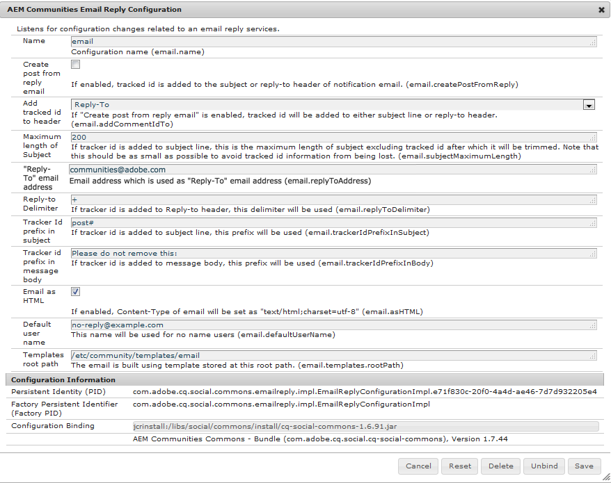
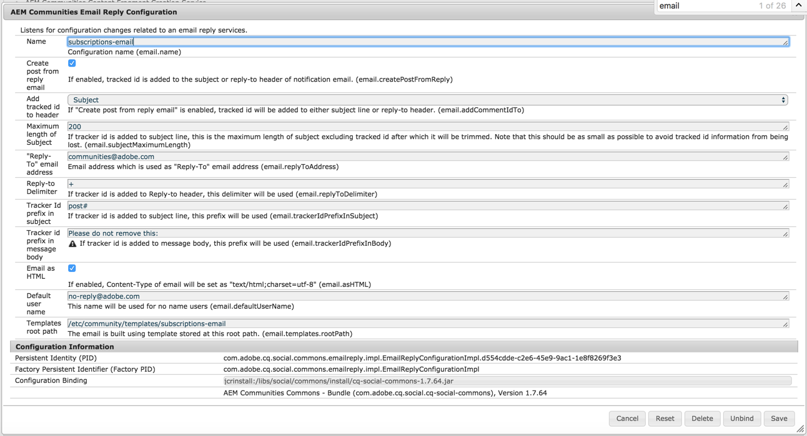

# 電子メールの設定 {#configuring-email}

AEM Communitiesは次の電子メールを使用します。

* [コミュニティの通知](notifications.md)
* [コミュニティの購読](subscriptions.md)

電子メール機能には SMTP サーバーと SMTP ユーザーの指定が必要なので、この機能はデフォルトでは使用できません。

>[!CAUTION]
>
>Email for notifications and subscriptions must be configured only on the [primary publisher](deploy-communities.md#primary-publisher).

## デフォルトの電子メールサービス設定 {#default-mail-service-configuration}

デフォルトの電子メールサービスは、通知と購読の両方に必要です。

* 管理者権限を持つプライマリ・パブリッシャにログインし、 [Webコンソールにアクセスします](../../help/sites-deploying/configuring-osgi.md):

   * For example, [http://localhost:4503/system/console/configMgr](http://localhost:4503/system/console/configMgr)

* を見つけ `Day CQ Mail Service`ます。
* 編集アイコンを選択します。

This is based on the documentation for [Configuring Email Notification](../../help/sites-administering/notification.md), but with a difference in that the field `"From" address` is *not* required and should be left empty.

例（入力されている値は例としてのみ使用されています）：

* **[!UICONTROL SMTPサーバーのホスト名]**

   *（必須）* 使用するSMTPサーバーです。

* **[!UICONTROL SMTPサーバーポート]**

   *（必須）* SMTPサーバーのポートは25以上である必要があります。

* **[!UICONTROL SMTPユーザー]**

   *（必須）* SMTPユーザーです。

* **[!UICONTROL SMTP password]**

   *（必須）* SMTPユーザーのパスワードです。

* **[!UICONTROL &quot;送信者&quot;アドレス]**

   空白のままにする
* **[!UICONTROL SMTP use SSL]**

   オンの場合、セキュリティで保護された電子メールを送信します。 ポートが465に設定されているか、SMTPサーバーに必要なポートであることを確認します。
* **[!UICONTROL 電子メールのデバッグ]**

   オンの場合、SMTPサーバーの操作のログ記録を有効にします。

## AEM Communities の電子メール設定 {#aem-communities-email-configuration}

Once the [default mail service](#default-mail-service-configuration) is configured, the two existing instances of the `AEM Communities Email Reply Configuration` OSGi config, included in the release, become functional.

電子メールによる返信を許可する際、購読用のインスタンスはさらに設定をおこなう必要があります。

1. [電子メール](#configuration-for-notifications) インスタンス：

   通知の場合は、返信電子メールをサポートしないので、変更しないでください。

1. [購読 — 電子メール](#configuration-for-subscriptions) インスタンス：

   返信電子メールからの投稿の作成を完全に有効にするように設定する必要があります。

Communities の電子メール設定インスタンスに接続するには：

* 管理者権限を持つプライマリ・パブリッシャにログインし、 [Webコンソールにアクセスする](../../help/sites-deploying/configuring-osgi.md)

   * For example, [http://localhost:4503/system/console/configMgr](http://localhost:4503/system/console/configMgr)

* Locate `AEM Communities Email Reply Configuration`.

### 通知用の設定 {#configuration-for-notifications}

名前電子メールを使用した `AEM Communities Email Reply Configuration` OSGi設定のインスタンスは通知機能です。 この機能には電子メールの返信は含まれません。

この設定は変更しないでください。

* を見つけ `AEM Communities Email Reply Configuration`ます。
* 編集アイコンを選択します。
* Verify the **Name** is `email`.

* Verify **Create post from reply email** is `unchecked`.

### 購読用の設定 {#configuration-for-subscriptions}

コミュニティ購読の場合、メンバーが電子メールに返信することによりコンテンツを投稿する機能を有効にしたり無効にしたりできます。

* を見つけ `AEM Communities Email Reply Configuration`ます。
* 編集アイコンを選択します。
* Verify the **Name** is `subscriptions-email`.

   

* **[!UICONTROL 名前]**

   *（必須）*`subscriptions-email`。 編集しない。

* **[!UICONTROL 返信電子メールから投稿を作成]**

   このオプションを選択すると、購読の電子メールの受信者は返信を送信してコンテンツを投稿できます。 初期設定はオンです。
* **[!UICONTROL ヘッダ追加ーに追跡されるID]**

   デフォルトは `Reply-To` です。

* **[!UICONTROL 件名の最大長]**

   トラッカーIDが件名行に追加された場合、これは、追跡対象IDを除く、件名の最大長です。この長さを超えると、トリミングされます。 トラッカー ID 情報が失われないように、可能な限り小さい値を設定する必要があります。初期設定は 200 です。

* **[!UICONTROL 「返信先」の電子メールアドレス]**

   「返信先」の電子メールアドレスとして使用されるアドレス。 デフォルトは `communities@adobe.com` です。

* **[!UICONTROL Reply-to-Delimiter]**

   トラッカーIDが返信先ヘッダーに追加された場合、この区切り文字が使用されます。 Default is `+` (plus sign).

* **[!UICONTROL 件名のトラッカーIDのプレフィックス]**

   トラッカーIDが件名行に追加された場合は、このプレフィックスが使用されます。 デフォルトは `post#` です。

* **[!UICONTROL メッセージ本文のトラッカーIDのプレフィックス]**

   トラッカーIDがメッセージの本文に追加された場合は、このプレフィックスが使用されます。 デフォルトは `Please do not remove this:` です。

* **[!UICONTROL HTMLとして電子メール]**:オンにすると、電子メールのコンテンツタイプがに設定され `"text/html;charset=utf-8"`ます。 初期設定はオンです。

* **[!UICONTROL デフォルトのユーザー名]**

   この名前は、名前を持つユーザーには使用されません。 デフォルトは `no-reply@example.com` です。

* **[!UICONTROL テンプレートのルートパス]**

   このルートパスに保存されているテンプレートを使用して電子メールが作成されます. デフォルトは `/etc/community/templates/subscriptions-email` です。

## ポーリングインポーターの設定 {#configure-polling-importer}

電子メールがリポジトリに取り込まれるように、ポーリングインポーターを設定し、そのプロパティをリポジトリで手動で設定する必要があります。

### 新しいポーリングインポーターの追加 {#add-new-polling-importer}

* 管理者権限を持つプライマリパブリッシャにログインし、ポーリングインポーターコンソールを参照します。

   For example, [http://localhost:4503/etc/importers/polling.html](http://localhost:4503/etc/importers/polling.html)

* Select **[!UICONTROL Add]**

   

* **[!UICONTROL 型]**

   *（必須）* プルダウンして選択し `POP3 (over SSL)`ます。

* **[!UICONTROL URL]**

   *（必須）* 送信メールサーバーです。 例： `pop.gmail.com:995/INBOX?username=community-emailgmail.com&password=****`

* **[!UICONTROL パスマップに読み込み]**(&amp;A);ast;

   *（必須）* : `/content/usergenerated/mailFolder/postEmails`フォルダーを参照 `postEmails`して「 **OK**」を選択し、に設定します。

* **[!UICONTROL 更新間隔 (単位：秒)]**

   *（オプション）* デフォルトのメールサービス用に設定されたメールサーバーには、更新間隔の値に関する要件がある場合があります。 例えば、Gmail では間隔を `300` にする必要がある場合があります。

* **[!UICONTROL ログイン]**

   *(オプション)*

* **[!UICONTROL パスワード]**

   *(オプション)*

* 「**[!UICONTROL OK]**」を選択します。

### 新しいポーリングインポーターのプロトコルの調整 {#adjust-protocol-for-new-polling-importer}

新しいポーリング設定が保存されたら、購読電子メールインポーターのプロパティをさらに変更し、プロトコルを `POP3` から `emailreply` に変更する必要があります

[CRXDE Lite](../../help/sites-developing/developing-with-crxde-lite.md) を使用して、次の手順を実行します。

* 管理者権限を持つプライマリパブリッシャーにログインし、https://&lt;server>:&lt;port>/crx/de/index.jsp#/etc/importers/polling [を参照します](http://localhost:4503/crx/de/index.jsp#/etc/importers/polling)。
* 新しく作成された設定を選択し、次のプロパティを変更します。

   * **feedType**:置換 `pop3s` 文字列 **`emailreply`**
   * **source**:ソースのプロトコルを次に置き換え `pop3s://` ます： **`emailreply://`**

赤い三角は、変更したプロパティを示します。変更内容を保存してください。

* Select **[!UICONTROL Save All]**.

