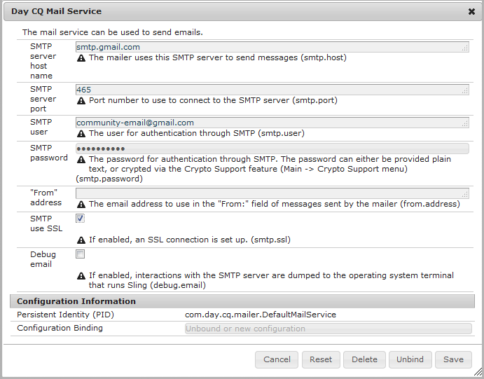
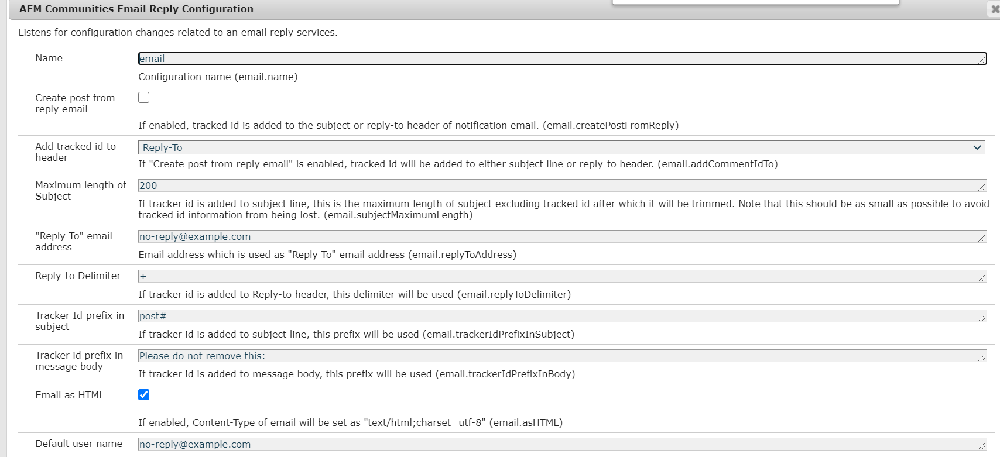
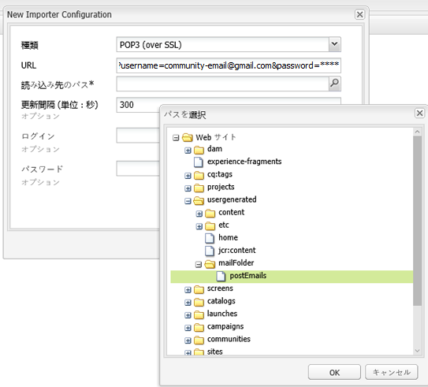
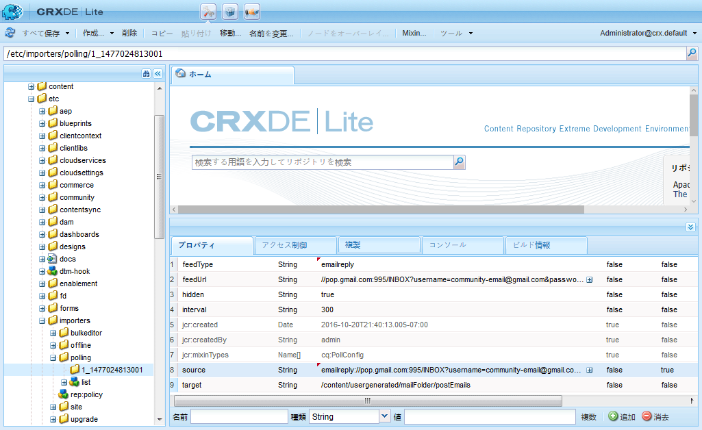

# メールの設定 {#configuring-email}

AEM Communitiesでは、次の目的で電子メールを使用します。

* [コミュニティの通知](notifications.md)
* [コミュニティの購読](subscriptions.md)

デフォルトでは、メール機能は機能しません。SMTP サーバーとSMTP ユーザーの指定が必要です。

>[!CAUTION]
>
>通知と購読の電子メールは、[&#x200B; プライマリパブリッシャー](deploy-communities.md#primary-publisher)でのみ設定する必要があります。

## デフォルトのメールサービス設定 {#default-mail-service-configuration}

デフォルトのメールサービスは、通知と購読の両方に必要です。

* 管理者権限でプライマリパブリッシャーにログインし、[Web コンソール &#x200B;](../../help/sites-deploying/configuring-osgi.md)にアクセスします。

   * 例：[http://localhost:4503/system/console/configMgr](http://localhost:4503/system/console/configMgr)

* `Day CQ Mail Service`を探します。
* 編集アイコンを選択します。

これは、[&#x200B; メール通知の設定](../../help/sites-administering/notification.md)に関するドキュメントに基づいていますが、フィールド `"From" address`が&#x200B;*ではなく*&#x200B;必要であり、空のままにしておく必要があるという違いがあります。

例えば、次の例のように入力します（値が入力されているのは実例の場合のみ）。

* **[!UICONTROL SMTP サーバーホスト名]**

  *（必須）*&#x200B;使用するSMTP サーバー。

* **[!UICONTROL SMTP サーバーポート]**

  *（必須）* SMTP サーバーポートは25以上である必要があります。

* **[!UICONTROL SMTP ユーザー]**

  *（必須）* SMTP ユーザー。

* **[!UICONTROL SMTP パスワード]**

  *（必須）* SMTP ユーザーのパスワード。

* **[!UICONTROL &quot;From&quot; アドレス]**

  空のままにする
* **[!UICONTROL SMTPはSSL]**&#x200B;を使用します

  オンにすると、安全な電子メールが送信されます。 ポートが465に設定されているか、SMTP サーバーの必要に応じて設定されていることを確認します。
* **[!UICONTROL 電子メールをデバッグ]**

  オンにすると、SMTP サーバーインタラクションのログ記録が有効になります。

## AEM Communitiesのメール設定 {#aem-communities-email-configuration}

[&#x200B; デフォルトのメールサービス &#x200B;](#default-mail-service-configuration)を設定すると、リリースに含まれている`AEM Communities Email Reply Configuration` OSGi設定の2つの既存のインスタンスが機能するようになります。

メールによる返信を許可する場合は、サブスクリプションのインスタンスのみを追加で設定する必要があります。

1. [&#x200B; メール &#x200B;](#configuration-for-notifications) インスタンス：

   通知の場合は、返信メールをサポートしていないので、変更しないでください。

1. [Subscriptions-email](#configuration-for-subscriptions) インスタンス：

   返信メールからの投稿の作成を完全に有効にするには、設定が必要です。

Communities メール設定インスタンスにアクセスするには：

* 管理者権限でプライマリパブリッシャーにログインし、[Web コンソール &#x200B;](../../help/sites-deploying/configuring-osgi.md)にアクセスします

   * 例：[http://localhost:4503/system/console/configMgr](http://localhost:4503/system/console/configMgr)

* `AEM Communities Email Reply Configuration` を見つけます。

### 通知の設定 {#configuration-for-notifications}

名前の電子メールを含む`AEM Communities Email Reply Configuration` OSGi設定のインスタンスは、forthenotifications機能です。 この機能には、電子メールによる返信は含まれません。

この設定は変更しないでください。

* `AEM Communities Email Reply Configuration`を探します。
* 編集アイコンを選択します。
* **Name**&#x200B;が`email`であることを確認します。

* 返信電子メール **から** Create postが`unchecked`であることを確認します。

### サブスクリプションの設定 {#configuration-for-subscriptions}

Communities サブスクリプションの場合、メンバーがメールに返信してコンテンツを投稿する機能を有効または無効にすることができます。

* `AEM Communities Email Reply Configuration`を探します。
* 編集アイコンを選択します。
* **Name**&#x200B;が`subscriptions-email`であることを確認します。

  

* **[!UICONTROL 名前]**

  *（必須）* `subscriptions-email`。 編集しないでください。

* **[!UICONTROL 返信メールから投稿を作成]**

  チェックを入れた場合、購読メールの受信者は、返信を送信してコンテンツを投稿できます。 デフォルトはオンです。
* **[!UICONTROL トラッキング IDをヘッダーに追加]**

  デフォルトは `Reply-To` です。

* **[!UICONTROL 件名の最大長]**

  トラッカーIDが件名に追加されている場合、これは追跡されたIDを除く被写体の最大長であり、その後トリミングされます。 これは、トラッキングされたID情報が失われるのを防ぐために、できるだけ小さくする必要があります。 デフォルトは200です。

* **[!UICONTROL 「返信先」電子メールアドレス]**

  「返信先」メールアドレスとして使用されるアドレス。 デフォルトは `no-reply@example.com` です。

* **[!UICONTROL Reply-to-Delimiter]**

  トラッカーIDがReply-to ヘッダーに追加されている場合は、この区切り文字が使用されます。 デフォルトは`+` （プラス記号）です。

* 件名&#x200B;**の** トラッカーID プレフィックス

  トラッカーIDが件名に追加されている場合は、この接頭辞が使用されます。 デフォルトは `post#` です。

* メッセージ本文&#x200B;**の** トラッカーID プレフィックス

  トラッカーIDがメッセージ本文に追加されている場合は、このプレフィックスが使用されます。 デフォルトは `Please do not remove this:` です。

* **[!UICONTROL HTMLとして電子メール]**：オンにした場合、電子メールのコンテンツタイプは`"text/html;charset=utf-8"`に設定されます。 デフォルトはオンです。

* **[!UICONTROL 既定のユーザー名]**

  この名前は、名前のないユーザーに使用されます。 デフォルトは `no-reply@example.com` です。

* **[!UICONTROL テンプレートのルートパス]**

  メールは、このルートパスに保存されているテンプレートを使用して作成されます。 デフォルトは `/etc/community/templates/subscriptions-email` です。

## ポーリングインポーターの設定 {#configure-polling-importer}

メールをリポジトリに取り込むには、ポーリングインポーターを設定し、リポジトリ内のプロパティを手動で設定する必要があります。

### 新しいポーリングインポーターを追加 {#add-new-polling-importer}

* 管理者権限でプライマリパブリッシャーにログインし、ポーリングインポーターコンソールを参照します。

  例：[http://localhost:4503/etc/importers/polling.html](http://localhost:4503/etc/importers/polling.html)

* **[!UICONTROL 追加]**&#x200B;を選択

  

* **[!UICONTROL タイプ]**

  *（必須）*&#x200B;引き下げて`POP3 (over SSL)`を選択します。

* **[!UICONTROL URL]**

  *（必須）*&#x200B;送信メールサーバー。 例えば、`pop.gmail.com:995/INBOX?username=community-emailgmail.com&password=****` のように指定します。

* **[!UICONTROL パスに読み込む]** （&amp;ast）

  *（必須）*&#x200B;をに設定 `/content/usergenerated/mailFolder/postEmails`
`postEmails` フォルダーを参照して、**OK**&#x200B;を選択します。

* **[!UICONTROL 更新間隔（秒）]**

  *（オプション）* デフォルトのメールサービス用に設定されたメールサーバーには、更新間隔の値に関する要件がある場合があります。 例えば、Gmailでは`300`の間隔が必要な場合があります。

* **[!UICONTROL ログイン]**

  *（オプション）*

* **[!UICONTROL パスワード]**

  *（オプション）*

* 「**[!UICONTROL OK]**」を選択します。

### 新しいポーリングインポーターのプロトコルを調整 {#adjust-protocol-for-new-polling-importer}

新しいポーリング設定が保存されたら、サブスクリプション電子メールインポーターのプロパティをさらに変更して、プロトコルを`POP3`から`emailreply`に変更する必要があります。

[CRXDE Lite](../../help/sites-developing/developing-with-crxde-lite.md)を使用：

* 管理者権限でプライマリパブリッシャーにログインし、[https://&lt;server>:&lt;port>/crx/de/index.jsp#/etc/importers/polling](http://localhost:4503/crx/de/index.jsp#/etc/importers/polling)を参照します。
* 新しく作成した設定を選択し、次のプロパティを変更します。

   * **feedType**: `pop3s`を&#x200B;**`emailreply`**&#x200B;に置換します
   * **source**: ソースのプロトコル `pop3s://`を&#x200B;**`emailreply://`**&#x200B;に置換します

赤い三角形は、変更されたプロパティを示します。 変更を保存してください：

* 「**[!UICONTROL すべて保存]**」を選択します。
