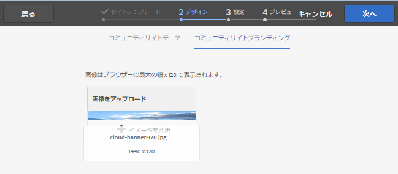
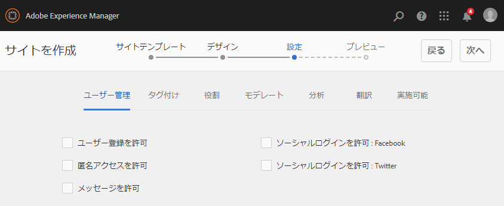
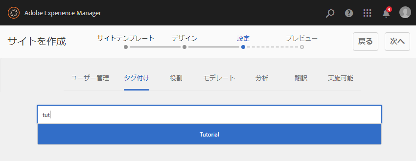
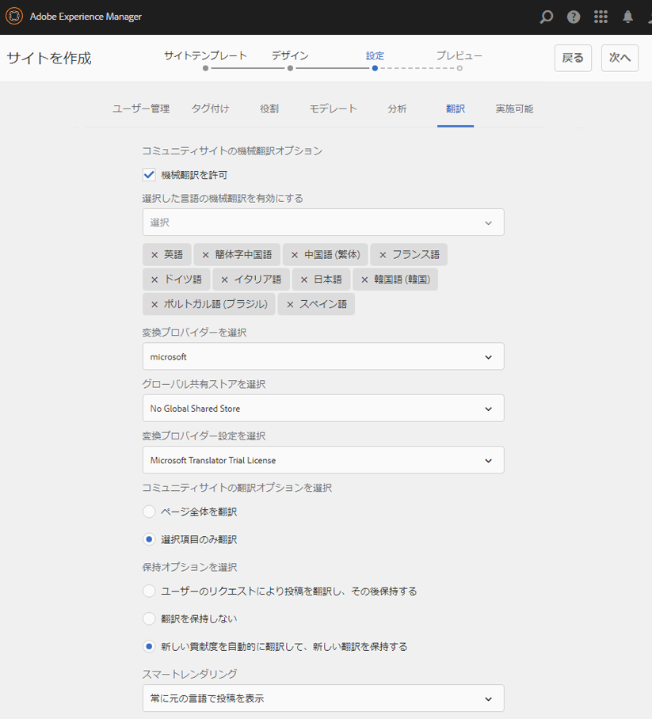
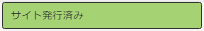
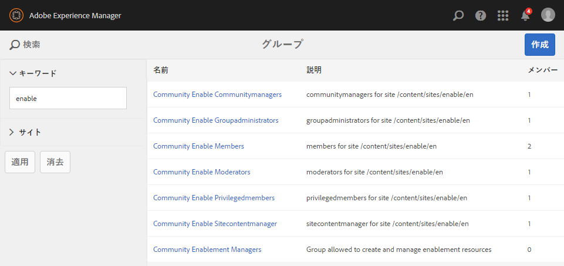
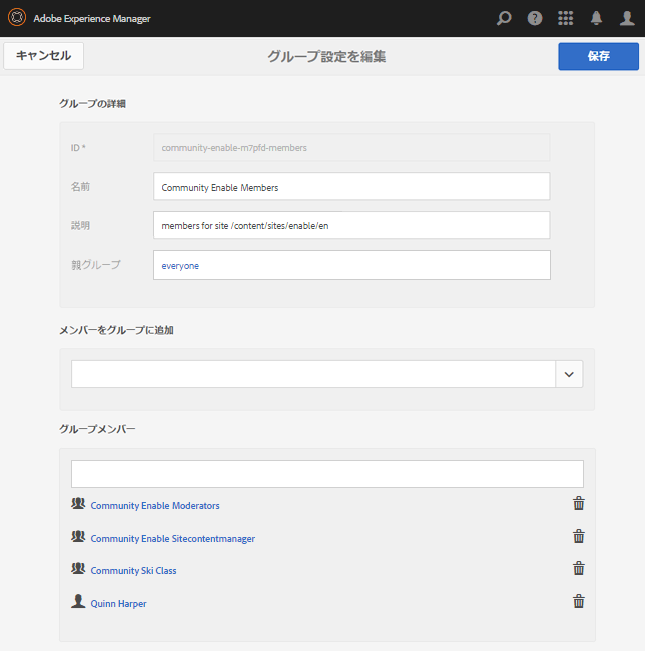
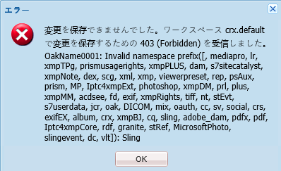
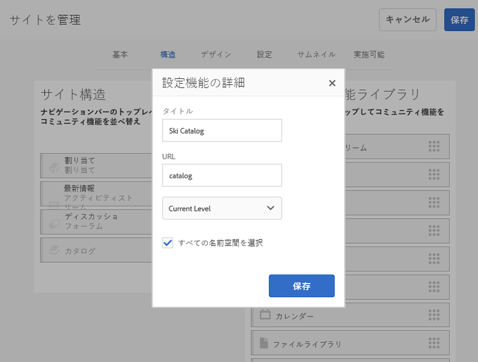
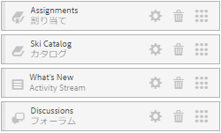

# イネーブルメントのための新しいコミュニティサイトの作成 {#author-a-new-community-site-for-enablement}

## コミュニティサイトを作成 {#create-community-site}

[コミュニティサ](/help/communities/sites-console.md) イトの作成では、コミュニティサイトの作成手順を案内するウィザードを使用します。最後の手順でサイトをコミットする前に、`Next`または`Back`を前の手順に進むことができます。

新しいコミュニティサイトの作成を開始するには：

[オーサーインスタンス](https://localhost:4502/)を使用します。

* 管理者権限でログインし、**[!UICONTROL コミュニティ]**/**[!UICONTROL サイト]**&#x200B;に移動します。

* 「**作成**」を選択します。

### Step 1 : Site Template {#step-site-template}

「**サイトテンプレート**」の手順では、URL のタイトル、説明、名前を入力し、コミュニティサイトテンプレートを選択します。次に例を示します。

* **コミュニティサイトのタイトル**: `Enablement Tutorial`.

* **コミュニティサイトの説明**: `A site for enabling the community to learn.`

* **コミュニティサイトのルート**:(デフォルトのルートの場合は空白のままにし `/content/sites`ます)。

* **クラウド設定**：（クラウド設定が指定されていない場合は空欄のままにする）指定されたクラウド設定へのパスを入力します。
* **コミュニティサイトのベース言語**:（単一の言語に対しては手を加えないでください）。英語)ドロップダウンを使用し *て、使用可能な言語(ドイツ語、イタリア語、フランス語、日本語、スペイン語、ポルトガル語（ブラジル）、中国語(繁体* 語)、中国語（簡体字）)から1つ以上を選択します。追加された言語ごとに1つのコミュニティサイトが作成され、[多言語サイトのコンテンツの翻訳](/help/sites-administering/translation.md)で説明されているベストプラクティスに従って、同じサイトフォルダー内に存在します。 各サイトのルートページには、選択したいずれかの言語の言語コード（例えば、英語では「en」、フランス語では「fr」）で名付けられた子ページが含まれます。

* **コミュニティサイト名**: `enable`

   * コミュニティサイト名の下に初期URLが表示されます。
   * 有効なURLに、ベース言語コード+ &quot;.html&quot;を追加する
      *例：* https://localhost:4502/content/sites/  `enable/en.html`

* **参照サイトテンプレート**:～を選ぶ  `Reference Structured Learning Site Template`

「**次へ**」を選択します。

### 手順 2：デザイン {#step-design}

デザインの手順は、テーマとブランディングのバナーを選択する2つの節で説明します。

#### コミュニティサイトテーマ {#community-site-theme}

目的のスタイルを選択し、テンプレートに適用します。選択すると、テーマにチェックマークが付きます。

#### コミュニティサイトブランディング {#community-site-branding}

（オプション）サイトページ全体に表示するバナー画像をアップロードします。 バナーはブラウザーの左端およびコミュニティサイトヘッダーとメニュー（ナビゲーションリンク）の間に固定されます。バナーの高さは 120 ピクセルに切り詰められます。バナーがブラウザーの幅や 120 ピクセルの高さに合わせてリサイズされることはありません。

「**次へ**」を選択します。

### 手順 3：設定  {#step-settings}

設定の手順で`Next`を選択する前に、ユーザー管理、タグ付け、役割、モデレート、分析、翻訳およびイネーブルメントに関する設定にアクセスできる7つのセクションがあることに注意してください。

#### ユーザー管理 {#user-management}

[イネーブルメントコミュニティ](/help/communities/overview.md#enablement-community)はプライベートにすることをお勧めします。

コミュニティサイトを非公開にするとは、匿名のサイト訪問者に対してアクセスを拒否し、自己登録やソーシャルログインを使用禁止にすることです。

[User Management](/help/communities/sites-console.md#user-management)のほとんどのチェックボックスがオフになっていることを確認します。

* サイト訪問者の自己登録を許可しない。
* 匿名のサイト訪問者に対し、サイトの閲覧を許可しないでください。
* コミュニティメンバー間でのメッセージングを許可するかどうかを指定します（オプション）。
* facebookでのログインを許可しない。
* twitterでのログインを許可しない。

#### タグ付け {#tagging}

コミュニティコンテンツに適用できるタグを制御するには、[タグ付けコンソール](/help/sites-administering/tags.md#tagging-console)で以前に定義したAEM名前空間（[Tutorial namespace](/help/communities/enablement-setup.md#create-tutorial-tags)など）を選択します。

また、コミュニティサイトに対してタグ名前空間を選択すると、カタログとイネーブルメントリソースを定義するときに表示される選択肢が制限されます。重要な情報については、[イネーブルメントリソースのタグ付け](/help/communities/tag-resources.md)を参照してください。

名前空間は先行入力検索で簡単に検索できます。例：

* タイプ `tut`
*  `Tutorial`

### 役割 {#roles}

[コミュニティメ](/help/communities/users.md) ンバーの役割は、役割セクションの設定を使用して割り当てられます。

コミュニティメンバー（またはメンバーのグループ）がコミュニティマネージャーとしてサイトを体験するには、先頭入力検索を使用して、ドロップダウンのオプションからメンバーまたはグループ名を選択します。

例：

* タイプ `q`
* [Quinn Harper](/help/communities/enablement-setup.md#publishcreateenablementmembers)を選択します。

>[!NOTE]
>
>[トンネル](/help/communities/deploy-communities.md#tunnel-service-on-author) サービスを使用すると、パブリッシュ環境にのみ存在するメンバーとグループを選択できます。

#### モデレート {#moderation}

ユーザー生成コンテンツ（UGC）を[モデレート](/help/communities/sites-console.md#moderation)する場合は、デフォルトのグローバル設定を受け入れます。

#### Analytics  {#analytics}

ドロップダウンから、このコミュニティサイト用に設定されたAnalyticsクラウドサービスフレームワークを選択します。

スクリーンショットに表示されている選択肢「`Communities`」は、[設定ドキュメント](/help/communities/analytics.md#aem-analytics-framework-configuration)のフレームワークの例です。

#### 翻訳 {#translation}

[翻訳設定](/help/communities/sites-console.md#translation)では、UGC の翻訳を許可するかどうかと、どの言語に翻訳するかを指定します。

* 「**機械翻訳を許可**」をオンにします。
* デフォルト設定を使用する

#### イネーブルメント {#enablement}

1 つのイネーブルメントコミュニティに対し、1 人以上のコミュニティ実施可能マネージャーを指定する必要があります。

* **イネーブルメントマネージャー**
（必須） 
`Community Enablement Managers` グループを選択して、このコミュニティサイトを管理できます。

   * タイプ `s`
   *  `Sirius Nilson`

* **Marketing Cloud組織ID**
（オプション）Adobe AnalyticsアカウントのIDです。有効化レポートにビデオハートビー [ト分析を含め](/help/communities/analytics.md#video-heartbeat-analytics) る際に必要になります。

「**次へ**」を選択します。

### 手順 4：コミュニティサイトの作成 {#step-create-community-site}

「**作成**」を選択します。

処理が完了すると、新しいサイトのフォルダーがコミュニティ/サイトコンソールに表示されます。

### 新しいコミュニティサイトの公開 {#publish-the-new-community-site}

作成したサイトは、コミュニティ - サイトコンソールで管理する必要があります。このコンソールは、新しいサイトを作成するコンソールと同じものです。

コミュニティサイトのフォルダーを選択した後、サイトアイコンにマウスカーソルを合わせると、4 つのアクションアイコンが表示されます。

省略記号アイコン（その他のアクションアイコン）を選択すると、「サイトを書き出し」および「サイトを削除」オプションが表示されます。

各アイコンの機能は次のとおりです（左から右の順に説明）。

* **サイトを開く**

   鉛筆アイコンを選択して、コミュニティサイトをオーサリング編集モードで開き、ページコンポーネントの追加や設定をおこないます。

* **サイトを編集**

   プロパティアイコンを選択してコミュニティサイトを開き、タイトルやテーマの変更などのプロパティを変更します。

* **サイトを公開**

   世界のアイコンを選択してコミュニティサイトを公開します（デフォルトではlocalhost:4503に公開）。

* **サイトを書き出し**

   書き出しアイコンを選択して、コミュニティサイトのパッケージを作成します。このパッケージが、[パッケージマネージャー](/help/sites-administering/package-manager.md)に格納され、ダウンロード可能になります。UGC はサイトパッケージに含まれていません。

* **サイトを削除**

   コミュニティサイトを削除するには、サイトを削除アイコンを選択します。このアイコンは、コミュニティサイトコンソール内でサイトにマウスポインターを置くと表示されます。サイトを削除すると、UGC やユーザーグループ、アセット、データベースレコードなど、そのサイトに関連付けられているアイテムがすべて削除されます。

   

#### サイトの公開 {#select-publish}

地球のアイコンを選択して、コミュニティサイトを公開します。

サイトが公開されると、次のようなメッセージが表示されます。

## コミュニティのユーザーとユーザーグループ {#community-users-user-groups}

### 新しいコミュニティユーザーグループの確認 {#notice-new-community-user-groups}

新しいコミュニティサイトとともに、新しいユーザーグループが作成されます。各グループには、様々な管理機能に応じて適切な権限が設定されています。詳しくは、[コミュニティサイトのユーザーグループ](/help/communities/users.md#usergroupsforcommunitysites)を参照してください。

この新しいコミュニティサイトでは、手順1でサイト名「enable」を指定すると、パブリッシュ環境に存在する新しいユーザーグループが[コミュニティメンバーとグループコンソール](/help/communities/members.md#groups-console)から表示されます。

### 「Community Enable Members」グループへのメンバー割り当て{#assign-members-to-community-enable-members-group}

オーサー環境で、トンネルサービスを有効にすると、初期セットアップ](/help/communities/enablement-setup.md#publishcreateenablementmembers)中に作成された[ユーザーを、新しく作成したコミュニティサイトのコミュニティメンバーグループに割り当てることができます。

コミュニティグループコンソールでは、メンバーを個別に追加したり、グループのメンバーシップを使用して追加したりできます。

この例では、グループ`Community Ski Class`がグループ`Community Enable Members`のメンバーとして追加され、メンバー`Quinn Harper`も追加されます。

* **コミュニティ/グループ**&#x200B;コンソールに移動します。
* *Community Enable Members*&#x200B;グループを選択します。
* 「**Add Members To Group**」検索ボックスに「ski」と入力します。
* 「*Community Ski Class*」（学習者のグループ）を選択します。
* 検索ボックスに「quinn」と入力します。
* *Quinn Harper*（イネーブルメントリソースの連絡先）を選択します。

* 「**保存**」を選択します。

## パブリッシュ側の設定 {#configurations-on-publish}

`https://localhost:4503/content/sites/enable/en.html {#http-localhost-content-sites-enable-en-html}`

### 認証エラーの設定 {#configure-for-authentication-error}

サイトが設定され、パブリッシュにプッシュされたら、パブリッシュインスタンス上で[ログインマッピング](/help/communities/sites-console.md#configure-for-authentication-error)(`Adobe Granite Login Selector Authentication Handler`)を設定します。 ログイン資格情報が正しく入力されない場合、認証エラーによってコミュニティサイトのログインページが再表示され、エラーメッセージが表示されるという利点があります。

`Login Page Mapping`を次のように追加します。

* `/content/sites/enable/en/signin:/content/sites/enable/en`

### （オプション）デフォルトのホームページの変更{#optional-change-the-default-home-page}

公開サイトをデモ目的で操作するときは、デフォルトのホームページを新しいサイトに変更すると便利です。

これをおこなうには、[CRX|DE](https://localhost:4503/crx/de) Lite を使用して、パブリッシュ側で[リソースマッピング](/help/sites-deploying/resource-mapping.md)テーブルを編集します。

開始するには、次のようにします。：

1. 公開時に、CRXDEにアクセスし、管理者権限でログインします。

   * 例えば、[https://localhost:4503/crx/de](https://localhost:4503/crx/de)を参照し、`admin/admin`を使用してログインします。

1. プロジェクトブラウザで、`/etc/map`を展開します。
1. `http`ノードを選択します。

   * 「**ノードを作成**」を選択します。

      * **** Namelocalhost.4503

         （*not*&#x200B;で、「:」を使用します）。

      * **** [型：マッピング](https://sling.apache.org/documentation/the-sling-engine/mappings-for-resource-resolution.html)

1. 新しく作成された`localhost.4503`ノードを選択した状態

   * プロパティの追加

      * **名前**：sling:match
      * **タイプ**：String
      * **値**：localhost.4503/$

   （「$」文字で終わる必要があります）

   * プロパティの追加

      * **名前**：sling:internalRedirect
      * **タイプ**：String
      * **値**：/content/sites/enable/en.html

1. 「**すべて保存**」を選択します。
1. （オプション）閲覧履歴の削除
1. https://localhost:4503/を参照します。

   * https://localhost:4503/content/sites/enable/en.htmlにアクセスします。

>[!NOTE]
>
>無効にするには、`sling:match`プロパティの値の前に「x」を付け、`xlocalhost.4503/$`と&#x200B;**すべて保存**&#x200B;を付けます。

#### トラブルシューティング：マップ保存エラー {#troubleshooting-error-saving-map}

変更を保存できない場合は、ノード名が `localhost.4503`（区切り文字が「ドット」）となっているかを確認してください。`localhost:4503` は有効な名前空間のプレフィックスではないので、`localhost`（区切り文字が「コロン」）という表記は正しくありません。

#### トラブルシューティング：リダイレクト失敗 {#troubleshooting-fail-to-redirect}

正規表現`sling:match`文字列の末尾にある「**$**」は重要なので、正確に`https://localhost:4503/`のみがマッピングされます。そうでない場合、URLのserver:portの後に存在する任意のパスの前にリダイレクト値が付加されます。 したがって、AEMがログインページにリダイレクトしようとすると、失敗します。

## コミュニティサイトの変更 {#modifying-the-community-site}

サイトを最初に作成した後、作成者は[サイトを開くアイコン](/help/communities/sites-console.md#authoring-site-content)を使用して、標準的な AEM のオーサリングアクティビティを実行できます。

また、管理者は[サイトを編集アイコン](/help/communities/sites-console.md#modifying-site-properties)を使用して、タイトルなどのサイトプロパティを変更できます。

変更後は、必ず&#x200B;**保存**&#x200B;して再&#x200B;**公開**&#x200B;してください。

>[!NOTE]
>
>AEM に馴染みがない場合は、[基本操作](/help/sites-authoring/basic-handling.md)に関するドキュメントおよび[ページのオーサリングのクイックガイド](/help/sites-authoring/qg-page-authoring.md)を参照してください。

### カタログの追加 {#add-a-catalog}

このコミュニティサイトに選択されたコミュニティサイトテンプレートには、カタログ機能が含まれています。

含まれていない場合は、カタログ機能を簡単に追加できます。これにより、イネーブルメントリソースや学習パスに割り当てられていないコミュニティの他のメンバーが、カタログからイネーブルメントリソースを選択できるようになります。

サイト構造にカタログ機能が既に含まれている場合、タイトルが変わることがあります。

サイトの構造を変更するには、**[!UICONTROL コミュニティ]** / **[!UICONTROL サイト]**&#x200B;コンソールに移動し、`enable`フォルダーを開いて、**サイトを編集**&#x200B;アイコンを選択し、`Enablement Tutorial`のプロパティにアクセスします。

構造パネルを選択し、カタログを追加するか、既存のカタログを変更します。

* **タイトル**: `Ski Catalog`

* **URL**: `catalog`

* **すべての名前空間を選択**：デフォルトのままにします。

* 「**保存**」を選択します。

位置アイコンを使用し、カタログ機能を Assignments の後の 2 番目の位置に移動します。

右上隅の「**保存**」を選択してコミュニティサイトに対する変更を保存します。

その後、サイトを再び&#x200B;**公開**&#x200B;します。
