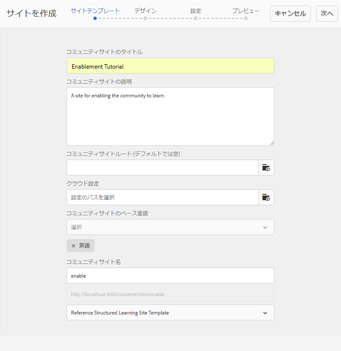

# イネーブルメントのための新しいコミュニティサイトの作成 {#author-a-new-community-site-for-enablement}

## コミュニティサイトを作成 {#create-community-site}

[コミュニティサイトの作成](/help/communities/sites-console.md) (Community Site Creation)では、コミュニティサイトの作成手順を案内するウィザードを使用します。 It is possible to move forward to the `Next` step or `Back` to the previous step before committing the site in the final step.

新しいコミュニティサイトの作成を開始するには：

[オーサーインスタンス](https://localhost:4502/)を使用します。

* 管理者権限でのログイン
* Navigate to **[!UICONTROL Communities > Sites]**

* 「**作成**」を選択します。

### Step 1 : Site Template {#step-site-template}

「**サイトテンプレート**」の手順では、URL のタイトル、説明、名前を入力し、コミュニティサイトテンプレートを選択します。次に例を示します。

* **コミュニティサイトのタイトル**: `Enablement Tutorial`

* **コミュニティサイトの説明**: `A site for enabling the community to learn.`

* **コミュニティサイトのルート**:(デフォルトのルートの場合は空白のままにし `/content/sites`ます)。

* **クラウド設定**：（クラウド設定が指定されていない場合は空欄のままにする）指定されたクラウド設定へのパスを入力します。
* **コミュニティサイトの基本言語**:（単一言語の場合は手を付けないでおきます）。英語)ドロップダウンを使用して ** 、使用可能な言語(ドイツ語、イタリア語、フランス語、日本語、スペイン語、ポルトガル語（ブラジル）、中国語（繁体字）、中国語（簡体字）)から1つ以上のベース言語を選択します。 One community site will be created for each language added, and will exist within the same site folder following the best practice described in [Translating Content for Multilingual Sites](/help/sites-administering/translation.md). 各サイトのルートページには、選択したいずれかの言語の言語コード（例えば、英語では「en」、フランス語では「fr」）で名付けられた子ページが含まれます。

* **コミュニティサイト名**: `enable`

   * コミュニティサイト名の下に最初のURLが表示されます。
   * 有効なURLの場合は、ベース言語コード+ &quot;.html&quot;を追加します。
      *例えば*、https://localhost:4502/content/sites/ `enable/en.html`

* **リファレンスサイトテンプレート**:引っ張って～を選ぶ `Reference Structured Learning Site Template`

「**次へ**」を選択します。

### 手順 2：デザイン {#step-design}

デザインの手順は、テーマとブランドバナーを選択するための2つのセクションに分かれています。

#### コミュニティサイトテーマ {#community-site-theme}

目的のスタイルを選択し、テンプレートに適用します。選択すると、テーマはチェックマーク付きでオーバーレイされます。

#### コミュニティサイトブランディング {#community-site-branding}

（オプション）サイトページに表示するバナー画像をアップロードします。バナーはブラウザーの左端およびコミュニティサイトヘッダーとメニュー（ナビゲーションリンク）の間に固定されます。バナーの高さは 120 ピクセルに切り詰められます。バナーがブラウザーの幅や 120 ピクセルの高さに合わせてリサイズされることはありません。

 

「**次へ**」を選択します。

### 手順 3：設定 {#step-settings}

On the Settings step, before selecting `Next`, notice there are seven sections providing access to configurations involving user management, tagging, roles, moderation, analytics, translation, and enablement.

#### ユーザー管理 {#user-management}

It is recommended that [enablement communities](/help/communities/overview.md#enablement-community) be private.

コミュニティサイトを非公開にするとは、匿名のサイト訪問者に対してアクセスを拒否し、自己登録やソーシャルログインを使用禁止にすることです。

Ensure most checkboxes are deselected for [User Management](/help/communities/sites-console.md#user-management) :

* サイト訪問者の自己登録を許可しない
* 匿名サイトの訪問者がサイトに表示することを許可しない
* コミュニティメンバー間でのメッセージングを許可するかどうか（オプション）
* Facebookへのログインを許可しない
* Twitterでのログインを許可しない

#### タグ付け {#tagging}

The tags which may be applied to community content are controlled by selecting AEM namespaces previously defined through the [Tagging Console](/help/sites-administering/tags.md#tagging-console) (such as the [Tutorial namespace](/help/communities/enablement-setup.md#create-tutorial-tags)).

また、コミュニティサイトに対してタグ名前空間を選択すると、カタログとイネーブルメントリソースを定義するときに表示される選択肢が制限されます。See [Tagging Enablement Resources](/help/communities/tag-resources.md) for important information.

名前空間は先行入力検索で簡単に検索できます。以下に例を示します。

* タイプ `tut`
*  `Tutorial`

### 役割 {#roles}

[コミュニティメンバの役割は](/help/communities/users.md) 、[役割]セクションの設定を通じて割り当てられます。

コミュニティメンバー（またはメンバーのグループ）がコミュニティマネージャーとしてサイトを体験できるようにするには、先読み検索を使用し、ドロップダウンのオプションからメンバーまたはグループ名を選択します。

以下に例を示します。

* タイプ `q`
* Select [Quinn Harper](/help/communities/enablement-setup.md#publishcreateenablementmembers)

>[!NOTE]
>
>[トンネルサービス](/help/communities/deploy-communities.md#tunnel-service-on-author) では、パブリッシュ環境のみに存在するメンバーとグループを選択できます。

#### モデレート {#moderation}

ユーザー生成コンテンツ（UGC）を[モデレート](/help/communities/sites-console.md#moderation)する場合は、デフォルトのグローバル設定を受け入れます。

#### Analytics {#analytics}

ドロップダウンから、このコミュニティサイト用に設定されたAnalyticsクラウドサービスフレームワークを選択します。

スクリーンショットに表示されている選択肢「`Communities`」は、[設定ドキュメント](/help/communities/analytics.md#aem-analytics-framework-configuration)のフレームワークの例です。

#### TRANSLATION {#translation}

[翻訳設定](/help/communities/sites-console.md#translation)では、UGC の翻訳を許可するかどうかと、どの言語に翻訳するかを指定します。

* Check **Allow Machine Translation**
* デフォルト設定の使用

#### イネーブルメント {#enablement}

1 つのイネーブルメントコミュニティに対し、1 人以上のコミュニティ実施可能マネージャーを指定する必要があります。

* **有効化マネージャ**（必須）グループのメンバ `Community Enablement Managers` ーを選択して、このコミュニティサイトを管理できます。

   * タイプ `s`
   *  `Sirius Nilson`

* **Marketing Cloud組織ID**（オプション）有効化レポートに [Video Heartbeat Analyticsを含める場合に必要なAdobe AnalyticsアカウントのID](/help/communities/analytics.md#video-heartbeat-analytics) 。

「**次へ**」を選択します。

### 手順 4：コミュニティサイトの作成 {#step-create-community-site}

Select **Create.**

処理が完了すると、新しいサイトのフォルダーがコミュニティ/サイトコンソールに表示されます。

### 新しいコミュニティサイトの公開 {#publish-the-new-community-site}

作成したサイトは、コミュニティ - サイトコンソールで管理する必要があります。このコンソールは、新しいサイトを作成するコンソールと同じものです。

コミュニティサイトのフォルダーを選択した後、サイトアイコンにマウスカーソルを合わせると、4 つのアクションアイコンが表示されます。

省略記号アイコン（その他のアクションアイコン）を選択すると、「サイトを書き出し」および「サイトを削除」オプションが表示されます。

各アイコンの機能は次のとおりです（左から右の順に説明）。

* **サイトを開く**

   鉛筆アイコンを選択して、コミュニティサイトを作成者編集モードで開き、ページコンポーネントを追加または設定します。

* **サイトを編集**

   プロパティアイコンを選択して、タイトルやテーマの変更など、プロパティの変更用にコミュニティサイトを開きます

* **サイトを公開**

   コミュニティサイトを公開する（デフォルトでlocalhost:4503に）ワールドアイコンを選択します。

* **サイトを書き出し**

   書き出しアイコンを選択して、コミュニティサイトのパッケージを作成します。このパッケージが、[パッケージマネージャー](/help/sites-administering/package-manager.md)に格納され、ダウンロード可能になります。UGC はサイトパッケージに含まれていません。

* **サイトを削除**

   コミュニティサイトを削除するには、サイトを削除アイコンを選択します。このアイコンは、コミュニティサイトコンソール内でサイトにマウスポインターを置くと表示されます。サイトを削除すると、UGC やユーザーグループ、アセット、データベースレコードなど、そのサイトに関連付けられているアイテムがすべて削除されます。

#### サイトの公開 {#select-publish}

地球のアイコンを選択して、コミュニティサイトを公開します。

サイトが公開されると、次のようなメッセージが表示されます。

## コミュニティのユーザーとユーザーグループ {#community-users-user-groups}

### 新しいコミュニティユーザーグループの確認 {#notice-new-community-user-groups}

新しいコミュニティサイトとともに、新しいユーザーグループが作成されます。各グループには、様々な管理機能に応じて適切な権限が設定されています。For details, visit [User Groups for Community Sites](/help/communities/users.md#usergroupsforcommunitysites).

For this new community site, given the site name &quot;enable&quot; in Step 1, the new user groups that exist in the publish environment may be seen from the [Communities Members &amp; Groups console](/help/communities/members.md#groups-console) :

### 「Community Enable Members」グループへのメンバー割り当て{#assign-members-to-community-enable-members-group}

On author, with the tunnel service enabled, it is possible to assign the [users created during Initial Setup](/help/communities/enablement-setup.md#publishcreateenablementmembers) to the Community Members group for the newly created community site.

コミュニティグループコンソールでは、メンバーを個別に追加したり、グループのメンバーシップを使用して追加したりできます。

In this example, the group `Community Ski Class` is added as a member of the group `Community Enable Members` as well as member `Quinn Harper`.

* Navigate to **Communities, Groups** console
* Select *Community Enable Members* group
* Enter &#39;ski&#39; into the **Add Members To Group** search box
* Select *Community Ski Class* (group of learners)
* 検索ボックスに「quin」と入力します。
* Select *Quinn Harper* (enablement resource contact)

* Select **Save**

## パブリッシュ側の設定 {#configurations-on-publish}

`https://localhost:4503/content/sites/enable/en.html {#http-localhost-content-sites-enable-en-html}`

### 認証エラーの設定 {#configure-for-authentication-error}

Once a site has been configured and pushed to publish, [configure login mapping](/help/communities/sites-console.md#configure-for-authentication-error) ( `Adobe Granite Login Selector Authentication Handler`) on the publish instance. ログイン資格情報が正しく入力されない場合、認証エラーによりコミュニティサイトのログインページが再度表示され、エラーメッセージが表示されるという利点があります。

追加 `Login Page Mapping` ～

* `/content/sites/enable/en/signin:/content/sites/enable/en`

### （オプション）デフォルトのホームページの変更{#optional-change-the-default-home-page}

公開サイトをデモ目的で操作するときは、デフォルトのホームページを新しいサイトに変更すると便利です。

これをおこなうには、[CRX|DE](https://localhost:4503/crx/de) Lite を使用して、パブリッシュ側で[リソースマッピング](/help/sites-deploying/resource-mapping.md)テーブルを編集します。

開始するには、次のようにします。

1. 公開時に、CRXDEにアクセスし、管理者権限でログインします。

   * 例えば、https://localhost:4503/crx/deを参照し [て](https://localhost:4503/crx/de) 、 `admin/admin`

1. In the project browser, expand `/etc/map`
1. Select the `http` node

   * Select **Create Node**

      * **名前** localhost.4503

         (do *not* use &#39;:&#39;)

      * **タイプ**[sling:Mapping](https://sling.apache.org/documentation/the-sling-engine/mappings-for-resource-resolution.html)

1. With newly created `localhost.4503` node selected

   * 追加特性

      * **名前**：sling:match
      * **タイプ**：String
      * **値**：localhost.4503/$
   （「$」文字で終わる必要があります）

   * 追加特性

      * **名前**：sling:internalRedirect
      * **タイプ**：String
      * **値**：/content/sites/enable/en.html

1. 「**すべて保存**」を選択します。
1. （オプション）閲覧履歴の削除
1. https://localhost:4503/を参照します。

   * https://localhost:4503/content/sites/enable/en.htmlにアクセス

>[!NOTE]
>
>To disable, simply pre-pend the `sling:match` property value with an &#39;x&#39; - `xlocalhost.4503/$` - and **Save All**.

#### トラブルシューティング：マップ保存エラー {#troubleshooting-error-saving-map}

変更を保存できない場合は、ノード名が `localhost.4503`（区切り文字が「ドット」）となっているかを確認してください。`localhost:4503` は有効な名前空間のプレフィックスではないので、`localhost`（区切り文字が「コロン」）という表記は正しくありません。

#### トラブルシューティング：リダイレクト失敗 {#troubleshooting-fail-to-redirect}

The &#39;**$**&#39; at the end of the regular expression `sling:match`string is crucial, so that only exactly `https://localhost:4503/` is mapped, else the redirect value is prepended to any path that might exist after the server:port in the URL. したがって、AEMがログインページにリダイレクトしようとすると、失敗します。

## コミュニティサイトの変更 {#modifying-the-community-site}

サイトを最初に作成した後、作成者は[サイトを開くアイコン](/help/communities/sites-console.md#authoring-site-content)を使用して、標準的な AEM のオーサリングアクティビティを実行できます。

また、管理者は[サイトを編集アイコン](/help/communities/sites-console.md#modifying-site-properties)を使用して、タイトルなどのサイトプロパティを変更できます。

変更後は、必ず&#x200B;**保存**&#x200B;して再&#x200B;**公開**&#x200B;してください。

>[!NOTE]
>
>AEM に馴染みがない場合は、[基本操作](/help/sites-authoring/basic-handling.md)に関するドキュメントおよび[ページのオーサリングのクイックガイド](/help/sites-authoring/qg-page-authoring.md)を参照してください。

### カタログの追加 {#add-a-catalog}

このコミュニティサイトに選択されたコミュニティサイトテンプレートには、カタログ機能が含まれています。

含まれていない場合は、カタログ機能を簡単に追加できます。これにより、イネーブルメントリソースや学習パスに割り当てられていないコミュニティの他のメンバーが、カタログからイネーブルメントリソースを選択できるようになります。

サイト構造にカタログ機能が既に含まれている場合、タイトルが変わることがあります。

To modify the site&#39;s structure, navigate to the **Communities, Sites** console, open the `enable` folder, and select the **Edit Site** icon to access the properties of `Enablement Tutorial`.

構造パネルを選択し、カタログを追加するか、既存のカタログを変更します。

* **タイトル**: `Ski Catalog`

* **URL**: `catalog`

* **すべての名前空間を選択**：デフォルトのままにします。
* 「**Save**」を選択します。

位置アイコンを使用し、カタログ機能を Assignments の後の 2 番目の位置に移動します。

右上隅の「**保存**」を選択してコミュニティサイトに対する変更を保存します。

その後、サイトを再び&#x200B;**公開**&#x200B;します。

