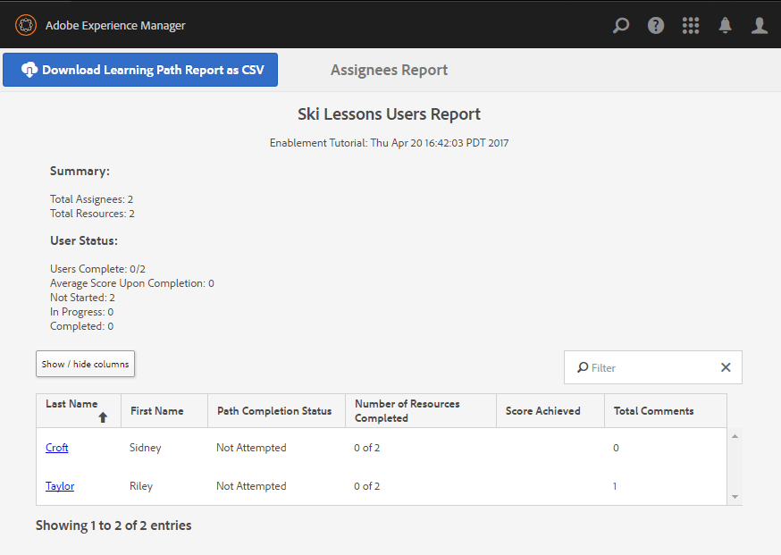

# 公開したサイトを使ってみる {#experience-the-published-site}

**[⇐ イネーブルメントリソースの作成と割り当て](resource.md)**

## パブリッシュサーバー上の新しいサイトの参照 {#browse-to-new-site-on-publish}

新しく作成したコミュニティサイトとそのイネーブルメントリソースおよび学習パスを公開したら、イネーブルメントチュートリアルサイトを実際に使ってみることができます。

まず、サイト作成時に表示された URL を参照します。ただし、このとき参照するのはパブリッシュサーバー上の URL です。次に例を示します。

* Author URL = [http://localhost:4502/content/sites/enable/en.html](http://localhost:4502/content/sites/enable/en.html)
* Publish URL = [http://localhost:4503/content/sites/enable/en.html](http://localhost:4503/content/sites/enable/en.html)

[デフォルトホームページを設定](enablement-create-site.md#changethedefaulthomepage)した場合は、[http://localhost:4503/](http://localhost:4503/) を参照するだけでサイトが開きます。

公開済みサイトに初めてアクセスするときは、通常、そのサイト訪問者はまだサインインしておらず、匿名です。

**http://localhost:4503/content/sites/enable/en.html**

## 匿名のサイト訪問者 {#anonymous-site-visitor}

匿名のサイト訪問者には、この非公開のイネーブルメントコミュニティサイトのログインページがすぐに表示されます。自己登録やFacebookやTwitterへのログインは選択できません。

Notice this  home page  shows four menu items: `Assignments, Ski Catalog, What's New` and `Discussions`, but none may be reached without signing in.

>[!NOTE]
>
>サイト訪問者に自己登録を許可することなく、イネーブルメントサイトへの匿名アクセスを許可することができます。
>If an enablement resource is set to `show in catalog` and `allow anonymous access`, it will be possible for anonymous site visitors to view resources in the catalog.

### JCRでの匿名アクセスの禁止 {#prevent-anonymous-access-on-jcr}

既知の制限により、jcrコンテンツとjsonを介してコミュニティサイトのコンテンツが匿名訪問者に公開されますが、匿名アクセス **[!UICONTROL を許可]** (allow anonymous access)はサイトのコンテンツに対して無効になります。 ただし、この動作は、回避策として「Sling制限」を使用して制御できます。

jcrコンテンツとjsonを介した匿名ユーザーによるアクセスからコミュニティサイトのコンテンツを保護するには、次の手順に従います。

1. AEM作成者インスタンスで、https://&lt;ホスト>:&lt;ポート>/editor.html/content/site/&lt;サイト名>.htmlに移動します。

   >[!NOTE]
   >
   >ローカライズされたサイトに移動しないでください。

1. 「 **[!UICONTROL ページプロパティ]**」に移動。

   

1. 「**[!UICONTROL 詳細]**」タブに移動します。
1. Enable **[!UICONTROL Authentication Requirement]**.

   

1. ログ追加インページのパス。 例： `/content/......./GetStarted`
1. ページを公開します。

## 登録済みメンバー {#enrolled-member}

This experience relies on users `Riley Taylor` and `Sidney Croft` being [created](enablement-setup.md#publishcreateenablementmembers) and [assigned](resource.md#settings) to the *Ski Lessons* learning path through their membership in the *Community Ski Class* group.

ログイン

* `Username: riley`
* `Password: password`

ユーザープロファイルが自己登録によって作成されなかった場合は、メンバーが初めてサインインしたときにプロファイルページが表示され、必要に応じてプロファイルを確認および変更することができます。

次にメンバーがサインインしたときは、1 番目のメニュー項目のページがホームページとして表示されます。

### 割り当て {#assignments}

割り当てページでは、各メンバーに割り当てられたすべての学習パスとイネーブルメントリソースが表示されます。

それぞれの割り当てについて、次の基本情報が表示されます。：

* 割り当てのタイプ
* 新しい割り当てかどうか
* 名前
* 割り当てのタイプに関連する詳細
* 割り当ての連絡先、エキスパートおよび作成者（指定されている場合）

カード左上隅のアイコンは、割り当ての種類を示しています。道路のイメージは、イネーブルメントリソースの数を含む学習パス用です。

「Ski Lessons」を選択すると、その学習パスで参照される 2 つのイネーブルメントリソースが表示されます。**

「Ski Lesson 1」を選択すると、イネーブルメントリソースの詳細ページが表示されます。**

From the details page, the member is able to learn, [rate](rating.md) the lesson and add [comments](comments.md). メンバーのアクティビティはすべて、サイトの新機能セクションに反映されます。

イネーブルメントリソースとのインタラクションは、オーサー環境からアクセスできるレポートセクションに表示されます。

### Ski Catalog {#ski-catalog}

Ski Catalog のページは、`Tutorial` 名前空間のタグが付けられたイネーブルメントリソースのカタログです。The two *Ski Lesson* resources are tagged with the `Skiing` tag, such that if any tags other than `All` or `Tutorial: Sports / Skiing` is selected, nothing is displayed.

メンバーにイネーブルメントリソースが（直接または学習パスを通じて）割り当てられていないときも、カタログ内にあるイネーブルメントリソースを使用したり、コメントや評価を付けてフィードバックを与えることができます。

### Discussions {#discussions}

In addition to rating and commenting on enablement resources ([when enabled](enablement-create-site.md#step33asettings)), the community site template from which `Enablement Tutorial` was created includes the [forum function](functions.md#forum-function) (title is `Discussions)`.

「`Discussions`」のリンクを選択し、トピックを投稿します。

Sidney Croft（sidney／password）としてログインおよびログインし、質問に回答してトピックをフォローします。

インラインでのモデレートに加え、トピックをソーシャルメディアで共有したり電子メールで送信するオプションがあります。

### 新機能 {#what-s-new}

The `What's New` menu item is the title given the [activity stream function](functions.md#activity-stream-function) in this community site&#39;s structure.

Still signed in as Sidney, select the `What's New` link to show the activity.

## 信頼されているコミュニティメンバー {#trusted-community-member}

This experience assumes ` [Quinn Harper](enablement-setup.md#publishcreateenablementmembers)` was assigned the roles of [moderator](enablement-create-site.md#moderation) and [resource contact](resource.md#settings).

ログイン

* `Username: quinn`
* `Password: password`

Once signed in, notice there is a new menu item, `Administration`, which appears because the member was given the role of moderator.

ホームページは、1 番目のメニュー項目として定義されている割り当てページです。Quinは、モデレーターで有効化リソースの連絡先で、有効化リソースや学習パスに登録されていなかったため、表示するものはありません。

### Administration {#administration}

What there is, is activity by the two learners, `Riley Taylor` and `Sidney Croft`. By selecting the `Administration` link to access the Moderation Console, Quinn is able to use the [bulk moderation console](moderation.md) to moderate their posts.

サイドパネルのアイコンを選択すると、コミュニティコンテンツの検索に使用するフィルターの展開／折りたたみが切り替わります。

コメントカードにカーソルを合わせると、モデレートアクションが表示されます。

## オーサー環境でのレポート {#reports-on-author}

学習者とイネーブルメントリソースに関するレポートにアクセスには、2 つの方法があります。

On author, navigate to the **Communities,[Resources console](resources.md)**, where the enablement resources are managed, and after selecting a community site, it is possible to generate reports for

* すべての有効化リソースと学習パス
* 有効化に関する1つのリソースまたは学習パス

Navigate to the **Communities,[Reports console](reports.md)**, and generate reports according to:

* 有効化リソースと学習パスの割り当て
* 特定の期間におけるコミュニティサイトへの投稿
* 特定の期間のコミュニティサイトの表示（サイト訪問）

* 投稿や表示は、すべてのコンテンツに対して、または特定のコンテンツに対して行うことができます。

   * フォーラム
   * フォーラムトピック
   * Q&amp;A
   * Q&amp;A 質問
   * ブログ
   * ブログ記事
   * カレンダー
   * カレンダーイベント

### リソースコンソール {#resources-console}

パブリッシュ環境でリソースに対しておこなわれるアクティビティやインタラクションが少ない場合は、オーサー環境でレポートを表示すると有益です。

* 作成者は、管理者権限でサインインします。
* Navigate from the main menu to **[!UICONTROL Communities]** > **[!UICONTROL Resources]**.
* サイトを選択し `Enablement Tutorial` ます。
* Select the `Report` icon for a summary of all Resources.
* Select a Resource and then the `Report` icon for a report on that Resource.

Adobe Analytics のデータを表示するには時期尚早のようです。データが表示されるには 1 時間から 12 時間かかります。ただし、基本的なSCORMレポートは既に使用可能です。

#### Ski Lessons のリソースレポート {#ski-lessons-resource-report}

#### Ski Lessons のユーザーレポート {#ski-lessons-user-report}

* Select **[!UICONTROL Communities > Resources]**

* Open card `Enablement Tutorial`
* Open card `Ski Lessons`
*  `Report > User Report`

### レポートコンソール {#reports-console}

レポートコンソールでは、以下のものに関するレポートを生成できます。

* イネーブルメントコミュニティサイトの&#x200B;**割り当て**
* コミュニティサイトの&#x200B;**表示**
* コミュニティサイトの&#x200B;**投稿**

割り当てのレポートの場合：

* 作成者は、管理者権限でサインインします。
* Navigate to **[!UICONTROL Communities]** > **[!UICONTROL Reports]** > **[!UICONTROL Assignments Report]**.
* Select a **[!UICONTROL Site]** from the pull-down menu (select `Enablement Tutorial`).

* Select **[!UICONTROL Group]** (select `Community Ski Class`)

* Select an **[!UICONTROL Assignment]** (select `Ski Lessons`)

* Select **[!UICONTROL Generate]**

表示のレポートの場合：

* 作成者は、管理者権限でサインインします。
* **[!UICONTROL コミュニティ]** / **[!UICONTROL レポート]** / **[!UICONTROL 表示レポートに移動します]**。
* Select a **Site **from the pull-down menu (select`Enablement Tutorial`).

* Select **[!UICONTROL Content Type]** (select `all`).

* **[!UICONTROL 日付範囲を選択します]** (選択 `Last 7 days`)。

* Select **[!UICONTROL Generate]**.

**[⇐ イネーブルメントリソースの作成と割り当て](resource.md)**
