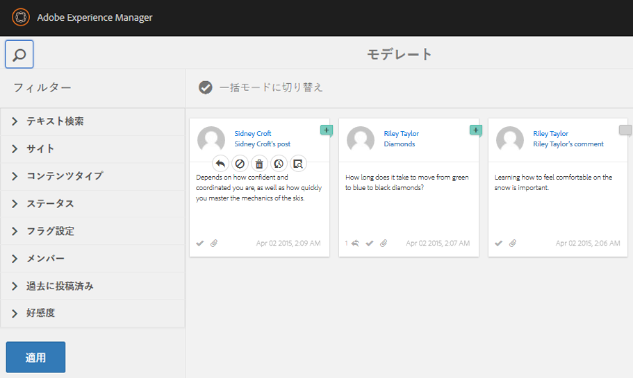

# 公開したサイトを使ってみる {#experience-the-published-site}

**[⇐ イネーブルメントリソースの作成と割り当て](resource.md)**

## パブリッシュサーバー上の新しいサイトの参照 {#browse-to-new-site-on-publish}

新しく作成したコミュニティサイトとそのイネーブルメントリソースおよび学習パスを公開したら、イネーブルメントチュートリアルサイトを実際に使ってみることができます。

まず、サイト作成時に表示された URL を参照します。ただし、このとき参照するのはパブリッシュサーバー上の URL です。次に例を示します。

* 作成者URL = [http://localhost:4502/content/sites/enable/en.html](http://localhost:4502/content/sites/enable/en.html)
* 発行URL = [http://localhost:4503/content/sites/enable/en.html](http://localhost:4503/content/sites/enable/en.html)

[デフォルトホームページを設定](enablement-create-site.md#changethedefaulthomepage)した場合は、[http://localhost:4503/](http://localhost:4503/) を参照するだけでサイトが開きます。

公開済みサイトに初めてアクセスするときは、通常、そのサイト訪問者はまだサインインしておらず、匿名です。

**http://localhost:4503/content/sites/enable/en.html**

## 匿名のサイト訪問者 {#anonymous-site-visitor}

匿名のサイト訪問者には、この非公開のイネーブルメントコミュニティサイトのログインページがすぐに表示されます。自己登録やFacebookやTwitterへのログインは選択できません。

このホームページには、次の4つのメニュー項目が表示されています。`Assignments, Ski Catalog, What's New`と`Discussions`ですが、サインインしない限り、到達できない場合があります。

>[!NOTE]
>
>サイト訪問者に自己登録を許可することなく、イネーブルメントサイトへの匿名アクセスを許可することができます。
>
>有効化リソースが`show in catalog`と`allow anonymous access`に設定されている場合、匿名サイト訪問者はカタログ内の表示リソースを使用できます。

### JCR {#prevent-anonymous-access-on-jcr}での匿名アクセスの禁止

既知の制限により、jcrコンテンツとjsonを介してコミュニティサイトのコンテンツが匿名訪問者に公開されますが、**[!UICONTROL allow anonymous access]**&#x200B;はサイトのコンテンツに対して無効になっています。 ただし、この動作は、回避策として「Sling制限」を使用して制御できます。

jcrコンテンツとjsonを介した匿名ユーザーによるアクセスからコミュニティサイトのコンテンツを保護するには、次の手順に従います。

1. AEMオーサーインスタンスで、https://&lt;host>:&lt;port>/editor.html/content/site/&lt;sitename>.htmlに移動します。

   >[!NOTE]
   >
   >ローカライズされたサイトには移動しないでください。

1. **[!UICONTROL ページプロパティ]**&#x200B;に移動します。

   

1. 「**[!UICONTROL 詳細]**」タブに移動します。
1. **[!UICONTROL 認証要件]**&#x200B;を有効にします。

   

1. ログ追加インページのパス。 例： `/content/......./GetStarted`
1. ページを公開します。

## 登録済みメンバー {#enrolled-member}

このエクスペリエンスは、`Riley Taylor`と`Sidney Croft`が[作成](enablement-setup.md#publishcreateenablementmembers)で[割り当て](resource.md#settings)を&#x200B;*Ski Lessons*&#x200B;の学習パスに、*Community Ski Class*&#x200B;グループのメンバーシップに依存しています。

ログイン

* `Username: riley`
* `Password: password`

ユーザープロファイルが自己登録によって作成されなかった場合は、メンバーが初めてサインインしたときにプロファイルページが表示され、必要に応じてプロファイルを確認および変更することができます。

次にメンバーがサインインしたときは、1 番目のメニュー項目のページがホームページとして表示されます。

### 割り当て {#assignments}

割り当てページでは、各メンバーに割り当てられたすべての学習パスとイネーブルメントリソースが表示されます。

それぞれの割り当てについて、次の基本情報が表示されます。：

* 割り当てのタイプ
* 新しい割り当てかどうか
* 名前
* 割り当てのタイプに関連する詳細
* 割り当ての連絡先、エキスパートおよび作成者（指定されている場合）

カード左上隅のアイコンは、割り当ての種類を示しています。道路のイメージは、イネーブルメントリソースの数を含む学習パス用です。

「Ski Lessons」を選択すると、その学習パスで参照される 2 つのイネーブルメントリソースが表示されます。**

「Ski Lesson 1」を選択すると、イネーブルメントリソースの詳細ページが表示されます。**

詳細ページから、メンバーは学習し、[rate](rating.md)レッスンを学び、[comments](comments.md)を追加することができます。 メンバーのアクティビティはすべて、サイトの新機能セクションに反映されます。

イネーブルメントリソースとのインタラクションは、オーサー環境からアクセスできるレポートセクションに表示されます。

### Ski Catalog {#ski-catalog}

Ski Catalog のページは、`Tutorial` 名前空間のタグが付けられたイネーブルメントリソースのカタログです。2つの&#x200B;*Ski Lesson*&#x200B;リソースには`Skiing`タグが付けられます。例えば、`All`または`Tutorial: Sports / Skiing`以外のタグが選択されている場合は、何も表示されません。

メンバーにイネーブルメントリソースが（直接または学習パスを通じて）割り当てられていないときも、カタログ内にあるイネーブルメントリソースを使用したり、コメントや評価を付けてフィードバックを与えることができます。

### Discussions {#discussions}

有効化リソースの評価とコメント化（[有効な場合](enablement-create-site.md#step33asettings)）に加えて、`Enablement Tutorial`の作成元のコミュニティサイトテンプレートには[フォーラム関数](functions.md#forum-function)(タイトルは`Discussions)`です。

「`Discussions`」のリンクを選択し、トピックを投稿します。

Sidney Croft（sidney／password）としてログインおよびログインし、質問に回答してトピックをフォローします。

インラインでのモデレートに加え、トピックをソーシャルメディアで共有したり電子メールで送信するオプションがあります。

### 新機能 {#what-s-new}

`What's New`メニュー項目は、このコミュニティサイトの構造の[アクティビティストリーム関数](functions.md#activity-stream-function)に与えられたタイトルです。

シドニーとしてサインインしたまま、`What's New`リンクを選択してアクティビティを表示します。

## 信頼されているコミュニティメンバー {#trusted-community-member}

このエクスペリエンスでは、` [Quinn Harper](enablement-setup.md#publishcreateenablementmembers)`に[モデレーター](enablement-create-site.md#moderation)と[リソース連絡先](resource.md#settings)の役割が割り当てられたと想定しています。

ログイン

* `Username: quinn`
* `Password: password`

サインインすると、新しいメニュー項目`Administration`が表示されます。これは、メンバーにモデレーターの役割が与えられたためです。

ホームページは、1 番目のメニュー項目として定義されている割り当てページです。Quinは、モデレーターで有効化リソースの連絡先で、有効化リソースや学習パスに登録されていなかったため、表示するものはありません。

### Administration {#administration}

何があるかというと、2人の学習者`Riley Taylor`と`Sidney Croft`のアクティビティです。 `Administration`リンクを選択してモデレートコンソールにアクセスすると、Quinは[一括モデレートコンソール](moderation.md)を使用して投稿をモデレートできます。

サイドパネルのアイコンを選択すると、コミュニティコンテンツの検索に使用するフィルターの展開／折りたたみが切り替わります。

コメントカードにカーソルを合わせると、モデレートアクションが表示されます。

## オーサー環境でのレポート {#reports-on-author}

学習者とイネーブルメントリソースに関するレポートにアクセスには、2 つの方法があります。

作成者が&#x200B;**コミュニティ[リソースコンソール](resources.md)**&#x200B;に移動し、有効化リソースが管理されている場所に移動します。コミュニティサイトを選択すると、次のレポートを生成できます。

* すべての有効化リソースと学習パス
* 有効化に関する1つのリソースまたは学習パス

**コミュニティ、[レポートコンソール](reports.md)**&#x200B;に移動し、次に従ってレポートを生成します。

* 有効化リソースと学習パスの割り当て
* 特定の期間におけるコミュニティサイトへの投稿
* 特定の期間のコミュニティサイトの表示（サイト訪問）

* 投稿や表示は、すべてのコンテンツに対して、または特定のコンテンツに対して行うことができます。

   * フォーラム
   * フォーラムトピック
   * Q&amp;A
   * Q&amp;A 質問
   * ブログ
   * ブログ記事
   * カレンダー
   * カレンダーイベント

### リソースコンソール {#resources-console}

パブリッシュ環境でリソースに対しておこなわれるアクティビティやインタラクションが少ない場合は、オーサー環境でレポートを表示すると有益です。

* 作成者は、管理者権限でサインインします。
* メインメニューから&#x200B;**[!UICONTROL コミュニティ]** > **[!UICONTROL リソース]**&#x200B;に移動します。
* `Enablement Tutorial`サイトを選択します。
* すべてのリソースの概要を表示するには、`Report`アイコンを選択します。
* リソースを選択し、そのリソースのレポートの`Report`アイコンを選択します。

Adobe Analytics のデータを表示するには時期尚早のようです。データが表示されるには 1 時間から 12 時間かかります。ただし、基本的なSCORMレポートは既に使用可能です。

#### Ski Lessons のリソースレポート {#ski-lessons-resource-report}

#### Ski Lessons のユーザーレポート {#ski-lessons-user-report}

* **[!UICONTROL コミュニティ/リソース]**&#x200B;を選択します

* カード`Enablement Tutorial`を開く
* カード`Ski Lessons`を開く
*  `Report > User Report`

### レポートコンソール {#reports-console}

レポートコンソールでは、以下のものに関するレポートを生成できます。

* イネーブルメントコミュニティサイトの&#x200B;**割り当て**
* コミュニティサイトの&#x200B;**表示**
* コミュニティサイトの&#x200B;**投稿**

割り当てのレポートの場合：

* 作成者は、管理者権限でサインインします。
* **[!UICONTROL コミュニティ]** > **[!UICONTROL レポート]** > **[!UICONTROL 割り当てレポート]**&#x200B;に移動します。
* プルダウンメニューから&#x200B;**[!UICONTROL サイト]**&#x200B;を選択します（`Enablement Tutorial`を選択します）。

* **[!UICONTROL グループ]**&#x200B;を選択（`Community Ski Class`を選択）

* **[!UICONTROL 割り当て]**&#x200B;を選択（`Ski Lessons`を選択）

* 「**[!UICONTROL 生成]**」を選択します

表示のレポートの場合：

* 作成者は、管理者権限でサインインします。
* **[!UICONTROL コミュニティ]** > **[!UICONTROL レポート]** > **[!UICONTROL 表示レポート]**&#x200B;に移動します。
* プルダウンメニューから&#x200B;**サイト**&#x200B;を選択します（`Enablement Tutorial`を選択します）。

* 「**[!UICONTROL コンテンツタイプ]**」を選択します（「`all`」を選択します）。

* **[!UICONTROL 日付範囲]**&#x200B;を選択します（`Last 7 days`を選択）。

* 「**[!UICONTROL 生成]**」を選択します。

**[⇐ イネーブルメントリソースの作成と割り当て](resource.md)**
