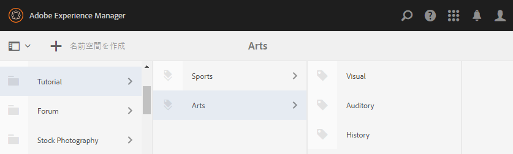
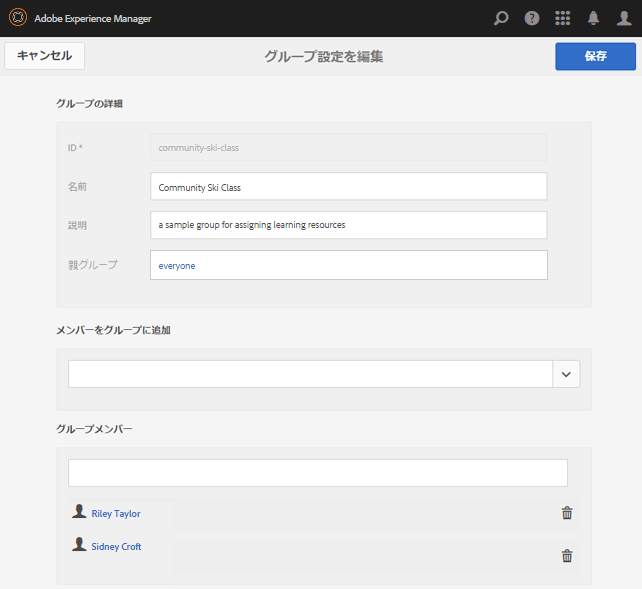
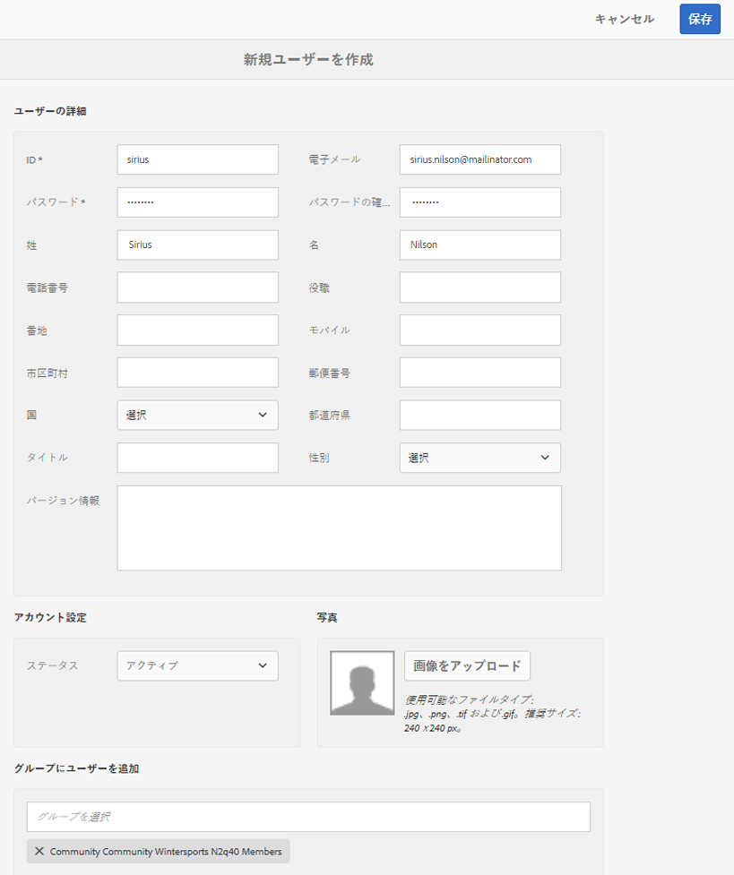

# イネーブルメントのための初期設定  {#initial-setup-for-enablement}

## オーサーインスタンスおよびパブリッシュインスタンスの開始 {#start-author-and-publish-instances}

開発用およびデモ用の場合、1 つのオーサーインスタンスと 1 つのパブリッシュインスタンスを実行する必要があります。

Follow the basic AEM [Getting Started](../../help/sites-deploying/deploy.md#getting-started) instructions which will result in

* Author environment on [localhost:4502](http://localhost:4502/)
* Publish environment on [localhost:4503](http://localhost:4503/)

AEM Communities では、各環境を次の目的で使用します。

* 作成者環境は次の目的で使用します。

   * サイト、テンプレート、コンポーネント、イネーブルメントリソース、ラーニングパスの開発。
   * 有効化リソースと学習パスへのメンバーとメンバーのグループの割り当て。
   * 割り当て、表示および投稿に関するレポートを生成します。
   * 管理タスクと設定環境。

* 公開環境は次の目的で使用します。

   * イネーブルメントマネージャが管理するトピックに基づく学習/トレーニング
   * コメント化と評価の有効化リソースと学習パス
   * リソースの連絡先と連絡を取る。

>[!NOTE]
>
>AEM に馴染みがない場合は、[基本操作](../../help/sites-authoring/basic-handling.md)に関するドキュメントおよび[ページのオーサリングのクイックガイド](../../help/sites-authoring/qg-page-authoring.md)を参照してください。

## Communities の最新リリースのインストール {#install-latest-communities-release}

このチュートリアルでは、[イネーブルメントコミュニティサイト](overview.md#enablement-community)を作成します。最新の機能パックがインストールされていることを確認するには、次のページにアクセスします。

* [最新リリース](deploy-communities.md#latest-releases)

[エンゲージメントコミュニティサイト](overview.md#engagement-community)の作成に関するチュートリアルについては、[AEM Communities 使用の手引き](getting-started.md)を参照してください。

## イネーブルメント機能の設定 {#configure-enablement-features}

このチュートリアルに従って操作するには、[イネーブルメントをインストールして設定](enablement.md)する必要があります。これには、MySQL や FFmpeg などのサードパーティの商品が必要です。

## Analytics の設定 {#configure-analytics}

When [Adobe Analytics is configured for the community site](analytics.md), more information is available in the [reports](reports.md) generated on enablement resources and learning paths assigned to community members (learners).

## 電子メール通知の設定 {#configure-email-for-notifications}

The notifications feature, available by default for all sites created using the `Communities Sites` console, provides an email channel for notifications.

これを使用するには、電子メールをサイト用に適切に設定する必要があります。

[電子メールの設定](email.md)を参照してください。

## トンネルサービスの有効化 {#enable-the-tunnel-service}

オーサー環境でコミュニティサイトを作成するときに、トンネルサービスを使用すると、パブリッシュ環境に登録されているユーザーおよびユーザーグループ（メンバー）の作成や管理と、信頼されているコミュニティメンバーへの役割の割り当て、学習者へのコンテンツの割り当てを実行できます。

詳しくは、[ユーザーとユーザーグループの管理](users.md)を参照してください。

トンネルサービスを有効にする簡単な手順については、[トンネルサービス](deploy-communities.md#tunnel-service-on-author)を参照してください。

## チュートリアルタグの作成 {#create-tutorial-tags}

`Tutorial` のタグ名前空間を使用して、エンゲージメントチュートリアルとイネーブルメントチュートリアルに使用するタグを作成します。

Use the [Tagging console](../../help/sites-administering/tags.md#tagging-console) to create the following tags:

* `Tutorial: Sports / Baseball`
* `Tutorial: Sports / Gymnastics`
* `Tutorial: Sports / Skiing`
* `Tutorial: Arts / Visual`
* `Tutorial: Arts / Auditory`
* `Tutorial: Arts / History`

次の手順に従います。

1. [タグ権限の設定](../../help/sites-administering/tags.md#setting-tag-permissions)
1. [タグを公開する](../../help/sites-administering/tags.md#publishing-tags)

AEM Communities 入門チュートリアル用に作成したタグのサンプルパッケージ

[ファイルを入手](assets/communities_tutorialtags-10.zip)

## イネーブルメントメンバーおよびグループの作成 {#create-enablement-members-and-groups}

For an enablement community site, site visitors should not be able to [self-register nor use social login](sites-console.md#user-management).

Instead, with the [tunnel service](#enable-the-tunnel-service) enabled, the [Members console](members.md) is used to register new members in the publish environment.

このチュートリアルでは、パブリッシュ環境で 3 人のメンバーを作成します。2人のメンバーが学習パスに割り当てられたユーザーグループのメンバーになり、3人目のメンバーはイネーブルメントリソースの連絡先になります。

さらに、4 人目のメンバーをオーサー環境で作成し、コミュニティ管理者およびコミュニティイネーブルメントマネージャーの役割を割り当てます。

>[!NOTE]
>
>These members are being created prior to creation of the *Enablement Tutorial* community site.
>
>後で作成する場合は、イネーブルメントチュートリアルメンバーグループのメンバーを作成するときに、これらのメンバーをメンバーグループに追加できます。**
>
>または、これらのメンバーを後から[メンバーグループに割り当て](enablement-create-site.md#assignuserstocommunityenablemembersgroup)ます。

### Riley Taylor - 登録者 {#riley-taylor-enrollee}

Community Ski Class という名前の学習者グループに追加される[メンバーを作成](members.md#create-new-member)します。

* **ID**:ライリー
* **電子メール**：riley.taylor@mailinator.com
* **パスワード**：password
* **パスワードの確認**:password
* **名**：Riley
* **姓**:テイラー

### Sidney Croft - 登録者 {#sidney-croft-enrollee}

「Community Ski Class」グループに追加される [2 人目のメンバーを作成](members.md#create-new-member)します。

* **ID**:シドニー
* **電子メール**：sidney.croft@mailinator.com
* **パスワード**：password
* **パスワードの確認**:password
* **名**：Sidney
* **姓**:クロフト

### Quinn Harper - イネーブルメントリソースの連絡先およびモデレーター {#quinn-harper-enablement-resource-contact-and-moderator}

[サイトの作成後にコミュニティサイトのメンバーグループに追加されるメンバーを作成します](members.md#create-new-member) 。 This membership will allow the member to be assigned as the enablement [Resource Contact](resources.md#settings) when an enablement resource is created for the site.

* **ID**:クイン
* **電子メール**：quinn.harper@mailinator.com
* **パスワード**：password
* **パスワードの確認**:password
* **名**：Quinn
* **姓**:ハーパー

### ユーザーグループを追加 - Community Ski Class {#add-a-user-group-community-ski-class}

Community Ski Class という名前の[新しいグループを追加](members.md#create-new-group)します。

* **ID**:コミュニティスキー教室
* **名前**：Community Ski Class
* **説明**:有効化リソースを割り当てるためのサンプルグループ
* **Members To Group** &#39;add&#39;:

   * riley
   * sidney

* Select **[!UICONTROL Save]**

### Community Ski Class のプロパティ {#community-ski-class-properties}

>[!NOTE]
>
>コミュニティサイトの作成中に、既存のメンバーおよびグループをコミュニティサイトのメンバーグループに追加できます。

## コミュニティ管理者の役割 {#community-administrator-role}

コミュニティ管理者グループのメンバーは、コミュニティサイトの作成、サイトの管理、メンバーの管理（コミュニティの利用を禁止可能）およびコンテンツのモデレートを実行できます。

### ユーザーを作成 {#create-user}

Create a user on *author*, who is assigned the role of Community Administrator:

* 作成者インスタンス

   * For example, [http://localhost:4502/](http://localhost:4503/)

* 管理者権限でサインインする

   * 例：ユーザー名「admin」/パスワード「admin」

* From the main console, navigate to **[!UICONTROL Tools]** > **[!UICONTROL Operations]** > **[!UICONTROL Security]** > **[!UICONTROL Users]**.
* From the **[!UICONTROL Edit]** menu, select **[!UICONTROL Add User]**.

* ダイアログで、次のように `Create New User` 入力します。

   * **IDアンプ(&amp;A);ast;**:シリウス
   * **電子メールアドレス**：sirius.nilson@mailinator.com
   * **パスワード(&amp;A);ast;**:password
   * **パスワードの確認(&amp;A);ast;**:password
   * **名**：Sirius
   * **姓(&amp;A)；姓(&amp;A);**:ニルソン

### コミュニティ管理者グループに対する Sirius の割り当て {#assign-sirius-to-community-administrators-group}

下にスクロール `Add User to Groups`:

* &#39;C&#39;を入力して検索してください

   *  `Community Administrators`
   *  `Community Enablement Managers`

* Select **[!UICONTROL Save]**

