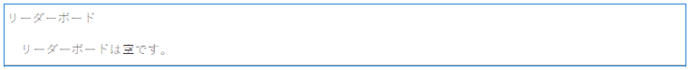
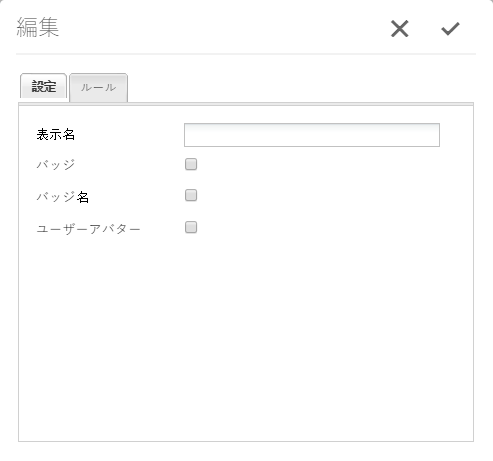

# リーダーボード機能  {#leaderboard-feature}

## 概要 {#introduction}

`Leaderboard`コンポーネントは、獲得点（基本スコア）またはその専門知識（高度スコア）に従ってメンバーをランク付けすることで、コミュニティ内でのメンバーの関わり方を把握できます。

ページにリーダーボードコンポーネントを含める前に、[コミュニティのスコアとバッジ](/help/communities/implementing-scoring.md)を設定する必要があります。

ドキュメントのこのセクションでは、以下の内容について説明します。：

* `Leaderboard`コンポーネントを[コミュニティサイト](/help/communities/overview.md#community-sites)に追加します。
* `Leaderboard`コンポーネントの構成設定です。

### リーダーボードをページに追加 {#adding-a-leaderboard-to-a-page}

作成者モードで`Leaderboard`コンポーネントをページに追加するには、コンポーネントを見つけます

* `Communities / Leaderboard`

コンポーネントを探し、ページ上の位置にドラッグします。

必要な情報については、[Communities Components Basics](/help/communities/basics.md)を参照してください。

コミュニティサイトのページに初めて配置されたとき、コンポーネントは次のように表示されます。

### リーダーボードの設定 {#configuring-leaderboard}

アクセスする配置済みの`Leaderboard`コンポーネントを選択し、編集ダイアログを開く`Configure`アイコンを選択します。

#### 「設定」タブ{#settings-tab}

「**[!UICONTROL 設定]**」タブで、メンバーに関連して表示する情報を指定します。

* **表示名**

   ボードに表示するわかりやすい名前。バッジとスコアの表示に選択したルールを反映します。
何も入力しなかった場合の初期設定は`Leaderboard`です。

* **バッジ**

   選択すると、バッジアイコンの列がリーダーボードに含まれます。
初期設定はオフです。

* **バッジ名**

   オンの場合、バッジ名の列がリーダーボードに含まれます。
初期設定はオフです。

* **ユーザーアバター**

   オンの場合、メンバーのアバター画像はリーダーボードに含まれ、メンバープロファイルへの名前リンクの隣に表示されます。
初期設定はオフです。

#### 「ルール」タブ{#rules-tab}

「**ルール**」タブで、コミュニティサイト、およびそのスコアルールとバッジルールを指定します。

* **ルールの場所**

   （必須）スコアリング/バッジングルールが設定されている場所。

* **スコアルール**

   （必須）表示するスコアを生成する特定のルール。

* **バッジルール**

   （必須）表示するバッジを生成する特定のルール。

* **最大表示数**

   1ページに表示するメンバーの数。デフォルトは10です。

### 例：参加者のリーダーボード {#example-participants-leaderboard}

このリーダーボードには、基本スコアルールを適用した結果が報告されます。

リーダーボードコンポーネントの設定：

* 「設定」タブ：

   * 表示名 = `Participation Board`
   *  `checked` の下）で、次の手順をおこないます。

      * バッジ
      * バッジ名
      * ユーザーアバター

* 「ルール」タブ：

   * ルールの場所 = `/content/sites/<site name>/jcr:content`
   * スコアルール = `/libs/settings/community/scoring/rules/forums-scoring`
   * バッジルール = `/libs/settings/community/badging/rules//reference-badging`
   * 最大表示数 = `10`

### 例：エキスパートのリーダーボード {#example-experts-leaderboard}

このリーダーボードには、高度なスコアルールを適用した結果が報告されます。

リーダーボードコンポーネントの設定：

* 「設定」タブ：

   * 表示名 = `Expertise Board`
   *  `checked` の下）で、次の手順をおこないます。

      * バッジ
      * ユーザーアバター

* 「ルール」タブ：

   * ルールの場所 = `/content/sites/<site name>/jcr:content`
   * スコアルール = `/libs/settings/community/scoring/rules/adv-forums-scoring`
   * バッジルール = `/libs/settings/community/badging/rules/adv-forums-badging`
   * 最大表示数 = `10`

### 追加情報 {#additional-information}

詳しい情報は[Leaderboard Essentials](/help/communities/leaderboard.md)ページの開発者向けページにあります。

ルールの作成手順は、管理者向けの[コミュニティスコアリングとバッジ](/help/communities/implementing-scoring.md)ページに記載されています。
