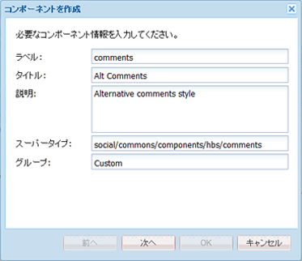
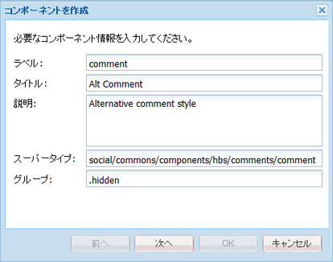
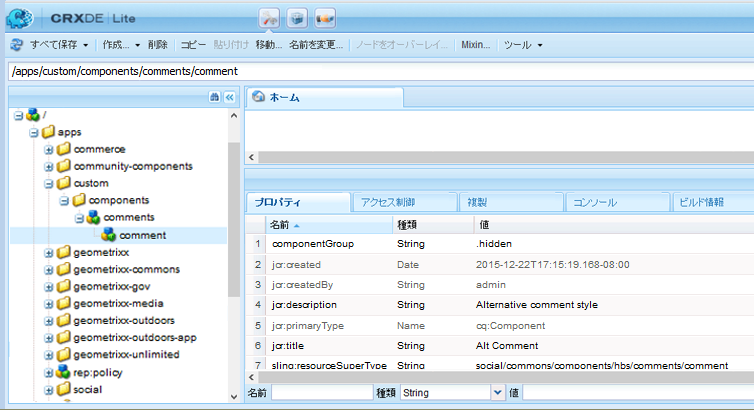
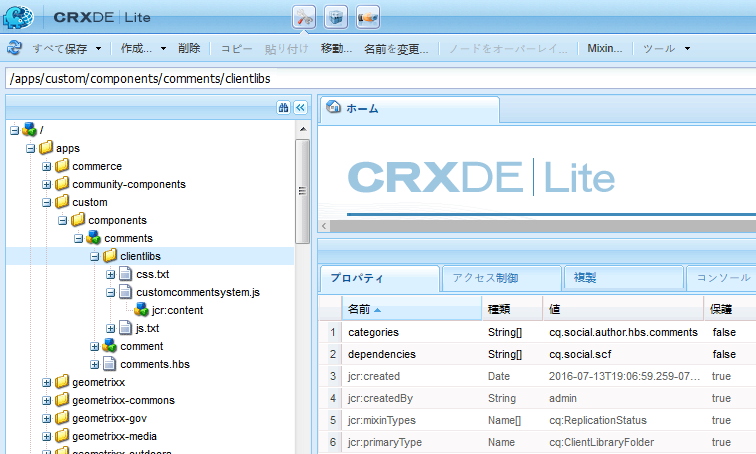

# コンポーネントの作成   {#create-the-components}

コンポーネントを拡張する例では、実際には次の 2 つのコンポーネントで構成されるコメントシステムを使用します。

* コメント — ページ上に配置されるコンポーネントである包含コメントシステム。
* コメント — 投稿されたコメントのインスタンスをキャプチャするコンポーネント。

投稿されたコメントの外観をカスタマイズする場合は特に、両方のコンポーネントを配置する必要があります。

>[!NOTE]
>
>1 つのサイトページで使用できるコメントシステムは 1 つのみです。
>
>多くのコミュニティ機能には、拡張されたコメントシステムを参照するように resourceType を変更できるコメントシステムが既に含まれています。

## コメントコンポーネントの作成  {#create-the-comments-component}

これらの指示に従って、`.hidden`以外の&#x200B;**Group**&#x200B;値を指定するので、コンポーネントはコンポーネントブラウザー（サイドキック）から利用できます。

デフォルトの HBS ファイルを代わりに使用するので、自動的に作成された JSP ファイルは削除します。

1. **CRXDE Lite**（[http://localhost:4502/crx/de/index.jsp](http://localhost:4502/crx/de/index.jsp)）を表示します。

1. カスタムアプリケーションの場所の作成：

   * `/apps`ノードを選択

      * 「**フォルダーを作成**」を選択し、**[!UICONTROL custom]** という名前のフォルダーを作成します。
   * `/apps/custom`ノードを選択

      * 「**フォルダーを作成**」を選択し、**[!UICONTROL components]** という名前のフォルダーを作成します。


1. `/apps/custom/components`ノードを選択

   * **[!UICONTROL 作成／コンポーネント...]** を選択します。

      * **ラベル**: *コメント*
      * **タイトル**：Alt Comments **
      * **説明**：Alternative comments style **
      * **スーパータイプ**：social/commons/components/hbs/comments **
      * **グループ**：Custom **
   * 「**[!UICONTROL 次へ]**」を選択します。
   * 「**[!UICONTROL 次へ]**」を選択します。
   * 「**[!UICONTROL 次へ]**」を選択します。
   * 「**[!UICONTROL OK]**」を選択します。


1. 作成したノードを展開します。`/apps/custom/components/comments`
1. 「**[!UICONTROL すべて保存]**」を選択します。
1. `comments.jsp`を右クリック
1. **[!UICONTROL 削除]**&#x200B;を選択
1. 「**[!UICONTROL すべて保存]**」を選択します。



### 子コメントコンポーネントの作成 {#create-the-child-comment-component}

これらの方向は、**Group**&#x200B;を`.hidden`に設定します。これは、親コンポーネントのみをページに含める必要があるためです。

デフォルトの HBS ファイルを代わりに使用するので、自動的に作成された JSP ファイルは削除します。

1. `/apps/custom/components/comments`ノードに移動します
1. ノードを右クリック

   * **[!UICONTROL 作成]**/**[!UICONTROL コンポーネントを選択…]**

      * **ラベル**：comment **
      * **タイトル**：Alt Comment **
      * **説明**：Alternative comment style **
      * **スーパータイプ**：social/commons/components/hbs/comments/comment **
      * **グループ**: `*.hidden*`
   * 「**[!UICONTROL 次へ]**」を選択します。
   * 「**[!UICONTROL 次へ]**」を選択します。
   * 「**[!UICONTROL 次へ]**」を選択します。
   * 「**[!UICONTROL OK]**」を選択します。


1. 作成したノードを展開します。`/apps/custom/components/comments/comment`
1. 「**[!UICONTROL すべて保存]**」を選択します。
1. `comment.jsp`を右クリック
1. **[!UICONTROL 削除]**&#x200B;を選択
1. 「**[!UICONTROL すべて保存]**」を選択します。





### デフォルトの HBS スクリプトのコピーと変更 {#copy-and-modify-the-default-hbs-scripts}

[CRXDE Lite](../../help/sites-developing/developing-with-crxde-lite.md) を使用して、次の手順を実行します。

* コピー `comments.hbs`

   * [/libs/social/commons/components/hbs/comments](http://localhost:4502/crx/de/index.jsp#/libs/social/commons/components/hbs/comments)から
   * [/apps/custom/components/comments](http://localhost:4502/crx/de/index.jsp#/apps/custom/components/comments)へ

* `comments.hbs`を編集して次を実行：

   * `data-scf-component`属性の値を変更（～行20）:

      * 送信元 `social/commons/components/hbs/comments`
      * To `/apps/custom/components/comments`
   * カスタムコメントコンポーネントを含めるように変更（～行75）:

      * 置換 `{{include this resourceType='social/commons/components/hbs/comments/comment'}}`
      * を次のタグに置換します。`{{include this resourceType='/apps/custom/components/comments/comment'}}`


* コピー `comment.hbs`

   * [/libs/social/commons/components/hbs/comments/comment](http://localhost:4502/crx/de/index.jsp#/libs/social/commons/components/hbs/comments/comment)から
   * [/apps/custom/components/comments/comment](http://localhost:4502/crx/de/index.jsp#/apps/custom/components/comments/comment)へ

* `comment.hbs`を編集して次を実行：

   * data-scf-component属性の値の変更（～行19）

      * 送信元 `social/commons/components/hbs/comments/comment`
      * `/apps/custom/components/comments/comment`へ

* `/apps/custom`ノードを選択
* 「**[!UICONTROL すべて保存]**」を選択します。

## クライアントライブラリフォルダーの作成 {#create-a-client-library-folder}

このクライアントライブラリを明示的に含めなくても済むように、デフォルトのコメントシステムの clientlib の categories 値（`cq.social.author.hbs.comments`）を使用できますが、これを使用すると、デフォルトのコンポーネントのすべてのインスタンスについても、この clientlib が含まれるようになります。

[CRXDE Lite](../../help/sites-developing/developing-with-crxde-lite.md) を使用して、次の手順を実行します。

* `/apps/custom/components/comments`ノードを選択
* **[!UICONTROL ノードを作成]**&#x200B;を選択

   * **名前**：`clientlibs`
   * **型**：`cq:ClientLibraryFolder`
   * 追加&#x200B;**[!UICONTROL プロパティ]**&#x200B;タブ：

      * **** `categories` **** `String` **NameTypeValue** `cq.social.author.hbs.comments` `Multi`
      * **** `dependencies` **** `String` **NameTypeValue** `cq.social.scf` `Multi`

* 「**[!UICONTROL すべて保存]**」を選択します。
* `/apps/custom/components/comments/clientlib`のノードを選択した状態で、3つのファイルを作成します。

   * **名前**：`css.txt`
   * **名前**：`js.txt`
   * **名前**：customcommentsystem.js

* 「customcommentsystem.js」を`js.txt`の内容として入力
* 「**[!UICONTROL すべて保存]**」を選択します。



## SCF モデルおよびビューの登録 {#register-the-scf-model-view}

SCFコンポーネントを拡張（オーバーライド）する場合、resourceTypeは異なります（オーバーレイでは、resourceTypeが同じになるように、`/apps`の前に`/libs`を検索する相対的な検索メカニズムを使用します）。 このため、カスタムresourceTypeのSCF JSモデルと表示を登録するために、（クライアントライブラリ内に）JavaScriptを作成する必要があります。

次のテキストを`customcommentsystem.js`の内容として入力します。

### customcommentsystem.js {#customcommentsystem-js}

```xml
(function($CQ, _, Backbone, SCF) {
    "use strict";

    var CustomComment = SCF.Components["social/commons/components/hbs/comments/comment"].Model;
    var CustomCommentView = SCF.Components["social/commons/components/hbs/comments/comment"].View;

    var CustomCommentSystem = SCF.Components["social/commons/components/hbs/comments"].Model;
    var CustomCommentSystemView = SCF.Components["social/commons/components/hbs/comments"].View;

    SCF.registerComponent('/apps/custom/components/comments/comment', CustomComment, CustomCommentView);
    SCF.registerComponent('/apps/custom/components/comments', CustomCommentSystem, CustomCommentSystemView);

})($CQ, _, Backbone, SCF);
```

* 「**[!UICONTROL すべて保存]**」を選択します。

## アプリの公開 {#publish-the-app}

拡張されたコンポーネントをパブリッシュ環境で確認するには、カスタムコンポーネントをレプリケートする必要があります。

その方法の1つは、次のとおりです。

* グローバルナビゲーションから、

   * **[!UICONTROL ツール]**/**[!UICONTROL 展開]**/**[!UICONTROL レプリケーション]**&#x200B;を選択します
   * 「**[!UICONTROL ツリーをアクティブにする]**」を選択します。
   * `Start Path`を`/apps/custom`に設定
   * **[!UICONTROL 変更済みのみ]**&#x200B;のチェックを外す
   * 「**[!UICONTROL アクティブ化]**」ボタンを選択

