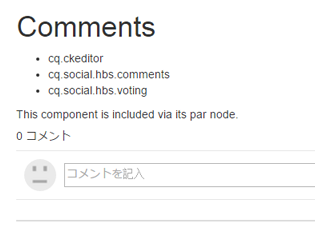
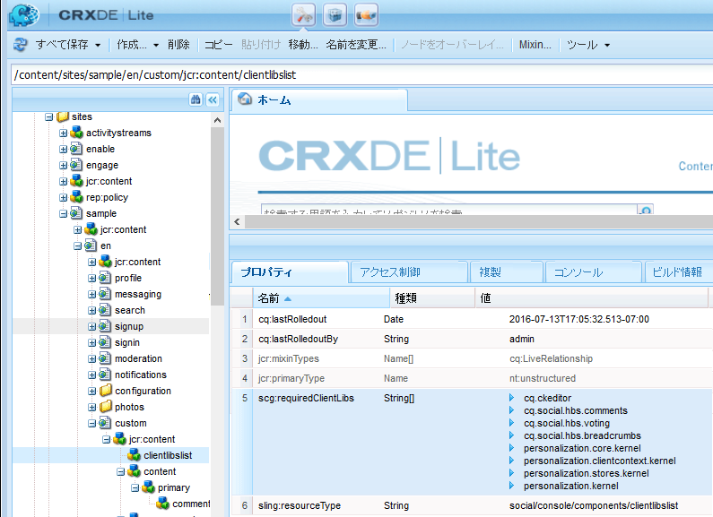
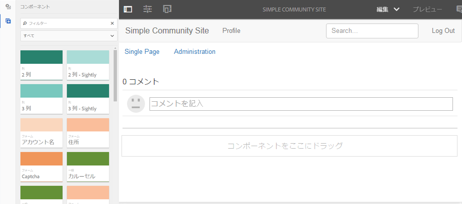
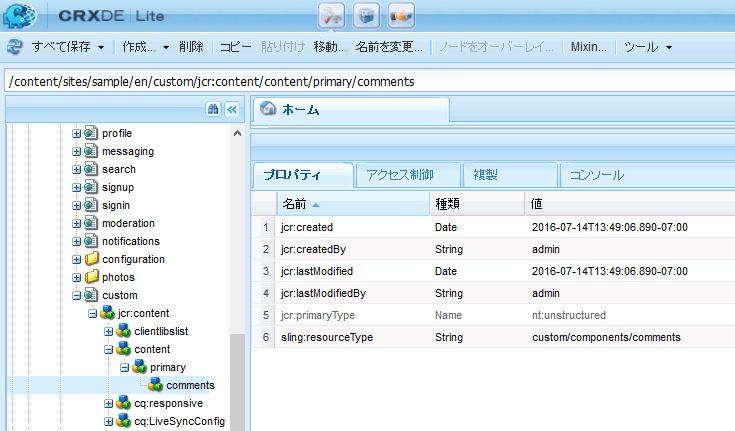
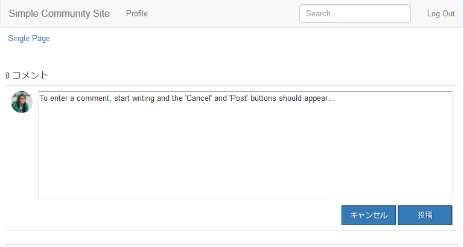

# サンプルページへのコメントの追加  {#add-comment-to-sample-page}

カスタムコメントシステムのコンポーネントがアプリケーションディレクトリ (/apps) に配置されたので、拡張コンポーネントを使用できます。 影響を受ける Web サイト内のコメントシステムのインスタンスでは、resourceType をカスタムコメントシステムに設定し、必要なクライアントライブラリをすべて含める必要があります。

## 必要な clientlib の識別 {#identify-required-clientlibs}

デフォルトのコメントのスタイルと機能に必要なクライアントライブラリは、拡張されたコメントにも必要です。

この [コミュニティコンポーネントガイド](/help/communities/components-guide.md) 必要なクライアントライブラリを識別します。 コンポーネントガイドを参照し、次に例を示します。

[https://localhost:4502/content/community-components/en/comments.html](https://localhost:4502/content/community-components/en/comments.html)

コメントの正常なレンダリングと機能のためには、3 つのクライアントライブラリが必要です。これらは、拡張されたコメントが参照される場所に含める必要があり、 [拡張コメントのクライアントライブラリ](/help/communities/extend-create-components.md#create-a-client-library-folder) ( `apps.custom.comments`) をクリックします。

### ページへのカスタムコメントの追加 {#add-custom-comments-to-a-page}

1 つのページで使用できるコメントシステムは 1 つだけなので、[サンプルページの作成](/help/communities/create-sample-page.md)のチュートリアルで説明する手順に従ってサンプルページを作成すると簡単です。

作成したら、デザインモードに切り替え、カスタムコンポーネントグループを使用可能にして、`Alt Comments` コンポーネントをページに追加できるようにします。

コメントを正しく表示し、機能させるには、コメントのクライアントライブラリをページの clientlibslist に追加する必要があります（[コミュニティコンポーネントの clientlib](/help/communities/clientlibs.md) を参照）。

#### サンプルページでのコメントの clientlib {#comments-clientlibs-on-sample-page}

#### オーサー環境：サンプルページでの Alt Comment {#author-alt-comment-on-sample-page}

#### オーサー環境：サンプルページでのコメントノード {#author-sample-page-comments-node}

CRXDE で resourceType を確認するには、サンプルページ ( ) の comments ノードのプロパティを表示します。 `/content/sites/sample/en/jcr:content/content/primary/comments`.

#### サンプルページの公開 {#publish-sample-page}

カスタムコンポーネントをページに追加した後は、（再度）[ページを公開](/help/communities/sites-console.md#publishing-the-site)する必要もあります。

#### パブリッシュ環境：サンプルページでの Alt Comment {#publish-alt-comment-on-sample-page}

カスタムアプリケーションとサンプルページの両方を公開した後に、コメントを入力できます。 サインイン時に、 [デモユーザー](/help/communities/tutorials.md#demo-users) または管理者は、コメントを投稿できます。

aaron.mcdonald@mailinator.comはコメントを投稿しています：

拡張されたコンポーネントがデフォルトの外観で正しく機能していることがわかります。次は外観を変更します。
