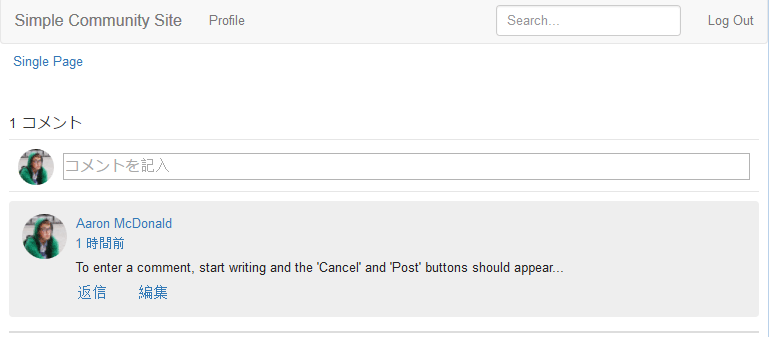

# サンプルページへのコメントの追加  {#add-comment-to-sample-page}

カスタムコメントシステムのコンポーネントがアプリケーションディレクトリ（/apps）に配置されたので、拡張コンポーネントを使用できます。 影響を受ける web サイトのコメントシステムのインスタンスは、resourceType をカスタムコメントシステムに設定し、必要なすべてのクライアントライブラリを含める必要があります。

## 必要な Clientlib の特定 {#identify-required-clientlibs}

デフォルトコメントのスタイルと機能に必要なクライアントライブラリは、拡張コメントにも必要です。

[ コミュニティコンポーネントガイド ](/help/communities/components-guide.md) は、必要なクライアントライブラリを示しています。 コンポーネントガイドを参照し、コメントコンポーネントを確認します。次に例を示します。

[https://localhost:4502/content/community-components/en/comments.html](https://localhost:4502/content/community-components/en/comments.html)

コメントがレンダリングされて正しく機能するには、3 つのクライアントライブラリが必要であることに注意してください。 これらは、拡張コメントが参照される場所と [ 拡張コメント」クライアントライブラリ ](/help/communities/extend-create-components.md#create-a-client-library-folder) （`apps.custom.comments`）に含める必要があります。

### ページへのカスタムコメントの追加 {#add-custom-comments-to-a-page}

コメントシステムはページごとに 1 つだけなので、簡単な [ サンプルページの作成 ](/help/communities/create-sample-page.md) チュートリアルで説明しているように、サンプルページを作成する方が簡単です。

作成したら、デザインモードに入り、カスタムコンポーネントグループを使用して、`Alt Comments` コンポーネントをページに追加できます。

コメントが表示されて正しく機能するには、コメント用のクライアントライブラリをページの clientlibslist に追加する必要があります（[ コミュニティコンポーネントのクライアントライブラリ ](/help/communities/clientlibs.md) を参照）。

#### サンプルページのコメント Clientlib {#comments-clientlibs-on-sample-page}

#### 作成者：サンプルページの代替コメント {#author-alt-comment-on-sample-page}

#### 作成者：サンプルページコメントノード {#author-sample-page-comments-node}

`/content/sites/sample/en/jcr:content/content/primary/comments` のサンプルページのコメントノードのプロパティを表示すると、CRXDE で resourceType を確認できます。

#### Publishのサンプルページ {#publish-sample-page}

カスタムコンポーネントをページに追加した後、ページを（再） [ 公開 ](/help/communities/sites-console.md#publishing-the-site) する必要もあります。

#### Publish：サンプルページに対する代替コメント {#publish-alt-comment-on-sample-page}

カスタムアプリケーションとサンプルページの両方を公開した後、コメントを入力できます。 [ デモユーザー ](/help/communities/tutorials.md#demo-users) または管理者でログインすると、コメントを投稿できます。

aaron.mcdonald@mailinator.comがコメントを投稿しています。

これで、拡張コンポーネントがデフォルトの外観で正しく動作しているように見えるので、次に外観を変更します。
