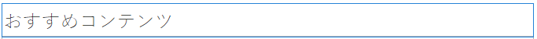
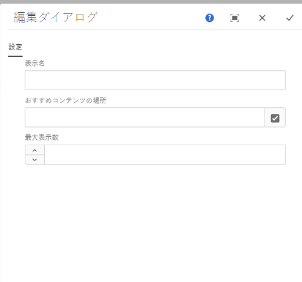
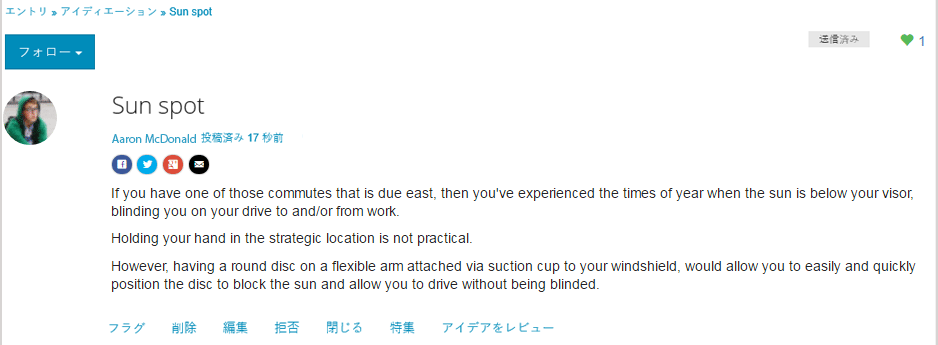
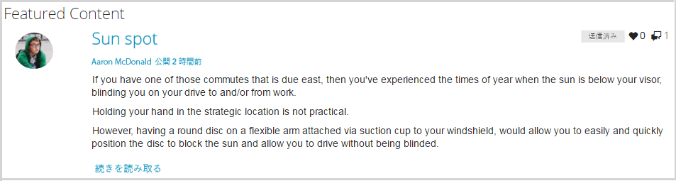

# おすすめコンテンツ機能 {#featured-content-feature}

## 概要 {#introduction}

おすすめコンテンツ機能は、パブリッシュ環境にサインインしているサイト訪問者（コミュニティメンバー）が以下のコンテンツに注目する領域を提供します。：

* [ブログ](blog-feature.md)
* [カレンダー](calendar.md)
* [フォーラム](forum.md)
* [アイデア](ideation-feature.md)
* [Q&amp;A](working-with-qna.md)

コンテンツにおすすめとしてフラグを設定すると、このコンポーネント内に一覧表示されるようになります。特定のランディングページまたは領域にこのコンポーネントを配置し、コミュニティメンバーの注目を簡単に集めることができます。

コンテンツをおすすめに設定する機能は、コンポーネントごとに許可または禁止できます。

ドキュメントのこのセクションでは、以下の内容について説明します。：

* コミュニティサイトにおすすめコンテンツを追加する。
* の設定 `Featured Content` コンポーネント。

## おすすめコンテンツをページに追加 {#adding-featured-content-to-a-page}

を追加するには、以下を実行します。 `Featured Content` コンポーネントをオーサリングモードでページに追加する場合は、コンポーネントブラウザーを使用して

* `Communities / Featured Content`

コンポーネントを探し、ページ上のおすすめコンテンツを表示する位置にドラッグします。

必要な情報については、 [コミュニティコンポーネントの基本](basics.md).

次の場合に [必要なクライアント側ライブラリ](essentials-featured.md#essentials-for-client-side) が含まれる場合、この方法で `Featured Content` コンポーネントが表示されます。

## おすすめコンテンツの設定 {#configuring-featured-content}

配置された `Featured Content` アクセスして選択するコンポーネント `Configure` 編集ダイアログを開くアイコン。

### 「設定」タブ {#settings-tab}

「**[!UICONTROL 設定]**」タブの下で、おすすめに設定するコンテンツを指定します。

* **[!UICONTROL 表示名]**

   おすすめコンテンツのリストのタイトル。 例： `Featured Questions` または `Featured Ideas`. デフォルトはです。 `Featured Content` 空のままの場合は。

* **[!UICONTROL おすすめコンテンツの場所]**

   *（必須）* 機能するコンテンツを含むページを参照します（そのページのコンポーネントは、「おすすめコンテンツを許可」に設定する必要があります）。 （例：`/content/sites/engage/en/forum`）。

* **[!UICONTROL 最大表示数]**

   表示するおすすめコンテンツの最大数。 デフォルトは 5 です。

## サイト訪問者のエクスペリエンス {#site-visitor-experience}

コンテンツにおすすめコンテンツのフラグを設定する機能には、モデレーター権限が必要です。

モデレーターが投稿されたコンテンツを表示すると、コンテキスト内のモデレートフラグにアクセスできます。このフラグには、新しい `Feature` フラグ。

機能としてフラグを設定すると、モデレーションフラグが `Unfeature`.

次を含むページ： `Featured Content` コンポーネントにこの投稿が含まれます。

`Read More` は、実際の投稿へのリンクです。

## 追加情報 {#additional-information}

開発者向けの詳細情報は、[おすすめコンテンツ](essentials-featured.md)ページを参照してください。

コンテンツへのおすすめフラグの設定について詳しくは、[ユーザー生成コンテンツのモデレート](moderate-ugc.md)を参照してください。
