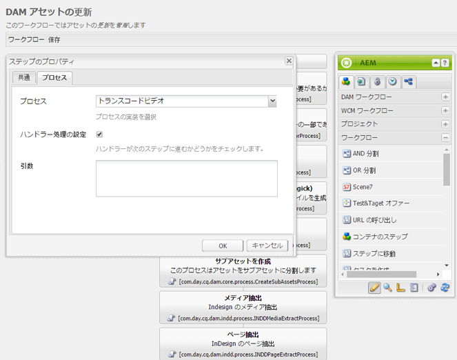

# コミュニティのための FFmpeg  {#ffmpeg-for-communities}

## 概要 {#overview}

FFmpeg は、オーディオとビデオの変換およびストリーミングのためのソリューションです。インストールすると、[ビデオアセット](../../help/sites-authoring/default-components-foundation.md#video)の適切なトランスコーディングと AEM Communities のイネーブルメント 能に使用できます。

FFmpeg は、オーサー環境で、アップロードしたイネーブルメントリソースのメタデータを取得したり、イネーブルメントリソースの一覧に表示するサムネイルを生成するときに使用します。

## FFmpeg のインストール  {#installing-ffmpeg}

FFmpeg は AEM *オーサー*&#x200B;インスタンスをホストしているサーバーにインストールする必要があります。

1. [https://www.ffmpeg.org](https://www.ffmpeg.org/)に移動します。
1. お使いの環境（Macintosh、WindowsまたはLinux）向けの最新バージョンのFFmpegをダウンロードします。

   * 古いバージョンのセキュリティの脆弱性により、FFmpegを最新の状態に保つことが重要です。

1. OS の手順に従って FFmpeg をインストールします。

1. FFmpeg実行可能ファイルがシステムパスに設定されていることを確認します。

   システム内の任意のディレクトリからFFmpegを実行できるはずです。

   * （例：`ffmpeg -version`）。

## FFmpeg トランスコーディングサービスの設定 {#configure-ffmpeg-transcoding-service}

デフォルトでは、FFmpegがインストールされると、[!UICONTROL DAMアセットの更新]ワークフロー定義に従って複数のレンディションが設定（トランスコーディング）されます。

トランスコーディングは CPU を集中的に使用するので、対象レンディションのリストを変更することを推奨します。ほとんどの場合、トランスコードは必要ありません。

[!UICONTROL DAMアセットの更新]ワークフローを変更し、この例でトランスコーディングをオフにするには、次のようにします。

* 管理者権限でオーサーインスタンスにログインします。
* グローバルナビゲーションから、**[!UICONTROL ツール]** / **[!UICONTROL ワークフロー]** / **[!UICONTROL モデル]**&#x200B;に移動します。
* **[!UICONTROL DAM Update Asset]**&#x200B;を探します。
* ダブルクリックして、編集用のワークフローをクラシックUIで開きます。

   結果の場所：[http://localhost:4502/cf#/etc/workflow/models/dam/update_asset.html](http://localhost:4502/cf#/etc/workflow/models/dam/update_asset.html)

* **[!UICONTROL FFmpegトランスコーディング]**&#x200B;の手順をダブルクリックして、ステップのプロパティダイアログにアクセスします。
* 「**[!UICONTROL プロセス]**」タブで、次の操作を実行します。

   * **[!UICONTROL 引数]**:トランスコーディングを無効にするには、すべてのエントリをクリアします。デフォルト値：  `profile:format_ogg,profile:format_aac,profile:format_flv,profile:format_aac_ie`

   

* 「**[!UICONTROL OK]**」を選択して、`Step Properties`ダイアログを閉じます。

* 「**[!UICONTROL 保存]**」を選択して、`DAM Update Asset`ワークフローを保存します。
