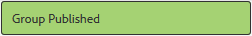

# ファイルライブラリ機能{#file-library-feature}

## 概要 {#introduction}

ファイルライブラリ機能は、サインインしているサイト訪問者（コミュニティメンバー）がコミュニティサイト内でファイルをアップロード、管理およびダウンロードする場所を提供します。

ドキュメントのこのセクションでは、以下の内容について説明します。

* ファイルライブラリ機能を AEM サイトに追加
* configuration settings for the `File Library` component

### ファイルライブラリをページに追加 {#adding-a-file-library-to-a-page}

To add a `File Library` component to a page in author mode, locate the component

* `Communities / File Library`

コンポーネントを探し、ページ上の位置にドラッグします。

For necessary information, visit [Communities Components Basics](/help/communities/basics.md).

When the [required client-side libraries](/help/communities/essentials-file-library.md#essentials-for-client-side) are included, this is how the `File Library` component will appear :

### ファイルライブラリの設定 {#configuring-file-library}

Select the placed `File Library` component to access and select the `Configure` icon which opens the edit dialog.

 

#### 「コメント」タブ{#comments-tab}

「**コメント*」タブで、アップロードされたファイルに対するコメントの表示と表示を指定します。

* **ファイルへのコメントを許可**&#x200B;オンにすると、アップロードしたファイルに対するコメントを許可します。初期設定はオフです。

* **1 ページのコメント数** 1 ページに表示されるコメント数と返信数を制限します。デフォルトは **10** です。

* **最大ファイルサイズ**&#x200B;この値によって、アップロードするファイルサイズが制限されます。デフォルトの制限は104857600(10 Mb)です。

* **メッセージの最大長**&#x200B;テキストボックスに入力できる最大文字数です。初期設定は 4096 文字です。

* **許可されるファイルタイプ**&#x200B;ドット付きのファイル拡張子をコンマ区切りで指定します（例：.jpg, .jpeg, .png, .doc, .docx, .pdf）。ファイルタイプを指定した場合、指定しなかったファイルは許可されません。 初期設定は、** **すべてのファイルタイプを許可するように指定されていない。

* **リッチテキストエディター**&#x200B;オンにすると、マークアップを使用してコメントを入力できます。初期設定はオフです。

* **コメントを削除**&#x200B;オンにすると、ユーザーは自分のコメントを削除できます。初期設定はオンです。

* **タグ付けを許可**&#x200B;オンにすると、ファイルにタグを付加する機能が有効になります。初期設定はオフです。

* **許可された名前空間**「タグ付けを許可」がオンの場合、使用可能なタグは選択した名前空間に限定されます。名前空間が選択されていない場合、すべての名前空間が許可されます。初期設定はすべての名前空間です。

* **推奨の制限**「タグ付けを許可」がオンの場合に、表示する推奨タグの数の上限を設定します。-1 に設定した場合、制限はありません。初期設定は -1 です。

* **投票を許可**&#x200B;オンにすると、ファイルに投票する機能が有効になります。初期設定はオフです。

* **フォローを許可**&#x200B;オンにすると、ブログ記事にフォロー機能が追加され、新しい投稿があった場合にメンバーに[通知](/help/communities/notifications.md)できるようになります。初期設定はオフです。

* **「メンション**&#x200B;を有効にする」を有効にすると、登録済みコミュニティユーザーは、他の登録済みメンバー（名、姓、ユーザー名を使用）を識別し、共通の@user-name構文を使用してタグ付けできます。 タグ付きユーザーは、メンションに関する通知を受信します。

* **最大メンション**：投稿で許可されるメンションの最大数を制限します。 初期設定は 10 です。

* **UIメンションパターン**：投稿内の登録ユーザーにタグ付け(@mention)するために許可されたパターン文字列を指定します。 例：～{{familyName}}{{givenName}}

* **スレッド化された返信を許可**&#x200B;オンにすると、投稿されたコメントに返信できるようになります。初期設定はオフです。

#### 「ユーザーモデレート」タブ {#user-moderation-tab}

「**ユーザーモデレート**」タブでは、コメントが許可されている場合に、コメントのモデレートを設定します。

* **モデレート前**&#x200B;オンにすると、コメントを公開サイトに表示する前に承認が必要になります。初期設定はオフです。

* **コメントを削除**&#x200B;オンにすると、コメントを投稿した訪問者がそのコメントを削除できます。初期設定はオンです。

* **コメントを拒否**&#x200B;オンにすると、信頼されているメンバーモデレーターがコメントを拒否できます。初期設定はオフです。

* **コメントを閉じる／再度開く**&#x200B;オンにすると、信頼されているメンバーモデレーターがコメントを閉じたり、再度開いたりすることができます。初期設定はオフです。

* **コメントにフラグを設定**&#x200B;オンにすると、訪問者はコメントに「不適切」のフラグを設定できます。初期設定はオフです。

* **フラグ設定理由リスト**&#x200B;オンにすると、訪問者はコメントに「不適切」のフラグを設定した理由をドロップダウンリストから選択できます。初期設定はオフです。

* **カスタムフラグ設定理由**&#x200B;オンにすると、訪問者はコメントに「不適切」のフラグを設定した独自の理由を入力できます。初期設定はオフです。

* **モデレートのしきい値**&#x200B;訪問者がコメントに何回フラグを設定したらモデレーターに通知するかを指定します。Default is one time (**1**).

* **フラグ付けの制限**&#x200B;コメントに何回フラグが設定されたら、公開表示から非公開にするかを指定します。This number must be greater than or equal to the **Moderation Threshold**. 初期設定は 5 です。

### 「並べ替え設定」タブ{#sort-settings-tab}

並べ替え

デフォルトとして設定

### 追加情報 {#additional-information}

More information may be found on the [File Library Essentials](/help/communities/essentials-file-library.md) page for developers.

投稿されたトピックとコメントのモデレートについては、[ユーザー生成コンテンツのモデレート](/help/communities/moderate-ugc.md)を参照してください。

投稿されたトピックとコメントのタグ付けについては、[ユーザー生成コンテンツのタグ付け](/help/communities/tag-ugc.md)を参照してください。
