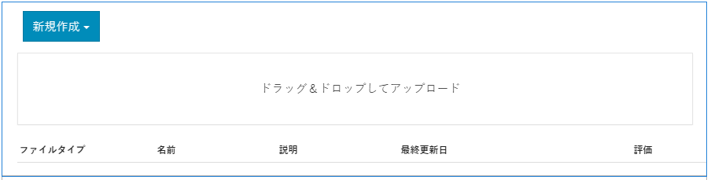

# ファイルライブラリ機能{#file-library-feature}

## はじめに {#introduction}

ファイルライブラリ機能は、サインインしているサイト訪問者（コミュニティメンバー）がコミュニティサイト内でファイルをアップロード、管理およびダウンロードする場所を提供します。

ドキュメントのこのセクションでは、以下の内容について説明します。：

* ファイルライブラリ機能をAEMサイトに追加する。
* `File Library`コンポーネントの設定。

### ファイルライブラリをページに追加 {#adding-a-file-library-to-a-page}

`File Library`コンポーネントをオーサリングモードでページに追加するには、次の場所に移動します。

* `Communities / File Library`

コンポーネントを探し、ページ上の位置にドラッグします。

必要な情報については、[コミュニティコンポーネントの基本](/help/communities/basics.md)を参照してください。

[必須のクライアント側ライブラリ](/help/communities/essentials-file-library.md#essentials-for-client-side)を含めると、`File Library`コンポーネントは次のように表示されます。

### ファイルライブラリの設定 {#configuring-file-library}

配置済みの`File Library`コンポーネントを選択し、`Configure`アイコンを選択すると、編集ダイアログが開きます。

#### 「コメント」タブ{#comments-tab}

「**コメント**」タブでは、アップロードしたファイルに対するコメントを表示するかどうかと、その方法を指定します。

* **ファイルへのコメントを許可**

   オンにすると、アップロードされたファイルに対するコメントを許可します。 初期設定はオフです。

* **1 ページのコメント数**

   1ページに表示するコメントの数と返信の数を制限します。 デフォルトは **10** です。

* **最大ファイルサイズ**

   この値によって、アップロードするファイルサイズが制限されます。デフォルトの制限は104857600(10 Mb)です。

* **メッセージの最大長**

   テキストボックスに入力できる最大文字数。 初期設定は 4096 文字です。

* **許可されるファイルタイプ**

   ドット付きのファイル拡張子をコンマ区切りで指定します（例：.jpg, .jpeg, .png, .doc, .docx, .pdf）。ファイルタイプを指定した場合、指定しなかったファイルは許可されません。 デフォルトでは、すべてのファイルタイプが許可されるように指定されていません。

* **リッチテキストエディター**

   オンにすると、マークアップを使用してコメントを入力できます。 初期設定はオフです。

* **コメントを削除**

   オンにすると、ユーザーは自分のコメントを削除できます。 初期設定はオンです。

* **タグ付けを許可**

   オンにすると、ファイルにタグを追加する機能が有効になります。 初期設定はオフです。

* **許可された名前空間**

   「タグ付けを許可」をオンにすると、使用可能なタグはチェックした名前空間に限定されます。 名前空間が選択されていない場合、すべての名前空間が許可されます。初期設定はすべての名前空間です。

* **推奨の制限**

   「タグ付けを許可」をオンにすると、表示するタグの数が制限されます。 -1 に設定した場合、制限はありません。初期設定は -1 です。

* **投票を許可**

   オンにすると、ファイルの投票機能が有効になります。 初期設定はオフです。

* **フォローを許可**

   オンにすると、次の機能がブログ記事に含まれ、メンバーは新しい投稿の[通知](/help/communities/notifications.md)を受け取ることができます。 初期設定はオフです。

* **メンションを有効化**

   有効にすると、登録済みコミュニティユーザーは、他の登録済みメンバー（名、姓、ユーザー名を使用）を識別し、共通の@user-name構文を使用してタグ付けできます。 タグ付きユーザーは、メンションに関する通知を受け取ります。

* **最大メンション数**

   投稿で許可するメンションの最大数を制限します。 初期設定は 10 です。

* **UI メンションパターン**

   投稿に登録されたユーザーにタグ付け(@mention)するために許可されるパターン文字列を指定します。 例： ～{{familyName}}{{givenName}}。

* **スレッド化された返信を許可**

   オンにすると、投稿されたコメントに対する返信を許可します。 初期設定はオフです。

#### 「ユーザーモデレート」タブ  {#user-moderation-tab}

「**ユーザーモデレート**」タブでは、コメントが許可されている場合に、コメントのモデレートを設定します。

* **事前モデレート**

   オンにすると、コメントはパブリッシュサイトに表示される前に承認が必要になります。 初期設定はオフです。

* **コメントを削除**

   オンにすると、コメントを投稿した訪問者はコメントを削除できます。 初期設定はオンです。

* **コメントを拒否**

   オンにすると、信頼されているメンバーモデレーターがコメントを拒否できます。 初期設定はオフです。

* **コメントを閉じる / 再度開く**

   オンにすると、信頼されているメンバーモデレーターがコメントを閉じたり、再度開いたりできるようになります。 初期設定はオフです。

* **コメントにフラグを設定**

   オンにすると、訪問者はコメントに「不適切」のフラグを設定できます。 初期設定はオフです。

* **フラグ設定理由リスト**

   オンにすると、訪問者はコメントに「不適切」のフラグを設定した理由をドロップダウンリストから選択できます。 初期設定はオフです。

* **カスタムフラグ設定理由**

   オンにすると、訪問者はコメントに「不適切」のフラグを設定した独自の理由を入力できます。 初期設定はオフです。

* **モデレートのしきい値**

   訪問者がコメントに何回フラグを設定したらモデレーターに通知するかを指定します。 初期設定は1回(**1**)です。

* **フラグ付けの制限**

   コメントに何回フラグを設定したら、公開表示から非表示にするかを入力します。 この数値は、**モデレートのしきい値**&#x200B;以上にする必要があります。 初期設定は 5 です。

### 「並べ替え設定」タブ{#sort-settings-tab}

並べ替え

デフォルトとして設定

### 追加情報 {#additional-information}

詳しくは、開発者向けの[ファイルライブラリの基本事項](/help/communities/essentials-file-library.md)ページを参照してください。

投稿されたトピックとコメントのモデレートについては、[ユーザー生成コンテンツのモデレート](/help/communities/moderate-ugc.md)を参照してください。

投稿されたトピックとコメントのタグ付けについては、[ユーザー生成コンテンツのタグ付け](/help/communities/tag-ugc.md)を参照してください。
