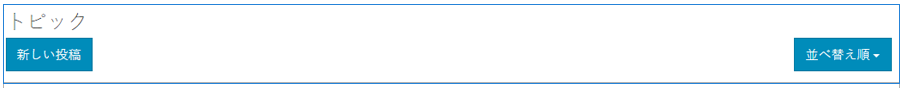

# フォーラム機能{#forum-feature}

## はじめに {#introduction}

フォーラム機能は、パブリッシュ環境にサインインしているサイト訪問者（コミュニティメンバー）が以下を実行できる領域を提供します。

* 新しいトピックの作成
* トピックの表示と返信
* トピックをフォロー
* フォーラムの検索
* フォーラムコンテンツのモデレートに役立つ
* フォーラムトピックをページ間で移動する

このドキュメントの節では、以下について説明します。

* フォーラム機能をAEMサイトに追加する。
* `Forum`コンポーネントの設定。

### フォーラムをページに追加 {#adding-a-forum-to-a-page}

`Forum`コンポーネントをオーサリングモードでページに追加するには、コンポーネントブラウザーを使用して

* `Communities / Forum`

コンポーネントを探し、ページ上のフォーラムを表示する位置にドラッグします。

必要な情報については、[コミュニティコンポーネントの基本](/help/communities/basics.md)を参照してください。

[必須のクライアント側ライブラリ](/help/communities/essentials-forum.md#essentials-for-client-side)を含めると、`Forum`コンポーネントは次のように表示されます。

### フォーラムの設定 {#configuring-a-forum}

配置済みの`Forum`コンポーネントを選択し、`Configure`アイコンを選択すると、編集ダイアログが開きます。

#### 「設定」タブ{#settings-tab}

「**設定**」タブでは、トピックと返信の基本機能を設定します。

* **添付サムネールを許可**

   オンにすると、添付画像のサムネールが作成されます。

* **添付サムネールの最大サイズ**

   添付ファイルのサムネール画像の最大サイズ（ピクセル単位）。 デフォルト値は、800 x 800 です。

* **サムネールの最小画像サイズ**
* **サムネールの最大サイズ**

   インライン画像のサムネール画像の最大サイズ（ピクセル単位）。 デフォルト値は、800 x 800 です。

* **1 ページのトピック数**

   1 ページあたりに表示されるトピック / 投稿の数を定義します。デフォルト値は 10 です。

* **モデレート**

   オンにすると、トピックとコメントの投稿を発行サイトに表示する前に承認が必要になります。 初期設定はオフです。

* **閉じる**

   オンにすると、フォーラムは新しいトピックとコメントを受け付けなくなります。 初期設定はオフです。

* **リッチテキストエディター**

   オンにすると、マークアップを使用してトピックとコメントを入力できます。 初期設定はオフです。

* **タグ付けを許可**

   オンにすると、メンバーは自分の投稿にタグラベルを追加できます（**タグフィールド**&#x200B;タブを参照）。 初期設定はオフです。

* **ファイルのアップロードを許可**

   オンにすると、トピックまたはコメントに添付ファイルを追加できます。 初期設定はオフです。

* **フォローを許可**

   オンにすると、フォーラム投稿に次の機能が含まれ、メンバーは新しい投稿の[通知](/help/communities/notifications.md)を受け取ることができます。 初期設定はオフです。

* **ピン留めを許可**

   オンにすると、フォーラムトピックがトピックのリストの先頭にピン留めされる場合があります。 初期設定はオフです。

* **おすすめコンテンツを許可**

   オンにすると、アイデアを[おすすめコンテンツ](/help/communities/featured.md)として識別できます。 初期設定はオフです。

* **電子メール購読を許可**

   オンにすると、新しい投稿をEメールでメンバーに通知できます（[購読](/help/communities/subscriptions.md)）。 `Allow Following`を確認し、[電子メールを設定](/help/communities/email.md)する必要があります。 初期設定はオフです。

* **最大ファイルサイズ**

   `Allow File Uploads`がオンの場合にのみ関連します。 このフィールドは、アップロードするファイルのサイズ（バイト単位）を制限します。 初期設定は104857600(10 Mb)です。

* **許可されるファイルタイプ**

   `Allow File Uploads`がオンの場合にのみ関連します。 ドット付きのファイル拡張子をコンマ区切りで指定します（例：.jpg, .jpeg, .png, .doc, .docx, .pdf）。ファイルタイプを指定すると、指定されていないファイルはアップロードできません。 デフォルトでは、すべてのファイルタイプが許可されるように指定されていません。

* **「ファイルのアップロードを許可」**
がオンの場合にのみ、添付画像ファイルの最大サイズが関連します。アップロードされた画像ファイルの最大バイト数。 初期設定は2097152(2 Mb)です。

* **スレッド化された返信を許可**

   オンにすると、トピックに投稿されたコメントに対する返信を許可します。 初期設定はオフです。

* **投票を許可**

   オンにした場合、トピックに投票機能を含めます。 初期設定はオフです。

* **ユーザーによるコメントおよびトピックの削除を許可**

   オンにすると、メンバーは自分が投稿したコメントやトピックを削除できます。 初期設定はオフです。

* **パンくずリストを表示**

   オンにすると、トピックページにナビゲーションのパンくずリストが表示されます。 初期設定はオンです。

* **バッジを表示**

   オンにすると、獲得した[バッジ](/help/communities/implementing-scoring.md)をメンバーのブログエントリに割り当てて表示します。 初期設定はオフです。

* **権限を持つメンバーを許可**

   オンにすると、権限を持つメンバーのみがコンテンツを作成できます。

* **許可された権限を持つメンバー**

   コンテンツの作成が許可されている権限を持つメンバーを追加します。

* **作成者編集モードでユーザーが生成したコンテンツをブロックする**

   有効にすると、オーサーモードでの編集中にユーザー生成コンテンツがブロックされます。

* **メンションを有効化**

   有効にすると、登録済みコミュニティユーザーは、他の登録済みメンバー（名、姓、ユーザー名を使用）を識別し、共通の@user-name構文を使用してタグ付けできます。 タグ付きユーザーは、メンションに関する通知を受け取ります。

* **最大メンション数**

   投稿で許可するメンションの最大数を制限します。 初期設定は 10 です。

* **UI メンションパターン**

   投稿に登録されたユーザーにタグ付け(@mention)するために許可されるパターン文字列を指定します。 例えば、`~{{familyName}}{{givenName}}` のように指定します。

>[!NOTE]
>
>トピックに対するコメントを有効にするには、`AllowThreaded Replies`と`Allow users to Delete Comments and Topics`の両方を確認する必要が生じる場合があります。

#### 「ユーザーモデレート」タブ{#user-moderation-tab}

「**ユーザーモデレート**」タブで、投稿されたトピックと返信（ユーザー生成コンテンツ）の管理方法を指定します。 詳しくは、[ユーザー生成コンテンツのモデレート](/help/communities/moderate-ugc.md)を参照してください。

* **投稿を拒否**

   オンにすると、信頼されているメンバーモデレーターは投稿を拒否し、公開フォーラムに投稿が表示されなくなります。 初期設定はオフです。

* **トピックを閉じる / 再度開く**

   オンにすると、信頼されているメンバーモデレーターがトピックを閉じて、さらに編集やコメントを行ったり、トピックを再度開いたりできます。 初期設定はオフです。

* **トピックを移動**

   オンにすると、公開側のモデレーターがトピックを移動できます。 初期設定はオンです。

* **投稿にフラグを設定**

   オンにすると、メンバーは他のユーザーのトピックまたはコメントに「不適切」のフラグを設定できます。 初期設定はオフです。

* **フラグ設定理由リスト**

   オンにすると、メンバーはトピックまたはコメントに「不適切」のフラグを設定した理由をドロップダウンリストから選択できます。 初期設定はオフです。

* **カスタムフラグ設定理由**

   オンにすると、メンバーはトピックまたはコメントに「不適切」のフラグを設定した独自の理由を入力できます。 初期設定はオフです。

* **モデレートのしきい値**

   メンバーがトピックまたはコメントに何回フラグを設定したらモデレーターに通知するかを指定します。 初期設定は1（1回）です。

* **フラグ付けの制限**

   トピックまたはコメントに何回フラグを設定したら、公開表示から非表示にするかを入力します。 -1に設定した場合、フラグ付きのトピックまたはコメントが公開表示で非表示になることはありません。 それ以外の場合は、この数値をモデレートのしきい値以上にする必要があります。 初期設定は 5 です。

#### 「タグフィールド」タブ{#tag-field-tab}

「**タグフィールド**」タブでは、「**設定**」タブでタグ付けが許可されている場合に、適用できるタグを名前空間に従って制限します。

* **許可された名前空間**

   「**設定**」タブで`Allow Tagging`がチェックされている場合に関連します。 適用できるタグは、チェックされた名前空間カテゴリ内のタグに限定されます。 名前空間のリストには、「標準タグ」（デフォルトの名前空間）および「すべてのタグを含む」が含まれます。 初期設定は「なし」です。これは、すべての名前空間が許可されることを意味します。

* **推奨の制限**

   フォーラムに投稿するメンバーに提案として表示するタグの数を入力します。 初期設定は**-**1です（制限なし）。

#### 「翻訳」タブ{#translation-tab}

「**翻訳**」タブでは、コミュニティサイトの翻訳が有効になっている場合に、選択された投稿だけでなくトピック全体を翻訳するかどうかを設定できます。

* **すべてを翻訳**

   オンにすると、フォーラムスレッドがユーザーの設定言語に変換されます。 初期設定はオフです。

#### 「並べ替え設定」タブ{#sort-settings-tab}

「**並べ替え設定**」タブで、投稿されたコメントを表示する際の並べ替え方法を指定します。

* **並べ替え**

   許可されているすべての並べ替え選択をオンにします。`Newest, Oldest, Last Updated, Most Viewed, Most Active, Most Followed and Most Liked`. デフォルトは `Newest, Oldest, Last Updated` です。

* **デフォルトとして設定**

   プルダウンして、オンにした並べ替えオプションの1つを選択し、デフォルトとして表示します。 デフォルトは `Newest` です。

* **Analytics 並べ替えのタイムオプションを選択**

   プルダウンして、次のいずれかのオプションを選択します。`All, Last 24 Hours, Last 7 Days, Last 30 Days`.

   デフォルトは `All` です。

### 追加情報 {#additional-information}

詳しくは、開発者向けの[フォーラムの基本事項](/help/communities/essentials-forum.md)ページを参照してください。

投稿されたトピックとコメントのモデレートについては、[ユーザー生成コンテンツのモデレート](/help/communities/moderate-ugc.md)を参照してください。

投稿されたトピックとコメントのタグ付けについては、[ユーザー生成コンテンツのタグ付け](/help/communities/tag-ugc.md)を参照してください。

投稿されたトピックとコメントの翻訳については、[ユーザー生成コンテンツの翻訳](/help/communities/translate-ugc.md)を参照してください。
