# コミュニティ機能{#community-functions}

コミュニティに必要とされる機能の種類はだいたい決まっています。コミュニティ機能は、コミュニティ機能として使用できます。 基本的に、コミュニティ機能を実装するために事前に配線された 1 つ以上のページです。この場合、オーサリングモードでページにコンポーネントを追加するだけでは済みません。 これらは、 [コミュニティサイトテンプレート](/help/communities/sites.md) どのコミュニティサイトから [作成済み](/help/communities/sites-console.md).

コミュニティサイトを作成した後、標準の [AEMオーサリングモード](/help/sites-authoring/editing-content.md). 様々なコミュニティ機能がコミュニティ機能コンソールに表示されます。

>[!NOTE]
>
>作成用のコンソール [コミュニティサイト](/help/communities/sites-console.md), [コミュニティサイトテンプレート](/help/communities/sites.md), [コミュニティグループテンプレート](/help/communities/tools-groups.md)、および [コミュニティ機能](/help/communities/functions.md) は、オーサー環境でのみ使用されます。

## コミュニティ機能コンソール {#community-functions-console}

オーサー環境でコミュニティ機能コンソールにアクセスするには：

* に移動します。 **[!UICONTROL ツール]** > **[!UICONTROL コミュニティ]** > **[!UICONTROL コミュニティ機能]**.

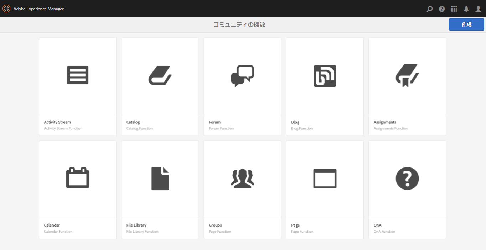

## 標準で提供される機能 {#pre-built-functions}

AEM Communities で提供される機能を以下で簡単に説明します。各機能には、コミュニティコンポーネントを含む 1 つ以上のAEMページが含まれます。このページは、 [コミュニティサイトテンプレート](/help/communities/sites.md).

コミュニティサイトテンプレートは、ログイン、ユーザープロファイル、通知、メッセージング、サイトメニュー、検索、テーマ、ブランディング機能など、コミュニティサイトの構造を定義します。

### タイトルと URL の設定 {#title-and-url-settings}

**タイトル**&#x200B;と **URL** は、すべてのコミュニティ機能に共通するプロパティです。

コミュニティ機能をコミュニティサイトテンプレートに追加するか、コミュニティサイトの構造を[変更](/help/communities/sites-console.md#modifying-site-properties)すると、その機能のダイアログが開き、タイトルと URL を設定できます。

#### 設定機能の詳細 {#configuration-function-details}

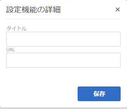

* **タイトル**

   (*必須*) サイトの機能のメニューに表示されるテキスト

* **URL**

   (*必須*) URI の生成に使用される名前。 名前は [命名規則](/help/sites-developing/naming-conventions.md) AEMと JCR によって課せられます。

例えば、[使用の手引き](/help/communities/getting-started.md)のチュートリアルに従って作成したサイトを使用し、

* タイトル = Web ページ
* URL = page

次に、ページの URL はhttps://localhost:4503/content/sites/engage/en/page.htmlです。

また、このページのメニューリンクは以下のように表示されます。

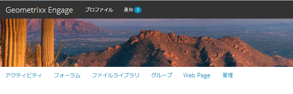

### アクティビティストリーム機能 {#activity-stream-function}

アクティビティストリーム機能は、選択されたすべてのビュー（すべてのアクティビティ、ユーザーアクティビティおよびフォロー）を備えた[アクティビティストリームコンポーネント](/help/communities/activities.md)を含むページです。関連トピック [Activity Stream Essentials](/help/communities/essentials-activities.md) 開発者向け

テンプレートに追加すると、次のダイアログが開きます。

#### 設定機能の詳細 {#configuration-function-details-1}

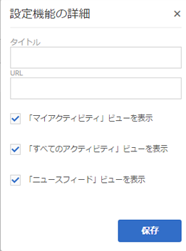

* [タイトルと URL の設定](#title-and-url-settings)

* **「マイアクティビティ」ビューを表示**

   選択した場合、アクティビティページにタブが表示され、現在のメンバーがコミュニティ内で生成したアクティビティに基づいてアクティビティをフィルタリングできます。 デフォルトで選択されています。

* **「すべてのアクティビティ」ビューを表示**

   選択した場合、アクティビティページにタブが表示され、現在のメンバーがアクセスできるコミュニティ内で生成されたすべてのアクティビティが含まれます。 デフォルトで選択されています。

* **「ニュースフィード」ビューを表示**

   選択した場合、アクティビティページには、現在のメンバーがフォローしているアクティビティに基づいてアクティビティをフィルタリングするタブが含まれます。 デフォルトで選択されています。

### 割り当て機能 {#assignments-function}

割り当て機能は、 [イネーブルメントのためのコミュニティサイト](/help/communities/overview.md#enablement-community). コミュニティメンバーにイネーブルメントリソースを割り当てることができます。 関連トピック [割り当ての基本事項](/help/communities/essentials-assignments.md) 開発者向け

この関数は、 [イネーブルメントアドオン](/help/communities/enablement.md). イネーブルメントアドオンを実稼動環境で使用するには、追加のライセンスが必要です。

テンプレートへの追加時には、[タイトルと URL 設定](#title-and-url-settings)のみを設定します。

### ブログ機能 {#blog-function}

ブログ機能は、タグ付け、ファイルのアップロード、フォロー、メンバー自身による編集、投票、モデレートに対応した[ブログコンポーネント](/help/communities/blog-feature.md)を含むページです。関連トピック [ブログの基本事項](/help/communities/blog-developer-basics.md) 開発者向け

テンプレートに追加すると、次のダイアログが開きます。

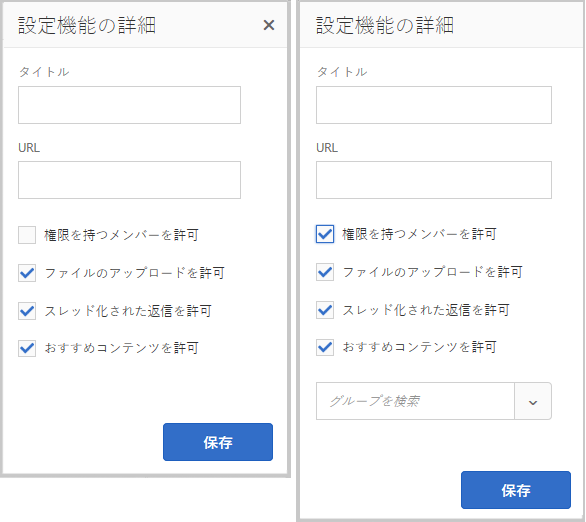

* [タイトルと URL の設定](#title-and-url-settings)

* **権限を持つメンバーを許可**

   選択した場合、ブログでは、権限を持つメンバーのみが記事を作成できます。作成するには、 [権限を持つメンバーグループ](/help/communities/users.md#privileged-members-group). 選択しない場合、すべてのコミュニティメンバーが作成できます。 デフォルト値はオフです。

* **ファイルのアップロードを許可**

   選択した場合、メンバーがファイルをアップロードする機能がブログに含まれます。 デフォルトで選択されています。

* **スレッド化された返信を許可**

   選択しない場合、ブログは記事に対する返信（コメント）を許可しますが、コメントに対する返信は許可されません。 デフォルトで選択されています。

* **おすすめコンテンツを許可**

   選択すると、ブログは次のように識別されます。 [おすすめコンテンツ](/help/communities/featured.md). デフォルトで選択されています。

### カレンダー機能 {#calendar-function}

カレンダー機能は、タグ付けに対応した[カレンダーコンポーネント](/help/communities/calendar.md)を含むページです。関連トピック [カレンダーの基本事項](/help/communities/calendar-basics-for-developers.md) 開発者向け

テンプレートに追加すると、次のダイアログが開きます。

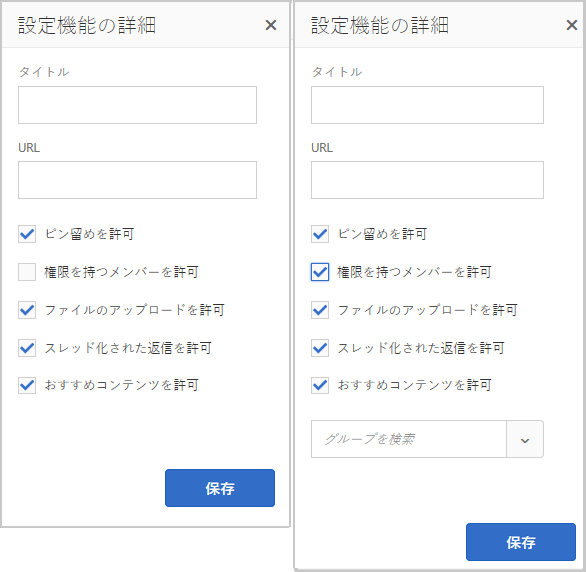

* [タイトルと URL の設定](#title-and-url-settings)

* **ピン留めを許可**

   選択した場合、フォーラムでは、トピックの返信をコメントのリストの先頭にピン留めできます。 デフォルトで選択されています。

* **権限を持つメンバーを許可**

   選択した場合、ブログでは、権限を持つメンバーのみが記事を作成できます。作成するには、 [権限を持つメンバーグループ](/help/communities/users.md#privileged-members-group). 選択しない場合、すべてのコミュニティメンバーが作成できます。 デフォルト値はオフです。

* **ファイルのアップロードを許可**

   選択した場合、メンバーがファイルをアップロードする機能がブログに含まれます。 デフォルトで選択されています。

* **スレッド化された返信を許可**

   選択しない場合、ブログは記事に対する返信（コメント）を許可しますが、コメントに対する返信は許可されません。 デフォルトで選択されています。

* **おすすめコンテンツを許可**

   選択すると、そのコンテンツは次のように識別されます。 [おすすめコンテンツ](/help/communities/featured.md). デフォルトで選択されています。

### カタログ機能 {#catalog-function}

カタログ機能を使用すると、 [実施可能コミュニティ](/help/communities/overview.md#enablement-community) メンバー：割り当てられていないイネーブルメントリソースを参照します。 詳しくは、 [イネーブルメントリソースのタグ付け](/help/communities/tag-resources.md) および [カタログの基本事項](/help/communities/catalog-developer-essentials.md) 開発者向け

コミュニティサイトのすべてのイネーブルメントリソースと学習パスが、プロパティの場合はすべてのカタログに表示されます。 ` [Show in Catalog](/help/communities/resources.md)`が true に設定されている場合、エラーは発生しません。 リソースと学習パスを明示的に含めるには、 [プリフィルター](/help/communities/catalog-developer-essentials.md#pre-filters) をカタログに追加します。

テンプレートに追加した場合、この設定により、サイト訪問者に表示されるタグフィルターの設定に使用されるタグ名前空間を指定できます。

* [タイトルと URL の設定](#title-and-url-settings)

* **すべての名前空間を選択**

   選択したタグ名前空間は、カタログに一覧表示されているイネーブルメントリソースのリストをフィルタリングするために、訪問者が選択できるタグを定義します。
選択した場合、コミュニティサイトで許可されているすべてのタグ名前空間を使用できます。
選択を解除すると、コミュニティサイトに許可されている 1 つ以上の名前空間を選択できます。
デフォルトで選択されています。

### おすすめコンテンツ機能 {#featured-content-function}

おすすめコンテンツ機能は、コメントの追加と削除に対応した[おすすめコンテンツコンポーネント](/help/communities/featured.md)を含むページです。

おすすめコンテンツの機能は、コンポーネントごとに許可または禁止することができます（[ブログ機能](#blog-function)、[カレンダー機能](#calendar-function)、[フォーラム機能](#forum-function)、[アイディエーション機能](#ideation-function)、[Q&amp;A 機能](#qna-function)を参照してください）。

テンプレートへの追加時には、[タイトルと URL 設定](#title-and-url-settings)のみを設定します。

### ファイルライブラリ機能 {#file-library-function}

ファイルライブラリ機能は、コメントの追加と削除に対応した[ファイルライブラリコンポーネント](/help/communities/file-library.md)を含むページです。

テンプレートへの追加時には、[タイトルと URL 設定](#title-and-url-settings)のみを設定します。

### フォーラム機能 {#forum-function}

フォーラム機能は、タグ付け、ファイルのアップロード、フォロー、メンバー自身による編集、投票、モデレートに対応した[フォーラムコンポーネント](/help/communities/forum.md)を含むページです。

テンプレートに追加すると、次のダイアログが開きます。

#### 設定機能の詳細 {#configuration-function-details-2}

* [タイトルと URL の設定](#title-and-url-settings)

* **ピン留めを許可**

   選択した場合、フォーラムでは、トピックの返信をコメントのリストの先頭にピン留めできます。 デフォルトで選択されています。

* **権限を持つメンバーを許可**

   選択すると、権限を持つメンバーのみがトピックを投稿できるようになります。 [権限を持つメンバーグループ](/help/communities/users.md#privileged-members-group). 選択しない場合、すべてのコミュニティメンバーが投稿できます。 デフォルト値はオフです。

* **ファイルのアップロードを許可**

   選択すると、メンバーがファイルをアップロードする機能もフォーラムに含まれます。 デフォルトで選択されています。

* **スレッド化された返信を許可**

   選択しない場合、フォーラムはトピックに対するコメントを許可しますが、それらのコメントに対する返信は許可されません。 デフォルトで選択されています。

* **おすすめコンテンツを許可**

   選択すると、コンポーネントのコンテンツは [おすすめコンテンツ](/help/communities/featured.md). デフォルトで選択されています。

### グループ機能 {#groups-function}

>[!CAUTION]
>
>グループ機能は、 *not* は *最初でも唯一でも* 機能をサイトの構造内、またはコミュニティサイトテンプレート内に組み込むことができます。
>
>他の機能（[ページ機能](#page-function)など）を含め、その機能を 1 番目にリストする必要があります。

グループ機能を使用すると、パブリッシュ環境でコミュニティメンバーがコミュニティサイト内にサブコミュニティを作成できます。

グループ機能を[コミュニティサイトテンプレート](/help/communities/sites.md)に含めるときの[設定](/help/communities/sites-console.md#groupmanagement)によって、グループを公開または非公開にしたり、1 つ以上のコミュニティグループテンプレートを設定しておいて、コミュニティグループを（パブリッシュ環境から）実際に作成するときにテンプレートを選択できるようにすることも可能です。A [コミュニティグループテンプレート](/help/communities/tools-groups.md) フォーラムやカレンダーなど、グループページ用に作成するコミュニティ機能を指定します。

コミュニティグループを作成すると、この新しいグループに対してメンバーグループが動的に作成され、メンバーの割り当てや追加ができるようになります。詳しくは、 [ユーザーとユーザーグループの管理](/help/communities/users.md).

Communities [機能パック 1](/help/communities/deploy-communities.md#latestfeaturepack) 以降では、コミュニティグループはオーサー環境で[コミュニティサイトのグループコンソール](/help/communities/groups.md)を使用して作成します。また、有効な場合はパブリッシュ環境でも作成できます。

テンプレートに追加すると、次のダイアログが開きます。

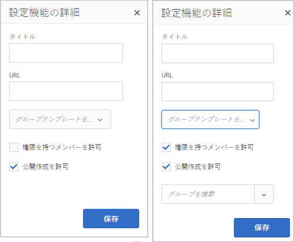

* [タイトルと URL の設定](#title-and-url-settings)

* **グループテンプレートを選択**

   （パブリッシュ環境で）新しいコミュニティグループの作成者が将来選択できる、1 つ以上の有効なグループテンプレートを選択できるドロップダウン。

* **権限を持つメンバーを許可**

   選択すると、権限を持つメンバーのみがトピックを投稿できるようになります。 [権限を持つメンバーのセキュリティグループ](/help/communities/users.md#privileged-members-group). 選択しない場合、すべてのコミュニティメンバーが投稿できます。 デフォルト値はオフです。

* **公開作成を許可**

   選択すると、権限を持つコミュニティメンバーはパブリッシュ環境でグループを作成できます。 選択を解除すると、新しいグループ（サブコミュニティ）は、コミュニティサイトのグループコンソールからオーサー環境でのみ作成できます。
デフォルトで選択されています。

### アイディエーション機能 {#ideation-function}

アイディエーション機能とは、[アイディエーションコンポーネント](/help/communities/ideation-feature.md)を 1 つ含むページです。

テンプレートに追加すると、次のダイアログが開きます。ここで、タイトルおよび URL 名のデフォルトと、テンプレートのデフォルト表示設定を指定します。

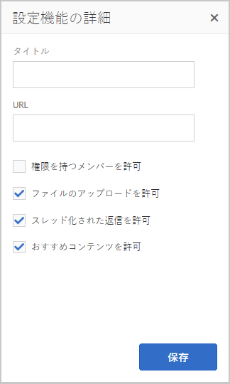

* [タイトルと URL の設定](#title-and-url-settings)

* **権限を持つメンバーを許可**

   選択すると、権限を持つメンバーのみがトピックを投稿できるようになります。 [権限を持つメンバーのセキュリティグループ](/help/communities/users.md#privileged-members-group). 選択しない場合、すべてのコミュニティメンバーが投稿できます。 デフォルト値はオフです。

* **ファイルのアップロードを許可**

   選択した場合、メンバーがファイルをアップロードする機能もアイデアに含まれます。 デフォルトで選択されています。

* **スレッド化された返信を許可**

   選択しない場合、アイデアはトピックに対する返信（コメント）を許可しますが、コメントに対する返信は許可されません。 デフォルトで選択されています。

* **おすすめコンテンツを許可**

   選択すると、そのコンテンツは次のように識別されます。 [おすすめコンテンツ](/help/communities/featured.md). デフォルトで選択されています。

### リーダーボード機能 {#leaderboard-function}

リーダーボード機能とは、[リーダーボーコンポーネント](/help/communities/enabling-leaderboard.md)を 1 つ含むページです。

**注意**:リーダーボードコンポーネントには、さらなる設定が必要です *後* コミュニティサイトは、リーダーボード機能を含むコミュニティテンプレートから作成されます。 リーダーボードコンポーネントの [ルール](/help/communities/enabling-leaderboard.md#rules-tab)（の設定に依存） [スコアとバッジ](/help/communities/implementing-scoring.md) コミュニティサイト用。

テンプレートに追加すると、次のダイアログが開きます。ここで、タイトルおよび URL 名のデフォルトと、テンプレートのデフォルト表示設定を指定します。

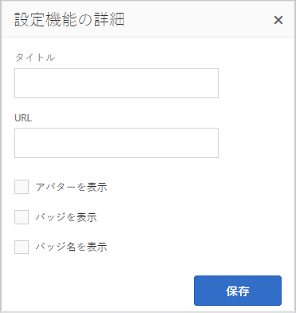

* [タイトルと URL の設定](#title-and-url-settings)

* **バッジを表示**

   選択すると、リーダーボードにバッジアイコンの列が表示されます。
デフォルト値はオフです。

* **バッジ名を表示**

   選択すると、リーダーボードにバッジ名の列が表示されます。
デフォルト値はオフです。

* **アバターを表示**

   選択した場合、メンバーのアバター画像がリーダーボードに含まれ、メンバーのプロファイルへの名前リンクの横に表示されます。
デフォルト値はオフです。

### ページ機能 {#page-function}

ページ機能を使用すると、ログイン、メニュー、通知、メッセージング、テーマ、ブランディングといったコミュニティサイトの機能が組み込まれた空白のページがコミュニティサイトに追加されます。コンテンツは、 [標準AEMオーサリングモード](/help/sites-authoring/editing-content.md).

テンプレートへの追加時には、[タイトルと URL 設定](#title-and-url-settings)のみを設定します。

### Q&amp;A 機能 {#qna-function}

Q&amp;A 機能は、タグ付け、ファイルのアップロード、フォロー、メンバー自身による編集、投票、モデレートに対応した [Q&amp;A コンポーネント](/help/communities/working-with-qna.md)を含むページです。

テンプレートへの追加時に、権限を持つメンバーだけが投稿できるような設定をすることができます。

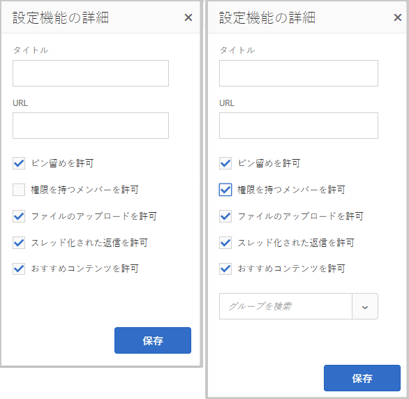

* [タイトルと URL の設定](#title-and-url-settings)

* **ピン留めを許可**

   選択した場合、フォーラムでは、トピックの返信をコメントのリストの先頭にピン留めできます。 デフォルトで選択されています。

* **権限を持つメンバーを許可**

   選択した場合、Q&amp;A フォーラムでは、権限を持つメンバーに対してのみ、 [権限を持つメンバーグループ](/help/communities/users.md#privileged-members-group). 選択しない場合、すべてのコミュニティメンバーが投稿できます。 デフォルト値はオフです。

* **ファイルのアップロードを許可**

   選択した場合、Q&amp;A フォーラムにはメンバーがファイルをアップロードする機能が含まれます。 デフォルトで選択されています。

* **スレッド化された返信を許可**

   選択しない場合、Q&amp;A フォーラムでは投稿された質問に対するコメント（回答）が許可されますが、回答に対する返信は許可されません。 デフォルトで選択されています。

* **おすすめコンテンツを許可**

   選択すると、そのコンテンツは次のように識別されます。 [おすすめコンテンツ](/help/communities/featured.md). デフォルトで選択されています。

## コミュニティ機能を作成 {#create-community-function}

コミュニティ機能を作成する機能には、 `Create Community Function` コミュニティ機能コンソールの上部にあるアイコン 同じAEMブループリントに基づく複数の関数を作成し、オーサー編集モードで開いて一意にカスタマイズできます。

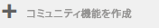

### コミュニティ機能名 {#community-function-name}

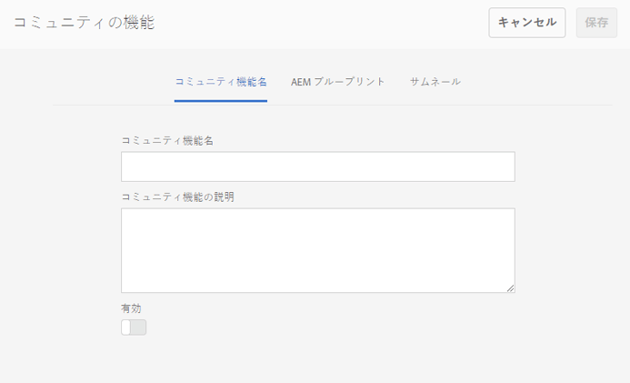

コミュニティ機能名パネルでは、機能の名前および説明と、機能を有効にするか無効にするかを設定します。

* **コミュニティ機能名**

   表示と保存に使用される関数名。

* **コミュニティ機能の説明**

   表示する関数の説明。

* **無効/有効**

   関数が参照可能かどうかを制御するトグルスイッチ。

### AEM ブループリント {#aem-blueprint}

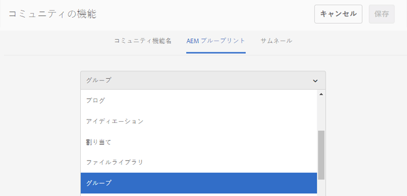

の `AEM Blueprint` パネルの場合は、コミュニティ機能の基盤となるブループリントを選択できます。

コミュニティ機能は、1 つ以上のページを含むミニサイトで、ログイン、ユーザープロファイル、通知、メッセージング、サイトメニュー、検索、テーマ設定、ブランディング機能など、コミュニティサイトに組み込むために事前に設定されています。 関数を作成した後は、次の操作を実行できます。 [関数を開く](#open-community-function) オーサー編集モードで、ページやコンポーネントの設定をカスタマイズします。

コミュニティ機能は [ライブコピー](/help/sites-administering/msm.md#live-copies) の [ブループリント](/help/sites-administering/msm-livecopy.md#creatingablueprint)を使用すると、関数に対して行われた変更をロールアウトできます。この変更は、 [コミュニティサイトテンプレート](/help/communities/sites.md) または [コミュニティグループテンプレート](/help/communities/tools-groups.md) 関数を含む ページを親ブループリントと関連付け解除して、ページレベルで変更することもできます。

[マルチサイトマネージャー](/help/sites-administering/msm.md)も参照してください。

### サムネール {#thumbnail}

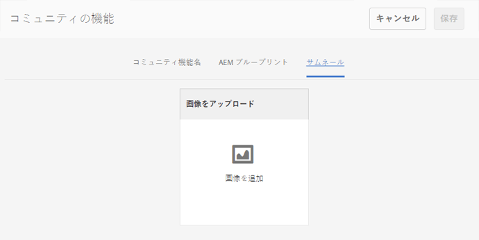

サムネールパネルでは、[コミュニティ機能コンソール](#community-functions-console)に表示する画像をアップロードできます。

## コミュニティ機能を開く {#open-community-function}

を選択します。 `Open Community Function` ページコンテンツをオーサリングし、機能コンポーネントの設定を変更するためのオーサー編集モードに入るアイコン。

### コンポーネントの設定 {#configuring-components}

コミュニティ機能は、AEM ブループリントのライブコピーとして実装されます（ライブコピーについては[マルチサイトマネージャー](/help/sites-administering/msm.md)を参照）。

ページコンテンツのオーサリングだけでなく、コンポーネントの設定をすることもできます。

作成したコミュニティサイトのページでコンポーネントを設定する場合は、キャンセルが必要になる場合があります [継承](/help/sites-administering/msm-livecopy.md#changing-live-copy-content) コンポーネントを設定する場合。 設定が完了したら、継承を再確立する必要があります。

設定について詳しくは、作成者向けの[コミュニティコンポーネント](/help/communities/author-communities.md)を参照してください。

## コミュニティ機能を編集 {#edit-community-function}

を選択します。 `Edit Community Function` アイコンをクリックし、 [コミュニティ機能の作成](#create-community-function)（関数の有効化または無効化を含む）
