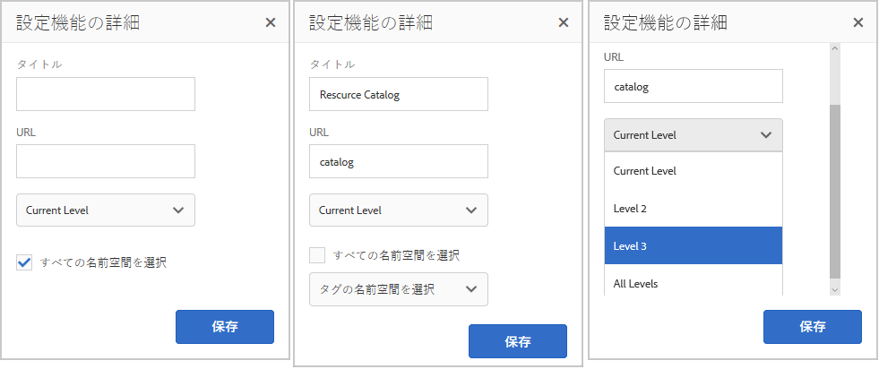
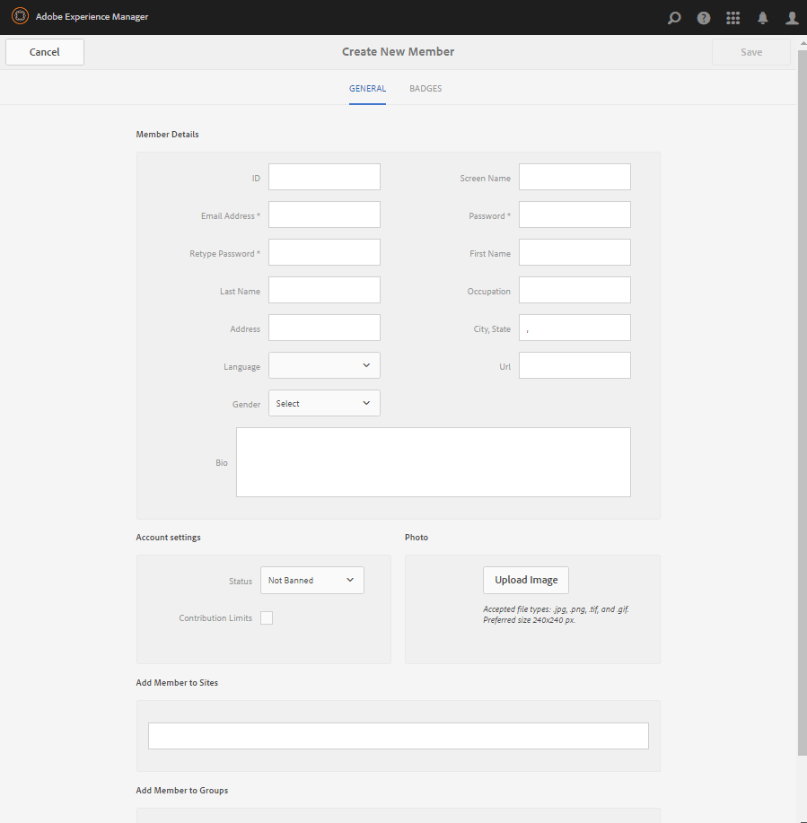

# コミュニティ機能{#community-functions}

コミュニティに必要とされる機能の種類はだいたい決まっています。コミュニティ機能はコミュニティ機能として使用できます。 基本的には、コミュニティ機能を実装するために事前に配線された1つ以上のページで、作成者モードでページにコンポーネントを追加する以外にも必要です。 They are the building blocks used to define the structure of a [community site template](/help/communities/sites.md) from which community sites are [created](/help/communities/sites-console.md).

Once a community site is created, content may be added to the resulting pages using the standard [AEM authoring mode](/help/sites-authoring/editing-content.md). コミュニティ機能コンソールには、様々なコミュニティ機能が表示されます。

>[!NOTE]
>
>The consoles for the creation of [community sites](/help/communities/sites-console.md), [community site templates](/help/communities/sites.md), [community group templates](/help/communities/tools-groups.md), and [community functions](/help/communities/functions.md) are for use only in the author environment.

## Community Functions Console {#community-functions-console}

作成者環境で、コミュニティ機能コンソールにアクセスするには：

* From global navigation: **[!UICONTROL Tools]** > **[!UICONTROL Communities]** > **[!UICONTROL Community Functions]**.

## 標準で提供される機能 {#pre-built-functions}

AEM Communities で提供される機能を以下で簡単に説明します。Each function includes one or more AEM pages containing Communities components wired together into a feature that is easily incorporated into a [community site template](/help/communities/sites.md).

コミュニティサイトテンプレートは、ログイン、ユーザープロファイル、通知、メッセージング、サイトメニュー、検索、テーマ、ブランディング機能など、コミュニティサイトの構造を定義します。

### タイトルと URL の設定 {#title-and-url-settings}

**タイトル**および**URL **は、すべてのコミュニティ機能に共通のプロパティです。

コミュニティ機能をコミュニティサイトテンプレートに追加するか、コミュニティサイトの構造を[変更](/help/communities/sites-console.md#modifying-site-properties)すると、その機能のダイアログが開き、タイトルと URL を設定できます。

#### 設定機能の詳細 {#configuration-function-details}

* **タイトル**

   (*Required*) The text which appears in the menu of features for the site

* **URL**

   (*Required*) The name used to generate the URI. The name must conform to the [naming conventions](/help/sites-developing/naming-conventions.md) imposed by AEM and JCR.

例えば、[使用の手引き](/help/communities/getting-started.md)のチュートリアルに従って作成したサイトを使用し、

* タイトル = Web ページ
* URL = page

次に、ページのURLはhttps://localhost:4503/content/sites/engage/en/page.htmlです。

また、このページのメニューリンクは以下のように表示されます。

### アクティビティストリーム機能 {#activity-stream-function}

アクティビティストリーム機能は、選択されたすべてのビュー（すべてのアクティビティ、ユーザーアクティビティおよびフォロー）を備えた[アクティビティストリームコンポーネント](/help/communities/activities.md)を含むページです。See also [Activity Stream Essentials](/help/communities/essentials-activities.md) for developers.

テンプレートに追加すると、次のダイアログが開きます。

#### 設定機能の詳細 {#configuration-function-details-1}

* [Title and URL Settings](#title-and-url-settings)

* **「マイアクティビティ」ビューを表示**

   選択すると、[アクティビティ]ページに、現在のメンバーによってコミュニティ内で生成されたアクティビティに基づいてフィルターを行うタブが表示されます。 デフォルトで選択されています。

* **「すべてのアクティビティ」ビューを表示**

   選択すると、[アクティビティ]ページにタブが表示され、現在のアクティビティがアクセス権を持つコミュニティ内で生成されたすべてのメンバーが含まれます。 デフォルトで選択されています。

* **「ニュースフィード」ビューを表示**

   選択した場合、アクティビティページには、現在のメンバーがフォローしているフィルターに基づいてアクティビティを行うタブが含まれます。 デフォルトで選択されています。

### 割り当て機能 {#assignments-function}

The assignments function is the basic feature which defines a [community site for enablement](/help/communities/overview.md#enablement-community). コミュニティのメンバーに対してイネーブルメントリソースを割り当てることができます。 See also [Assignments Essentials](/help/communities/essentials-assignments.md) for developers.

This function is available as a feature of the [enablement add-on](/help/communities/enablement.md). 有効化アドオンは、実稼働環境での使用に追加のライセンスが必要です。環境

テンプレートへの追加時には、[タイトルと URL 設定](#title-and-url-settings)のみを設定します。

### ブログ機能 {#blog-function}

ブログ機能は、タグ付け、ファイルのアップロード、フォロー、メンバー自身による編集、投票、モデレートに対応した[ブログコンポーネント](/help/communities/blog-feature.md)を含むページです。See also [Blog Essentials](/help/communities/blog-developer-basics.md) for developers.

テンプレートに追加すると、次のダイアログが開きます。

* [Title and URL Settings](#title-and-url-settings)

* **権限を持つメンバーを許可**

   選択した場合、ブログでは、権限を持つメンバーの選択を許可することで、権限を持つメンバーの記事の作 [成のみが許可されま](/help/communities/users.md#privileged-members-group)す。 選択しない場合、すべてのコミュニティメンバーが作成できます。 デフォルト値はオフです。

* **ファイルのアップロードを許可**

   選択すると、メンバーがファイルをアップロードする機能がブログに含まれます。 デフォルトで選択されています。

* **スレッド化された返信を許可**

   選択しなかった場合、ブログは記事への返信（コメント）を許可しますが、コメントへの返信は許可されません。 デフォルトで選択されています。

* **おすすめコンテンツを許可**

   選択した場合、ブログは特集コンテンツとして識 [別されます](/help/communities/featured.md)。 デフォルトで選択されています。

### カレンダー機能 {#calendar-function}

カレンダー機能は、タグ付けに対応した[カレンダーコンポーネント](/help/communities/calendar.md)を含むページです。See also [Calendar Essentials](/help/communities/calendar-basics-for-developers.md) for developers.

テンプレートに追加すると、次のダイアログが開きます。

* [Title and URL Settings](#title-and-url-settings)

* **ピン留めを許可**

   選択すると、トピックの返信をコメントのリストの先頭に固定できます。 デフォルトで選択されています。

* **権限を持つメンバーを許可**

   選択した場合、ブログでは、権限を持つメンバーの選択を許可することで、権限を持つメンバーの記事の作 [成のみが許可されま](/help/communities/users.md#privileged-members-group)す。 選択しない場合、すべてのコミュニティメンバーが作成できます。 デフォルト値はオフです。

* **ファイルのアップロードを許可**

   選択すると、メンバーがファイルをアップロードする機能がブログに含まれます。 デフォルトで選択されています。

* **スレッド化された返信を許可**

   選択しなかった場合、ブログは記事への返信（コメント）を許可しますが、コメントへの返信は許可されません。 デフォルトで選択されています。

* **おすすめコンテンツを許可**

   選択すると、そのコンテンツは重点コンテンツとし [て識別されま](/help/communities/featured.md)す。 デフォルトで選択されています。

### カタログ機能 {#catalog-function}

The catalog function provides the ability for [enablement community](/help/communities/overview.md#enablement-community) members to browse enablement resources which are not assigned to them. See [Tagging Enablement Resources](/help/communities/tag-resources.md) and [Catalog Essentials](/help/communities/catalog-developer-essentials.md) for developers.

All enablement resources and learning paths for the community site shows in all catalogs if their property, ` [Show in Catalog](/help/communities/resources.md)`, is set to true. To explicitly include resources and learning paths, it is necessary to apply a [pre-filter](/help/communities/catalog-developer-essentials.md#pre-filters) to the catalog.

テンプレートに追加した場合、この設定により、サイト訪問者に表示されるタグフィルターの設定に使用されるタグ名前空間を指定できます。

* [Title and URL Settings](#title-and-url-settings)

* **すべての名前空間を選択**

   選択したタグ名前空間は、カタログにリストされているイネーブルメントリソースのリストをフィルタリングする訪問者によって、選択可能なタグを定義します。
選択すると、コミュニティサイトに対して許可されているすべてのタグ名前空間が使用可能になります。
選択しない場合、コミュニティサイトで許可する1つ以上の名前空間を選択できます。
デフォルトで選択されています。

### おすすめコンテンツ機能 {#featured-content-function}

おすすめコンテンツ機能は、コメントの追加と削除に対応した[おすすめコンテンツコンポーネント](/help/communities/featured.md)を含むページです。

おすすめコンテンツの機能は、コンポーネントごとに許可または禁止することができます（[ブログ機能](#blog-function)、[カレンダー機能](#calendar-function)、[フォーラム機能](#forum-function)、[アイディエーション機能](#ideation-function)、[Q&amp;A 機能](#qna-function)を参照してください）。

テンプレートへの追加時には、[タイトルと URL 設定](#title-and-url-settings)のみを設定します。

### ファイルライブラリ機能 {#file-library-function}

ファイルライブラリ機能は、コメントの追加と削除に対応した[ファイルライブラリコンポーネント](/help/communities/file-library.md)を含むページです。

テンプレートへの追加時には、[タイトルと URL 設定](#title-and-url-settings)のみを設定します。

### フォーラム機能 {#forum-function}

フォーラム機能は、タグ付け、ファイルのアップロード、フォロー、メンバー自身による編集、投票、モデレートに対応した[フォーラムコンポーネント](/help/communities/forum.md)を含むページです。

テンプレートに追加すると、次のダイアログが開きます。

#### 設定機能の詳細 {#configuration-function-details-2}

* [Title and URL Settings](#title-and-url-settings)

* **ピン留めを許可**

   選択すると、トピックの返信をコメントのリストの先頭に固定できます。 デフォルトで選択されています。

* **権限を持つメンバーを許可**

   選択した場合、フォーラムでは、権限を持つメンバーの選択を許可して、権限を持つメンバーのトピックの投稿のみ [が許可されま](/help/communities/users.md#privileged-members-group)す。 選択しない場合、すべてのコミュニティメンバーが投稿を許可されます。 デフォルト値はオフです。

* **ファイルのアップロードを許可**

   選択すると、メンバーがファイルをアップロードする機能がフォーラムに含まれます。 デフォルトで選択されています。

* **スレッド化された返信を許可**

   選択しなかった場合、フォーラムではトピックに対するコメントは許可されますが、これらのコメントに対する返信は許可されません。 デフォルトで選択されています。

* **おすすめコンテンツを許可**

   選択した場合、コンポーネントのコンテンツは重点コンテンツとし [て識別されま](/help/communities/featured.md)す。 デフォルトで選択されています。

### グループ機能 {#groups-function}

>[!CAUTION]
>
>The groups function must *not *be the *first nor the only* function in a site&#39;s structure or in a community site template.
>
>他の機能（[ページ機能](#page-function)など）を含め、その機能を 1 番目にリストする必要があります。

グループ機能を使用すると、パブリッシュ環境でコミュニティメンバーがコミュニティサイト内にサブコミュニティを作成できます。

グループ機能を[コミュニティサイトテンプレート](/help/communities/sites.md)に含めるときの[設定](/help/communities/sites-console.md#groupmanagement)によって、グループを公開または非公開にしたり、1 つ以上のコミュニティグループテンプレートを設定しておいて、コミュニティグループを（パブリッシュ環境から）実際に作成するときにテンプレートを選択できるようにすることも可能です。A [community group template](/help/communities/tools-groups.md) specifies which Communities features are created for the group pages, such as forums and calendars.

コミュニティグループを作成すると、この新しいグループに対してメンバーグループが動的に作成され、メンバーの割り当てや追加ができるようになります。For more information, see [Managing Users and User Groups](/help/communities/users.md).

Communities [機能パック 1](/help/communities/deploy-communities.md#latestfeaturepack) 以降では、コミュニティグループはオーサー環境で[コミュニティサイトのグループコンソール](/help/communities/groups.md)を使用して作成します。また、有効な場合はパブリッシュ環境でも作成できます。

テンプレートに追加すると、次のダイアログが開きます。

* [Title and URL Settings](#title-and-url-settings)

* **グループテンプレートを選択**

   (公開環境で)新しいコミュニティグループの作成者が選択できる、1つ以上の有効なグループテンプレートの選択を可能にするドロップダウン。

* **権限を持つメンバーを許可**

   選択した場合、フォーラムでは、権限を持つメンバーのセキュリティ・グループの選択を許可して、権限を持つメンバーの [トピックの投稿のみが許可されま](/help/communities/users.md#privileged-members-group)す。 選択しない場合、すべてのコミュニティメンバーが投稿を許可されます。 デフォルト値はオフです。

* **公開作成を許可**

   選択すると、許可されたコミュニティメンバーは、公開コミュニティでグループを作成できます。環境 選択しない場合、新しいグループ（サブコミュニティ）は、Communities Sites Groupsコンソールから作成者環境でのみ作成できます。
デフォルトで選択されています。

### アイディエーション機能 {#ideation-function}

アイディエーション機能とは、[アイディエーションコンポーネント](/help/communities/ideation-feature.md)を 1 つ含むページです。

テンプレートに追加すると、次のダイアログが開きます。ここで、タイトルおよび URL 名のデフォルトと、テンプレートのデフォルト表示設定を指定します。

* [Title and URL Settings](#title-and-url-settings)

* **権限を持つメンバーを許可**

   選択した場合、フォーラムでは、権限を持つメンバーのセキュリティ・グループの選択を許可して、権限を持つメンバーの [トピックの投稿のみが許可されま](/help/communities/users.md#privileged-members-group)す。 選択しない場合、すべてのコミュニティメンバーが投稿を許可されます。 デフォルト値はオフです。

* **ファイルのアップロードを許可**

   選択すると、メンバーがファイルをアップロードする機能がアイデアに含まれます。 デフォルトで選択されています。

* **スレッド化された返信を許可**

   選択しなかった場合、アイデアはトピックへの返信（コメント）を許可しますが、コメントへの返信は許可されません。 デフォルトで選択されています。

* **おすすめコンテンツを許可**

   選択すると、そのコンテンツは重点コンテンツとし [て識別されま](/help/communities/featured.md)す。 デフォルトで選択されています。

### リーダーボード機能 {#leaderboard-function}

リーダーボード機能とは、[リーダーボーコンポーネント](/help/communities/enabling-leaderboard.md)を 1 つ含むページです。

**注**:リーダーボードコンポーネントは、リーダ *ーボード機能を含む* 、コミュニティテンプレートからコミュニティサイトを作成した後に、さらに設定する必要があります。 リーダーボードコンポーネントのル [ールを指定します](/help/communities/enabling-leaderboard.md#rules-tab)。これは、コミュニティサイトのスコ [アリングとバッジの設定に依存します](/help/communities/implementing-scoring.md) 。

テンプレートに追加すると、次のダイアログが開きます。ここで、タイトルおよび URL 名のデフォルトと、テンプレートのデフォルト表示設定を指定します。

* [Title and URL Settings](#title-and-url-settings)

* **バッジを表示**

   選択すると、バッジアイコンの列がリーダーボードに含まれます。
デフォルト値はオフです。

* **バッジ名を表示**

   選択すると、バッジ名の列がリーダーボードに含まれます。
デフォルト値はオフです。

* **アバターを表示**

   選択すると、メンバーのアバター画像がリーダーボードに含まれ、メンバーのアバター画像はメンバーのプロファイルへの名前リンクの横に表示されます。
デフォルト値はオフです。

### ページ機能 {#page-function}

ページ機能を使用すると、ログイン、メニュー、通知、メッセージング、テーマ、ブランディングといったコミュニティサイトの機能が組み込まれた空白のページがコミュニティサイトに追加されます。Content is added to the page using the [standard AEM authoring mode](/help/sites-authoring/editing-content.md).

テンプレートへの追加時には、[タイトルと URL 設定](#title-and-url-settings)のみを設定します。

### Q&amp;A 機能 {#qna-function}

Q&amp;A 機能は、タグ付け、ファイルのアップロード、フォロー、メンバー自身による編集、投票、モデレートに対応した [Q&amp;A コンポーネント](/help/communities/working-with-qna.md)を含むページです。

テンプレートへの追加時に、権限を持つメンバーだけが投稿できるような設定をすることができます。

* [Title and URL Settings](#title-and-url-settings)

* **ピン留めを許可**

   選択すると、トピックの返信をコメントのリストの先頭に固定できます。 デフォルトで選択されています。

* **権限を持つメンバーを許可**

   選択した場合、QnAフォーラムでは、権限を持つメンバーグループの選択を許可することで、権限を持つメンバーに対してのみ質 [問の投稿が許可されま](/help/communities/users.md#privileged-members-group)す。 選択しない場合、すべてのコミュニティメンバーが投稿を許可されます。 デフォルト値はオフです。

* **ファイルのアップロードを許可**

   選択した場合、QnAフォーラムにはメンバーがファイルをアップロードする機能が含まれます。 デフォルトで選択されています。

* **スレッド化された返信を許可**

   選択しなかった場合、QnAフォーラムでは投稿された質問に対するコメント（回答）は許可されますが、回答への返信は許可されません。 デフォルトで選択されています。

* **おすすめコンテンツを許可**

   選択すると、そのコンテンツは重点コンテンツとし [て識別されま](/help/communities/featured.md)す。 デフォルトで選択されています。

## Create Community Function {#create-community-function}

The ability to create a community function is reached by selecting the `Create Community Function` icon located at the top of the Community Functions console. 同じAEM Blueprintに基づく複数の関数を作成し、作成者編集モードで開くことで独自にカスタマイズできます。

### コミュニティ機能名 {#community-function-name}

コミュニティ機能名パネルでは、機能の名前および説明と、機能を有効にするか無効にするかを設定します。

* **コミュニティ機能名**

   表示とストレージ

* **コミュニティ機能の説明**

   表示する関数の説明。

* **無効/有効**

   関数が参照可能かどうかを制御するトグルスイッチ。

### AEM ブループリント {#aem-blueprint}

On the `AEM Blueprint` panel, it is possible to select the blueprint which is the underlying implementation of the community function.

コミュニティ機能は、1つ以上のページを含むミニサイトで、ログイン、ユーザプロファイル、通知、メッセージング、サイトメニュー、検索、テーマ設定、ブランディング機能など、コミュニティサイトに組み込むために事前に準備されています。 Once the function is created, it is possible to [open the function](#open-community-function) in author edit mode and customize the page or component settings.

Since the community function is implemented as a [live copy](/help/sites-administering/msm.md#live-copies) of a [blueprint](/help/sites-administering/msm-livecopy.md#creatingablueprint), it is possible to rollout changes made to a function which affects all community site pages created from the [community site template](/help/communities/sites.md) or [community group template](/help/communities/tools-groups.md) that included the function. また、ページレベルの変更を行うために、親のBluePrintからページの関連付けを解除することもできます。

[マルチサイトマネージャー](/help/sites-administering/msm.md)も参照してください。

### サムネール {#thumbnail}

サムネールパネルでは、[コミュニティ機能コンソール](#community-functions-console)に表示する画像をアップロードできます。

## コミュニティ機能を開く {#open-community-function}

Select the `Open Community Function` icon to enter author edit mode for authoring the page content and modifying the configuration of the feature component(s).

### コンポーネントの設定 {#configuring-components}

コミュニティ機能は、AEM ブループリントのライブコピーとして実装されます（ライブコピーについては[マルチサイトマネージャー](/help/sites-administering/msm.md)を参照）。

ページコンテンツのオーサリングだけでなく、コンポーネントの設定をすることもできます。

If configuring a component on a page of a created community site, it may be necessary to cancel [inheritance](/help/sites-administering/msm-livecopy.md#changing-live-copy-content) to configure the component. 設定が完了したら、継承を再確立する必要があります。

設定について詳しくは、作成者向けの[コミュニティコンポーネント](/help/communities/author-communities.md)を参照してください。

## コミュニティ機能を編集 {#edit-community-function}

Select the `Edit Community Function` icon to edit the function&#39;s properties using the same panels as [creating a community function](#create-community-function), including enabling or disabling the function.
