# コミュニティ機能{#community-functions}

コミュニティ体験に期待される機能の種類は周知の事実です。 コミュニティ機能は、コミュニティ機能として使用できます。 基本的には、コミュニティ機能を実装するために事前に接続された1つ以上のページで、オーサーモードでページにコンポーネントを追加するだけでは不十分です。 これらは、コミュニティサイトが[作成](/help/communities/sites-console.md)される[ コミュニティサイトテンプレート ](/help/communities/sites.md)の構造を定義するために使用される構成要素です。

コミュニティサイトを作成したら、標準の[AEM オーサリングモード ](/help/sites-authoring/editing-content.md)を使用して、作成されたページにコンテンツを追加できます。 コミュニティ関数コンソールに表示されているように、様々なコミュニティ関数を使用できます。

>[!NOTE]
>
>[ コミュニティサイト ](/help/communities/sites-console.md)、[ コミュニティサイトテンプレート ](/help/communities/sites.md)、[ コミュニティグループテンプレート ](/help/communities/tools-groups.md)、[ コミュニティ関数](/help/communities/functions.md)の作成用コンソールは、オーサー環境でのみ使用できます。

## Community Functions Console {#community-functions-console}

オーサー環境でコミュニティ関数コンソールにアクセスするには、次の手順を実行します。

* **[!UICONTROL ツール]** > **[!UICONTROL コミュニティ]** > **[!UICONTROL コミュニティ関数]**&#x200B;に移動します。

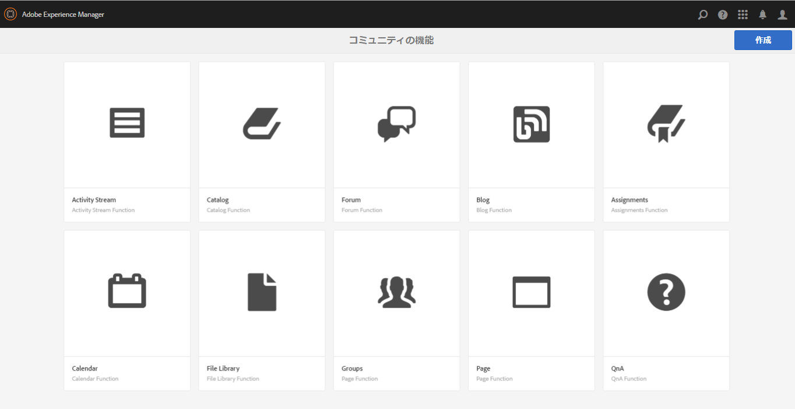

## 事前定義済みの関数 {#pre-built-functions}

以下に、AEM Communitiesで提供される機能の簡単な説明を示します。 各関数には、Communities コンポーネントを含む1つ以上のAEM ページが含まれており、これらは[ コミュニティサイトテンプレート ](/help/communities/sites.md)に簡単に組み込まれる機能に接続されています。

コミュニティサイトテンプレートは、ログイン、ユーザープロファイル、通知、メッセージ、サイトメニュー、検索、テーマ、ブランディング機能など、コミュニティサイトの構造を提供します。

### タイトルとURL設定 {#title-and-url-settings}

**タイトル**&#x200B;と&#x200B;**URL**&#x200B;は、すべてのコミュニティ関数に共通のプロパティです。

コミュニティサイトのテンプレートにコミュニティ関数を追加するか、コミュニティサイトの構造を[変更](/help/communities/sites-console.md#modifying-site-properties)するときに追加すると、関数のダイアログが開き、タイトルとURLを設定できます。

#### 設定機能の詳細 {#configuration-function-details}

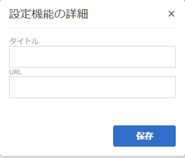

* **タイトル**

  （*必須*） サイトの機能のメニューに表示されるテキスト

* **URL**

  （*必須*） URIの生成に使用される名前。 名前は、AEMとJCRによって課される[命名規則](/help/sites-developing/naming-conventions.md)に準拠している必要があります。

例えば、[はじめに](/help/communities/getting-started.md) チュートリアルに従って作成したサイトを使用します。次の場合は、

* タイトル = Web ページ
* URL = ページ

次に、ページのURLはhttps://localhost:4503/content/sites/engage/en/page.htmlです

ページのメニューリンクは次のように表示されます。

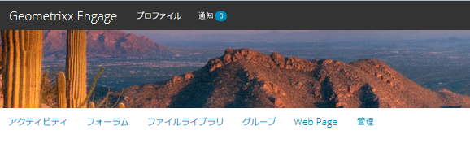

### アクティビティストリーム機能 {#activity-stream-function}

アクティビティストリーム関数は、[ アクティビティストリームコンポーネント ](/help/communities/activities.md)を持つページで、すべてのビュー（すべてのアクティビティ、ユーザーアクティビティ、その後）が選択されています。 開発者については、[Activity Stream Essentials](/help/communities/essentials-activities.md)も参照してください。

テンプレートに追加すると、次のダイアログが開きます。

#### 設定機能の詳細 {#configuration-function-details-1}

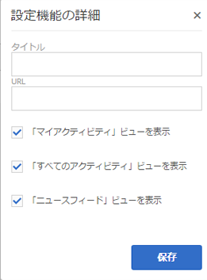

* [タイトルとURL設定](#title-and-url-settings)

* **自分のアクティビティの表示**&#x200B;を表示

  選択した場合、「アクティビティ」ページには、現在のメンバーがコミュニティ内で生成したアクティビティに基づいてアクティビティをフィルタリングするタブが含まれます。 デフォルトが選択されています。

* **すべてのアクティビティの表示**

  選択した場合、「アクティビティ」ページには、現在のメンバーがアクセスできるコミュニティ内で生成されたすべてのアクティビティが含まれるタブが含まれます。 デフォルトが選択されています。

* **「ニュースフィード」表示**&#x200B;を表示

  選択した場合、「アクティビティ」ページには、現在のメンバーがフォローしているアクティビティに基づいてアクティビティをフィルタリングするタブが含まれます。 デフォルトが選択されています。

### ブログ機能 {#blog-function}

ブログ関数は、タグ付け、ファイルのアップロード、フォロー、メンバーの自己編集、投票、モデレーション用に設定された[ ブログコンポーネント ](/help/communities/blog-feature.md)を持つページです。 開発者向け[Blog Essentials](/help/communities/blog-developer-basics.md)も参照してください。

テンプレートに追加すると、次のダイアログが開きます。

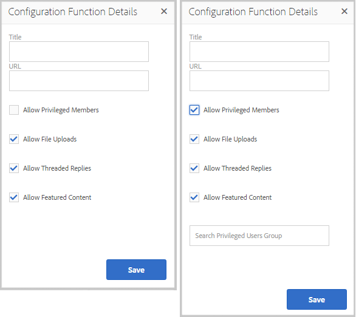

* [タイトルとURL設定](#title-and-url-settings)

* **特権メンバーを許可**

  選択した場合、ブログでは、[特権メンバーグループ ](/help/communities/users.md#privileged-members-group)の選択を許可することによって、特権メンバーのみが記事を作成できます。 選択しない場合は、すべてのコミュニティメンバーが作成できます。 デフォルトの選択は解除されます。

* **ファイルのアップロードを許可**

  選択した場合、このブログには、メンバーがファイルをアップロードする機能が含まれます。 デフォルトが選択されています。

* **スレッド返信を許可**

  選択しない場合、ブログでは記事への返信（コメント）は許可されますが、コメントへの返信は許可されません。 デフォルトが選択されています。

* **おすすめのコンテンツを許可**

  選択すると、ブログは[おすすめコンテンツ ](/help/communities/featured.md)として識別されます。 デフォルトが選択されています。

### カレンダー機能 {#calendar-function}

カレンダー関数は、[ カレンダーコンポーネント ](/help/communities/calendar.md)がタグ付けを許可するように設定されたページです。 開発者については、[Calendar Essentials](/help/communities/calendar-basics-for-developers.md)も参照してください。

テンプレートに追加すると、次のダイアログが開きます。

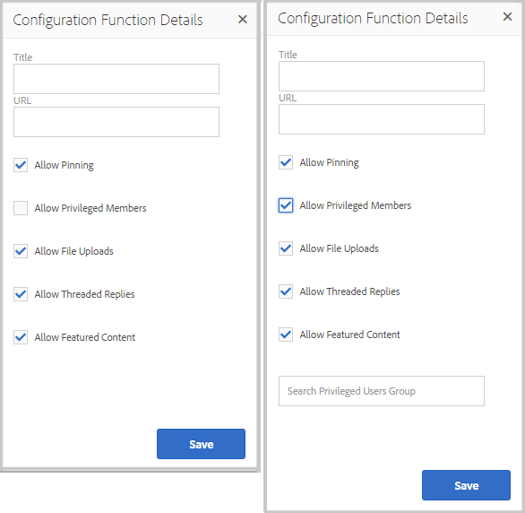

* [タイトルとURL設定](#title-and-url-settings)

* **ピン留めを許可**

  選択した場合、フォーラムでは、トピックの返信をコメントのリストの先頭に固定できます。 デフォルトが選択されています。

* **特権メンバーを許可**

  選択した場合、ブログでは、[特権メンバーグループ ](/help/communities/users.md#privileged-members-group)の選択を許可することによって、特権メンバーのみが記事を作成できます。 選択しない場合は、すべてのコミュニティメンバーが作成できます。 デフォルトの選択は解除されます。

* **ファイルのアップロードを許可**

  選択した場合、このブログには、メンバーがファイルをアップロードする機能が含まれます。 デフォルトが選択されています。

* **スレッド返信を許可**

  選択しない場合、ブログでは記事への返信（コメント）は許可されますが、コメントへの返信は許可されません。 デフォルトが選択されています。

* **おすすめのコンテンツを許可**

  選択すると、そのコンテンツは[おすすめコンテンツ ](/help/communities/featured.md)として識別されます。 デフォルトが選択されています。

### おすすめのコンテンツ機能 {#featured-content-function}

おすすめコンテンツ関数は、コメントの追加と削除を許可するように[おすすめコンテンツコンポーネント ](/help/communities/featured.md)が設定されたページです。

コンテンツを機能させる機能は、コンポーネントごとに許可または禁止される場合があります（[ ブログ機能](#blog-function)、[ カレンダー機能](#calendar-function)、[ フォーラム機能](#forum-function)、[ アイデア出し機能](#ideation-function)、および[QnA機能](#qna-function)を参照）。

テンプレートに追加する場合、設定は[ タイトルとURL設定](#title-and-url-settings)のみです。

### ファイルライブラリ機能 {#file-library-function}

ファイルライブラリ関数は、[ ファイルライブラリコンポーネント ](/help/communities/file-library.md)が設定されたページで、コメントの追加と削除が可能です。

テンプレートに追加する場合、設定は[ タイトルとURL設定](#title-and-url-settings)のみです。

### フォーラム機能 {#forum-function}

フォーラム関数は、タグ付け、ファイルのアップロード、フォロー、メンバーの自己編集、投票、モデレーション用に設定された[ フォーラムコンポーネント ](/help/communities/forum.md)を持つページです。

テンプレートに追加すると、次のダイアログが開きます。

#### 設定機能の詳細 {#configuration-function-details-2}

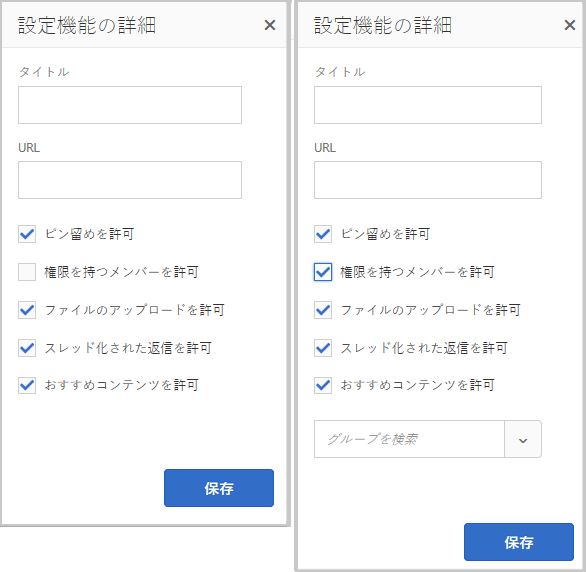

* [タイトルとURL設定](#title-and-url-settings)

* **ピン留めを許可**

  選択した場合、フォーラムでは、トピックの返信をコメントのリストの先頭に固定できます。 デフォルトが選択されています。

* **特権メンバーを許可**

  選択した場合、フォーラムでは、[特権メンバーグループ ](/help/communities/users.md#privileged-members-group)の選択を許可することによって、特権メンバーのみがトピックを投稿できます。 選択しない場合は、すべてのコミュニティメンバーが投稿できます。 デフォルトの選択は解除されます。

* **ファイルのアップロードを許可**

  選択した場合、フォーラムには、メンバーがファイルをアップロードする機能が含まれます。 デフォルトが選択されています。

* **スレッド返信を許可**

  選択しない場合、フォーラムはトピックに対するコメントを許可しますが、それらのコメントに対する返信は許可されません。 デフォルトが選択されています。

* **おすすめのコンテンツを許可**

  選択すると、コンポーネントのコンテンツは[おすすめコンテンツ ](/help/communities/featured.md)として識別されます。 デフォルトが選択されています。

### Groups関数 {#groups-function}

>[!CAUTION]
>
>グループ関数&#x200B;*not*&#x200B;は、サイトの構造またはコミュニティ サイト テンプレート内の&#x200B;*firstまたはonly*&#x200B;関数である必要があります。
>
>[ ページ関数](#page-function)などの他の関数を最初に含めてリストする必要があります。

グループ関数は、パブリッシュ環境でコミュニティサイト内にサブコミュニティを作成する機能をコミュニティメンバーに提供します。

グループ関数が[ コミュニティサイトテンプレート ](/help/communities/sites.md)に含まれている場合、[設定](/help/communities/sites-console.md#groupmanagement)に応じて、グループはパブリックまたはプライベートにでき、コミュニティグループが実際に作成されたときにテンプレートの選択肢を提供するように1つ以上のコミュニティグループテンプレートを設定できます（パブリッシュ環境からなど）。 [ コミュニティグループテンプレート ](/help/communities/tools-groups.md)は、フォーラムやカレンダーなど、グループページ用に作成されるコミュニティ機能を指定します。

コミュニティグループを作成すると、新しいグループのメンバーグループが動的に作成され、メンバーを割り当てたり参加したりできます。 詳しくは、[ ユーザーとユーザーグループの管理](/help/communities/users.md)を参照してください。

コミュニティ [機能パック 1](/help/communities/deploy-communities.md#latestfeaturepack)の時点では、コミュニティグループは[ コミュニティサイトのグループコンソール ](/help/communities/groups.md)を使用してオーサー環境で作成され、有効にするとパブリッシュ環境で作成される可能性があります。

テンプレートに追加すると、次のダイアログが開きます。

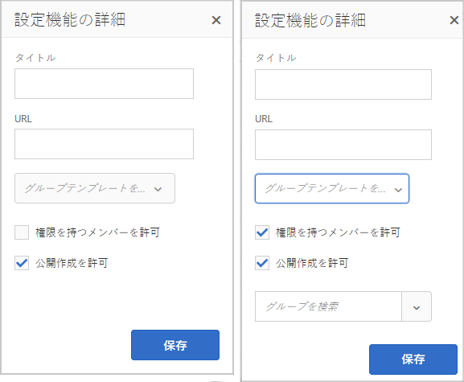

* [タイトルとURL設定](#title-and-url-settings)

* **グループテンプレートの選択**

  （パブリッシュ環境内の）新しいコミュニティグループの将来の作成者が選択できる、1つ以上の有効なグループテンプレートの選択を可能にするドロップダウン。

* **特権メンバーを許可**

  選択した場合、フォーラムでは、[特権メンバーのセキュリティグループ ](/help/communities/users.md#privileged-members-group)の選択を許可することによって、特権メンバーのみがトピックを投稿できます。 選択しない場合は、すべてのコミュニティメンバーが投稿できます。 デフォルトの選択は解除されます。

* **公開の作成を許可**

  選択した場合、許可されたコミュニティメンバーは、パブリッシュ環境でグループを作成できます。 選択を解除した場合、新しいグループ（サブコミュニティ）は、Communities Sitesのグループコンソールからオーサー環境でのみ作成できます。
  デフォルトが選択されています。

### アイディエーション機能 {#ideation-function}

アイデア出し関数は、1つの[ アイデア出しコンポーネント ](/help/communities/ideation-feature.md)を持つページです。

テンプレートに追加すると、次のダイアログが開き、テンプレートのデフォルトのタイトル名とURL名、およびデフォルトの表示設定が指定されます。

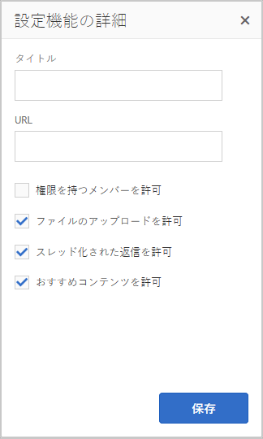

* [タイトルとURL設定](#title-and-url-settings)

* **特権メンバーを許可**

  選択した場合、フォーラムでは、[特権メンバーのセキュリティグループ ](/help/communities/users.md#privileged-members-group)の選択を許可することによって、特権メンバーのみがトピックを投稿できます。 選択しない場合は、すべてのコミュニティメンバーが投稿できます。 デフォルトの選択は解除されます。

* **ファイルのアップロードを許可**

  選択した場合、アイデアにはメンバーがファイルをアップロードする機能が含まれます。 デフォルトが選択されています。

* **スレッド返信を許可**

  選択しない場合、トピックへの返信（コメント）は可能ですが、コメントへの返信は許可されません。 デフォルトが選択されています。

* **おすすめのコンテンツを許可**

  選択すると、そのコンテンツは[おすすめコンテンツ ](/help/communities/featured.md)として識別されます。 デフォルトが選択されています。

### リーダーボード機能 {#leaderboard-function}

リーダーボード関数は、1つの[ リーダーボード コンポーネント ](/help/communities/enabling-leaderboard.md)を含むページです。

**メモ**: リーダーボード機能を含むコミュニティテンプレートからコミュニティサイトを作成した後&#x200B;*3}に、リーダーボードのコンポーネントをさらに設定する必要があります。*&#x200B;リーダーボードコンポーネントの[ ルール ](/help/communities/enabling-leaderboard.md#rules-tab)を指定します。このルールは、コミュニティサイトの[ スコアリングとバッジ ](/help/communities/implementing-scoring.md)の設定によって異なります。

テンプレートに追加すると、次のダイアログが開き、テンプレートのデフォルトのタイトル名とURL名、およびデフォルトの表示設定が指定されます。

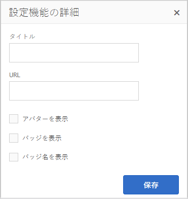

* [タイトルとURL設定](#title-and-url-settings)

* **バッジの表示**

  選択した場合、バッジアイコンの列がリーダーボードに含まれます。
  デフォルトの選択は解除されます。

* **バッジ名を表示**

  選択した場合、バッジ名の列がリーダーボードに含まれます。
  デフォルトの選択は解除されます。

* **アバターを表示**

  選択した場合、メンバーのアバター画像は、メンバープロファイルへの名前リンクの横にあるリーダーボードに含まれます。
  デフォルトの選択は解除されます。

### ページ機能 {#page-function}

このページ機能は、コミュニティサイトの機能であるログイン、メニュー、通知、メッセージング、テーマ、ブランディングに接続される空白のページをコミュニティサイトに追加します。 コンテンツは、[標準のAEM オーサリングモード ](/help/sites-authoring/editing-content.md)を使用してページに追加されます。

テンプレートに追加する場合、設定は[ タイトルとURL設定](#title-and-url-settings)のみです。

### Q&amp;A 機能 {#qna-function}

QnA関数は、[QnA コンポーネント ](/help/communities/working-with-qna.md)を持つページで、タグ付け、ファイルのアップロード、フォロー、自己編集、投票、モデレーションを行うためのメンバーが設定されています。

テンプレートに追加すると、設定では特権メンバーに対する制限が許可されます。

* [タイトルとURL設定](#title-and-url-settings)

* **ピン留めを許可**

  選択した場合、フォーラムでは、トピックの返信をコメントのリストの先頭に固定できます。 デフォルトが選択されています。

* **特権メンバーを許可**

  選択した場合、QnA フォーラムでは、[特権メンバーグループ ](/help/communities/users.md#privileged-members-group)の選択を許可することで、特権メンバーのみが質問を投稿できます。 選択しない場合は、すべてのコミュニティメンバーが投稿できます。 デフォルトの選択は解除されます。

* **ファイルのアップロードを許可**

  選択した場合、QnA フォーラムには、メンバーがファイルをアップロードする機能が含まれます。 デフォルトが選択されています。

* **スレッド返信を許可**

  選択しない場合、QnA フォーラムでは、投稿された質問に対するコメント（回答）は許可されますが、回答に対する回答は許可されません。 デフォルトが選択されています。

* **おすすめのコンテンツを許可**

  選択すると、そのコンテンツは[おすすめコンテンツ ](/help/communities/featured.md)として識別されます。 デフォルトが選択されています。

## コミュニティ機能を作成 {#create-community-function}

コミュニティ機能を作成するには、コミュニティ機能コンソールの上部にある`Create Community Function` アイコンを選択します。 同じAEM ブループリントに基づく複数の関数を作成し、オーサー編集モードで開くことで一意にカスタマイズできます。

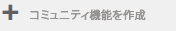

### コミュニティ機能名 {#community-function-name}

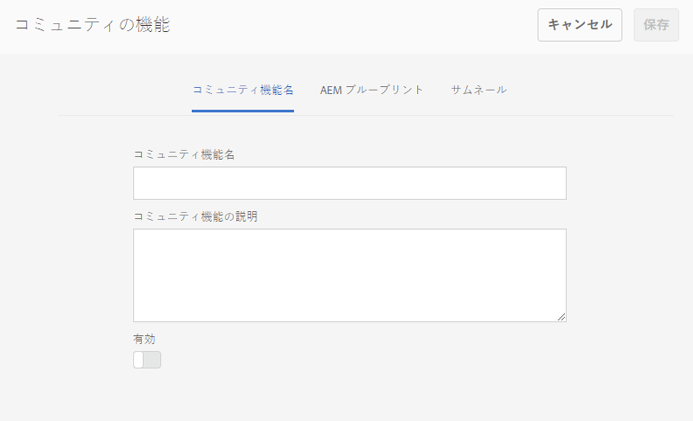

コミュニティ機能名パネルで、名前、説明、および機能が有効か無効かを設定します。

* **コミュニティ関数名**

  表示と保存に使用される関数名。

* **コミュニティ関数の説明**

  表示する関数の説明。

* **無効/有効**

  関数が参照可能かどうかを制御するトグルスイッチ。

### AEM ブループリント {#aem-blueprint}

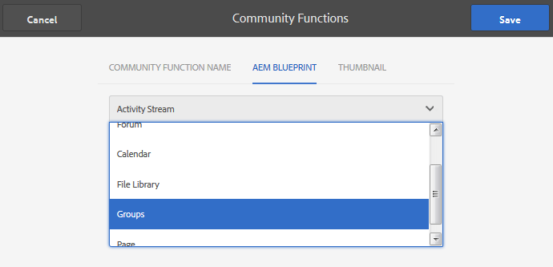

`AEM Blueprint` パネルで、コミュニティ関数の基礎となる実装であるブループリントを選択できます。

コミュニティ機能は、ログイン、ユーザープロファイル、通知、メッセージング、サイトメニュー、検索、テーマ、ブランディング機能など、1つ以上のページを含むミニサイトです。 関数を作成したら、作成者の編集モードで[関数](#open-community-function)を開き、ページまたはコンポーネントの設定をカスタマイズできます。

コミュニティ関数は[ ブループリント ](/help/sites-administering/msm-livecopy.md#creatingablueprint)の[ ライブコピー](/help/sites-administering/msm.md#live-copies)として実装されるので、関数を含む[ コミュニティサイトテンプレート ](/help/communities/sites.md)または[ コミュニティグループテンプレート ](/help/communities/tools-groups.md)から作成されたすべてのコミュニティサイトページに影響を与える関数に変更をロールアウトできます。 親ブループリントからページの関連付けを解除して、ページレベルの変更を行うこともできます。

[ マルチサイトマネージャー](/help/sites-administering/msm.md)も参照してください。

### サムネイル {#thumbnail}

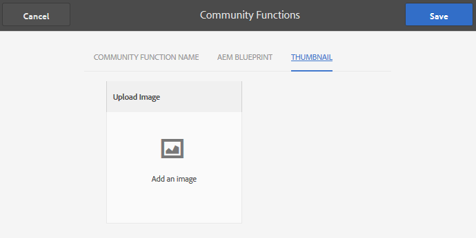

サムネールパネルで、画像をアップロードして[ コミュニティ機能コンソール ](#community-functions-console)に表示することができます。

## コミュニティ機能を開く {#open-community-function}

`Open Community Function` アイコンを選択して、ページコンテンツのオーサリングと機能コンポーネントの設定の変更を行うためのオーサー編集モードに入ります。

### コンポーネントの設定 {#configuring-components}

コミュニティ関数は、AEM ブループリントのライブコピーとして実装され、その詳細は[ マルチサイトマネージャー](/help/sites-administering/msm.md)に記載されています。

ページコンテンツの作成だけでなく、コンポーネントの設定も可能です。

作成したコミュニティサイトのページでコンポーネントを設定する場合は、コンポーネントを設定するために[継承](/help/sites-administering/msm-livecopy.md#changing-live-copy-content)をキャンセルする必要がある場合があります。 設定が完了したら、継承を再度確立する必要があります。

設定の詳細については、作成者の[ コミュニティコンポーネント ](/help/communities/author-communities.md)を参照してください。

## コミュニティ機能を編集 {#edit-community-function}

`Edit Community Function` アイコンを選択して、[ コミュニティ関数の作成](#create-community-function)と同じパネルを使用して、関数のプロパティを編集します。これには、関数の有効化または無効化が含まれます。
