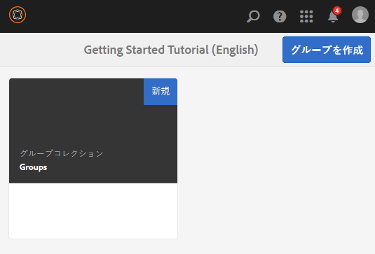
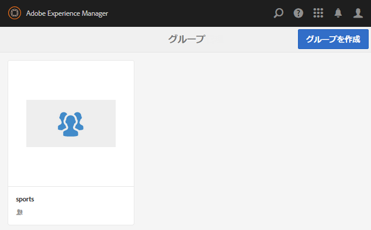
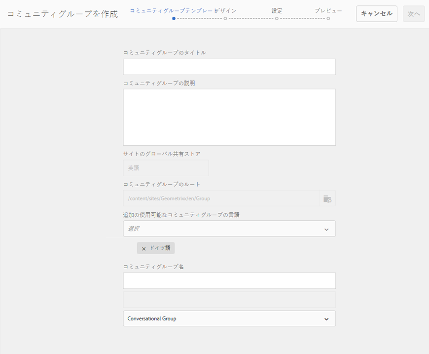
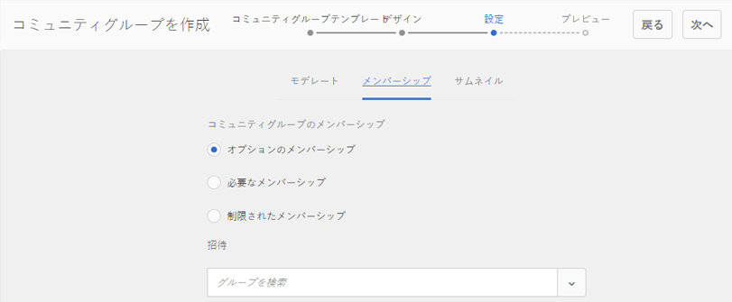
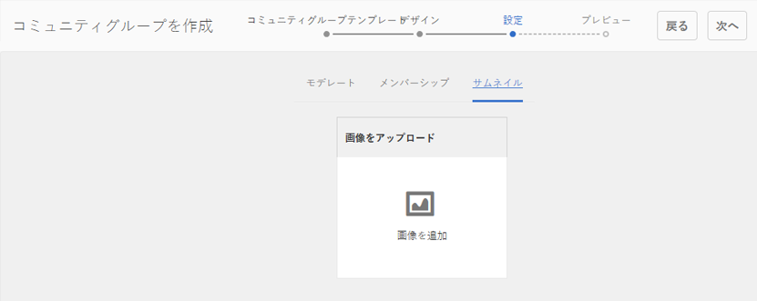
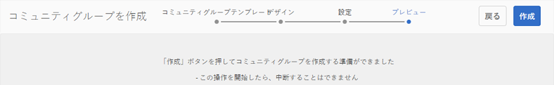
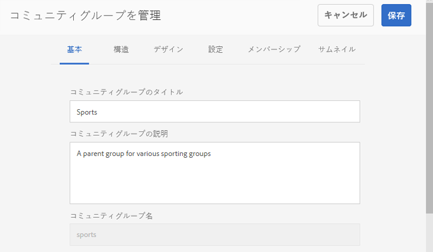
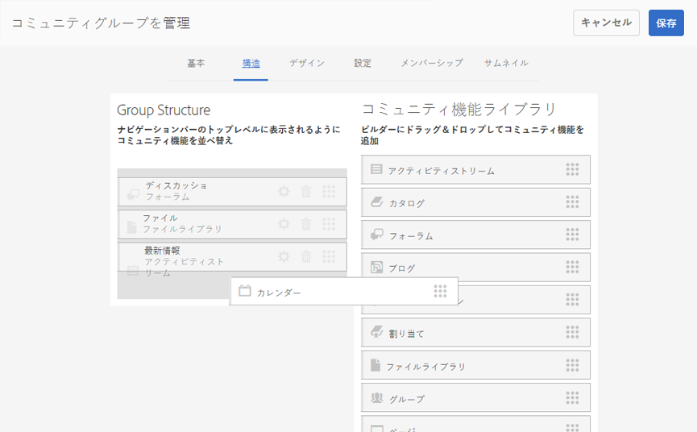
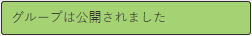

# コミュニティグループコンソール {#community-groups-console}

The Groups console provides access to creating community groups when a community site&#39;s [template structure](/help/communities/sites-console.md#step1) includes the [groups function](/help/communities/functions.md#groups-function).

* AEM Communitiesは、他のグループ内でのグループのネストをサポートしています。 グループのネストは、新しいグループの [構造にグループ機能が含まれる場合](/help/communities/tools-groups.md) に可能です。
* 作成者環境の場合のみ、サイト作成ウィザードに似たグループ作成ウィザードがあります。
* グループ機能をコミュニティサイト構造またはコミュニティグループ構造に追加する場合に、メンバーが公開環境でグループを作成できるかどうかを設定できます。

Of the three group templates included, only the `Reference Group` template includes a groups function in its structure.

コミュニティグループの様々な側面は次のとおりです。

* **作成**: 新しいグループは、作成者に対しても、オプションで発行インスタンスに対しても作成できます。
* **コントロール**: グループは、開いている場合とシークレットの場合があります。
* **入れ子**: groupには、0個以上のグループを含めることができます。

<!-- This is a 404 on helpx. Please update or remove.
>[!NOTE]
>
>Community groups, created in the publish environment before the [existence of the Community Groups console](/help/communities/version-history.md#featurepack1fp1), will not be listed in the Community Groups console, and thus, are not modifiable using the console.-->

>[!NOTE]
>
>This Groups console, only accessible from the Communities Sites console, is not to be confused with the member [Groups console](/help/communities/members.md) for managing member groups.
>
>メンバーグループは、パブリッシュ環境に登録されたユーザーグループであり、[トンネルサービス](/help/communities/deploy-communities.md#tunnel-service-on-author)を使用してオーサー環境からアクセスします。

## グループ作成 {#group-creation}

グループコンソールにアクセスするには：

* 作成者は、管理者権限を持つログインを行います。
* From global navigation: **[!UICONTROL Communities]** > **[!UICONTROL Sites]**.
* 既存のコミュニティサイトフォルダを選択して開きます。
* フォルダ内のコミュニティサイトのインスタンスを選択します。

   * コミュニティサイトの構造には、グループ機能が含まれている必要があります。
   * These screen shots are from the Getting Started tutorial after [creating groups on publish](/help/communities/published-site.md).

   

* **グループフォルダー**&#x200B;を選択して、開きます。

   開いたら、オーサーまたはパブリッシュで作成されたすべての既存のグループが表示されます。

   このグループコンソールから、新しいグループを作成できます。

   

* Select the **Create Group** button.

### 手順 1：コミュニティグループテンプレート {#step-community-group-template}

* **コミュニティグループのタイトル**

   グループの表示タイトル。
タイトルは、グループのパブリッシュされたサイトに表示されます。

* **コミュニティグループの説明**

   グループの説明です。

* **コミュニティグループのルート**

   グループのルートパスです。
デフォルトのルートは親サイトですが、ルートはWebサイト内の任意の場所に移動できます。 変更することはお勧めしません。

* **使用可能なその他のコミュニティグループ言語** メニュー

   ドロップダウンを使用して、使用可能なコミュニティグループ言語を選択します。 このメニューには、親コミュニティサイトを作成できる言語がすべて表示されます。この中から言語を選択することで、1 回の手順で複数のロケールにグループを作成できます。指定した複数の言語で、それぞれのコミュニティサイトのグループコンソールに同じグループが作成されます。

* **コミュニティグループ名**

   URLに表示されるグループのルートページの名前。

   * グループの作成後に名前が容易に変更されないので、重複チェックを行います。
   * ベースURLがの下に表示され `Community Group Name`ます。
   * 有効なURLの場合は、「.html」を追加します。
      *例えば*、 `https://localhost:4502/content/sites/mysight/en/mygroup.html`。

* **コミュニティグループテンプレート** メニュー

   ドロップダウンを使用して、使用可能な [コミュニティグループテンプレートを選択し](/help/communities/tools.md)ます。

### 手順 2：デザイン {#step-design}

### コミュニティグループのテーマ {#community-group-theme}

このフレームワークでは、レスポンシブで柔軟なサイトデザインを実現できるよう、[Twitter Bootstrap](https://twitterbootstrap.org/) を使用しています。プリロードされた多数のBootstrapテーマの1つを選択して、選択したコミュニティグループテンプレートのスタイルを設定したり、Bootstrapテーマをアップロードしたりできます。

選択すると、テーマは不透明な青のチェックマークでオーバーレイされます。

親サイトのテーマとは異なるテーマを選択することもできます。

コミュニティサイトがパブリッシュされた後、[プロパティを編集](#modifyinggroupproperties)して、別のテーマを選択できます。

### コミュニティグループブランディング {#community-group-branding}

コミュニティサイトブランディングとは、各ページ上部にヘッダーとして表示される画像のことです。他のサイトページとは異なるグループ用のバナーを表示することができます。

画像の幅は、予想されるブラウザー内でのページの表示に合わせます。画像の高さは 120 ピクセルにします。

画像を選択するときは、次の点に注意してください。

* 画像の高さは、画像の上端から120ピクセルに切り抜かれます。
* 画像はブラウザーウィンドウの左端に固定されます
* 画像の幅が次のような場合は、画像のサイズは変更されません。

   * ブラウザーの幅より小さい場合は、画像が水平方向に繰り返されます。
   * ブラウザーの幅より大きい場合、画像は切り抜かれたように見えます。

### 手順 3：設定 {#step-settings}

**モデレート**

**コミュニティグループのモデレーター**

デフォルトで、親コミュニティサイトのモデレーターリストが継承されます。

グループに固有のモデレーターを追加できます。 (投稿環境から)メンバーを検索して、モデレーターとして追加します

**グループ管理者**

デフォルトでは、親コミュニティサイト管理者もグループの管理者です。

ただし、独立したグループ管理者を割り当てることは可能です。 グループ管理者は、自分のグループ（G1など）を管理し、G1の下にネストされたサブグループを作成できます。 さらに、サブグループに異なる管理者を割り当てることができます。

したがって、ユーザU1は、グループG1の管理者であり、ネストグループG2の正規ユーザである可能性がある。

**メンバーシップ**

メンバーシップ設定によって、コミュニティグループをセキュリティ保護する 3 つの方法のうち 1 つを選択できます。

* **オプションのメンバーシップ**

   選択した場合、コミュニティグループはパブリックグループになります。 サイトメンバーは、明示的にグループに参加することなく、グループおよび投稿に参加できます。 デフォルトで選択されています。

* **必要なメンバーシップ**

   選択した場合、コミュニティグループは開かれたグループになります。 コミュニティサイトのメンバーはグループのコンテンツを表示できますが、コンテンツを投稿するにはグループに参加する必要があります。 Members join by selecting the `Join` button in the publish environment. 初期設定では選択されていません。

* **制限されたメンバーシップ**

   選択した場合、コミュニティグループは秘密のグループです。 コミュニティのメンバーは明示的に招待する必要があります。 招待メンバーは検索ボックスに入力されます。 Members can be added later using the [Members and Groups consoles](/help/communities/members.md) the author environment. 初期設定では選択されていません。

**サムネイル**

サムネイルは、オーサーおよびパブリッシュのグループに対して表示される画像です。

グループ画像の最適なサイズは、サポートされている画像形式（JPG や PNG など）の 170 x 90 ピクセルです。

画像を追加しない場合は、デフォルトの画像が表示されます。

### 手順 4：グループの作成 {#step-create-group}

If any adjustments are needed, use the **Back** button to make them.

Once **Create** is selected and started, the process of creating the group cannot be interrupted.

処理が完了すると、新しいサブコミュニティサイト（グループ）のカードがCommunitiesのサイトグループコンソールに表示されます。このコンソールから、作成者がページコンテンツを追加したり、管理者がサイトのプロパティを変更したりできます。

>[!NOTE]
>
>それぞれのコミュニティサイトのコミュニティグループコンソールに、[手順 1：コミュニティグループテンプレート](/help/communities/groups.md#step-community-group-template)の「追加の使用可能なコミュニティグループの言語」で指定したすべての言語でグループが作成されます。

## 作成者グループのコンテンツ {#author-group-content}

グループのページコンテンツは、他のAEMページと同じツールを使用して作成できます。 オーサリング用にグループを開くには、グループカードの上にカーソルを置くと表示される「サイトを開く」アイコンを選択します。

## グループプロパティの変更 {#modify-group-properties}

コミュニティグループの作成プロセスで指定された既存のサブコミュニティサイトのプロパティは、グループカードの上にカーソルを置くと表示される「サイトを編集」アイコンを選択して変更できます。

以下のプロパティの詳細は、[グループ作成](#group-creation)で説明した内容と同じです。パブリッシュ環境や作成者環境で作成したネストグループはどれでも変更できます。

### 基本事項の変更 {#modify-basic}

基本パネルでは、次のものを変更できます。

* コミュニティグループのタイトル
* コミュニティグループの説明

コミュニティグループ名は変更できません。

別のコミュニティグループテンプレートを選択しても、テンプレートとサイトの間に関係は残っていないので、既存のコミュニティグループサイトに影響が及ぶことはありません。

その一方で、サブコミュニティの[構造](#modify-structure)は変更できます。

### 構造の変更 {#modify-structure}

構造パネルでは、オーサー環境またはパブリッシュ環境でサブコミュニティを作成するときに選択したコミュニティグループテンプレートから最初に作成した構造を変更できます。パネルから、次の操作を行うことができます。

* Drag-and-drop additional [community functions](/help/communities/functions.md) into the site structure.
* サイト構造内のコミュニティ関数のインスタンスに対して、次の操作を行います。

   * **`Gear icon`**
表示タイトル、URL、 [権限を持つメンバーのグループなどの設定を編集します](/help/communities/users.md#privilegedmembersgroups)。

   * **`Trashcan icon`**
サイト構造から関数を削除（削除）します。

   * **`Grid icon`**
サイトのトップレベルナビゲーションバーに表示される機能の順序を変更します。

>[!CAUTION]
>
>表示タイトルは副作用なく変更できますが、コミュニティサイトに属するコミュニティ機能のURL名を編集することはお勧めしません。
>
>例えば、URL の名前を変更しても、既存の UGC は移動されません。そのため、UGC が「失われる」ことになります。

>[!CAUTION]
>
>The groups function must *not* be the *first nor the only* function in the site structure.
>
>他の機能（[ページ機能](/help/communities/functions.md#page-function)など）を含め、その機能を 1 番目にリストする必要があります。

**例：サブコミュニティ（グループ）構造へのカレンダー機能の追加**

### デザインの変更 {#modify-design}

デザインパネルでは、次のものを変更できます。

* [コミュニティグループのテーマ](#community-group-theme)
* [コミュニティグループブランディング](#community-group-branding)

   * パネルの下部にスクロールして、ブランド画像を変更します。

### 設定の変更 {#modify-settings}

設定パネルでは、コミュニティの[モデレーター](#moderation)を追加できます。

### メンバーシップの変更 {#modify-membership}

[メンバーシップ](#membership)パネルは情報提供のみを目的としています。設定されたグループメンバーシップの種類は、オプション、必須、制限のいずれであるかに関係なく変更できません。

### サムネイルの変更 {#modify-thumbnail}

[サムネイル](#thumbnail)パネルでは、コミュニティグループを表す画像をアップロードできます。この画像は、パブリッシュ環境でサイト訪問者に表示され、オーサー環境のコミュニティサイトのグループコンソールにも表示されます。

## グループの公開 {#publish-the-group}

After a community group has been newly created or modified, it is possible to publish (activate) the group by selecting the `Publish Site` icon.

グループが正常に公開されると、メッセージが表示されます。

>[!CAUTION]
>
>親コミュニティサイトおよび親グループが既に公開されている必要があります。
>
>コミュニティサイトおよびネストされたグループは、階層の上から下の順に公開される必要があります。

## グループの削除 {#delete-the-group}

コミュニティグループコンソール内のグループを削除するには、グループを削除アイコンを選択します。このアイコンは、グループにマウスポインターを置くと表示されます。

グループを削除すると、グループに関連付けられているアイテムはすべて削除されます。例えば、グループのコンテンツはすべて永久に削除され、ユーザーメンバーシップはシステムから削除されます。
