# コミュニティグループコンソール {#community-groups-console}

グループコンソールでは、コミュニティサイトの[&#x200B; テンプレート構造](/help/communities/sites-console.md#step1)に[&#x200B; グループ関数](/help/communities/functions.md#groups-function)が含まれている場合、コミュニティグループを作成するためのアクセス権を提供します。

* AEM Communitiesでは、他のグループ内のグループのネストがサポートされます。 新しいグループ [&#128279;](/help/communities/tools-groups.md)の構造にグループ関数が含まれている場合、グループのネストが可能です。
* オーサー環境の場合のみ、サイト作成ウィザードと同様のグループ作成ウィザードがあります。
* メンバーがパブリッシュ環境でグループを作成できるかどうか。グループ関数をコミュニティサイト構造またはコミュニティグループ構造に追加する際に設定できます。

含まれている3つのグループテンプレートのうち、`Reference Group` テンプレートのみが、その構造にグループ関数を含んでいます。

コミュニティグループの様々な側面は次のとおりです。

* **作成**：新しいグループは作成者に作成でき、オプションでパブリッシュインスタンスに作成することもできます。
* **コントロール**: グループはオープンまたは秘密にできます。
* **ネスト**: グループには0個以上のグループを含めることができます。

<!--
This is a 404 on helpx. Update or remove.
>[!NOTE]
>
>Community groups, created in the publish environment before the [existence of the Community Groups console](/help/communities/version-history.md#featurepack1fp1), is not listed in the Community Groups console, and thus, are not modifiable using the console.
-->

>[!NOTE]
>
>このグループコンソールは、Communities Sites コンソールからのみアクセス可能で、メンバーグループの管理用にメンバー[&#x200B; グループコンソール &#x200B;](/help/communities/members.md)と混同しないでください。
>
>メンバーグループは、パブリッシュ環境に登録され、[&#x200B; トンネルサービス &#x200B;](/help/communities/deploy-communities.md#tunnel-service-on-author)を使用してオーサー環境からアクセスするユーザーグループです。

## グループ作成 {#group-creation}

グループコンソールにアクセスするには：

* オーサーで、管理者権限でログインします。
* グローバルナビゲーションから：**[!UICONTROL Communities]** > **[!UICONTROL Sites]**。
* 既存のコミュニティサイトフォルダーを選択して開きます。
* フォルダー内のコミュニティサイトのインスタンスを選択します。

   * コミュニティサイトの構造には、グループ関数を含める必要があります。
   * これらのスクリーンショットは、[&#x200B; パブリッシュでグループを作成した後の入門チュートリアルのものです](/help/communities/published-site.md)。

  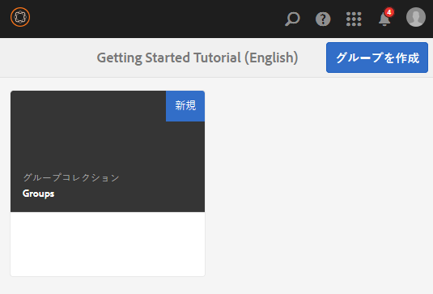

* **グループ フォルダー**&#x200B;を選択して開きます。

  開くと、作成者または公開時に作成されたすべての既存のグループが表示されます。

  このグループコンソールから、新しいグループを作成できます。

  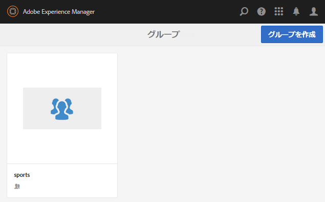

* 「**グループを作成**」ボタンを選択します。

### ステップ 1：コミュニティグループテンプレート {#step-community-group-template}

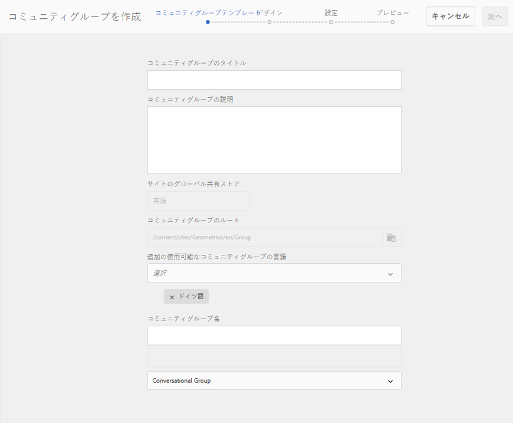

* **コミュニティグループタイトル**

  グループの表示タイトル。
タイトルは、グループの公開サイトに表示されます。

* **コミュニティグループの説明**

  グループの説明。

* **コミュニティグループルート**

  グループへのルートパス。
デフォルトのルートは親サイトですが、ルートはweb サイト内の任意の場所に移動できます。変更することはお勧めできません。

* **その他の利用可能なコミュニティグループ言語** メニュー

  ドロップダウンを使用して、使用可能なコミュニティグループの言語を選択します。 メニューには、親コミュニティサイトが作成されるすべての言語が表示されます。 ユーザーは、この単一のステップで、これらの言語の中から選択して、複数のロケールでグループを作成できます。 同じグループが、それぞれのコミュニティサイトのグループコンソールで、指定された複数の言語で作成されます。

* **コミュニティグループ名**

  URLに表示されるグループのルートページの名前。 グループ名にアンダースコア文字（_）やリソースや設定などのキーワードを使用しないでください。

   * グループの作成後に名前が簡単に変更されないので、名前を再確認します。
   * ベース URLは`Community Group Name`の下に表示されます。
   * 有効なURLに「.html」を追加します
     *例：*、`https://localhost:4502/content/sites/mysight/en/mygroup.html`。

* **コミュニティグループテンプレート** メニュー

  ドロップダウンを使用して、使用可能な[&#x200B; コミュニティグループテンプレート &#x200B;](/help/communities/tools.md)を選択します。

### ステップ 2：デザイン {#step-design}

### コミュニティグループのテーマ {#community-group-theme}

このフレームワークでは、`Twitter Bootstrap`を使用して、レスポンシブで柔軟なデザインをサイトに取り入れています。 プリロードされた多数のBootstrap テーマの1つを選択して、選択したコミュニティグループテンプレートのスタイルを設定するか、Bootstrap テーマをアップロードできます。

選択すると、テーマに不透明な青いチェックマークがオーバーレイされます。

親サイトのテーマとは異なるテーマを選択することができます。

コミュニティサイトが公開されたら、[&#x200B; プロパティを編集して](#modifyinggroupproperties)別のテーマを選択できます。

### コミュニティグループブランディング {#community-group-branding}

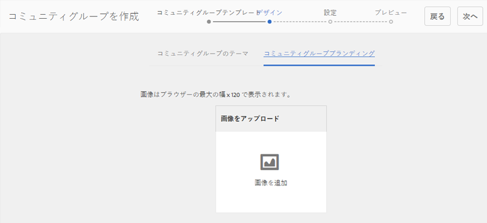

コミュニティサイトのブランディングとは、各ページの上部にヘッダーとして表示される画像です。 他のサイトページとは異なるグループのバナーを表示することができる。

画像のサイズは、ブラウザーでのページの予想される表示幅と高さ120 ピクセルになるように調整する必要があります。

画像を作成または選択する際は、次の点に注意してください。

* 画像の高さは、画像の上端から測定された120 ピクセルに切り抜かれます
* 画像はブラウザーウィンドウの左端にピン留めされています
* 画像の幅が次の場合に、画像のサイズ変更は行われません。

   * ブラウザーの幅よりも小さい場合、画像は水平方向に繰り返されます。
   * ブラウザーの幅よりも大きい画像は切り抜かれたように見えます。

### 手順3：設定 {#step-settings}

**モデレーション**

**コミュニティグループモデレーター**

デフォルトでは、親コミュニティサイトのモデレータのリストが継承されます。

グループにモデレータを追加することができます。 （パブリッシュ環境から）メンバーを検索して、モデレーターとして追加します

**グループ管理者**

デフォルトでは、親コミュニティサイトの管理者もグループの管理者です。

ただし、独立したグループ管理者を割り当てることは可能です。 グループ管理者は、グループ（G1など）を管理し、G1の下にネストされたサブグループを作成できます。 さらに、サブグループに異なる管理者を割り当てることができます。

したがって、ユーザ U1は、グループ G1の管理者であり、そのネストされたグループ G2の通常のユーザである。

**メンバーシップ**

メンバーシップ設定では、コミュニティグループを保護する3つの方法の1つを選択できます。

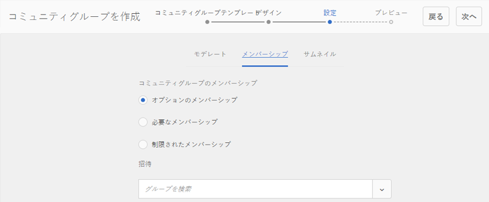

* **オプションのメンバーシップ**

  選択した場合、コミュニティグループはパブリックグループになります。 サイトメンバーは、グループに参加し、グループに明示的に参加することなく投稿できます。 デフォルトが選択されています。

* **必要なメンバーシップ**

  選択した場合、コミュニティグループは開いているグループです。 コミュニティサイトのメンバーはグループのコンテンツを表示できますが、コンテンツを投稿するにはグループに参加する必要があります。 メンバーは、パブリッシュ環境で「`Join`」ボタンを選択して参加します。 デフォルトは選択されていません。

* **制限付きメンバーシップ**

  選択した場合、コミュニティグループは秘密グループです。 コミュニティメンバーを明示的に招待する必要があります。 招待されたメンバーは検索ボックスに入力されます。 メンバーは、オーサー環境の[&#x200B; メンバーおよびグループコンソール &#x200B;](/help/communities/members.md)を使用して、後で追加できます。 デフォルトは選択されていません。

**サムネール**

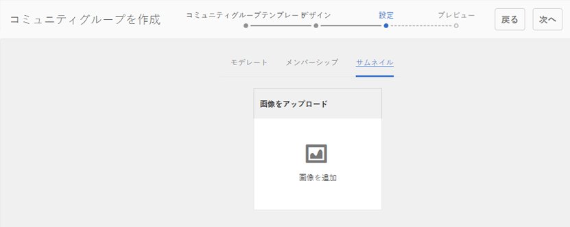

サムネールは、オーサーとパブリッシュのグループに表示する画像です。

グループ画像の最適なサイズは、サポートされている画像形式（JPGやPNGなど）の170 x 90 ピクセルです。

画像が追加されていない場合は、デフォルトの画像が表示されます。

### 手順4：グループの作成 {#step-create-group}

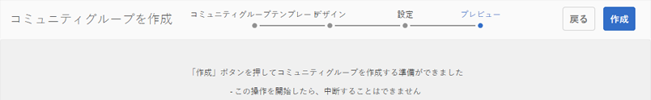

調整が必要な場合は、**戻る** ボタンを使用して調整します。

**Create**&#x200B;を選択して開始すると、グループの作成プロセスを中断できません。

プロセスが完了すると、新しいサブコミュニティサイト（グループ）のカードがコミュニティサイトグループコンソールに表示され、作成者がページコンテンツを追加したり、管理者がサイトのプロパティを変更したりできます。

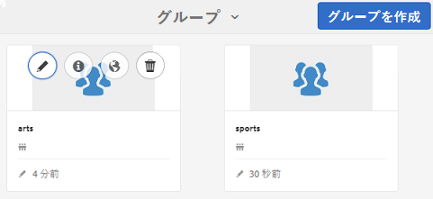

>[!NOTE]
>
>グループは、すべての言語で作成されます。詳しくは、[手順1：追加の利用可能なコミュニティグループ言語のコミュニティグループテンプレート &#x200B;](/help/communities/groups.md#step-community-group-template)を、それぞれのコミュニティサイトのコミュニティグループコンソールで参照してください。

## オーサーグループコンテンツ {#author-group-content}

グループのページコンテンツは、他のAEM ページと同じツールで作成できます。 オーサリング用にグループを開くには、グループカードの上にカーソルを置いたときに表示される「サイトを開く」アイコンを選択します。

## グループのプロパティを変更 {#modify-group-properties}

コミュニティグループの作成プロセス中に指定された既存のサブコミュニティサイトのプロパティは、グループカードにカーソルを合わせると表示される「サイトを編集」アイコンを選択して変更できます。

次のプロパティの詳細は、[&#x200B; グループ作成](#group-creation) セクションに記載されている説明と一致しています。 パブリッシュ環境またはオーサー環境で作成したネストされたグループは、すべて変更できます。

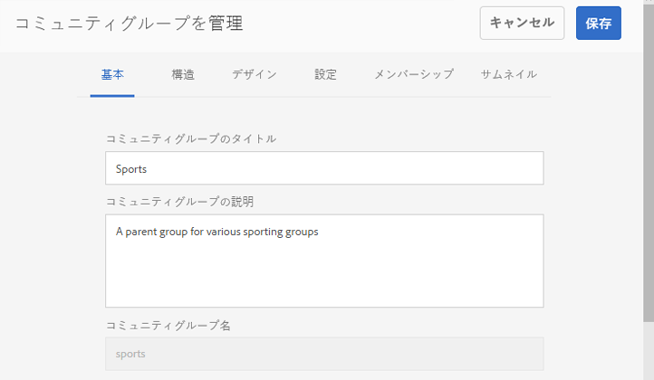

### 基本を変更 {#modify-basic}

基本パネルでは、次の項目を変更できます

* コミュニティグループのタイトル
* コミュニティグループの説明

コミュニティグループ名は変更できません。

別のコミュニティグループテンプレートを選択しても、テンプレートとサイト間に接続が残らないため、既存のコミュニティグループサイトには影響しません。

代わりに、サブコミュニティの[STRUCTURE](#modify-structure)を変更できます。

### 構造を変更 {#modify-structure}

構造パネルを使用すると、オーサー環境またはパブリッシュ環境からサブコミュニティサイトを作成する際に選択したコミュニティグループテンプレートから最初に作成された構造を変更できます。 パネルから、次のことが可能です。

* 追加の[&#x200B; コミュニティ関数](/help/communities/functions.md)をサイト構造にドラッグ&amp;ドロップします。
* サイト構造内のコミュニティ関数のインスタンス：

   * **`Gear icon`**
表示タイトル、URL、および[特権メンバーグループ &#x200B;](/help/communities/users.md#privilegedmembersgroups)を含む設定を編集します。

   * **`Trashcan icon`**
サイト構造から関数を削除（削除）します。

   * **`Grid icon`**
サイトの最上位ナビゲーションバーに表示される関数の順序を変更します。

>[!CAUTION]
>
>表示タイトルは副作用なしで変更できますが、コミュニティサイトに属するコミュニティ関数のURL名を編集することはお勧めしません。
>
>例えば、URLの名前を変更しても既存のUGCは移動されないため、「UGCを失う」効果があります。

>[!CAUTION]
>
>グループ関数&#x200B;*not*&#x200B;は、サイト構造内の&#x200B;*firstまたはonly*&#x200B;関数である必要があります。
>
>[&#x200B; ページ関数](/help/communities/functions.md#page-function)などの他の関数を最初に含めてリストする必要があります。

**例：サブコミュニティ （グループ）構造へのカレンダー関数の追加**

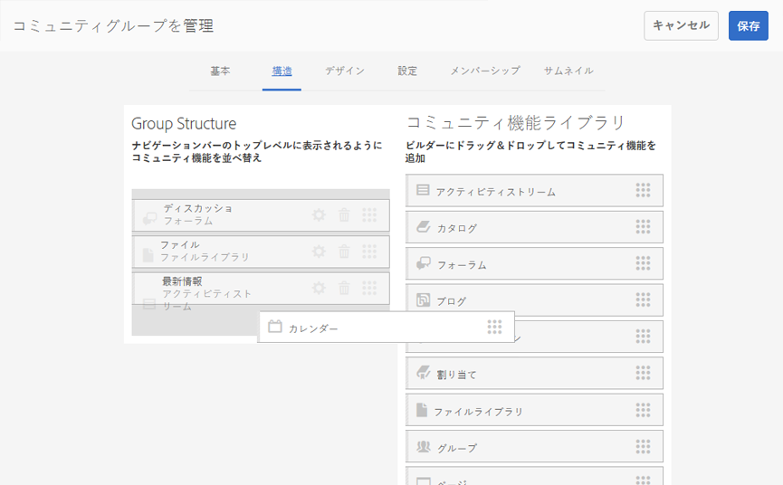

### デザインを修正 {#modify-design}

デザインパネルでは、テーマを変更できます。

* [コミュニティグループのテーマ](#community-group-theme)
* [コミュニティグループブランディング](#community-group-branding)

   * パネルの一番下までスクロールして、ブランド画像を変更できます。

### 設定を変更 {#modify-settings}

設定パネルでは、コミュニティ [&#x200B; モデレーター](#moderation)を追加できます。

### メンバーシップを変更 {#modify-membership}

[&#x200B; メンバーシップ &#x200B;](#membership) パネルは情報提供のみです。 設定されたグループメンバーシップのタイプを、オプション、必須、または制限のいずれにしても変更することはできません。

### サムネールを変更 {#modify-thumbnail}

[&#x200B; サムネール &#x200B;](#thumbnail) パネルを使用すると、パブリッシュ環境のサイト訪問者と、オーサー環境のCommunities サイトのグループコンソールで、コミュニティグループを表す画像をアップロードできます。

## グループを公開 {#publish-the-group}

コミュニティグループを新しく作成または変更した後、`Publish Site` アイコンを選択して、グループを公開（アクティブ化）できます。

グループが正常に公開されると、次のメッセージが表示されます。

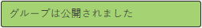

>[!CAUTION]
>
>親コミュニティサイトと親グループはすでに公開されている必要があります。
>
>コミュニティサイトとネストされたグループは、トップダウンで公開する必要があります。

## グループを削除 {#delete-the-group}

グループの上にマウスポインターを置くと表示される「グループを削除」アイコンを選択して、コミュニティグループコンソール内からグループを削除します。

これにより、グループに関連付けられたすべての項目が削除されます。例えば、グループのすべてのコンテンツが完全に削除され、ユーザーメンバーシップがシステムから削除されます。
