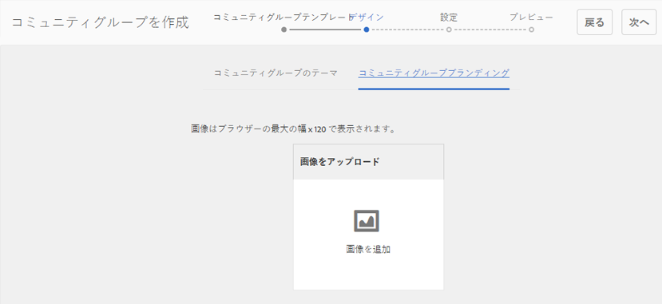

# コミュニティグループコンソール {#community-groups-console}

グループコンソールを使用すると、コミュニティサイトの [テンプレート構造](/help/communities/sites-console.md#step1) 次を含む [グループ機能](/help/communities/functions.md#groups-function).

* AEM Communitiesは、他のグループ内でのグループのネストをサポートしています。 グループのネストは、 [新しいグループの構造](/help/communities/tools-groups.md) には groups 関数が含まれます。
* オーサー環境の場合のみ、サイト作成ウィザードと同様のグループ作成ウィザードがあります。
* グループ機能をコミュニティサイト構造またはコミュニティグループ構造に追加する際に、メンバーがパブリッシュ環境でグループを作成できるかどうかを設定できます。

含まれる 3 つのグループテンプレートのうち、 `Reference Group` テンプレートの構造には、グループ機能が含まれます。

コミュニティグループの様々なファセットを次に示します。

* **作成**：オーサーインスタンスおよびオプションでパブリッシュインスタンスで新しいグループを作成できます。
* **制御**：グループは、開くか秘密鍵を持つことができます。
* **ネスト**：グループには、0 個以上のグループを含めることができます。

<!-- This is a 404 on helpx. Update or remove.
>[!NOTE]
>
>Community groups, created in the publish environment before the [existence of the Community Groups console](/help/communities/version-history.md#featurepack1fp1), is not listed in the Community Groups console, and thus, are not modifiable using the console.
-->

>[!NOTE]
>
>このグループコンソールはコミュニティサイトコンソールからのみアクセス可能で、メンバーと混同しないでください [グループコンソール](/help/communities/members.md) （メンバーグループの管理用）
>
>メンバーグループは、パブリッシュ環境に登録されたユーザーグループで、 [トンネルサービス](/help/communities/deploy-communities.md#tunnel-service-on-author).

## グループ作成 {#group-creation}

グループコンソールにアクセスするには：

* オーサー環境で、管理者権限でログインします。
* グローバルナビゲーションから： **[!UICONTROL Communities]** > **[!UICONTROL Sites]**.
* 既存のコミュニティサイトフォルダを選択して開くことができます。
* フォルダー内のコミュニティサイトのインスタンスを選択します。

   * コミュニティサイトの構造には、グループ機能を含める必要があります。
   * これらのスクリーンショットは、次の手順の後の入門チュートリアルのものです。 [パブリッシュ環境でのグループの作成](/help/communities/published-site.md).

  

* を選択します。 **グループフォルダー** 開けてみて下さい

  開くと、オーサー環境とパブリッシュ環境のどちらで作成された既存のグループもすべて表示されます。

  このグループコンソールから、新しいグループを作成できます。

  

* を選択します。 **グループを作成** 」ボタンをクリックします。

### 手順 1：コミュニティグループテンプレート {#step-community-group-template}

* **コミュニティグループのタイトル**

  グループの表示タイトル。
タイトルは、グループの公開済みサイトに表示されます。

* **コミュニティグループの説明**

  グループの説明。

* **コミュニティグループのルート**

  グループのルートパス。
デフォルトのルートは親サイトですが、ルートは Web サイト内の任意の場所に移動できます。 変更はお勧めしません。

* **追加の利用可能なコミュニティグループの言語** メニュー

  ドロップダウンを使用して、使用可能なコミュニティグループの言語を選択します。 親コミュニティサイトが作成されたすべての言語がメニューに表示されます。 ユーザーは、この 1 つの手順で、複数のロケールでグループを作成するために、これらの言語の中から選択できます。 各コミュニティサイトのグループコンソールで、指定した複数の言語で同じグループが作成されます。

* **コミュニティグループ名**

  URL に表示されるグループのルートページの名前。 アンダースコア文字 (_) や、リソースや設定などのキーワードをグループ名に使用することは避けてください。

   * 名前はグループの作成後は簡単に変更できないので、名前を再確認します。
   * ベース URL は、 `Community Group Name`.
   * 有効な URL に「.html」を追加します。
     *例：*, `https://localhost:4502/content/sites/mysight/en/mygroup.html`.

* **コミュニティグループテンプレート** メニュー

  ドロップダウンを使用して、使用可能な [コミュニティグループテンプレート](/help/communities/tools.md).

### 手順 2：デザイン {#step-design}

### コミュニティグループのテーマ {#community-group-theme}

フレームワークでは、 `Twitter Bootstrap` レスポンシブで柔軟なデザインをサイトに取り込む。 プリロードされた多数のBootstrapテーマの 1 つを選択して、選択したコミュニティグループテンプレートのスタイルを設定するか、Bootstrapテーマをアップロードできます。

選択すると、テーマは不透明な青色のチェックマークでオーバーレイされます。

親サイトのテーマとは異なるテーマを選択することができます。

コミュニティサイトが公開されると、次の操作が可能になります。 [プロパティの編集](#modifyinggroupproperties) 別のテーマを選択します。

### コミュニティグループのブランディング {#community-group-branding}

コミュニティサイトのブランディングは、各ページの上部にヘッダーとして表示される画像です。 他のサイトページとは異なるグループのバナーを表示できます。

画像のサイズは、ブラウザーでのページの予想される表示幅と高さ 120 ピクセルに合わせて調整する必要があります。

画像を作成または選択する場合は、次の点に注意してください。

* 画像の高さは、画像の上端から 120 ピクセルに切り抜かれます
* 画像はブラウザーウィンドウの左端に固定されます
* 画像の幅が以下の場合は、画像のサイズは変更されません。

   * ブラウザーの幅より小さい場合、画像は水平方向に繰り返されます。
   * ブラウザーの幅より大きい場合は、画像が切り抜かれて表示されます。

### 手順 3：設定 {#step-settings}

**モデレート**

**コミュニティグループのモデレーター**

デフォルトでは、親コミュニティサイトのモデレーターのリストが継承されます。

モデレーターを特別にグループに追加することができます。 （パブリッシュ環境から）メンバーを検索して、モデレーターとして追加する

**グループ管理者**

デフォルトでは、親コミュニティサイト管理者がグループの管理者になっています。

ただし、独立したグループ管理者を割り当てることは可能です。 グループ管理者は、グループ（G1 など）を管理し、G1 の下にネストされたサブグループを作成できます。 さらに、サブグループに対して異なる管理者を割り当てることができます。

したがって、ユーザ U1 は、グループ G1 の管理者であり、ネストされたグループ G2 の正規ユーザである。

**メンバーシップ**

メンバーシップ設定では、コミュニティグループを保護する 3 つの方法の 1 つを選択できます。

* **オプションのメンバーシップ**

  選択した場合、コミュニティグループはパブリックグループになります。 サイトメンバーは、グループに明示的に参加せずに、グループに参加したり投稿したりできます。 初期設定ではオンになっています。

* **必要なメンバーシップ**

  選択した場合、コミュニティグループはオープングループになります。 コミュニティサイトのメンバーは、グループのコンテンツを表示できますが、コンテンツを投稿するにはグループに参加する必要があります。 メンバーは、 `Join` 」ボタンをクリックします。 初期設定は選択されていません。

* **制限されたメンバーシップ**

  選択した場合、コミュニティグループは秘密グループになります。 コミュニティメンバーは明示的に招待される必要があります。 招待されたメンバーが検索ボックスに入力されます。 メンバーは後で [メンバーコンソールとグループコンソール](/help/communities/members.md) オーサー環境。 初期設定は選択されていません。

**サムネイル**

サムネールは、オーサー環境およびパブリッシュ環境でグループに対して表示される画像です。

グループ画像の最適なサイズは、サポートされている画像形式 (JPG、PNG など ) で 170 x 90 ピクセルです。

画像が追加されない場合は、デフォルトの画像が表示されます。

### 手順 4：グループを作成する {#step-create-group}

調整が必要な場合は、 **戻る** ボタンを使用して作成します。

1 回 **作成** が選択されて開始された場合、グループの作成プロセスは中断できません。

処理が完了すると、新しいサブコミュニティサイト（グループ）のカードがコミュニティサイトグループコンソールに表示されます。このコンソールから、作成者はページコンテンツを追加したり、管理者はサイトのプロパティを変更したりできます。

>[!NOTE]
>
>グループは、 [手順 1：コミュニティグループテンプレート](/help/communities/groups.md#step-community-group-template) 各コミュニティサイトのコミュニティグループコンソールの「追加の使用可能なコミュニティグループの言語」で、

## オーサーグループコンテンツ {#author-group-content}

グループのページコンテンツは、他のAEMページと同じツールを使用してオーサリングできます。 オーサリング用にグループを開くには、グループカードの上にマウスポインターを置くと表示される「サイトを開く」アイコンを選択します。

## グループプロパティを変更 {#modify-group-properties}

コミュニティグループの作成プロセス中に指定された既存のサブコミュニティサイトのプロパティは、グループカードにマウスポインターを置くと表示される「サイトを編集」アイコンを選択して変更できます。

以下のプロパティの詳細は、 [グループの作成](#group-creation) 」セクションに入力します。 ネストされたグループは、パブリッシュ環境で作成した場合でも、オーサー環境で作成した場合でも、変更できます。

### 基本を変更 {#modify-basic}

基本パネルでは、

* コミュニティグループのタイトル
* コミュニティグループの説明

コミュニティグループ名は変更できません。

別のコミュニティグループテンプレートを選択しても、テンプレートとサイト間の接続が残らないので、既存のコミュニティグループサイトには影響しません。

代わりに、 [構造](#modify-structure) サブコミュニティのを変更できます。

### 構造を修正 {#modify-structure}

構造パネルを使用すると、オーサー環境またはパブリッシュ環境からサブコミュニティサイトを作成する際に選択したコミュニティグループテンプレートから最初に作成した構造を変更できます。 パネルから、次の操作を実行できます。

* 追加の [コミュニティ機能](/help/communities/functions.md) をサイト構造に追加します。
* サイト構造内のコミュニティ機能のインスタンスで、次の操作を実行します。

   * **`Gear icon`**
表示タイトル、URL、 [権限を持つメンバーグループ](/help/communities/users.md#privilegedmembersgroups).

   * **`Trashcan icon`**
サイト構造から関数を削除（削除）します。

   * **`Grid icon`**
サイトのトップレベルナビゲーションバーに表示される機能の順序を変更します。

>[!CAUTION]
>
>表示タイトルは副作用なしに変更できますが、コミュニティサイトに属するコミュニティ機能の URL 名を編集することはお勧めしません。
>
>例えば、URL の名前を変更しても既存の UGC は移動されないので、UGC が「失われる」という結果になります。

>[!CAUTION]
>
>グループ機能は、 *not* は *最初でも唯一でも* 関数を使用して、サイト構造内で使用できます。
>
>その他の関数 ( [ページ関数](/help/communities/functions.md#page-function)、を含め、最初にリストする必要があります。

**例：サブコミュニティ（グループ）構造へのカレンダー機能の追加**

### デザインを修正 {#modify-design}

デザインパネルを使用すると、テーマを変更できます。

* [コミュニティグループのテーマ](#community-group-theme)
* [コミュニティグループブランディング](#community-group-branding)

   * ブランド画像を変更できるよう、パネルの下部までスクロールします。

### 設定を変更 {#modify-settings}

設定パネルでは、コミュニティを追加できます。 [モデレーター](#moderation).

### メンバーシップを変更 {#modify-membership}

The [メンバーシップ](#membership) パネルは情報提供のみを行う。 設定されたグループメンバーシップのタイプを、オプション、必須、制限のどれであるかに関わらず変更することはできません。

### サムネールを変更 {#modify-thumbnail}

The [サムネール](#thumbnail) パネルを使用すると、パブリッシュ環境でコミュニティグループをサイト訪問者に表す画像をアップロードしたり、オーサー環境でコミュニティサイトのグループコンソールで画像をアップロードしたりできます。

## グループの公開 {#publish-the-group}

コミュニティグループを新しく作成または変更した後は、 `Publish Site` アイコン。

グループが正常に公開されると、次のメッセージが表示されます。

>[!CAUTION]
>
>親コミュニティサイトと親グループが既に公開されているはずです。
>
>コミュニティサイトとネストされたグループは、トップダウン方式で公開する必要があります。

## グループの削除 {#delete-the-group}

コミュニティグループコンソール内からグループを削除するには、グループを削除アイコンを選択します。このアイコンは、グループにカーソルを合わせると表示されます。

これにより、グループに関連付けられているすべての項目が削除されます。例えば、グループのすべてのコンテンツが完全に削除され、ユーザーのメンバーシップがシステムから削除されます。
