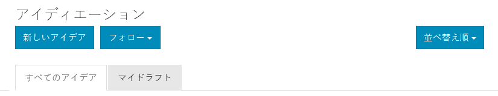
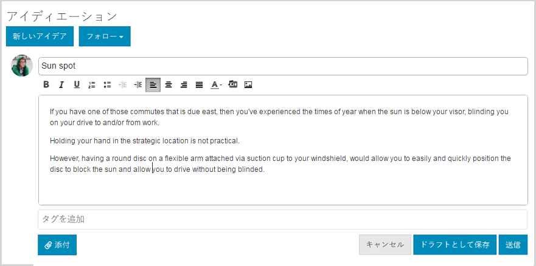
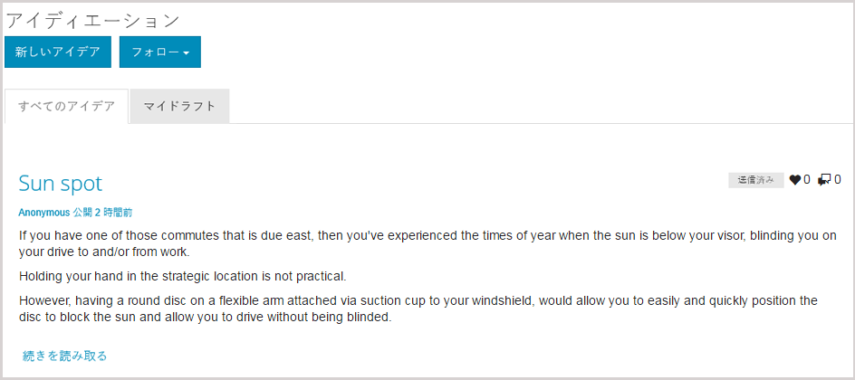
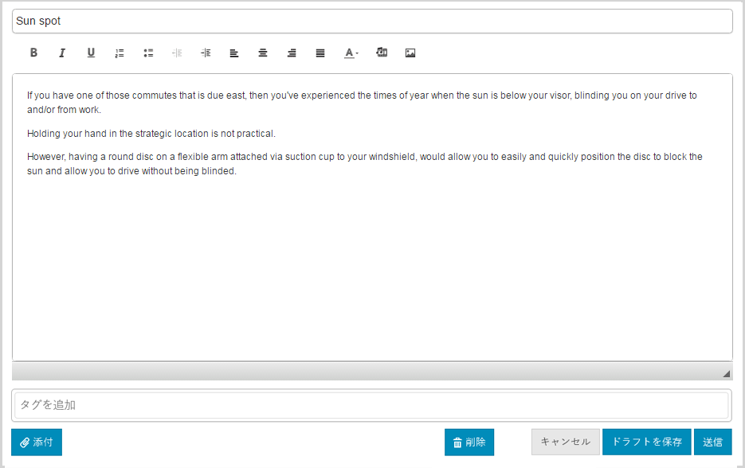
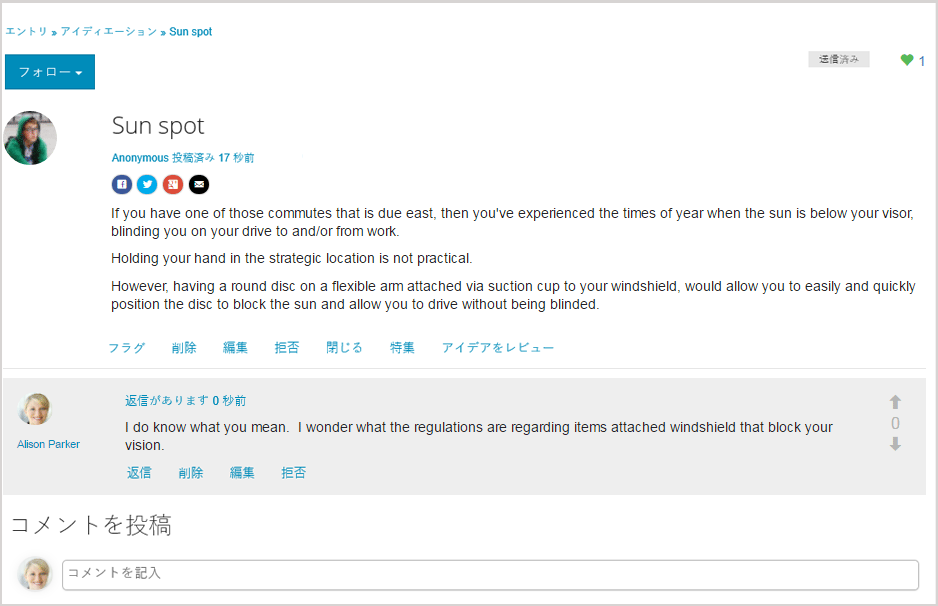

# アイディエーション機能  {#ideation-feature}

## 概要 {#introduction}

アイディエーション機能は、パブリッシュ環境にサインインしているサイト訪問者（コミュニティメンバー）が以下を実行できる領域を提供します。

* コミュニティと共有するアイデアを作成します。
* アイデアに対する表示とコメント。
* 考えに従って。
* アイデアに投票する。

ドキュメントのこの節では、以下について説明します。

* AEMサイトへの表示機能の追加
* Ideationコンポーネントの設定です。

### ページへのアイディエーションの追加 {#adding-a-ideation-to-a-page}

作成者モードで`Ideation`コンポーネントをページに追加するには、コンポーネントブラウザーを使用して

* `Communities / Ideation`

を探し、ページ上のアイデアを表示する位置にドラッグします。

必要な情報については、[Communities Components Basics](/help/communities/basics.md)を参照してください。

[必要なクライアント側ライブラリ](/help/communities/ideation.md#essentials-for-client-side)が含まれる場合、`Ideation`コンポーネントは次のように表示されます。

### アイディエーションの設定 {#configuring-an-ideation}

アクセスする配置済みの`Ideation`コンポーネントを選択し、編集ダイアログを開く`Configure`アイコンを選択します。

#### 「設定」タブ{#settings-tab}

「**[!UICONTROL 設定]**」タブでは、アイデアとコメントの基本機能を設定します。

* **添付サムネールを許可**
* **添付サムネールの最大サイズ**
* **サムネールの最小画像サイズ**
* **サムネールの最大サイズ**
* **権限を持つメンバーを許可**
* **許可された権限を持つメンバー**
* **作成者編集モードでユーザーが生成したコンテンツをブロックする**
* **アイディエーションのタイトル**

* アイデアの表示タイトル。 デフォルトは `Ideation` です。
* **アイディエーション説明**

   アイデアのサブタイトルとして表示する説明。 初期設定では、説明はありません。

* **1 ページのトピック数**

   ページあたりに表示するアイデア/投稿の数を定義します。 初期設定は 10 です。

* **モデレート**

   オンにした場合、アイデアやコメントの投稿は、投稿サイトに表示される前に承認される必要があります。 初期設定はオフです。

* **閉じる**

   このオプションを選択すると、新しいアイデアやコメントに対するイデエーションフォーラムが閉じられます。 初期設定はオフです。

* **リッチテキストエディター**

   オンにすると、アイデアやコメントはマークアップと共に入力される場合があります。 初期設定はオフです。

* **タグ付けを許可**

   オンにした場合、メンバーは自分の投稿にタグラベルを追加できます（「**[!UICONTROL タグフィールド]**」タブを参照）。 初期設定はオフです。

* **ファイルのアップロードを許可**

   オンにした場合、添付ファイルをアイデアまたはコメントに追加できるようにします。 初期設定はオフです。

* **最大ファイルサイズ**

   `Allow File Uploads`がチェックされている場合にのみ関連します。 このフィールドは、アップロードされるファイルのサイズ（バイト単位）を制限します。 初期設定は104857600(10 Mb)です。

* **許可されるファイルタイプ**

   `Allow File Uploads`がチェックされている場合にのみ関連します。 ドット付きのファイル拡張子をコンマ区切りで指定します（例：.jpg, .jpeg, .png, .doc, .docx, .pdf）。ファイルの種類が指定されている場合、指定されていないファイルはアップロードできません。 初期設定は、すべてのファイルタイプを許可するように指定されません。

* **添付する画像ファイルの最大サイズ**

   「ファイルのアップロードを許可」がオンになっている場合にのみ関連します。 アップロードされた画像ファイルの最大バイト数。 初期設定は2097152(2 Mb)です。

* **応答を許可**

   オンの場合、アイデアに投稿されたコメントへの返信を許可します。 初期設定はオフです。

* **投票を許可**

   オンにした場合、アイデアのコメントに対する投票を許可します。 初期設定はオフです。

* **ユーザーによるコメントおよびトピックの削除を許可**

   オンの場合、メンバーが投稿したコメントやアイデアを削除できるようにします。 初期設定はオフです。

* **フォローを許可**

   オンにした場合、アイデア投稿に次の機能を含めます。これにより、メンバーに新しい投稿の[通知](/help/communities/notifications.md)を受け取ることができます。 初期設定はオフです。

* **電子メール購読を許可**

   オンにした場合、メンバーに電子メールで新しい投稿の通知を許可します([購読](/help/communities/subscriptions.md))。 `Allow Following`を確認し、[電子メールを設定](/help/communities/email.md)する必要があります。 初期設定はオフです。

* **投票を許可**

   オンにした場合、アイデアのコメントに対する投票を許可します。 初期設定はオフです。

* **バッジを表示**

   オンの場合、獲得したバッジと[バッジ](/help/communities/implementing-scoring.md)をメンバーのアイデアと共に表示します。 初期設定はオフです。

* **リストページで返信を受け取らない**

* **おすすめコンテンツを許可**

   チェックすると、アイデアは[特集コンテンツ](/help/communities/featured.md)として識別できます。 初期設定はオフです。

* **メンションを有効化**
* **最大メンション数**
* **UI メンションパターン**

#### 「ユーザーモデレート」タブ{#user-moderation-tab}

「**[!UICONTROL ユーザーモデレート]**」タブで、投稿されたアイデアとコメント（ユーザー生成コンテンツ）の管理方法を指定します。 詳しくは、[ユーザー生成コンテンツのモデレート](/help/communities/moderate-ugc.md)を参照してください。

* **投稿を拒否**

   オンにすると、信頼されたメンバーのモデレーターは、投稿を拒否し、投稿がパブリックフォーラムに表示されないように許可されます。 初期設定はオフです。

* **トピックを閉じる / 再度開く**

   オンにすると、信頼されたメンバーのモデレーターがトピックを閉じて、さらに編集やコメントを行ったり、トピックを再度開いたりすることができます。 初期設定はオフです。

* **投稿にフラグを設定**

   このオプションを選択すると、他のユーザーのトピックやコメントに不適切なフラグを付けることができます。 初期設定はオフです。

* **フラグ設定理由リスト**

   オンにした場合、メンバーは、トピックまたはコメントに不適切なフラグを付ける理由をドロップダウンリストから選択できます。 初期設定はオフです。

* **カスタムフラグ設定理由**

   このオプションを選択すると、トピックやコメントに不適切なフラグを付ける理由をメンバーが自分で入力できます。 初期設定はオフです。

* **モデレートのしきい値**

   モデレーターに通知する前に、トピックまたはコメントにメンバーがフラグを付ける必要がある回数を入力します。 初期設定は1（1回）です。

* **フラグ付けの制限**

   トピックまたはコメントが公開表示に表示されなくなる前にフラグを付ける必要がある回数を入力します。 -1に設定した場合、フラグ付けされたトピックまたはコメントはパブリック表示に表示されません。 それ以外の場合は、この数値をモデレートしきい値以上にする必要があります。 初期設定は 5 です。

#### 「タグフィールド」タブ{#tag-field-tab}

「**[!UICONTROL タグフィールド]**」タブでは、「**[!UICONTROL 設定]**」タブでタグ付けが許可されている場合に、適用できるタグを名前空間に従って制限します。

* **許可された名前空間**

   「**[!UICONTROL 設定]**」タブで`Allow Tagging`がチェックされている場合に関連します。 適用できるタグは、チェック対象の名前空間カテゴリ内のタグに限定されます。 名前空間のリストには、「標準タグ」(デフォルトの名前空間)と「すべてのタグを含む」があります。 初期設定はオフで、すべての名前空間が許可されます。

* **推奨の制限**

   フォーラムに投稿するメンバーに対して提案として表示するタグの数を入力します。 **-1**&#x200B;の値は、制限がないことを意味します。 初期設定は 0 です。

#### 「並べ替え設定」タブ{#sort-settings-tab}

「**[!UICONTROL 並べ替え設定]**」タブで、投稿されたコメントの表示順を指定します。

* **並べ替え**

   許可されている並べ替えの選択項目をすべて選択：`Newest, Oldest, Last Updated, Most Viewed, Most Active, Most Followed and Most Liked`. デフォルトは `Newest, Oldest, Last Updated` です。

* **デフォルトとして設定**

   デフォルトとして表示する、チェック済みの並べ替えオプションの1つをプルダウンして選択します。 デフォルトは `Newest` です。

* **Analytics 並べ替えのタイムオプションを選択**

   プルダウンして`All, Last 24 Hours, Last 7 Days, Last 30 Days`の1つを選択します。 デフォルトは `All` です。

## サイト訪問者のエクスペリエンス {#site-visitor-experience}

### アイデアの作成 {#creating-idea}

Communities のすべての機能と同様に、サインインしていない場合、サイト訪問者はアイデアを読むことと、他のユーザーの（コメントや投票／「いいね!」を通じた）意見を見ることしかできません。

メンバーはサインインすると、新しいアイデアを作成できます。

アイデアを送信する前に、ドラフトとして保存できます。

`Save as Draft`ボタンを選択すると、ドラフトが保存されます。

保存したドラフトを「`My Drafts`」タブで表示する場合は、「`Read More`」を選択して編集モードに戻ります。

#### フィードバックの提供 {#providing-feedback}

アイデアが投稿されると、他のメンバーはサインインし、アイデア(`Read More`)を開き、アイデアと同様にして、投票数に追加し、コメントを行うことができます。

### 追加情報 {#additional-information}

開発者向けの詳細情報は、[アイディエーションの基本事項](/help/communities/ideation.md)ページを参照してください。

投稿されたトピックとコメントのモデレートについては、[ユーザー生成コンテンツのモデレート](/help/communities/moderate-ugc.md)を参照してください。

投稿されたトピックとコメントのタグ付けについては、[ユーザー生成コンテンツのタグ付け](/help/communities/tag-ugc.md)を参照してください。
