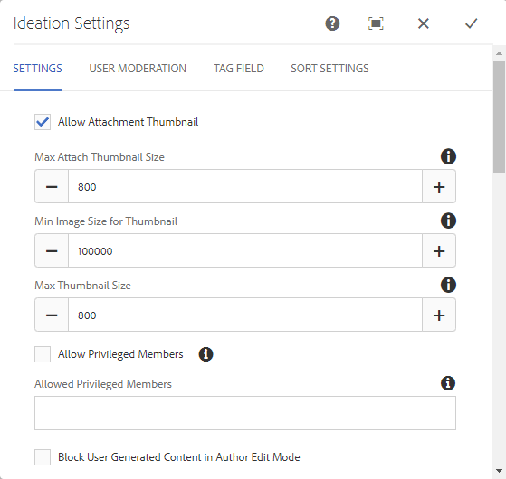

# アイディエーション機能  {#ideation-feature}

## はじめに {#introduction}

アイディエーション機能は、パブリッシュ環境にサインインしているサイト訪問者（コミュニティメンバー）が以下を実行できる領域を提供します。

* コミュニティと共有するアイデアを作成します。
* アイデアの表示とコメント。
* 考えに従う。
* アイデアに投票します。

このドキュメントの節では、以下について説明します。

* アイディエーション機能をAEMサイトに追加する。
* アイディエーションコンポーネントの設定。

### ページへのアイディエーションの追加 {#adding-a-ideation-to-a-page}

`Ideation`コンポーネントをオーサリングモードでページに追加するには、コンポーネントブラウザーを使用して

* `Communities / Ideation`

を探し、ページ上のアイデアを表示する位置にドラッグします。

必要な情報については、[コミュニティコンポーネントの基本](/help/communities/basics.md)を参照してください。

[必須のクライアント側ライブラリ](/help/communities/ideation.md#essentials-for-client-side)を含めると、`Ideation`コンポーネントは次のように表示されます。

### アイディエーションの設定 {#configuring-an-ideation}

配置済みの`Ideation`コンポーネントを選択し、`Configure`アイコンを選択すると、編集ダイアログが開きます。

#### 「設定」タブ{#settings-tab}

「**[!UICONTROL 設定]**」タブでは、アイデアとコメントの基本機能を設定します。

* **添付サムネールを許可**
* **添付サムネールの最大サイズ**
* **サムネールの最小画像サイズ**
* **サムネールの最大サイズ**
* **権限を持つメンバーを許可**
* **許可された権限を持つメンバー**
* **作成者編集モードでユーザーが生成したコンテンツをブロックする**
* **アイディエーションのタイトル**

* アイデアの表示タイトル。 デフォルトは `Ideation` です。
* **アイディエーション説明**

   アイデアのサブタイトルとして表示する説明。 初期設定では、説明はありません。

* **1 ページのトピック数**

   1ページに表示するアイデア/投稿の数を定義します。 初期設定は 10 です。

* **モデレート**

   オンにすると、アイデアやコメントの投稿を公開サイトに表示する前に承認が必要になります。 初期設定はオフです。

* **閉じる**

   オンにすると、アイディエーションフォーラムは新しいアイデアやコメントを受け付けなくなります。 初期設定はオフです。

* **リッチテキストエディター**

   オンにすると、マークアップを使用してアイデアとコメントを入力できます。 初期設定はオフです。

* **タグ付けを許可**

   オンにすると、メンバーは自分の投稿にタグラベルを追加できます（**[!UICONTROL タグフィールド]**&#x200B;タブを参照）。 初期設定はオフです。

* **ファイルのアップロードを許可**

   オンにすると、アイデアまたはコメントに添付ファイルを追加できます。 初期設定はオフです。

* **最大ファイルサイズ**

   `Allow File Uploads`がオンの場合にのみ関連します。 このフィールドは、アップロードするファイルのサイズ（バイト単位）を制限します。 初期設定は104857600(10 Mb)です。

* **許可されるファイルタイプ**

   `Allow File Uploads`がオンの場合にのみ関連します。 ドット付きのファイル拡張子をコンマ区切りで指定します（例：.jpg, .jpeg, .png, .doc, .docx, .pdf）。ファイルタイプを指定すると、指定されていないファイルはアップロードできません。 デフォルトでは、すべてのファイルタイプが許可されるように指定されていません。

* **添付する画像ファイルの最大サイズ**

   「ファイルのアップロードを許可」がオンの場合にのみ関連します。 アップロードされた画像ファイルの最大バイト数。 初期設定は2097152(2 Mb)です。

* **応答を許可**

   オンにすると、アイデアに投稿されたコメントに対する返信を許可します。 初期設定はオフです。

* **投票を許可**

   オンにすると、アイデアのコメントに投票できます。 初期設定はオフです。

* **ユーザーによるコメントおよびトピックの削除を許可**

   オンにすると、メンバーは自分が投稿したコメントやアイデアを削除できます。 初期設定はオフです。

* **フォローを許可**

   オンにすると、アイデアの投稿に次の機能が含まれ、メンバーは新しい投稿の[通知](/help/communities/notifications.md)を受け取ることができます。 初期設定はオフです。

* **電子メール購読を許可**

   オンにすると、新しい投稿をEメールでメンバーに通知できます（[購読](/help/communities/subscriptions.md)）。 `Allow Following`を確認し、[電子メールを設定](/help/communities/email.md)する必要があります。 初期設定はオフです。

* **投票を許可**

   オンにすると、アイデアのコメントに投票できます。 初期設定はオフです。

* **バッジを表示**

   オンにすると、獲得したバッジと割り当てられた[バッジ](/help/communities/implementing-scoring.md)がメンバーのアイデアと共に表示されます。 初期設定はオフです。

* **リストページに返信しない**

* **おすすめコンテンツを許可**

   オンにすると、アイデアを[おすすめコンテンツ](/help/communities/featured.md)として識別できます。 初期設定はオフです。

* **メンションを有効化**
* **最大メンション数**
* **UI メンションパターン**

#### 「ユーザーモデレート」タブ{#user-moderation-tab}

「**[!UICONTROL ユーザーモデレート]**」タブで、投稿されたアイデアとコメント（ユーザー生成コンテンツ）の管理方法を指定します。 詳しくは、[ユーザー生成コンテンツのモデレート](/help/communities/moderate-ugc.md)を参照してください。

* **投稿を拒否**

   オンにすると、信頼されているメンバーモデレーターは投稿を拒否し、公開フォーラムに投稿が表示されなくなります。 初期設定はオフです。

* **トピックを閉じる / 再度開く**

   オンにすると、信頼されているメンバーモデレーターがトピックを閉じて、さらに編集やコメントを行ったり、トピックを再度開いたりできます。 初期設定はオフです。

* **投稿にフラグを設定**

   オンにすると、メンバーは他のユーザーのトピックまたはコメントに「不適切」のフラグを設定できます。 初期設定はオフです。

* **フラグ設定理由リスト**

   オンにすると、メンバーはトピックまたはコメントに「不適切」のフラグを設定した理由をドロップダウンリストから選択できます。 初期設定はオフです。

* **カスタムフラグ設定理由**

   オンにすると、メンバーはトピックまたはコメントに「不適切」のフラグを設定した独自の理由を入力できます。 初期設定はオフです。

* **モデレートのしきい値**

   メンバーがトピックまたはコメントに何回フラグを設定したらモデレーターに通知するかを指定します。 初期設定は1（1回）です。

* **フラグ付けの制限**

   トピックまたはコメントに何回フラグを設定したら、公開表示から非表示にするかを入力します。 -1に設定した場合、フラグ付きのトピックまたはコメントが公開表示で非表示になることはありません。 それ以外の場合は、この数値をモデレートのしきい値以上にする必要があります。 初期設定は 5 です。

#### 「タグフィールド」タブ{#tag-field-tab}

「**[!UICONTROL タグフィールド]**」タブでは、「**[!UICONTROL 設定]**」タブでタグ付けが許可されている場合に、適用できるタグを名前空間に従って制限します。

* **許可された名前空間**

   「**[!UICONTROL 設定]**」タブで`Allow Tagging`がチェックされている場合に関連します。 適用できるタグは、チェックされた名前空間カテゴリ内のタグに限定されます。 名前空間のリストには、「標準タグ」（デフォルトの名前空間）および「すべてのタグを含む」が含まれます。 初期設定は「なし」です。これは、すべての名前空間が許可されることを意味します。

* **推奨の制限**

   フォーラムに投稿するメンバーに提案として表示するタグの数を入力します。 値&#x200B;**-1**&#x200B;は制限がないことを意味します。 初期設定は 0 です。

#### 「並べ替え設定」タブ{#sort-settings-tab}

「**[!UICONTROL 並べ替え設定]**」タブで、投稿されたコメントを表示する際の並べ替え方法を指定します。

* **並べ替え**

   許可されている並べ替えの選択をすべてオンにします。`Newest, Oldest, Last Updated, Most Viewed, Most Active, Most Followed and Most Liked`. デフォルトは `Newest, Oldest, Last Updated` です。

* **デフォルトとして設定**

   プルダウンして、オンにした並べ替えオプションの1つを選択し、デフォルトとして表示します。 デフォルトは `Newest` です。

* **Analytics 並べ替えのタイムオプションを選択**

   プルダウンして`All, Last 24 Hours, Last 7 Days, Last 30 Days`の1つを選択します。 デフォルトは `All` です。

## サイト訪問者のエクスペリエンス {#site-visitor-experience}

### アイデアの作成 {#creating-idea}

Communities のすべての機能と同様に、サインインしていない場合、サイト訪問者はアイデアを読むことと、他のユーザーの（コメントや投票／「いいね!」を通じた）意見を見ることしかできません。

メンバーはサインインすると、新しいアイデアを作成できます。

アイデアを送信する前に、ドラフトとして保存できます。

「`Save as Draft`」ボタンを選択すると、ドラフトが保存されます。

保存したドラフトを「`My Drafts`」タブで表示する場合は、「`Read More`」を選択して編集モードに戻ります。

#### フィードバックの提供 {#providing-feedback}

アイデアが公開されると、他のメンバーがサインインし、アイデア(`Read More`)を開いて、アイデアに「いいね！」し、投票数に追加してコメントを付けることができます。

### 追加情報 {#additional-information}

開発者向けの詳細情報は、[アイディエーションの基本事項](/help/communities/ideation.md)ページを参照してください。

投稿されたトピックとコメントのモデレートについては、[ユーザー生成コンテンツのモデレート](/help/communities/moderate-ugc.md)を参照してください。

投稿されたトピックとコメントのタグ付けについては、[ユーザー生成コンテンツのタグ付け](/help/communities/tag-ugc.md)を参照してください。
