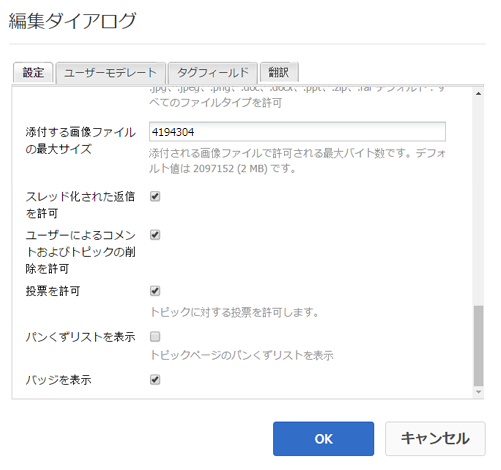
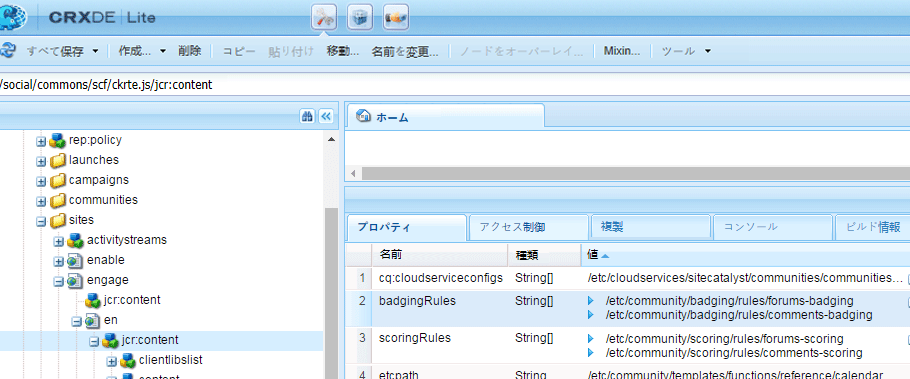
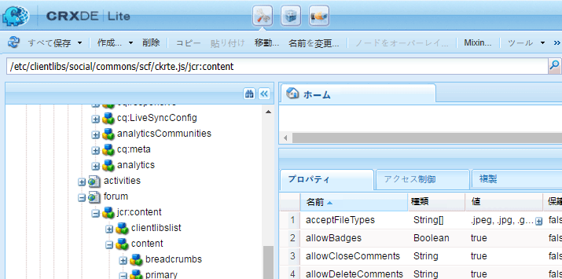

# コミュニティのスコアとバッジ {#communities-scoring-and-badges}

## 概要 {#overview}

AEM Communities のスコアおよびバッジ機能を使用すると、コミュニティメンバーを分類して報奨を与えることができます。

スコアとバッジの主な要素を以下に示します。

* [バッジ](#assign-and-revoke-badges) を割り当てて、コミュニティ内のメンバーの役割を識別します。

* [メンバーの参加を](#enable-scoring) 奨励するためのバッジの基本的な授与（作成されたコンテンツの量）。

* [メンバーをエキスパ](/help/communities/advanced.md) ート（作成されたコンテンツの質）として識別するためのバッジの高度な授与。

**** バッジの授与は、デフォルトで [は有効になっていません](/help/communities/implementing-scoring.md#main-pars-text-237875536)。

>[!CAUTION]
>
>CRXDE Lite で表示される実装の構造は、UI が使用可能になると変化する場合があります。

## バッジ {#badges}

バッジはコミュニティ内でのメンバーの役割または地位を表すためのもので、メンバーの名前の下に配置されます。バッジは、画像または名前として表示できます。 画像として表示される場合、この名前はアクセシビリティの代替テキストとして含まれます。

デフォルトでは、バッジは次の場所にリポジトリがあります。

* `/libs/settings/community/badging/images`

別の場所に格納する場合は、バッジに誰でもアクセスできるようにする必要があります。

UGC 内では、割り当てられたバッジと、ルールに従って獲得されたバッジが区別されます。現在は、割り当てられたバッジがテキストとして表示され、獲得したバッジが画像として表示されます。

### バッジ管理 UI {#badge-management-ui}

コミュニティ[バッジコンソール](/help/communities/badges.md)では、獲得（授与）時やコミュニティで特定の役割を担う（割り当て）時に、メンバーに表示できるカスタムバッジを追加できます。

### 割り当てられたバッジ {#assigned-badges}

役割ベースのバッジは、管理者がコミュニティメンバーに対し、各メンバーのコミュニティ内での役割に基づいて割り当てるものです。

割り当てられた（および待ち受けた）バッジは、選択した[SRP](/help/communities/srp.md)に保存され、直接アクセスできません。 GUIが使用可能になるまで、ロールベースのバッジを割り当てる唯一の方法は、コードまたはcURLを使用することです。 cURLの手順については、[バッジの割り当てと取り消し](#assign-and-revoke-badges)の節を参照してください。

このリリースには、以下の 3 つの役割ベースのバッジが含まれています。

* **モデレーター**

   `/libs/settings/community/badging/images/moderator/jcr:content/moderator.png`

* **グループマネージャー**

   `/libs/settings/community/badging/images/group-manager/jcr:content/group-manager.png`

* **特権を持つメンバー**

   `/libs/settings/community/badging/images/privileged-member/jcr:content/privileged-member.png`

   

### 授与されたバッジ {#awarded-badges}

報奨ベースのバッジは、スコアサービスがコミュニティ内でのメンバーのアクティビティを一定のルールで評価し、その結果としてメンバーに付与されるものです。

アクティビティに対する報奨としてバッジを表示するには、以下の 2 つの設定をする必要があります。

* 機能コンポーネントに対してバッジを[有効](#enableforcomponent)にする必要があります。
* スコアルールとバッジルールは、コンポーネントが配置されるページ（または上位ページ）に[適用](#applytopage)する必要があります。

このリリースには、以下の 3 つの報奨ベースのバッジが含まれています。

* **金**

   `/libs/settings/community/badging/images/gold-badge/jcr:content/gold.png`

* **銀**

   `/libs/settings/community/badging/images/silver-badge/jcr:content/silver.png`

* **青銅**

   `/libs/settings/community/badging/images/bronze-badge/jcr:content/bronze.png`

   

>[!NOTE]
>
>不適切な投稿としてフラグが付けられた場合に、その投稿にマイナスのポイントを割り当て、スコアの値に反映させるようなスコアルールを設定できます。ただし、バッジを獲得した後は、スコアポイントの削減やスコアルールの変更によって自動的に削除されることはありません。
>
>授与されたバッジは、割り当てられたバッジと同じ方法で取り消すことができます。[バッジの割り当てと取り消し](#assign-and-revoke-badges)の節を参照してください。 今後の改善には、メンバーのバッジを管理するためのUIが含まれます。

### カスタムバッジ {#custom-badges}

カスタムバッジは、[バッジコンソール](/help/communities/badges.md)を使用してインストールし、バッジルールで割り当てるか指定します。

バッジコンソールからインストールすると、カスタムバッジは自動的にパブリッシュ環境にレプリケートされます。

## スコアの有効化 {#enable-scoring}

スコアはデフォルトで有効になっていません。スコアを設定し、有効にしてバッジを授与する基本的な手順は次のとおりです。

* ポイントを獲得するためのルール（[スコアルール](#scoring-rules)）を特定します。
* スコアルールごとに累積されたポイントに対して、[バッジ](#badges)（[バッジルール](#badging-rules)）を割り当てます。

* [スコアルールとバッジルールをコミュニティサイトに適用します](#apply-rules-to-content)。
* [コミュニティ機能のバッジを有効にする](#enable-badges-for-component)。

フォーラムとコメントのデフォルトのスコアとバッジルールを使用してコミュニティサイトのスコアを有効にするには、[クイックテスト](#quick-test)の節を参照してください。

### Apply Rules to Content {#apply-rules-to-content}

スコアとバッジを有効にするには、サイトのコンテンツツリー内の任意のノードに`scoringRules`プロパティと`badgingRules`プロパティを追加します。

サイトが公開済みの場合は、すべてのルールを適用してコンポーネントを有効にした後に、サイトを再公開します。

バッジを有効にしたコンポーネントには、現在のノードまたはその上位ノードのルールが適用されます。

ノードのタイプが`cq:Page`（推奨）の場合は、CRXDE|Liteを使用して、その`jcr:content`ノードにプロパティを追加します。

| **プロパティ** | **タイプ** | **説明** |
|---|---|---|
| badgingRules | 文字列 | [バッジルール](#badging-rules)の配列リスト |
| scoringRules | 文字列 | [スコアルール](#scoring-rules)の配列リスト |

>[!NOTE]
>
>スコアルールがバッジ授与に影響を与えていないように見える場合は、スコアルールがバッジルールの scoringRules でブロックされていないかを確認してください。[バッジルール](#badging-rules)の節を参照してください。

### Enable Badges for Component {#enable-badges-for-component}

スコアルールとバッジルールは、[オーサリングモード](/help/communities/author-communities.md)でコンポーネント設定を編集してバッジを有効にしたコンポーネントのインスタンスに対してのみ有効です。

コンポーネントインスタンスでバッジを表示するかどうかは、ブール型プロパティの `allowBadges` で指定できます。フォーラム、Q&amp;A、コメントコンポーネントの[コンポーネント編集ダイアログ](/help/communities/author-communities.md)で、「**バッジを表示**」というチェックボックスを使用して設定できます。

#### 例：フォーラムコンポーネントインスタンスの allowBadges {#example-allowbadges-for-forum-component-instance}



>[!NOTE]
>
>フォーラム、Q&amp;A およびコメントで見つかった HBS コードを例として使用すると、どのコンポーネントもバッジを表示するようにオーバーレイすることができます。

## スコアルール {#scoring-rules}

スコアルールは、バッジを授与するためのスコア計算の基礎となるものです。

ごく簡単に言うと、スコアルールは、1 つ以上のサブルールから成るリストです。スコアルールは、バッジが有効な場合に適用するルールを識別するために、コミュニティサイトのコンテンツに適用されます。

スコアルールは継承されますが、付加的ではありません。以下に例を示します。

* page2にスコアルール2が含まれ、その上位ページ1にスコアルール1が含まれる場合。
* page2コンポーネントのアクションは、rule1とrule2の両方を呼び出します。
* 両方のルールに同じ`topic/verb`に適用可能なサブルールが含まれる場合：

   * ルール2のサブルールのみがスコアに影響します。
   * 両方のサブルールのスコアは、一緒には追加されません。

1 つ以上のスコアルールが存在するときは、ルールごとに分けてスコアが管理されます。

スコアルールは、タイプ`cq:Page`のノードで、`jcr:content`ノードのプロパティを持ち、それを定義するサブルールのリストを指定します。

スコアは SRP に格納されます。

>[!NOTE]
>
>ベストプラクティスは、各スコアルールに一意の名前を付けることです。
>
>スコアルールの名前はグローバルレベルで一意にする必要があり、末尾を同じ名前にしてはなりません。
>
>*not*&#x200B;の例を次に示します。
>
>/libs/settings/community/scoring/rules/site1/forums-scoring
>/libs/settings/community/scoring/rules/site2/forums-scoring

### Scoring Sub-Rules {#scoring-sub-rules}

スコアサブルールには、コミュニティへの参加状況を表す値を詳細に設定するプロパティが含まれています。

それぞれのスコアサブルールでは、以下を指定します。：

* 追跡されているアクティビティは何ですか？
* 関連する特定のコミュニティ機能は何ですか？
* ポイントは何点取る？

デフォルトではアクションを実行したメンバーにポイントが付与されますが、サブルールでコンテンツの所有者にポイントを付与するよう設定することも可能です（`forOwner`）。

各サブルールには、1 つ以上のスコアルールを含めることができます。

サブルールの名前は、通常、*subject* 、 *object*&#x200B;および&#x200B;*verb*&#x200B;を使用するパターンに従います。 以下に例を示します。

* member-comment-create
* member-receive-vote

サブルールは`cq:Page`型のノードで、 `jcr:content`ノードのプロパティで[動詞とトピック](#topics-and-verbs)を指定します。

<table>
 <tbody>
  <tr>
   <th>プロパティ</th>
   <th>タイプ</th>
   <th> 値の説明</th>
  </tr>
  <tr>
   <td><i><code>VERB</code></i></td>
   <td>Long</td>
   <td>
    <ul>
     <li>必須です。動詞はイベントアクションに対応します。</li>
     <li>少なくとも 1 つの動詞プロパティが必要です。</li>
     <li>動詞はすべて大文字で入力する必要があります。</li>
     <li>複数の動詞プロパティを設定できますが、重複はできません。</li>
     <li>値はこのイベントに適用するスコアです。</li>
     <li>値は正でも負でも構いません。</li>
     <li>このリリースでサポートされる動詞のリストは、「<a href="#topics-and-verbs">トピックと動詞</a>」セクションにあります</li>
    </ul> </td>
  </tr>
  <tr>
   <td><code>topics</code></td>
   <td>文字列</td>
   <td>
    <ul>
     <li>オプションです。サブルールを、イベントトピックで識別されるコミュニティコンポーネントのみに制限します。</li>
     <li>指定する場合は、イベントトピックの複数値文字列を指定します。</li>
     <li>このリリースのトピックのリストは、「<a href="#topics-and-verbs">トピックと動詞</a>」セクションにあります。</li>
     <li>デフォルトでは、動詞に関連するすべてのトピックに適用されます。</li>
    </ul> </td>
  </tr>
  <tr>
   <td><code>forOwner</code></td>
   <td>ブール値</td>
   <td>
    <ul>
     <li>オプションです。メンバーが自分の所有するコンテンツを操作している場合は関係ありません。</li>
     <li>true の場合は、操作されたコンテンツの所有者にスコアが適用されます。</li>
     <li>false の場合は、操作をおこなうメンバーにスコアが適用されます。</li>
     <li>デフォルトは false です。</li>
    </ul> </td>
  </tr>
  <tr>
   <td><code>scoringType</code></td>
   <td>文字列</td>
   <td>
    <ul>
     <li>オプションです。スコアエンジンを指定します。</li>
     <li>「basic」の場合は、量に基づくスコアエンジンが使用されます。
      <ul>
       <li>このリリースに含まれています。</li>
      </ul> </li>
     <li>「advanced」の場合は、質と量に基づくスコアエンジンが使用されます。
      <ul>
       <li><a href="/help/communities/advanced.md">追加パッケージ</a>が必要です。</li>
      </ul> </li>
     <li>デフォルトは「basic」です。</li>
    </ul> </td>
  </tr>
 </tbody>
</table>

### このリリースに含まれているスコアルールとサブルール  {#included-scoring-rules-and-sub-rules}

このリリースには、[フォーラム機能](/help/communities/functions.md#forum-function)の2つのスコアルールが含まれています（フォーラム機能の「フォーラム」コンポーネントと「コメント」コンポーネント用）。

1. /libs/settings/community/scoring/rules/comments-scoring

   * subRules[] =
/libs/settings/community/scoring/rules/subrules/member-comment-create
/libs/settings/community/scoring/rules/subrules/member-receive-vote
/libs/settings/community/scoring/rules/subrules/member-give-vote
/libs/settings/community/scoring/rules/subrules/member-is-moderated

1. /libs/settings/community/scoring/rules/forums-scoring

   * subRules[] =
/libs/settings/community/scoring/rules/subrules/member-forum-create
/libs/settings/community/scoring/rules/subrules/member-receive-vote
/libs/settings/community/scoring/rules/subrules/member-give-vote
/libs/settings/community/scoring/rules/subrules/member-is-moderated

**備考:**

* `rules`ノードと`sub-rules`ノードの両方がcq:Pageタイプです。

* `subRules` は、ルールのノード[] のString型の属性 `jcr:content` です。

* `sub-rules` は、様々なスコアルールで共有できます。
* `rules` は、リポジトリの場所に配置され、全員に対して読み取り権限が付与されます。

   * ルール名は、場所に関係なく一意である必要があります。

### カスタムスコアルールのアクティベート {#activating-custom-scoring-rules}

オーサー環境でスコアルールやサブルールに対して行った変更や追加は、パブリッシュ環境にインストールする必要があります。

## Badging Rules {#badging-rules}

バッジルールでは、以下を指定することで、スコアルールをバッジにリンクします。

* スコアルール
* 特定のバッジを待機するために必要なスコア

バッジルールは `cq:Page` タイプのノードであり、その `jcr:content` ノードのプロパティで、スコアルールをスコアおよびバッジと関連付けます。

バッジルールは必須の `thresholds` プロパティから成り、このプロパティには、バッジに対応付けるスコアの順序付きリストを指定します。スコアは小さい値から順に並べる必要があります。以下に例を示します。

* `1|/libs/settings/community/badging/images/bronze-badge/jcr:content/bronze.png`

   * 1ポイントの獲得に対して、ブロンズバッジが表示されます。

* `60|/libs/settings/community/badging/images/silver-badge/jcr:content/silver.png`

   * シルバーバッジは、60ポイントが累積したときに授与されます。

* `80|/libs/settings/community/badging/images/gold-badge/jcr:content/gold.png`

   * 80ポイントが累積すると、ゴールドバッジが表示されます。

バッジルールは、ポイントの累積方法を決定するスコアルールと組み合わせて使用されます。「[コンテンツへのルールの適用](#apply-rules-to-content)」の節を参照してください。

バッジルールの `scoringRules` プロパティは、そのバッジルールに組み合わせ可能なスコアルールを制限します。

>[!NOTE]
>
>ベストプラクティスは、各 AEM サイトに固有のバッジ画像を作成することです。


<table>
 <tbody>
  <tr>
   <th>プロパティ</th>
   <th>タイプ</th>
   <th>値の説明</th>
  </tr>
  <tr>
   <td>thresholds</td>
   <td>文字列</td>
   <td>（必須）「number|path」という形式の複数値文字列<em></em>
    <ul>
     <li>number = スコア</li>
     <li>| = 縦線の文字（U+007C）</li>
     <li>path = バッジ画像リソースへのフルパス</li>
    </ul> 文字列は、数値が値で増加し、数値とパスの間に空白が出ないように順序付ける必要があります。<br /> エントリの例：<br /> <code>80|/libs/settings/community/badging/images/gold-badge/jcr:content/gold.png</code></td>
  </tr>
  <tr>
   <td>badgingType</td>
   <td>文字列</td>
   <td><em>（オプション）</em> スコアエンジンを「basic」または「advanced」として識別します。高度なスコアエンジンが必要な場合は、<a href="/help/communities/advanced.md">高度なスコアとバッジ</a>を参照してください。 デフォルトは「basic」です。</td>
  </tr>
  <tr>
   <td>scoringRules</td>
   <td>文字列</td>
   <td>（<em>オプションの</em>）バッジルールをスコアルールで識別されるスコアイベントに制限する複数値文字列</td>
  </tr>
 </tbody>
</table>

### このリリースに含まれるバッジルール {#included-badging-rules}

このリリースには、[フォーラムとコメントのスコアルール](#includedscoringrules)に対応する 2 つのバッジルールが含まれています。

* `/libs/settings/community/badging/rules/comments-badging`

* `/libs/settings/community/badging/rules/forums-badging`

**備考:**

* `rules` ノードのタイプはcq:Pageです。
* `rules` は、リポジトリの場所に配置され、全員に対して読み取り権限が付与されます。

   * ルール名は、場所に関係なく一意である必要があります。

### カスタムバッジルールのアクティベート {#activating-custom-badging-rules}

オーサー環境でバッジルールまたはバッジ画像の変更や追加をおこなった場合は、それをパブリッシュ環境でインストールする必要があります。

## バッジの割り当てと取り消し  {#assign-and-revoke-badges}

メンバーへのバッジの割り当ては、[メンバーコンソール](/help/communities/members.md#badges-tab)を使用するか、プログラムで cURL コマンドを使用して、おこなうことができます。

以下の cURL コマンドは、バッジの割り当てと取り消しの HTTP リクエストで必要とされる要素を示しています。基本的な形式は以下のとおりです。

cURL -i -XPOST-H *header* -u *signin* -F *operation* -F *badge* *member-profile-url*

*header*  = &quot;Accept:application/json&quot;カスタムヘッダーをサーバーに渡す（必須）

*signin*  = administrator-id:password例：admin:admin

*operation*  = &quot;:operation=social:assignBadge&quot; OR &quot;:operation=social:deleteBadge&quot;

*badge*  = &quot;badgeContentPath=*badge-image-file*&quot;

*badge-image-file*  =リポジトリ内のバッジ画像ファイルの場所。次に例を示します。/libs/settings/community/badging/images/moderator/jcr:content/moderator.png

*member-profile-url*  =パブリッシュ環境のメンバーのプロファイルのエンドポイント(例：https://&lt;server>:&lt;port>/home/users/community/riley/profile.social.json

>[!NOTE]
>
>*member-profile-url*:
>
>* [トンネルサービス](/help/communities/users.md#tunnel-service)が有効な場合は、オーサーインスタンスを参照できます。
>* 難解でランダムな名前にすることができます。許可可能IDについては、[セキュリティチェックリスト](/help/sites-administering/security-checklist.md#verify-that-you-are-not-disclosing-personally-identifiable-information-in-the-users-home-path)を参照してください。


### 例： {#examples}

#### モデレーターバッジの割り当て {#assign-a-moderator-badge}

```shell
curl -i -X POST -H "Accept:application/json" -u admin:admin -F ":operation=social:assignBadge" -F "badgeContentPath=/libs/settings/community/badging/images/moderator/jcr:content/moderator.png" /home/users/community/updcs9DndLEI74DB9zsB/profile.social.json
```

#### 割り当て済みのシルバーバッジの取り消し {#revoke-an-assigned-silver-badge}

```shell
curl -i -X POST -H "Accept:application/json" -u admin:admin -F ":operation=social:deleteBadge" -F "badgeContentPath=/libs/settings/community/badging/images/silver/jcr:content/silver.png" /home/users/community/updcs9DndLEI74DB9zsB/profile.social.json
```

>[!NOTE]
>
>cURL を使用したバッジの割り当てと取り消しは、どのバッジ画像でも機能します。ただし、獲得されたバッジではなく割り当てられたバッジの場合は、割り当てられたバッジとしてマークされ、相応に処理されます。

## カスタムコンポーネント用のスコアとバッジ  {#scoring-and-badges-for-custom-components}

カスタムコンポーネント用に作成されたイベントトピックを動詞と関連付けることで、カスタムコンポーネント用のスコアルールとバッジルールを作成できます。

## トピックと動詞  {#topics-and-verbs}

メンバーがコミュニティ機能を操作すると、通知やスコアなどの非同期リスナーを呼び出すイベントが送信されます。

コンポーネントのSocialEventインスタンスは、`topic`に対して発生した`actions`としてイベントを記録します。 SocialEventには、アクションに関連付けられた`verb`を返すメソッドが含まれます。 `actions`と`verbs`の間に&#x200B;*n-1*&#x200B;の関係があります。

配信されるコミュニティコンポーネントについて、次の表では、[スコアサブルール](#scoring-sub-rules)で使用可能な各`topic`に対して定義された`verbs`について説明します。

>[!NOTE]
>
>コンポーネントインスタンスでバッジを表示するかどうかは、新しいブール型プロパティの `allowBadges` で指定できます。**「バッジを表示**」というラベルのチェックボックスを使用して、更新された[コンポーネント編集ダイアログ](/help/communities/author-communities.md)で設定できます。

**[カレンダーコンポーネント](/help/communities/calendar.md)** SocialEvent `topic`=  = com/adobe/cq/social/calendar

| **動詞** | **説明** |
|---|---|
| POST | メンバーがカレンダーイベントを作成する |
| ADD | メンバーがカレンダーイベントについてコメントする |
| UPDATE | メンバーのカレンダーイベントまたはコメントが編集される |
| DELETE | メンバーのカレンダーイベントまたはコメントが削除される |

**[コメントコンポーネント](/help/communities/comments.md)** SocialEvent `topic`=  = com/adobe/cq/social/comment

| **動詞** | **説明** |
|---|---|
| POST | メンバーがコメントを作成する |
| 追加 | メンバーがコメントに返信する |
| 更新 | メンバーのコメントが編集される |
| DELETE | メンバーのコメントが削除される |

**[ファイルライブラリコンポーネント](/help/communities/file-library.md)** SocialEvent `topic`=  = com/adobe/cq/social/fileLibrary

| **動詞** | **説明** |
|---|---|
| POST | メンバーがフォルダーを作成する |
| ATTACH | メンバーがファイルをアップロードする |
| 更新 | メンバーがフォルダーまたはファイルを更新する |
| DELETE | メンバーがフォルダーまたはファイルを削除する |

**[フォーラムコンポーネント](/help/communities/forum.md)** SocialEvent `topic`=  = com/adobe/cq/social/forum

| **動詞** | **説明** |
|---|---|
| POST | メンバーがフォーラムトピックを作成する |
| 追加 | メンバーがフォーラムトピックに返信する |
| 更新 | メンバーのフォーラムトピックまたは返信が編集される |
| DELETE | メンバーのフォーラムトピックまたは返信が削除される |

**[ジャーナルコンポーネント](/help/communities/blog-feature.md)** SocialEvent `topic`=  = com/adobe/cq/social/journal

| **動詞** | **説明** |
|---|---|
| POST | メンバーがブログ記事を作成する |
| 追加 | メンバーがブログ記事にコメントする |
| 更新 | メンバーのブログ記事またはコメントが編集される |
| DELETE | メンバーのブログ記事またはコメントが削除される |

**[Q&amp;A コンポーネント](/help/communities/working-with-qna.md)** SocialEvent `topic` = com/adobe/cq/social/qna

| **動詞** | **説明** |
|---|---|
| POST | メンバーが Q&amp;A の質問を作成する |
| 追加 | メンバーが Q&amp;A の回答を作成する |
| 更新 | メンバーの Q&amp;A の質問または回答が編集される |
| SELECT | メンバーの回答が選択される |
| UNSELECT | メンバーの回答の選択が解除される |
| DELETE | メンバーの Q&amp;A の質問または回答が削除される |

**[レビューコンポーネント](/help/communities/reviews.md)** SocialEvent `topic`=  = com/adobe/cq/social/review

| **動詞** | **説明** |
|---|---|
| POST | メンバーがレビューを作成する |
| 更新 | メンバーのレビューが編集される |
| DELETE | メンバーのレビューが削除される |

**[評](/help/communities/rating.md)**
価ComponentSocialEvent  `topic`= com/adobe/cq/social/tally/rating

| **動詞** | **説明** |
|---|---|
| ADD RATING | メンバーのコンテンツの評価が上がった |
| REMOVE RATING | メンバーのコンテンツの評価が下がった |

**[投票](/help/communities/voting.md)**
ComponentSocialEvent  `topic`= com/adobe/cq/social/tally/voting

| **動詞** | **説明** |
|---|---|
| ADD VOTING | メンバーのコンテンツに賛成票が投じられた |
| REMOVE VOTING | メンバーのコンテンツに反対票が投じられた |

**モデレート対応コンポーネント** SocialEvent `topic`=  = com/adobe/cq/social/moderation

| **動詞** | **説明** |
|---|---|
| DENY | メンバーのコンテンツが拒否される |
| FLAG-AS-INAPPROPRIATE | メンバーのコンテンツにフラグが付けられる |
| UNFLAG-AS-INAPPROPRIATE | メンバーのコンテンツのフラグが解除される |
| ACCEPT | メンバーのコンテンツがモデレーターにより承認される |
| CLOSE | メンバーがコメントの編集と返信を閉じる |
| OPEN | メンバーがコメントを再度開く |

### カスタムコンポーネントイベント {#custom-component-events}

カスタムコンポーネントの場合、 SocialEventがインスタンス化され、コンポーネントのイベントが`topic`に対して発生した`actions`として記録されます。

スコアリングをサポートするには、SocialEventでメソッド`getVerb()`を上書きして、各`action`に対して適切な`verb`が返されるようにする必要があります。 アクションに対して返される`verb`は、一般的に使用されるもの（`POST`など）や、コンポーネント専用のもの（`ADD RATING`など）です。 `actions`と`verbs`の間に&#x200B;*n-1*&#x200B;の関係があります。

## トラブルシューティング {#troubleshooting}

### バッジが表示されない  {#badges-are-not-appearing}

スコアルールとバッジルールがWebサイトのコンテンツに適用されているが、どのアクティビティに対してもバッジが認識されない場合は、そのコンポーネントのインスタンスでバッジが有効になっていることを確認します。

[コンポーネントのバッジを有効にする](#enable-badges-for-component)を参照してください。

### スコアルールが反映されない {#scoring-rule-has-no-effect}

スコアルールとバッジルールを Web サイトのコンテンツに適用したのに、バッジが一部のアクションにしか授与されない場合は、バッジルールの適用先のスコアルールが制限されていないかを確認してください。

[バッジルール](#badging-rules)の`scoringRules`プロパティを参照してください。

### 大文字と小文字のタイプミス {#case-sensitive-typo}

ほとんどのプロパティや値（特に動詞）では、大文字と小文字が区別されます。スコアサブルールで動詞を使用する場合は、動詞をすべて大文字にする必要があります。

この機能が予想どおり動作しない場合は、データが正しく入力されているかを確認してください。

## クイックテスト  {#quick-test}

[Getting Started Tutorial](/help/communities/getting-started.md)（engage）サイトを使用すると、スコアとバッジを簡単に試すことができます。

* 作成者のCRXDE Liteにアクセスします。
* ベースページを参照します。

   * /content/sites/engage/en/jcr:content

* badgingRulesプロパティを追加します。

   * **名前**：`badgingRules`
   * **型**：`String`
   * **マルチ**&#x200B;を選択します。
   * **追加**&#x200B;を選択します。
   * Enter `/libs/settings/community/badging/rules/forums-badging`
   *  **+**
   * `/libs/settings/community/badging/rules/comments-badging`と入力します。
   * 「**OK**」を選択します。

* scoringRulesプロパティを追加します。

   * **名前**：`scoringRules`
   * **型**：`String`
   * **マルチ**&#x200B;を選択します。
   * **追加**&#x200B;を選択します。
   * `/libs/settings/community/scoring/rules/forums-scoring`と入力します。
   *  **+**
   * `/libs/settings/community/scoring/rules/comments-scoring`と入力します。
   * 「**OK**」を選択します。

* 「**すべて保存**」を選択します。



次に、フォーラムおよびコメントコンポーネントでバッジを表示できるようにします。

* 再びCRXDE Lite。
* フォーラムコンポーネントを参照します。

   * `/content/sites/engage/en/forum/jcr:content/content/primary/forum`

* 必要に応じて、allowBadgesブール型プロパティを追加し、trueに設定する。

   * **名前**：`allowBadges`
   * **型**：`Boolean`
   * **値**: `true`



次に、コミュニティサイトを[再公開](/help/communities/sites-console.md#publishing-the-site)します。

最後に、

* パブリッシュインスタンス上のコンポーネントを参照します。
* コミュニティメンバーとしてログインします(例：weston.mccall@dodgit.com /パスワード)。
* 新しいフォーラムトピックを投稿します。
* バッジを表示するには、ページを更新する必要があります。

   * ログアウトし、別のコミュニティメンバーとしてログインします(例：aaron.mcdonald@mailinator.com/password)に置き換えます。

* フォーラムを選択します。

フォーラムトピックを投稿したコミュニティメンバーを見ると、ブロンズバッジが表示されているはずです。これは、最初のフォーラムバッジルールの最初のしきい値のスコアが 1 であるからです。


## 追加情報 {#additional-information}

詳しくは、開発者向けの[スコアとバッジの基本事項](/help/communities/configure-scoring.md)ページを参照してください。

高度なスコアエンジンについて詳しくは、[高度なスコアとバッジ](/help/communities/advanced.md)を参照してください。

設定可能なリーダーボード[コンポーネント](/help/communities/enabling-leaderboard.md)と[機能](/help/communities/functions.md#leaderboard-function)を使用すると、コミュニティサイト上でメンバーとメンバーのスコアを簡単に表示できます。
