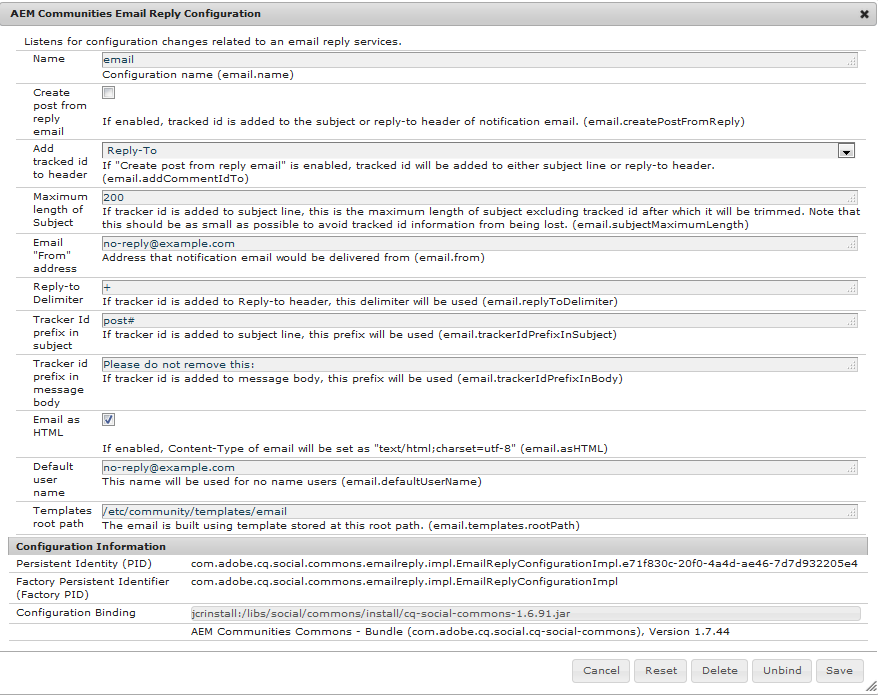

# コミュニティのスコアとバッジ {#communities-scoring-and-badges}

## 概要 {#overview}

AEM Communities のスコアおよびバッジ機能を使用すると、コミュニティメンバーを分類して報奨を与えることができます。

スコアとバッジの主な要素を以下に示します。

* [コミュニティ内のメンバーの役割を識別するためのバッジ](#assign-and-revoke-badges) を割り当てます。

* [会員の参加を促すためのバッジの基本的な付与](#enable-scoring) （コンテンツの作成数量）。
* [メンバーをエキスパートとして識別するため](/help/communities/advanced.md) 、バッジの高度な付与（コンテンツの作成品質）。

**バッジの付与は** 、デフォルトでは [有効になっていません](/help/communities/implementing-scoring.md#main-pars-text-237875536)。

>[!CAUTION]
>
>CRXDE Lite で表示される実装の構造は、UI が使用可能になると変化する場合があります。


## バッジ {#badges}

バッジはコミュニティ内でのメンバーの役割または地位を表すためのもので、メンバーの名前の下に配置されます。バッジは、画像または名前で表示できます。 画像として表示される場合、アクセシビリティ用の代替テキストとして名前が含まれます。

デフォルトでは、バッジはリポジトリの次の場所にあります。

* `/libs/settings/community/badging/images`

別の場所に格納する場合は、バッジに誰でもアクセスできるようにする必要があります。

UGC 内では、割り当てられたバッジと、ルールに従って獲得されたバッジが区別されます。現在、割り当てられたバッジがテキストとして表示され、獲得したバッジが画像として表示されます。

### バッジ管理 UI {#badge-management-ui}

The Communities [Badges console](/help/communities/badges.md) provides the ability to add custom badges which can be displayed for a member when earned (awarded) or when they take on a specific role in the community (assigned).

### 割り当てられたバッジ {#assigned-badges}

役割ベースのバッジは、管理者がコミュニティメンバーに対し、各メンバーのコミュニティ内での役割に基づいて割り当てるものです。

Assigned (and awared) badges are stored in the selected [SRP](/help/communities/srp.md) and are not directly accessible. GUIが使用可能になるまで、ロールベースのバッジを割り当てる唯一の方法は、コードまたはcURLを使用して割り当てることです。 For cURL instructions, see the section titled [Assign and Revoke Badges](#assign-and-revoke-badges).

このリリースには、以下の 3 つの役割ベースのバッジが含まれています。

* **司会者**

   `/libs/settings/community/badging/images/moderator/jcr:content/moderator.png`

* **グループマネージャ**

   `/libs/settings/community/badging/images/group-manager/jcr:content/group-manager.png`

* **特権的な会員**

   `/libs/settings/community/badging/images/privileged-member/jcr:content/privileged-member.png`


### 授与されたバッジ {#awarded-badges}

報奨ベースのバッジは、スコアサービスがコミュニティ内でのメンバーのアクティビティを一定のルールで評価し、その結果としてメンバーに付与されるものです。

アクティビティに対する報奨としてバッジを表示するには、以下の 2 つの設定をする必要があります。

* Badging must be [enabled](#enableforcomponent) for the feature component.
* Scoring and badging rules must be [applied](#applytopage) to the page (or ancestor) on which the component is placed.

このリリースには、以下の 3 つの報奨ベースのバッジが含まれています。

* **金**

   `/libs/settings/community/badging/images/gold-badge/jcr:content/gold.png`

* **銀**

   `/libs/settings/community/badging/images/silver-badge/jcr:content/silver.png`

* **青銅**

   `/libs/settings/community/badging/images/bronze-badge/jcr:content/bronze.png`


>[!NOTE]
>
>不適切な投稿としてフラグが付けられた場合に、その投稿にマイナスのポイントを割り当て、スコアの値に反映させるようなスコアルールを設定できます。ただし、一度獲得したバッジは、スコアリングポイントの減少またはスコアリングルールの変更により、自動的に削除されません。
>
>授与されたバッジは、割り当てられたバッジと同じ方法で取り消すことができます。See the [Assign and Revoke Badges](#assign-and-revoke-badges) section. 今後の改善には、メンバーのバッジを管理するUIが含まれます。


### カスタムバッジ {#custom-badges}

Custom badges can be installed using the [Badges console](/help/communities/badges.md) and either assigned or specified in badging rules.

バッジコンソールからインストールすると、カスタムバッジは自動的にパブリッシュ環境にレプリケートされます。

## スコアの有効化 {#enable-scoring}

スコアはデフォルトで有効になっていません。スコアリングを設定し、有効にしてバッジを付与する基本的な手順は次のとおりです。

* Identify rules for earning points ([scoring rules](#scoring-rules)).
* For points accumulated per scoring rules, assign [badges](#badges) ([badging rules](#badging-rules)).

* [コミュニティサイトにスコアリングルールとバッジルールを適用します](#apply-rules-to-content)。
* [コミュニティ機能のバッジを有効にする](#enable-badges-for-component)。

See the [Quick Test](#quick-test) section to enable scoring for a community site using the default scoring and badging rules for forums and comments.

### Apply Rules to Content {#apply-rules-to-content}

To enable scoring and badges, add the properties `scoringRules` and `badgingRules` to to any node in the content tree for the site.

サイトが公開済みの場合は、すべてのルールを適用してコンポーネントを有効にした後に、サイトを再公開します。

バッジを有効にしたコンポーネントには、現在のノードまたはその上位ノードのルールが適用されます。

If the node is of type `cq:Page` (recommended), then, using CRXDE|Lite, add the properties to its `jcr:content` node.

| **プロパティ** | **タイプ** | **説明** |
|---|---|---|
| badgingRules | String[] | [バッジルール](#badging-rules)の配列リスト |
| scoringRules | String[] | [スコアルール](#scoring-rules)の配列リスト |

>[!NOTE]
>
>スコアルールがバッジ授与に影響を与えていないように見える場合は、スコアルールがバッジルールの scoringRules でブロックされていないかを確認してください。See the section titled [Badging Rules](#badging-rules).


### Enable Badges for Component {#enable-badges-for-component}

スコアルールとバッジルールは、[オーサリングモード](/help/communities/author-communities.md)でコンポーネント設定を編集してバッジを有効にしたコンポーネントのインスタンスに対してのみ有効です。

コンポーネントインスタンスでバッジを表示するかどうかは、ブール型プロパティの `allowBadges` で指定できます。It is configurable in the [component edit dialog](/help/communities/author-communities.md) for forum, QnA and comment components through a checkbox labeled **Display Badges**.

#### 例：フォーラムコンポーネントインスタンスの allowBadges {#example-allowbadges-for-forum-component-instance}



>[!NOTE]
>
>フォーラム、Q&amp;A およびコメントで見つかった HBS コードを例として使用すると、どのコンポーネントもバッジを表示するようにオーバーレイすることができます。


## スコアルール {#scoring-rules}

スコアルールは、バッジを授与するためのスコア計算の基礎となるものです。

ごく簡単に言うと、スコアルールは、1 つ以上のサブルールから成るリストです。スコアリングルールは、コミュニティサイトのコンテンツに適用され、バッジが有効な場合に適用するルールを識別します。

スコアルールは継承されますが、付加的ではありません。次に例を示します。

* page2にスコアリングルール2が含まれ、その上位のpage1にスコアリングルール1が含まれる場合。
* page2コンポーネント上のアクションは、rule1とrule2の両方を呼び出します。
* If both rules contain applicable sub-rules for the same `topic/verb`:

   * rule2のサブルールのみがスコアに影響を与えます。
   * 両方のサブルールのスコアが一緒に追加されるわけではありません。

1 つ以上のスコアルールが存在するときは、ルールごとに分けてスコアが管理されます。

Scoring rules are nodes of type `cq:Page` with properties on its `jcr:content` node that specify the list of sub-rules that define it.

スコアは SRP に格納されます。

>[!NOTE]
>
>ベストプラクティスは、各スコアルールに一意の名前を付けることです。
>
>スコアルールの名前はグローバルレベルで一意にする必要があり、末尾を同じ名前にしてはなりません。
>
>実行し *ない操作の例* :
>/libs/settings/community/scoring/rules/site1/forums-scoring
>/libs/settings/community/scoring/rules/site2/forums/scoring


### Scoring Sub-Rules {#scoring-sub-rules}

スコアサブルールには、コミュニティへの参加状況を表す値を詳細に設定するプロパティが含まれています。

それぞれのスコアサブルールでは、以下を指定します。：

* 追跡しているアクティビティは何か。
* どのコミュニティ機能が関与しているか
* 何点が落札されるか

デフォルトではアクションを実行したメンバーにポイントが付与されますが、サブルールでコンテンツの所有者にポイントを付与するよう設定することも可能です（`forOwner`）。

各サブルールには、1 つ以上のスコアルールを含めることができます。

The name of the sub-rule typically follows the pattern of using a *subject* , *object* and *verb*. 次に例を示します。

* member-comment-create
* member-receive-vote

Sub-rules are nodes of type `cq:Page` with properties on its `jcr:content`node that specify the [verbs and topics](#topics-and-verbs) .

<table>
 <tbody>
  <tr>
   <th>プロパティ</th>
   <th>タイプ</th>
   <th> 値の説明</th>
  </tr>
  <tr>
   <td><i><code>VERB</code></i></td>
   <td>Long</td>
   <td>
    <ul>
     <li>必須です。動詞はイベントアクションに対応します。</li>
     <li>少なくとも 1 つの動詞プロパティが必要です。</li>
     <li>動詞はすべて大文字で入力する必要があります。</li>
     <li>複数の動詞プロパティを設定できますが、重複はできません。</li>
     <li>値はこのイベントに適用するスコアです。</li>
     <li>値は正でも負でも構いません。</li>
     <li>a list of verbs supported in the release is in the <a href="#topics-and-verbs">Topics and Verbs</a> section</li>
    </ul> </td>
  </tr>
  <tr>
   <td><code>topics</code></td>
   <td>String[]</td>
   <td>
    <ul>
     <li>オプションです。サブルールを、イベントトピックで識別されるコミュニティコンポーネントのみに制限します。</li>
     <li>指定する場合は、イベントトピックの複数値文字列を指定します。</li>
     <li>a list of topics in the release is in the <a href="#topics-and-verbs">Topics and Verbs</a> section</li>
     <li>デフォルトでは、動詞に関連するすべてのトピックに適用されます。</li>
    </ul> </td>
  </tr>
  <tr>
   <td><code>forOwner</code></td>
   <td>Boolean</td>
   <td>
    <ul>
     <li>オプションです。メンバーが自分の所有するコンテンツを操作している場合は関係ありません。</li>
     <li>true の場合は、操作されたコンテンツの所有者にスコアが適用されます。</li>
     <li>false の場合は、操作をおこなうメンバーにスコアが適用されます。</li>
     <li>デフォルトは false です。</li>
    </ul> </td>
  </tr>
  <tr>
   <td><code>scoringType</code></td>
   <td>String</td>
   <td>
    <ul>
     <li>オプションです。スコアエンジンを指定します。</li>
     <li>「basic」の場合は、量に基づくスコアエンジンが使用されます。
      <ul>
       <li>このリリースに含まれています。</li>
      </ul> </li>
     <li>「advanced」の場合は、質と量に基づくスコアエンジンが使用されます。
      <ul>
       <li><a href="/help/communities/advanced.md">追加パッケージ</a>が必要です。</li>
      </ul> </li>
     <li>デフォルトは「basic」です。</li>
    </ul> </td>
  </tr>
 </tbody>
</table>

### このリリースに含まれているスコアルールとサブルール {#included-scoring-rules-and-sub-rules}

Included in the release are two scoring rules for the [Forum Function](/help/communities/functions.md#forum-function) (one each for the Forum and Comments components of the Forum feature) :

1. /libs/settings/community/scoring/rules/comments-scoring

   * subRules[] =/libs/settings/community/scoring/rules/sub-rules/member-comment-create/libs/scoring/rules/sub-rules/member-receive-vote/libs/scoring/rules/sub-rules/member-is-is

1. /libs/settings/community/scoring/rules/forums/scoring

   * subRules[] =/libs/settings/community/scoring/rules/sub-rules/member-forum-create/libs/settings/community/scoring/rules/sub-rules/member-receive-vote/libs/scoring/member-is

**備考:**

* Both `rules` and `sub-rules` nodes are of type cq:Page.

* `subRules` は、ルールの[]`jcr:content` ノード上のString型の属性です。

* `sub-rules` は、様々なスコアリングルール間で共有できます。
* `rules` は、全員に対して読み取り権限を持つリポジトリの場所に配置する必要があります。

   * ルール名は、場所に関係なく一意にする必要があります。

### カスタムスコアルールのアクティベート {#activating-custom-scoring-rules}

作成者環境でスコアリングルールまたはサブルールに対して行われた変更や追加は、発行時にインストールする必要があります。

## Badging Rules {#badging-rules}

バッジルールでは、以下を指定することで、スコアルールをバッジにリンクします。

* スコアリングルール。
* 特定のバッジを待つために必要なスコア。

バッジルールは `cq:Page` タイプのノードであり、その `jcr:content` ノードのプロパティで、スコアルールをスコアおよびバッジと関連付けます。

バッジルールは必須の `thresholds` プロパティから成り、このプロパティには、バッジに対応付けるスコアの順序付きリストを指定します。スコアは小さい値から順に並べる必要があります。次に例を示します。

* `1|/libs/settings/community/badging/images/bronze-badge/jcr:content/bronze.png`

   * 1点を稼ぐためにブロンズのバッジが待っています。

* `60|/libs/settings/community/badging/images/silver-badge/jcr:content/silver.png`

   * 60点が積み重ねられると銀のバッジが贈られます。

* `80|/libs/settings/community/badging/images/gold-badge/jcr:content/gold.png`

   * 80ポイントが積み重なると、金のバッジが待たれます。

バッジルールは、ポイントの累積方法を決定するスコアルールと組み合わせて使用されます。See the section titled [Apply Rules to Content](#apply-rules-to-content).

バッジルールの `scoringRules` プロパティは、そのバッジルールに組み合わせ可能なスコアルールを制限します。

>[!NOTE]
>
>ベストプラクティスは、各 AEM サイトに固有のバッジ画像を作成することです。


<table>
 <tbody>
  <tr>
   <th>プロパティ</th>
   <th>タイプ</th>
   <th>値の説明</th>
  </tr>
  <tr>
   <td>thresholds</td>
   <td>String[]</td>
   <td>（必須）「number|path」という形式の複数値文字列<em></em>
    <ul>
     <li>number = スコア</li>
     <li>| = 縦線の文字（U+007C）</li>
     <li>path = バッジ画像リソースへのフルパス</li>
    </ul> 文字列は、number の値が小さいものから順に並べる必要があります。また、数値とパスの間にスペースを入れないようにします。<br /> 入力例：<br /> <code>80|/libs/settings/community/badging/images/gold-badge/jcr:content/gold.png</code></td>
  </tr>
  <tr>
   <td>badgingType</td>
   <td>String</td>
   <td><em>（オプション）</em> 「基本」または「詳細」としてスコアリングエンジンを識別します。 If the advanced scoring engine is desired, see <a href="/help/communities/advanced.md">Advanced Scoring and Badges</a>. デフォルト値は「basic」です。</td>
  </tr>
  <tr>
   <td>scoringRules</td>
   <td>String[]</td>
   <td>(<em>optional</em>) A multi-value string to restrict the badging rule to scoring events identified by the scoring rules</td>
  </tr>
 </tbody>
</table>

### このリリースに含まれるバッジルール {#included-badging-rules}

このリリースには、[フォーラムとコメントのスコアルール](#includedscoringrules)に対応する 2 つのバッジルールが含まれています。

* /libs/settings/community/badging/rules/comments-badging

* /libs/settings/community/badging/rules/forums-badging

**備考:**

* `rules` ノードのタイプはcq:Pageです。
* `rules` は、全員に対して読み取り権限を持つリポジトリの場所に配置する必要があります。

   * ルール名は、場所に関係なく一意にする必要があります。

### カスタムバッジルールのアクティベート {#activating-custom-badging-rules}

オーサー環境でバッジルールまたはバッジ画像の変更や追加をおこなった場合は、それをパブリッシュ環境でインストールする必要があります。

## バッジの割り当てと取り消し {#assign-and-revoke-badges}

メンバーへのバッジの割り当ては、[メンバーコンソール](/help/communities/members.md#badges-tab)を使用するか、プログラムで cURL コマンドを使用して、おこなうことができます。

以下の cURL コマンドは、バッジの割り当てと取り消しの HTTP リクエストで必要とされる要素を示しています。基本的な形式は以下のとおりです。

cURL -i -X POST -H *header* -u *signin* -F *operation* -F *badge* *member-profile-url*

*header* = &quot;Accept:application/json&quot;カスタムヘッダーをサーバーに渡す（必須）

*signin* = administrator-id:password例： admin:admin

*operation* = &quot;:operation=social:assignBadge&quot; OR &quot;:operation=social:deleteBadge&quot;

*badge* = &quot;badgeContentPath=*badge-image-file*&quot;

*badge-image-file* =リポジトリ内のバッジ画像ファイルの場所です。例： /libs/settings/community/badging/images/moderator/jcr:content/moderator.png

*member-プロファイル-url* =パブリッシュ時のメンバーのプロファイルのエンドポイント。例： https://&lt;サーバー>:&lt;ポート>/home/users/community/riley/profile.social.json

>[!NOTE]
>
>*member-プロファイルURL*:
>
>* May refer to an author instance if the [Tunnel Service](/help/communities/users.md#tunnel-service) is enabled.
>* May be an obscure, random name - see [Security Checklist](/help/sites-administering/security-checklist.md#verify-that-you-are-not-disclosing-personally-identifiable-information-in-the-users-home-path) regarding authorizable ID.

>


### 例: {#examples}

#### モデレーターバッジの割り当て {#assign-a-moderator-badge}

```shell
curl -i -X POST -H "Accept:application/json" -u admin:admin -F ":operation=social:assignBadge" -F "badgeContentPath=/libs/settings/community/badging/images/moderator/jcr:content/moderator.png" /home/users/community/updcs9DndLEI74DB9zsB/profile.social.json
```

#### 割り当て済みのシルバーバッジの取り消し {#revoke-an-assigned-silver-badge}

```shell
curl -i -X POST -H "Accept:application/json" -u admin:admin -F ":operation=social:deleteBadge" -F "badgeContentPath=/libs/settings/community/badging/images/silver/jcr:content/silver.png" /home/users/community/updcs9DndLEI74DB9zsB/profile.social.json
```

>[!NOTE]
>
>cURL を使用したバッジの割り当てと取り消しは、どのバッジ画像でも機能します。ただし、獲得されたバッジではなく割り当てられたバッジの場合は、割り当てられたバッジとしてマークされ、相応に処理されます。

## カスタムコンポーネント用のスコアとバッジ {#scoring-and-badges-for-custom-components}

カスタムコンポーネント用に作成されたイベントトピックを動詞と関連付けることで、カスタムコンポーネント用のスコアルールとバッジルールを作成できます。

## トピックと動詞 {#topics-and-verbs}

メンバーがコミュニティ機能を操作すると、通知やスコアなどの非同期リスナーを呼び出すイベントが送信されます。

A component&#39;s SocialEvent instance records the events as `actions` that occur for a `topic`. The SocialEvent includes a method to return a `verb` associated with the action. There is an *n-1* relationship between `actions` and `verbs`.

For the communities components delivered, the following tables describe the `verbs` defined for each `topic` available for use in [scoring sub-rules](#scoring-sub-rules).

>[!NOTE]
>
>コンポーネントインスタンスでバッジを表示するかどうかは、新しいブール型プロパティの `allowBadges` で指定できます。It will be configurable in updated [component edit dialogs](/help/communities/author-communities.md) through a checkbox labeled **Display Badges**.


**[カレンダーコンポーネント](/help/communities/calendar.md)**SocialEvent`topic`=  = com/adobe/cq/social/calendar

| **動詞** | **説明** |
|---|---|
| POST | メンバーがカレンダーイベントを作成する |
| ADD | メンバーがカレンダーイベントについてコメントする |
| UPDATE | メンバーのカレンダーイベントまたはコメントが編集される |
| DELETE | メンバーのカレンダーイベントまたはコメントが削除される |

**[コメントコンポーネント](/help/communities/comments.md)**SocialEvent`topic`=  = com/adobe/cq/social/comment

| **動詞** | **説明** |
|---|---|
| POST | メンバーがコメントを作成する |
| ADD | メンバーがコメントに返信する |
| UPDATE | メンバーのコメントが編集される |
| DELETE | メンバーのコメントが削除される |

**[ファイルライブラリコンポーネント](/help/communities/file-library.md)**SocialEvent`topic`=  = com/adobe/cq/social/fileLibrary

| **動詞** | **説明** |
|---|---|
| POST | メンバーがフォルダーを作成する |
| ATTACH | メンバーがファイルをアップロードする |
| UPDATE | メンバーがフォルダーまたはファイルを更新する |
| DELETE | メンバーがフォルダーまたはファイルを削除する |

**[フォーラムコンポーネント](/help/communities/forum.md)**SocialEvent`topic`=  = com/adobe/cq/social/forum

| **動詞** | **説明** |
|---|---|
| POST | メンバーがフォーラムトピックを作成する |
| ADD | メンバーがフォーラムトピックに返信する |
| UPDATE | メンバーのフォーラムトピックまたは返信が編集される |
| DELETE | メンバーのフォーラムトピックまたは返信が削除される |

**[ジャーナルコンポーネント](/help/communities/blog-feature.md)**SocialEvent`topic`=  = com/adobe/cq/social/journal

| **動詞** | **説明** |
|---|---|
| POST | メンバーがブログ記事を作成する |
| ADD | メンバーがブログ記事にコメントする |
| UPDATE | メンバーのブログ記事またはコメントが編集される |
| DELETE | メンバーのブログ記事またはコメントが削除される |

**[Q&amp;A コンポーネント](/help/communities/working-with-qna.md)**SocialEvent`topic`= com/adobe/cq/social/qna

| **動詞** | **説明** |
|---|---|
| POST | メンバーが Q&amp;A の質問を作成する |
| ADD | メンバーが Q&amp;A の回答を作成する |
| UPDATE | メンバーの Q&amp;A の質問または回答が編集される |
| SELECT | メンバーの回答が選択される |
| UNSELECT | メンバーの回答の選択が解除される |
| DELETE | メンバーの Q&amp;A の質問または回答が削除される |

**[レビューコンポーネント](/help/communities/reviews.md)**SocialEvent`topic`=  = com/adobe/cq/social/review

| **動詞** | **説明** |
|---|---|
| POST | メンバーがレビューを作成する |
| UPDATE | メンバーのレビューが編集される |
| DELETE | メンバーのレビューが削除される |

**[Rating Component](/help/communities/rating.md)**SocialEvent`topic`= com/adobe/cq/social/tally/rating

| **動詞** | **説明** |
|---|---|
| ADD RATING | メンバーのコンテンツの評価が上がった |
| REMOVE RATING | メンバーのコンテンツの評価が下がった |

**[投票コンポーネント](/help/communities/voting.md)**SocialEvent`topic`= com/adobe/cq/social/tally/voting

| **動詞** | **説明** |
|---|---|
| ADD VOTING | メンバーのコンテンツに賛成票が投じられた |
| REMOVE VOTING | メンバーのコンテンツに反対票が投じられた |

**モデレート対応コンポーネント** SocialEvent `topic`=  = com/adobe/cq/social/moderation

| **動詞** | **説明** |
|---|---|
| DENY | メンバーのコンテンツが拒否される |
| FLAG-AS-INAPPROPRIATE | メンバーのコンテンツにフラグが付けられる |
| UNFLAG-AS-INAPPROPRIATE | メンバーのコンテンツのフラグが解除される |
| ACCEPT | メンバーのコンテンツがモデレーターにより承認される |
| CLOSE | メンバーがコメントの編集と返信を閉じる |
| OPEN | メンバーがコメントを再度開く |

### カスタムコンポーネントイベント {#custom-component-events}

For a custom component, a SocialEvent is instantiated to record the component&#39;s events as `actions` that occur for a `topic`.

To support scoring, the SocialEvent would need to override the method `getVerb()` so that an appropriate `verb` is returned for each `action`. The `verb` returned for an action may be one commonly used (such as `POST`) or one specialized for the component (such as `ADD RATING`). There is an *n-1* relationship between `actions` and `verbs`.

## トラブルシューティング {#troubleshooting}

### バッジが表示されない {#badges-are-not-appearing}

スコアリングおよびバッジルールがWebサイトのコンテンツに適用されているが、どのアクティビティに対してもバッジが検出されない場合は、そのコンポーネントのインスタンスに対してバッジが有効になっていることを確認します。

See [Enable Badges for Component](#enable-badges-for-component).

### スコアルールが反映されない {#scoring-rule-has-no-effect}

スコアルールとバッジルールを Web サイトのコンテンツに適用したのに、バッジが一部のアクションにしか授与されない場合は、バッジルールの適用先のスコアルールが制限されていないかを確認してください。

See the `scoringRules` property of [Badging Rules](#badging-rules).

### 大文字と小文字のタイプミス {#case-sensitive-typo}

ほとんどのプロパティや値（特に動詞）では、大文字と小文字が区別されます。スコアリングサブルールで使用する場合、動詞はすべて大文字にする必要があります。

この機能が予想どおり動作しない場合は、データが正しく入力されているかを確認してください。

## クイックテスト {#quick-test}

[Getting Started Tutorial](/help/communities/getting-started.md)（engage）サイトを使用すると、スコアとバッジを簡単に試すことができます。

* 作成者のCRXDE Liteにアクセスします。
* ベースページを参照します。

   * /content/sites/engage/en/jcr:content

* badgingRules追加プロパティ：

   * **名前**: `badgingRules`
   * **Type**: `String`
   * Select **Multi**
   * Select **Add**
   * Enter `/libs/settings/community/badging/rules/forums-badging`
   *  **+**
   * Enter `/libs/settings/community/badging/rules/comments-badging`
   * 「**OK**」を選択します。

* scoringRules追加プロパティ：

   * **名前**: `scoringRules`
   * **Type**: `String`
   * Select **Multi**
   * Select **Add**
   * Enter `/libs/settings/community/scoring/rules/forums-scoring`
   *  **+**
   * Enter `/libs/settings/community/scoring/rules/comments-scoring`
   * 「**OK**」を選択します。

* Select **Save All**.


次に、フォーラムおよびコメントコンポーネントでバッジを表示できるようにします。

* CRXDE Liteを再び使用する。
* フォーラムコンポーネントを参照します。

   * `/content/sites/engage/en/forum/jcr:content/content/primary/forum`

* 必要に応じて、allowBadgesブール追加プロパティを設定し、それがtrueであることを確認します。

   * **名前**: `allowBadges`
   * **Type**: `Boolean`
   * **値**: `true`


次に、コミュニティサイトを[再公開](/help/communities/sites-console.md#publishing-the-site)します。

最後に、

* パブリッシュインスタンス上のコンポーネントを参照します。
* コミュニティのメンバーとしてサインインする(例： weston.mccall@dodgit.com / password)。
* 新しいフォーラムトピックを投稿します。
* バッジを表示するには、ページを更新する必要があります。

   * 別のコミュニティメンバーとしてログアウトし、ログインする(例： aaron.mcdonald@mailinator.com/password)。

* フォーラムを選択します。

フォーラムトピックを投稿したコミュニティメンバーを見ると、ブロンズバッジが表示されているはずです。これは、最初のフォーラムバッジルールの最初のしきい値のスコアが 1 であるからです。


## 追加情報 {#additional-information}

More information may be found on the [Scoring and Badges Essentials](/help/communities/configure-scoring.md) page for developers.

For information on the advanced scoring engine, see [Advanced Scoring and Badges](/help/communities/advanced.md).

The configurable Leaderboard [component](/help/communities/enabling-leaderboard.md) and [function](/help/communities/functions.md#leaderboard-function) simplifies the display of members and their scores on a community site.
