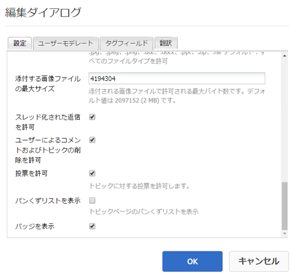
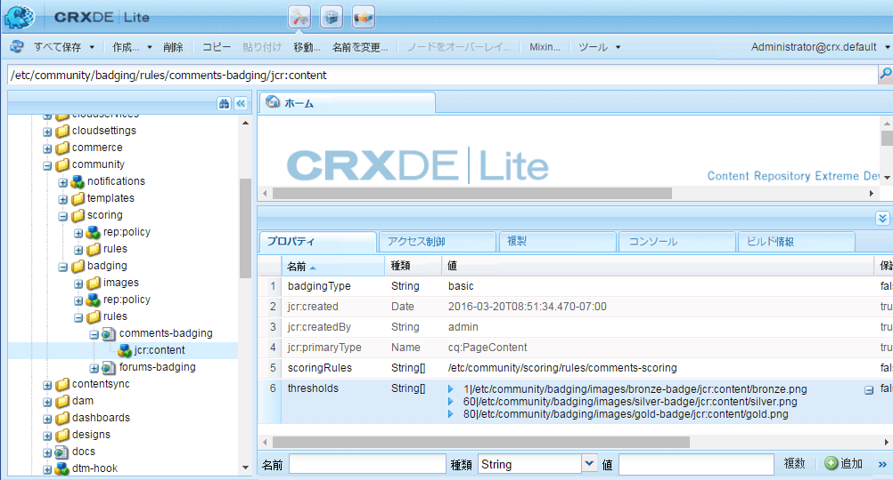
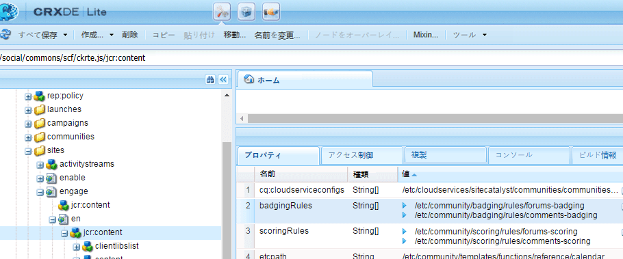
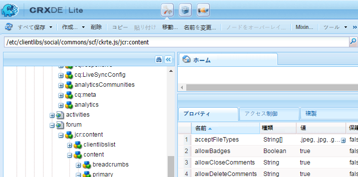

# コミュニティのスコアとバッジ {#communities-scoring-and-badges}

## 概要 {#overview}

AEM Communitiesのスコアリングとバッジ機能では、コミュニティメンバーを特定して報酬を与えることができます。

スコアリングとバッジの主な要素は次のとおりです。

* [&#x200B; バッジ &#x200B;](#assign-and-revoke-badges)を割り当てて、コミュニティ内のメンバーの役割を特定します。

* メンバーに対するバッジ [&#128279;](#enable-scoring)の基本授与（作成されたコンテンツの量）: メンバーへのバッジの基本授与。

* [&#x200B; メンバーをエキスパートとして識別するためのバッジ &#x200B;](/help/communities/advanced.md)の高度な授与（作成されたコンテンツの品質）。

バッジの授与が[&#x200B; デフォルトで有効になっていないことを&#x200B;**メモ**&#x200B;してください](/help/communities/implementing-scoring.md#main-pars-text-237875536)。

>[!CAUTION]
>
>CRXDE Liteに表示される実装構造は、UIが使用可能になると変更される可能性があります。

## バッジ {#badges}

バッジはメンバーの名前の下に配置され、メンバーの役割またはコミュニティ内での地位を示します。 バッジは、画像または名前として表示できます。 画像として表示される場合、名前はアクセシビリティのために代替テキストとして含まれます。

デフォルトでは、バッジは次のリポジトリにあります。

* `/libs/settings/community/badging/images`

別の場所に保存されている場合は、全員が読み取りできる状態で読み取る必要があります。

バッジは、ルールに従って割り当てられたか、獲得されたかにかかわらず、UGCで差別化されます。 現在、割り当てられたバッジはテキストとして表示され、獲得されたバッジは画像として表示されます。

### バッジ管理UI {#badge-management-ui}

コミュニティ [&#x200B; バッジコンソール &#x200B;](/help/communities/badges.md)では、メンバーが獲得（授与）またはコミュニティ内の特定の役割（割り当て）を引き受けたときにメンバーに表示できるカスタムバッジを追加できます。

### 割り当て済みバッジ {#assigned-badges}

役割ベースのバッジは、管理者がコミュニティ内での役割に基づいてコミュニティメンバーに割り当てます。

割り当てられた（および授与された）バッジは、選択した[SRP](/help/communities/srp.md)に保存され、直接アクセスできません。 GUIが使用可能になるまで、ロールベースのバッジを割り当てる唯一の方法は、コードまたはcURLを使用して割り当てることです。 cURLの手順については、「[&#x200B; バッジの割り当てと取り消し](#assign-and-revoke-badges)」というタイトルのセクションを参照してください。

このリリースには、次の3つのロールベースのバッジが含まれています。

* **モデレーター**
  `/libs/settings/community/badging/images/moderator/jcr:content/moderator.png`

* **グループマネージャー**
  `/libs/settings/community/badging/images/group-manager/jcr:content/group-manager.png`

* **特権メンバー**
  `/libs/settings/community/badging/images/privileged-member/jcr:content/privileged-member.png`

  

### 授与されたバッジ {#awarded-badges}

報酬ベースのバッジは、スコアリングサービスによって、コミュニティ内での活動に適用されるルールに基づいて、コミュニティメンバーに授与されます。

バッジをアクティビティの報酬として表示するには、次の2つの操作を実行する必要があります。

* 機能コンポーネントのバッジは[enabled](#enableforcomponent)である必要があります。
* スコアリングとバッジ付けのルールは、コンポーネントが配置されているページ（または祖先）に[適用](#applytopage)する必要があります。

このリリースには、3つの報酬ベースのバッジが含まれています。

* **ゴールド**
  `/libs/settings/community/badging/images/gold-badge/jcr:content/gold.png`

* **シルバー**
  `/libs/settings/community/badging/images/silver-badge/jcr:content/silver.png`

* **ブロンズ**
  `/libs/settings/community/badging/images/bronze-badge/jcr:content/bronze.png`

  

>[!NOTE]
>
>スコアリングルールは、不適切としてフラグ付けされた投稿に対してマイナスポイントを割り当て、スコア値に影響を与えるように設定できます。 ただし、バッジが獲得されると、スコアリングポイントの削減やスコアリングルールの変更により、バッジは自動的に削除されません。
>
>付与されたバッジは、割り当てられたバッジと同じ方法で取り消すことができます。 「[&#x200B; バッジの割り当てと取り消し](#assign-and-revoke-badges)」の節を参照してください。 今後は、メンバーのバッジを管理するためのUIも追加される予定です。

### カスタムバッジ {#custom-badges}

カスタムバッジは、[&#x200B; バッジコンソール &#x200B;](/help/communities/badges.md)を使用してインストールでき、バッジルールで割り当てられるか指定されます。

バッジコンソールからインストールすると、カスタムバッジがパブリッシュ環境に自動的にレプリケートされます。

## スコアリングの有効化 {#enable-scoring}

スコアリングはデフォルトでは有効になっていません。 バッジのスコアリングと授与を設定および有効化するための基本的な手順は次のとおりです。

* ポイントを獲得するためのルールを特定します（[&#x200B; ルールのスコアリング &#x200B;](#scoring-rules)）。
* スコアリングルールごとに累積されたポイントに対して、[&#x200B; バッジ &#x200B;](#badges) （[&#x200B; バッジングルール &#x200B;](#badging-rules)）を割り当てます。

* [&#x200B; スコアリング ルールとバッジ ルールをコミュニティ サイトに適用します](#apply-rules-to-content)。
* [&#x200B; コミュニティ機能のバッジを有効にする](#enable-badges-for-component)。

フォーラムとコメントのデフォルトのスコアリングとバッジルールを使用してコミュニティサイトのスコアリングを有効にするには、[&#x200B; クイックテスト &#x200B;](#quick-test)の節を参照してください。

### コンテンツへのルールの適用 {#apply-rules-to-content}

スコアリングとバッジを有効にするには、サイトのコンテンツツリー内の任意のノードにプロパティ `scoringRules`と`badgingRules`を追加します。

サイトが既に公開されている場合は、すべてのルールを適用してコンポーネントを有効にした後、サイトを再公開します。

バッジ対応コンポーネントに適用されるルールは、現在のノードまたはその祖先に適用されるルールです。

ノードのタイプが`cq:Page` （推奨）の場合、CRXDE|Liteを使用して、その`jcr:content` ノードにプロパティを追加します。

| **プロパティ** | **タイプ** | **説明** |
|---|---|---|
| badgingRules | 文字列 | [&#x200B; バッジングルール &#x200B;](#badging-rules)の配列リスト |
| scoringRules | 文字列 | [&#x200B; スコアリングルール &#x200B;](#scoring-rules)の配列リスト |

>[!NOTE]
>
>スコアリングルールがバッジの授与に影響を与えていないようであれば、スコアリングルールがバッジングルールのscoringRules プロパティによってブロックされていないことを確認してください。 「[&#x200B; バッジルール &#x200B;](#badging-rules)」の節を参照してください。

### コンポーネントのバッジを有効にする {#enable-badges-for-component}

スコアリングとベイディングのルールは、[&#x200B; オーサリングモード &#x200B;](/help/communities/author-communities.md)でコンポーネント設定を編集してバッジを有効にしたコンポーネントのインスタンスに対してのみ有効です。

ブール型プロパティ `allowBadges`は、コンポーネントインスタンスのバッジの表示を有効または無効にします。 **バッジを表示**&#x200B;というラベルの付いたチェックボックスを使用して、フォーラム、QnAおよびコメントコンポーネントの[&#x200B; コンポーネント編集ダイアログ &#x200B;](/help/communities/author-communities.md)で設定できます。

#### 例：Forum コンポーネントインスタンスのallowBadges {#example-allowbadges-for-forum-component-instance}



>[!NOTE]
>
>任意のコンポーネントをオーバーレイして、例えば、フォーラム、QnA、コメントに含まれるHBS コードを使用してバッジを表示できます。

## スコアリングルール {#scoring-rules}

スコアリングルールは、バッジを授与するためのスコアリングの基盤です。

各スコアリングルールは、1つ以上のサブルールのリストです。 スコアリングルールは、バッジが有効になっている場合に適用するルールを識別するために、コミュニティサイトコンテンツに適用されます。

スコアリングルールは継承されますが、加算されません。 例：

* page2にスコアリングルール 2が含まれ、その祖先page1にスコアリングルール 1が含まれている場合。
* page2 コンポーネントのアクションは、rule1とrule2の両方を呼び出します。
* 両方のルールに同じ`topic/verb`に適用できるサブルールが含まれている場合：

   * ルール 2のサブルールのみがスコアに影響します。
   * 両方のサブルールのスコアは追加されません。

複数のスコアリングルールがある場合、スコアは各ルールごとに個別に維持されます。

スコアリングルールは、`cq:Page`型のノードで、その`jcr:content` ノードにプロパティがあり、それを定義するサブルールのリストを指定します。

スコアはSRPに保存されます。

>[!NOTE]
>
>ベストプラクティス：各スコアリングルールに一意の名前を付けます。
>
>スコアリングルール名はグローバルに一意である必要があります。同じ名前で終わってはいけません。
>
>*not*&#x200B;の例：
>
>/libs/settings/community/scoring/rules/site1/forums-scoring>/libs/settings/community/scoring/rules/site2/forums-scoring

### スコアリングサブルール {#scoring-sub-rules}

スコアリングサブルールには、コミュニティに参加するための値の詳細を示すプロパティが含まれます。

各スコアリングサブルールは、次の項目を識別します。

* どのような活動が追跡されているのか？
* どのコミュニティ機能が関与していますか？
* ポイントはいくつ付与されますか？

デフォルトでは、サブルールでコンテンツの所有者がポイントを受け取ると指定されない限り、アクションを実行するメンバーにポイントが付与されます（`forOwner`）。

各サブルールは、1つ以上のスコアリングルールに含めることができます。

サブルールの名前は、通常、*件名*、*オブジェクト*、*動詞*&#x200B;を使用するパターンに従います。 例：

* member-comment-create
* member-receive-vote

サブルールは、[動詞とトピック &#x200B;](#topics-and-verbs)を指定する`jcr:content` ノードにプロパティを持つタイプ `cq:Page`のノードです。

<table>
 <tbody>
  <tr>
   <th>Property</th>
   <th>種類</th>
   <th> 値説明</th>
  </tr>
  <tr>
   <td><i><code>VERB</code></i></td>
   <td>Long</td>
   <td>
    <ul>
     <li>必須。動詞はイベントアクションに対応します</li>
     <li>動詞プロパティが少なくともひとつ必要です</li>
     <li>動詞は大文字で入力する必要があります</li>
     <li>複数の動詞プロパティを使用できますが、重複はありません</li>
     <li>値はこのイベントに適用するスコアです</li>
     <li>値には、正または負の値を指定できます</li>
     <li>このリリースでサポートされている動詞のリストは、<a href="#topics-and-verbs"> トピックと動詞</a> セクションにあります</li>
    </ul> </td>
  </tr>
  <tr>
   <td><code>topics</code></td>
   <td>文字列</td>
   <td>
    <ul>
     <li>オプション。イベントトピックで識別されるコミュニティコンポーネントにサブルールを制限します。</li>
     <li>指定した場合：値はイベントトピックの複数値文字列です</li>
     <li>リリースのトピックのリストは、<a href="#topics-and-verbs"> トピックと動詞</a> セクションにあります</li>
     <li>デフォルトでは、動詞に関連するすべてのトピックに適用されます</li>
    </ul> </td>
  </tr>
  <tr>
   <td><code>forOwner</code></td>
   <td>ブーリアン</td>
   <td>
    <ul>
     <li>オプション。メンバーが所有するコンテンツで行動する場合は関係ありません</li>
     <li>trueの場合、アクションの対象となるコンテンツの所有者にスコアを適用します</li>
     <li>falseの場合、アクションを実行するメンバーにスコアを適用します</li>
     <li>デフォルトはfalseです</li>
    </ul> </td>
  </tr>
  <tr>
   <td><code>scoringType</code></td>
   <td>文字列</td>
   <td>
    <ul>
     <li>オプション。スコアリングエンジンを識別します</li>
     <li>「基本」の場合は、数量に基づいてスコアリングエンジンを指定します
      <ul>
       <li>リリースに含まれる</li>
      </ul> </li>
     <li>「詳細設定」の場合は、品質と数量に基づいてスコアリングエンジンを指定します
      <ul>
       <li><a href="/help/communities/advanced.md">追加パッケージ </a>が必要です</li>
      </ul> </li>
     <li>デフォルトは「基本」です</li>
    </ul> </td>
  </tr>
 </tbody>
</table>

### 含まれるスコアリングルールとサブルール {#included-scoring-rules-and-sub-rules}

このリリースには、[&#x200B; フォーラム機能](/help/communities/functions.md#forum-function)の2つのスコアリングルールが含まれています（フォーラム機能のフォーラムおよびコメントコンポーネント用にそれぞれ1つ）。

1. /libs/settings/community/scoring/rules/comments-scoring

   * subRules[] =
/libs/settings/community/scoring/rules/sub-rules/member-comment-create
/libs/settings/community/scoring/rules/sub-rules/member-receive-vote
/libs/settings/community/scoring/rules/sub-rules/member-give-vote
/libs/settings/community/scoring/rules/sub-rules/member-is-moderated

1. /libs/settings/community/scoring/rules/forums-scoring

   * subRules[] =
/libs/settings/community/scoring/rules/sub-rules/member-forum-create
/libs/settings/community/scoring/rules/sub-rules/member-receive-vote
/libs/settings/community/scoring/rules/sub-rules/member-give-vote
/libs/settings/community/scoring/rules/sub-rules/member-is-moderated

**メモ：**

* `rules`と`sub-rules`の両方のノードのタイプがcq:Pageです。

* `subRules`は、ルールの`jcr:content` ノードのString[]型の属性です。

* `sub-rules`は、様々なスコアリングルール間で共有できます。
* `rules`は、全員に対する読み取り権限を持つリポジトリの場所にある必要があります。

   * ルール名は、場所に関係なく一意である必要があります。

### カスタムスコアリングルールの有効化 {#activating-custom-scoring-rules}

オーサー環境で行われたスコアリングルールまたはサブルールに対する変更または追加は、パブリッシュにインストールする必要があります。

## バッジングルール {#badging-rules}

バッジルールは、次を指定してスコアリングルールをバッジにリンクします。

* スコアリングルール
* 特定のバッジを授与するために必要なスコア

バッジルールは、スコアリングルールをスコアとバッジに関連付ける`jcr:content` ノード上のプロパティを持つタイプ `cq:Page`のノードです。

バッジのルールは、バッジにマッピングされたスコアの順序付きリストである必須の`thresholds` プロパティで構成されます。 スコアは、値を増やすように並べ替える必要があります。 例：

* `1|/libs/settings/community/badging/images/bronze-badge/jcr:content/bronze.png`

   * 1 ポイントを獲得するとブロンズバッジが授与されます。

* `60|/libs/settings/community/badging/images/silver-badge/jcr:content/silver.png`

   * 60 ポイントが貯まると銀色のバッジが授与されます。

* `80|/libs/settings/community/badging/images/gold-badge/jcr:content/gold.png`

   * ゴールドバッジは80 ポイントが貯まると授与されます。

バッジルールは、ポイントの累積方法を決定するスコアリングルールと組み合わされます。 「[&#x200B; コンテンツにルールを適用](#apply-rules-to-content)」の節を参照してください。

バッジングルールの`scoringRules` プロパティは、その特定のバッジングルールとペアにできるスコアリングルールを単に制限します。

>[!NOTE]
>
>ベストプラクティス：各AEM サイトに固有のバッジ画像を作成します。



<table>
 <tbody>
  <tr>
   <th>Property</th>
   <th>タイプ</th>
   <th>値説明</th>
  </tr>
  <tr>
   <td>しきい値</td>
   <td>文字列</td>
   <td><em> （必須） </em>形式「number|path」の複数値文字列
    <ul>
     <li>number = score</li>
     <li>| =垂直線の文字（U+007C）</li>
     <li>パス = バッジ画像リソースへのフルパス</li>
    </ul> 文字列は、数値の値が増加し、数値とパスの間に空白が表示されないように並べ替える必要があります。<br /> エントリ例：<br /> <code>80|/libs/settings/community/badging/images/gold-badge/jcr:content/gold.png</code></td>
  </tr>
  <tr>
   <td>badgingType</td>
   <td>文字列</td>
   <td><em> （オプション） </em>は、スコアリングエンジンを「基本」または「詳細」として識別します。 高度なスコアリングエンジンが必要な場合は、<a href="/help/communities/advanced.md">高度なスコアリングとバッジ </a>を参照してください。 デフォルトは「基本」です。</td>
  </tr>
  <tr>
   <td>scoringRules</td>
   <td>文字列</td>
   <td>（<em> オプション </em>） バッジングルールを、スコアリングルールによって特定されたスコアリングイベントに制限するための複数値の文字列</td>
  </tr>
 </tbody>
</table>

### 含まれるバッジルール {#included-badging-rules}

このリリースには、[&#x200B; フォーラムとコメントのスコアリングルール &#x200B;](#includedscoringrules)に対応する2つのバッジルールが含まれています。

* `/libs/settings/community/badging/rules/comments-badging`

* `/libs/settings/community/badging/rules/forums-badging`

**メモ：**

* `rules` ノードはcq:Page型です。
* `rules`は、全員に対する読み取り権限を持つリポジトリの場所にある必要があります。

   * ルール名は、場所に関係なく一意である必要があります。

### カスタムバッジルールの有効化 {#activating-custom-badging-rules}

オーサー環境で行われたバッジルールまたは画像に対する変更や追加は、パブリッシュにインストールする必要があります。

## バッジの割り当てと取り消し {#assign-and-revoke-badges}

バッジは、[&#x200B; メンバーコンソール &#x200B;](/help/communities/members.md#badges-tab)を使用するか、cURL コマンドを使用してプログラムでメンバーに割り当てることができます。

次のcURL コマンドは、バッジの割り当てと取り消しに対するHTTP リクエストに必要な処理を示しています。 基本的な形式は次のとおりです。

cURL -i -X POST -H *ヘッダー* -u *サインイン* -F *操作* -F *バッジ* *メンバープロファイル – url*

*header* = &quot;Accept:application/json&quot;
サーバーに渡すカスタムヘッダー（必須）

*signin* =管理者id:password
例：admin:admin

*operation* = &quot;:operation=social:assignBadge&quot;または&quot;:operation=social:deleteBadge&quot;

*バッジ* = &quot;badgeContentPath=*badge-image-file*&quot;

*badge-image-file* = リポジトリ内のバッジ画像ファイルの場所
例：/libs/settings/community/badging/images/moderator/jcr:content/moderator.png

*member-profile-url* = パブリッシュ時のメンバーのプロファイルのエンドポイント
例：https://&lt;server>:&lt;port>/home/users/community/riley/profile.social.json

>[!NOTE]
>
>*member-profile-url*:
>
>* [&#x200B; トンネルサービス &#x200B;](/help/communities/users.md#tunnel-service)が有効になっている場合、オーサーインスタンスを参照できます。
>* 不明瞭でランダムな名前である可能性があります。承認可能なIDについては、[&#x200B; セキュリティチェックリスト &#x200B;](/help/sites-administering/security-checklist.md#verify-that-you-are-not-disclosing-personally-identifiable-information-in-the-users-home-path)を参照してください。

### 例： {#examples}

#### モデレーターバッジの割り当て {#assign-a-moderator-badge}

```shell
curl -i -X POST -H "Accept:application/json" -u admin:admin -F ":operation=social:assignBadge" -F "badgeContentPath=/libs/settings/community/badging/images/moderator/jcr:content/moderator.png" /home/users/community/updcs9DndLEI74DB9zsB/profile.social.json
```

#### 割り当てられた銀のバッジを取り消す {#revoke-an-assigned-silver-badge}

```shell
curl -i -X POST -H "Accept:application/json" -u admin:admin -F ":operation=social:deleteBadge" -F "badgeContentPath=/libs/settings/community/badging/images/silver/jcr:content/silver.png" /home/users/community/updcs9DndLEI74DB9zsB/profile.social.json
```

>[!NOTE]
>
>cURLを使用してバッジを割り当てたり取り消したりすることは、任意のバッジ画像に対して機能しますが、アーンドではなく割り当てると、割り当てられたバッジとしてマークされ、それに応じて処理されます。

## カスタムコンポーネントのスコアリングとバッジ {#scoring-and-badges-for-custom-components}

カスタムコンポーネントのスコアリングルールとバッジルールは、コンポーネント用に作成されたイベントトピックを動詞に関連付けることで作成できます。

## トピックと動詞 {#topics-and-verbs}

メンバーがコミュニティ機能を操作すると、通知やスコアリングなど、非同期のリスナーをトリガーにできるイベントが送信されます。

コンポーネントのSocialEvent インスタンスは、`topic`に対して発生したイベントを`actions`として記録します。 SocialEventには、アクションに関連付けられた`verb`を返すメソッドが含まれています。 `actions`と`verbs`の間に&#x200B;*n-1*&#x200B;関係があります。

配信されたコミュニティコンポーネントについて、次の表は、[&#x200B; スコアリングサブルール &#x200B;](#scoring-sub-rules)で使用できる`topic`ごとに定義された`verbs`を示しています。

>[!NOTE]
>
>新しいブール型プロパティ `allowBadges`は、コンポーネントインスタンスのバッジの表示を有効または無効にします。 **バッジの表示**&#x200B;というラベルの付いたチェックボックスを使用して、更新された[&#x200B; コンポーネント編集ダイアログ &#x200B;](/help/communities/author-communities.md)で設定できます。

**[カレンダーコンポーネント](/help/communities/calendar.md)**
SocialEvent `topic`= com/adobe/cq/social/calendar

| **動詞** | **説明** |
|---|---|
| POST | メンバーがカレンダーイベントを作成 |
| 追加 | カレンダーイベントに対するメンバーのコメント |
| 更新 | メンバーのカレンダーイベントまたはコメントが編集されます |
| 削除 | メンバーのカレンダーイベントまたはコメントが削除されます |

**[コメントコンポーネント](/help/communities/comments.md)**
SocialEvent `topic`= com/adobe/cq/social/comment

| **動詞** | **説明** |
|---|---|
| POST | メンバーがコメントを作成します |
| 追加 | メンバーがコメントに返信 |
| 更新 | メンバーのコメントが編集されました |
| 削除 | メンバーのコメントが削除されました |

**[ファイルライブラリコンポーネント](/help/communities/file-library.md)**
SocialEvent `topic`= com/adobe/cq/social/fileLibrary

| **動詞** | **説明** |
|---|---|
| POST | メンバーがフォルダーを作成します |
| 添付 | メンバーがファイルをアップロード |
| 更新 | メンバーはフォルダーまたはファイルを更新します |
| 削除 | メンバーはフォルダーまたはファイルを削除します |

**[フォーラムコンポーネント](/help/communities/forum.md)**
SocialEvent `topic`= com/adobe/cq/social/forum

| **動詞** | **説明** |
|---|---|
| POST | メンバーがフォーラムのトピックを作成 |
| 追加 | メンバーがフォーラムのトピックに返信 |
| 更新 | メンバーのフォーラムのトピックまたは返信が編集されています |
| 削除 | メンバーのフォーラム トピックまたは返信が削除されました |

**[ジャーナルコンポーネント](/help/communities/blog-feature.md)**
SocialEvent `topic`= com/adobe/cq/social/journal

| **動詞** | **説明** |
|---|---|
| POST | メンバーがブログ記事を作成する |
| 追加 | ブログ記事に対するメンバーのコメント |
| 更新 | メンバーのブログ記事またはコメントが編集されました |
| 削除 | メンバーのブログ記事またはコメントが削除されました |

**[QnA コンポーネント](/help/communities/working-with-qna.md)**
SocialEvent `topic` = com/adobe/cq/social/qna

| **動詞** | **説明** |
|---|---|
| POST | メンバーはQnA質問を作成します |
| 追加 | メンバーはQnA回答を作成します |
| 更新 | メンバーのQnAの質問または回答が編集されます |
| SELECT | メンバーの回答が選択されました |
| 選択解除 | メンバーの回答が選択解除されています |
| 削除 | メンバーのQnAの質問または回答が削除されます |

**[レビューコンポーネント](/help/communities/reviews.md)**
SocialEvent `topic`= com/adobe/cq/social/review

| **動詞** | **説明** |
|---|---|
| POST | メンバーによるレビューの作成 |
| 更新 | メンバーのレビューが編集されました |
| 削除 | メンバーのレビューが削除されました |

**[評価コンポーネント](/help/communities/rating.md)**
SocialEvent `topic`= com/adobe/cq/social/tally/rating

| **動詞** | **説明** |
|---|---|
| 評価を追加 | メンバーのコンテンツが評価されました |
| 評価を削除 | メンバーのコンテンツがダウン評価されています |

**[投票コンポーネント](/help/communities/voting.md)**
SocialEvent `topic`= com/adobe/cq/social/tally/voting

| **動詞** | **説明** |
|---|---|
| 投票を追加 | メンバーのコンテンツが投票されました |
| 投票を削除 | メンバーのコンテンツがダウンしています |

**モデレーション対応コンポーネント**
SocialEvent `topic`= com/adobe/cq/social/moderation

| **動詞** | **説明** |
|---|---|
| 拒否 | メンバーのコンテンツが拒否されました |
| 不適切なフラグ | メンバーのコンテンツにフラグが付けられている |
| 不適切なフラグを付けない | メンバーのコンテンツにフラグが付いていません |
| 承認 | メンバーのコンテンツはモデレーターによって承認されます |
| 閉じる | メンバーが編集と返信にコメントを閉じる |
| オープン | メンバーがコメントを再開します |

### カスタムコンポーネントイベント {#custom-component-events}

カスタムコンポーネントの場合、SocialEventはインスタンス化され、`topic`に対して発生したコンポーネントのイベントを`actions`として記録します。

スコアリングをサポートするには、各`action`に対して適切な`verb`が返されるように、SocialEventがメソッド `getVerb()`を上書きする必要があります。 アクションに対して返される`verb`は、一般的に使用される1つ（例：`POST`）またはコンポーネントに特化した1つ（例：`ADD RATING`）です。 `actions`と`verbs`の間に&#x200B;*n-1*&#x200B;関係があります。

## トラブルシューティング {#troubleshooting}

### バッジが表示されない {#badges-are-not-appearing}

スコアリングとバッジルールがweb サイトのコンテンツに適用されていて、バッジがアクティビティに付与されていない場合は、そのコンポーネントのインスタンスでバッジが有効になっていることを確認します。

コンポーネント [&#128279;](#enable-badges-for-component)のバッジを有効にするを参照してください。

### スコアリングルールは効果がありません {#scoring-rule-has-no-effect}

スコアリングとバッジのルールがweb サイトのコンテンツに適用され、一部のアクションに対してバッジが付与されているが、その他のアクションに対してバッジが付与されていない場合は、バッジルールが適用されるスコアリングルールを制限していないことを確認してください。

[&#x200B; バッジングルール &#x200B;](#badging-rules)の`scoringRules` プロパティを参照してください。

### 大文字と小文字を区別 {#case-sensitive-typo}

ほとんどのプロパティと値、特に動詞では大文字と小文字が区別されます。 動詞は、スコアリングサブルールで使用する場合、すべて大文字にする必要があります。

機能が期待どおりに動作しない場合は、データが正しく入力されていることを確認します。

## クイックテスト {#quick-test}

[はじめにチュートリアル &#x200B;](/help/communities/getting-started.md) （エンゲージ）サイトを使用して、スコアリングとバッジの作成をすばやく試すことができます。

* 作成者のCRXDE Liteへのアクセス。
* 基本ページを参照します。

   * /content/sites/engage/en/jcr:content

* badgingRules プロパティを追加します。

   * **名前**：`badgingRules`
   * **型**：`String`
   * **Multi**&#x200B;を選択
   * **追加**&#x200B;を選択
   * `/libs/settings/community/badging/rules/forums-badging` と入力します。
   * **+**&#x200B;を選択
   * `/libs/settings/community/badging/rules/comments-badging` と入力します。
   * 「**OK**」を選択します。

* scoringRules プロパティを追加します。

   * **名前**：`scoringRules`
   * **型**：`String`
   * **Multi**&#x200B;を選択
   * **追加**&#x200B;を選択
   * `/libs/settings/community/scoring/rules/forums-scoring` と入力します。
   * **+**&#x200B;を選択
   * `/libs/settings/community/scoring/rules/comments-scoring` と入力します。
   * 「**OK**」を選択します。

* 「**すべて保存**」を選択します。



次に、フォーラムとコメントのコンポーネントでバッジを表示できることを確認します。

* CRXDE Liteを使用しています。
* フォーラムコンポーネントを参照する

   * `/content/sites/engage/en/forum/jcr:content/content/primary/forum`

* 必要に応じてallowBadges ブール型プロパティを追加し、trueであることを確認します。

   * **名前**：`allowBadges`
   * **型**：`Boolean`
   * **値**：`true`



次に、コミュニティサイトを[再公開](/help/communities/sites-console.md#publishing-the-site)します。

最後に，

* パブリッシュインスタンス上のコンポーネントを参照します。
* コミュニティメンバーとしてログインします（例：weston.mccall@dodgit.com / password）。
* 新しいフォーラムのトピックを投稿します。
* バッジを表示するには、ページを更新する必要があります。

   * ログアウトし、別のコミュニティメンバーとしてログインします（例：aaron.mcdonald@mailinator.com/password）。

* フォーラムを選択します。

これは、最初のフォーラムのバッジルールの最初のしきい値がスコア 1であるため、フォーラムの投稿で表示されるブロンズバッジをコミュニティメンバーに獲得する必要があります。


## 追加情報 {#additional-information}

詳細については、開発者向けの[&#x200B; スコアリングとバッジの基本](/help/communities/configure-scoring.md) ページを参照してください。

高度なスコアリングエンジンについて詳しくは、[高度なスコアリングとバッジ &#x200B;](/help/communities/advanced.md)を参照してください。

設定可能なリーダーボード [&#x200B; コンポーネント &#x200B;](/help/communities/enabling-leaderboard.md)と[関数](/help/communities/functions.md#leaderboard-function)は、コミュニティサイトでのメンバーとそのスコアの表示を簡素化します。
