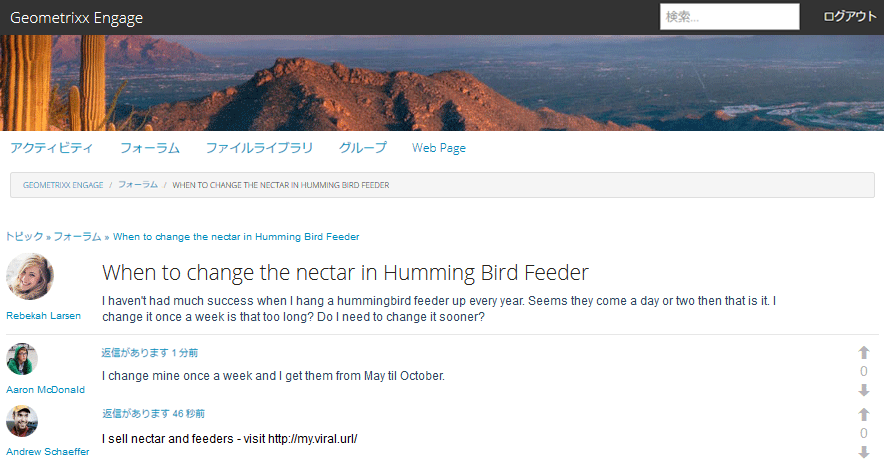
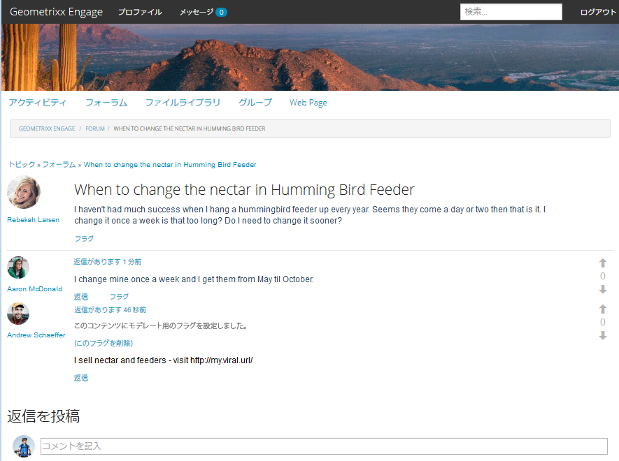
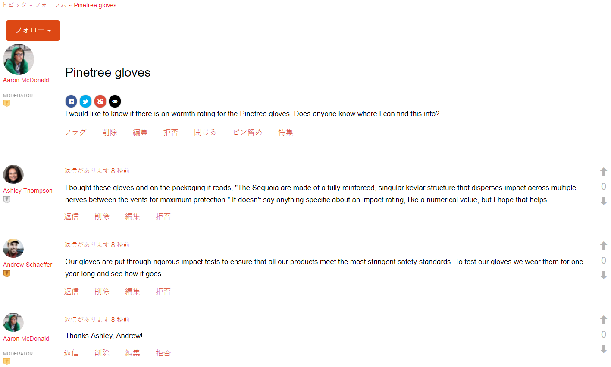
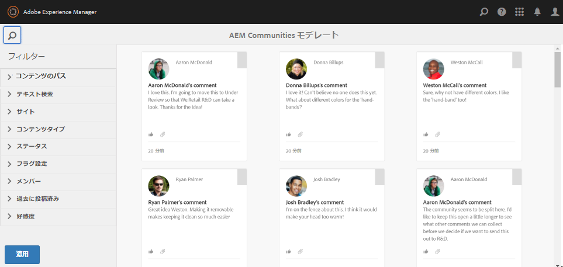
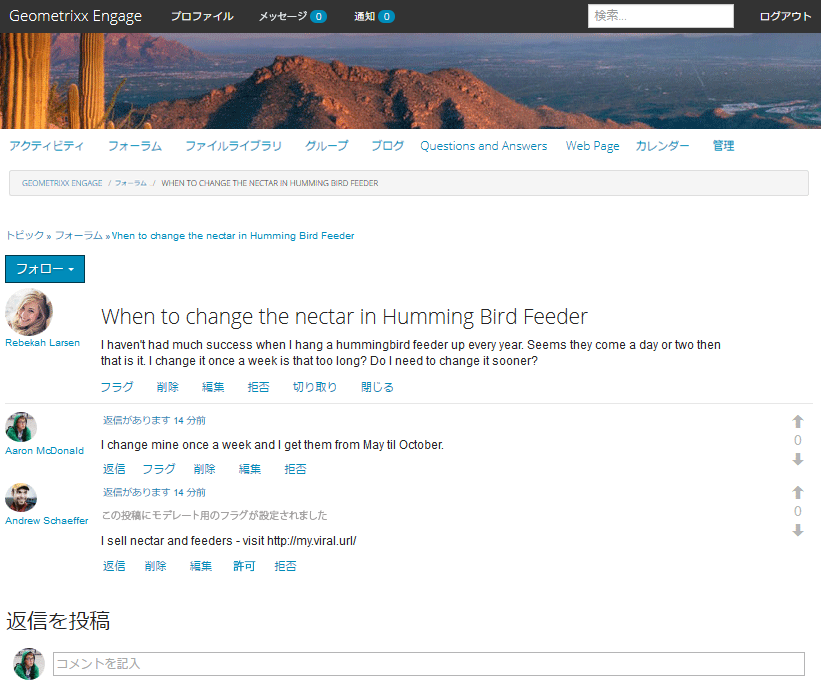
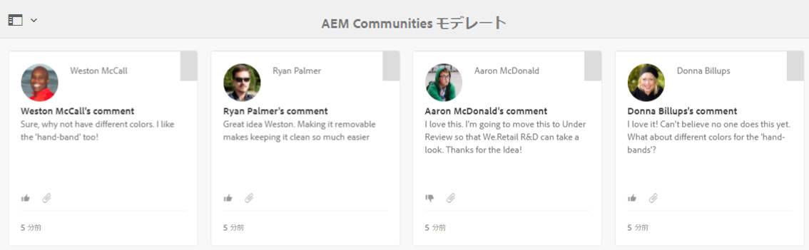
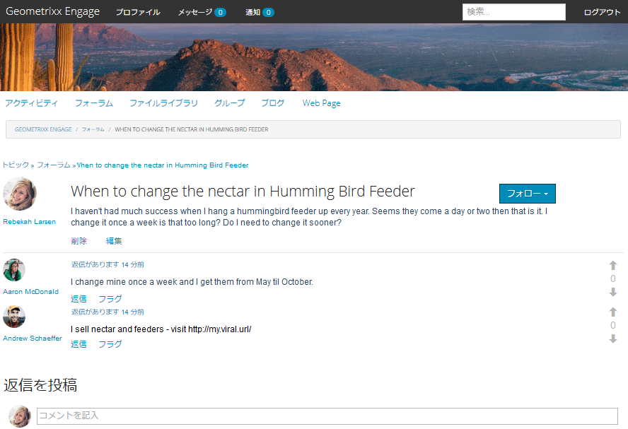

# コンテキスト内モデレート {#in-context-moderation}

AEM Communities では、管理者と信頼されているコミュニティメンバーが、コミュニティコンテンツをそのコンテンツが投稿された公開済みのページ上で直接モデレートできます。

When using a [moderation console](moderation.md), the information displayed for the content includes a link to the published page to allow access to additional moderation actions available when moderating in-context.

## モデレートアクション {#moderation-actions}

Visit the moderation overview for a description of [moderation actions](moderate-ugc.md#moderation-actions).

## モデレート UI {#moderation-ui}

パブリッシュインスタンスで使用できるモデレーター用の UI は、ユーザー生成コンテンツ（UGC）を投稿および管理するためのダイアログ内にあります。UIの要素は、サイトの訪問者のステータス（該当するかどうか）によって決まります。

1. コンテンツを投稿したメンバー。
1. 信頼できるメンバーモデレーターです。
1. 管理者。
1. サインインしましたが、管理者、モデレーター、コンテンツの作成者はいません。
1. サインインしていません。

## 例 {#example}

以下に示すように、[AEM Communities 使用の手引き](getting-started.md)で作成した [Geometrixx Engage](http://localhost:4503/content/sites/engage/en.html) サイトを使用して、フォーラムのスレッドを素早くセットアップし、パブリッシュ環境で様々なモデレートアクティビティを体験することができます。

Aaron McDonald（aaron.mcdonald@mailinator.com）は、サイト作成時に community-engage-moderators グループに追加された、信頼されているコミュニティメンバーです。

[メンバーコンソール](members.md)を使用して、Rebekah Larsen（rebekah.larsen@trashymail.com）を community-engage-members グループのメンバーとして追加できます。

コミュニティユーザーグループについて詳しくは、[ユーザーとユーザーグループの管理](users.md)を参照してください。

### フォーラム投稿の作成 {#create-the-forum-posts}

* Rebekah Larsen（rebekah.larsen@trashymail.com）としてログインします。

   * フォーラムの選択
   * 新しい投稿の選択
   * 件名の入力

      ハミングバードフィーダーで花蜜を変更するタイミング

   * 本文を入力

      私は毎年ハチドリの餌をつるしている時はあまり成功していません Seems they come a day or two then that is it.I change it once a week is that too long? Do I need to change it sooner?

   * 投稿の選択
   * ログアウトの選択

* Aaron McDonald（aaron.mcdonald@mailinator.com）としてログインします。

   * フォーラムの選択
   * 「Hummingbird」のトピックで、「詳細情報を読む」を選択します。
   * 「返信を投稿」にコメントを入力します

      私は週に1回、彼らを5月から10月まで受け取る。

   * 返信の選択
   * ログアウトの選択

* Andrew Schaeffer（andrew.schaeffer@trashymail.com）としてログインします。

   * フォーラムの選択
   * 「Hummingbird」のトピックで、「詳細情報を読む」を選択します。
   * 「返信を投稿」にコメントを入力します

      私は蜜と飼料を販売しています。https://my.viral.url/にアクセスしてください。

   * 返信の選択
   * ログアウトの選択

### Anonymous Site Visitor (#5) {#anonymous-site-visitor}

以下は、サインインしていないサイト訪問者が閲覧したフォーラムの表示です(5)。

匿名のサイト訪問者にできることは、フォーラムを表示することだけです。コンテンツを投稿することも、モデレートアクションを実行することもできません。

### New Member (#4) {#new-member}

On author, log in as admin and add Boyd Larsen (boyd.larsen@dodgit.com) as a new member of community-engage-members group using the [Members console](members.md), then Log Out.

On publish, log in as Boyd Larsen and access the thread by selecting `Forum`, and then `Read more` for the hummingbird post.

注意:

* ボイドはこのフォーラムに参加していない。
* ボイドは何も削除できません。
* Boydはサインイン済みで、内容に返信またはフラグを付けることができます。

Boyd としてログインした状態で「フラグ」を選択し、Andrew が投稿したコンテンツにフラグを設定します。

ログアウトします。

### Administrator (#3) {#administrator}

管理者（管理者）としてログインし、「フォーラム」を選択してスレッドにアクセスし、投稿に関して「詳細を表示」を選択します。

注意:

* 管理者は、フラグ付け、削除、編集、拒否、切り取り、閉じる、ピン、機能を実行できます。
* 管理者は、「管理」を選択してモデレートコンソールにアクセスできます。

[モデレートコンソール](moderation.md)にアクセスするには、パブリッシュ環境で「管理」メニュー項目を選択します。

管理者には、Geometrixx Engage コミュニティサイトのコンテンツだけでなく、すべてのモデレート可能なコンテンツが表示されます。

サイドパネルには検索フィルターがあり、開閉を切り替えることができます。

ログアウトします。

### Community Moderator (#2) {#community-moderator}

コミュニティのモデレーターであるAaron McDonald(aaron.mcdonal@mailinator.com)としてログインし、「フォーラム」を選択してスレッドにアクセスし、Hummingbird投稿の詳細情報を確認します。

注意:

* Aaronは、自分の投稿に対する返信、削除、編集または拒否を実行できます。
* Aaronは、他のコンテンツに対してフラグ/許可、返信、削除、編集、拒否を行うこともできます。
* Aaronは、フォーラムのトピックを切り取って、モデレート対象の別のフォーラムに移動できます。
* Aaronは、「管理」を選択してモデレートコンソールにアクセスする場合があります。

[モデレートコンソール](moderation.md)にアクセスするには、パブリッシュ環境で「管理」メニュー項目を選択します。

コミュニティモデレーターには、Geometrixx Engage コミュニティサイトのモデレート可能なコンテンツだけが表示されます。

コミュニティモデレーターは、管理者と同じオプションを使用できます（画像では検索サイドバーは閉じています）が、他の AEM コンソールにはアクセスできません。

ログアウトします。

### Content Author (#1) {#content-author}

Rebekah Larsen(rebekah.larsen@mailinator.com)としてログインします。スレッドを開始し、「フォーラム」を選択してスレッドにアクセスし、Hummingbird投稿の詳細情報を参照してください。

注意:

* Rebekahは自分の投稿を削除または編集できます。
* Rebekahは、他のコンテンツに返信したり、フラグを付けたりすることもできます。
* Rebekahはモデレートコンソールにアクセスできません。

