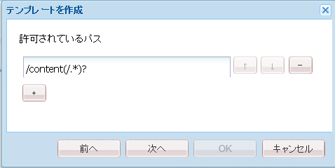

# 初期サンドボックスアプリケーション  {#initial-sandbox-application}

ここでは、次のものを作成します。

* サンプル Web サイトのコンテンツページを作成する際に使用する&#x200B;**[テンプレート.](#createthepagetemplate)**
* Web サイトのページをレンダリングする際に使用する&#x200B;**[コンポーネントとスクリプト.](#create-the-template-s-rendering-component)**

## コンテンツテンプレートの作成 {#create-the-content-template}

テンプレートは、新しいページのデフォルトのコンテンツを定義するものです。複雑な Web サイトでは、複数のテンプレートを使用して、サイト内の様々なタイプのページを作成する場合があります。さらに、変更内容をサーバークラスターにロールアウトする際のブループリントとして一連のテンプレートを使用する場合もあります。

この演習では、すべてのページを 1 つの単純なテンプレートに基づいて作成します。

1. CRXDE Lite のエクスプローラーペインで、次の手順を実行します。：

   *  `/apps/an-scf-sandbox/templates`
   * **[!UICONTROL 作成]** / **[!UICONTROL テンプレートを作成]**

1. テンプレートを作成ダイアログで、次の値を入力し、「**[!UICONTROL 次へ]**」をクリックします。

   * ラベル: `playpage`
   * タイトル: `An SCF Sandbox Play Template`
   * 説明: `An SCF Sandbox template for play pages`
   * リソースタイプ: `an-scf-sandbox/components/playpage`
   * ランキング：&lt;デフォルトのまま>

   「ラベル」は、ノード名に使用されます。

   「リソースタイプ」は、`playpage` の jcr:content ノードにプロパティ `sling:resourceType` として表示されます。ブラウザーから要求された場合に、コンテンツをレンダリングするコンポーネント（リソース）を識別します。

   この場合、`playpage`テンプレートを使用して作成されたすべてのページが`an-scf-sandbox/components/playpage`コンポーネントによってレンダリングされます。 慣例により、コンポーネントへのパスは相対パスなので、Slingは最初に`/apps`フォルダー内でリソースを検索し、見つからない場合は`/libs`フォルダー内でリソースを検索できます。

   

1. コピー／貼り付けを使用する場合は、「リソースタイプ」の値の先頭や末尾にスペースがないことを確認します。

   「**[!UICONTROL 次へ]**」をクリックします。

1. 「許可されているパス」は、**[!UICONTROL 新しいページ]**&#x200B;ダイアログにテンプレートが表示されるように、このテンプレートを使用するページのパスを参照します。

   パスを追加するには、プラスボタン`+`をクリックし、表示されるテキストボックスに「`/content(/.&ast;)?`」と入力します。 コピー/貼り付けを使用する場合は、先頭または末尾にスペースがないことを確認します。

   注意：許可されているパスプロパティの値は、*正規表現*&#x200B;です。 この表現と一致するパスを持つコンテンツページでテンプレートを使用できます。この場合、正規表現は&#x200B;**/content**&#x200B;フォルダーとそのすべてのサブページのパスと一致します。

   作成者が`/content`の下にページを作成すると、使用可能なテンプレートのリストに「An SCF Sandbox Page Template」というタイトルの`playpage`テンプレートが表示されます。

   テンプレートからルートページを作成した後は、プロパティを変更して正規表現にルートパスを含めることで、テンプレートへのアクセスをこのWebサイトに制限できます。

   `/content/an-scf-sandbox(/.&ast;)?`

   

1. 「**[!UICONTROL 次へ]**」をクリックします。

   **[!UICONTROL 許可されている親]**&#x200B;パネルで「**[!UICONTROL 次へ]**」をクリックします。

   **[!UICONTROL 許可されている子]**&#x200B;パネルで「**[!UICONTROL 次へ]**」をクリックします。

   「**[!UICONTROL OK]**」をクリックします。

1. 「OK」をクリックし、テンプレートの作成を終了すると、新しい `playpage` テンプレートについて、「プロパティ」タブの値の隅に赤い三角形が表示されていることがわかります。これらの赤い三角形は、編集内容が保存されていないことを示します。

   「**[!UICONTROL すべて保存]**」をクリックして、新しいテンプレートをリポジトリに保存します。

   

### テンプレートのレンダリングコンポーネントの作成 {#create-the-template-s-rendering-component}

コンテンツを定義し、[playpage テンプレート](#createthepagetemplate)に基づいて作成されたページをレンダリングするコンポーネントを作成します。**

1. CRXDE Liteで、**`/apps/an-scf-sandbox/components`**&#x200B;を右クリックし、**[!UICONTROL 作成/コンポーネント]**&#x200B;をクリックします。
1. ノードの名前（ラベル）を&#x200B;*playpage*&#x200B;に設定すると、コンポーネントのパスはになります。

   `/apps/an-scf-sandbox/components/playpage`

   これは、再生ページテンプレートのリソースタイプに対応します（オプションで、パスの最初の&#x200B;**`/apps/`**&#x200B;部分をマイナスにします）。

   **[!UICONTROL コンポーネントを作成]**&#x200B;ダイアログで、以下のプロパティ値を入力します。

   * ラベル：**playpage**
   * タイトル：**An SCF Sandbox Play Component**
   * 説明：**This is the component which renders content for An SCF Sandbox page.**
   * スーパータイプ：*&lt;空白のまま>*
   * グループ：*&lt;空白のまま>*

   

1. **[!UICONTROL 次へ]**&#x200B;をクリックして、ダイアログの&#x200B;**[!UICONTROL 許可されている子]**&#x200B;パネルが表示されるまで待ちます。

   * 「**[!UICONTROL OK]**」をクリックします。
   * 「**[!UICONTROL すべて保存]**」をクリックします。

1. コンポーネントのパスとテンプレートの resourceType が一致していることを確認します。

   >[!CAUTION]
   >
   >Webサイトを正しく機能させるには、playpageコンポーネントのパスとplaypageテンプレートのsling:resourceTypeプロパティの対応関係が重要です。

   
