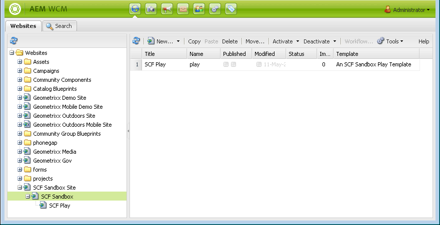

# 初期サンドボックスコンテンツ {#initial-sandbox-content}

ここでは、次のページを作成します。これらのすべてのページで[ページテンプレート](initial-app.md#createthepagetemplate)を使用します。

* SCF Sandboxサイト。メインページの英語版にリダイレクトされます。

   * SCF Sandbox — サイトの英語版のメインページ。

      * SCF再生 — 再生するメインページの子。

このチュートリアルでは[言語コピー](../../help/sites-administering/tc-prep.md)については詳しく説明しませんが、HTML ヘッダーによるユーザーの優先言語の検出をルートページに実装し、その言語の適切なメインページにリダイレクトできるように設計されています。ページのノード名に2文字の国コードを使用する規則です。例えば、英語の場合は「en」、フランス語の場合は「fr」などです。

## 最初のページの作成 {#create-first-pages}

[ページテンプレート](initial-app.md#createthepagetemplate)を作成したので、ここでは、/content ディレクトリで Web サイトのルートページを設定できます。

1. 標準 UI では現在、サイトを作成するためのブループリントが提供されます。このチュートリアルではシンプルなサイトを作成するので、クラシックUIが便利です。

   クラシック UI に切り替えるには、グローバルナビゲーションを選択し、「プロジェクト」アイコンの右側にマウスカーソルを合わせます。Select the *Switch to Classic UI* icon which appears:

   

   クラシック UI に切り替える機能は、[管理者が有効にする](../../help/sites-administering/enable-classic-ui.md)必要があります。

1. From the [classic UI Welcome page](http://localhost:4502/welcome.html), select **[!UICONTROL Websites]**.

   

   または、[/siteadmin](http://localhost:4502/siteadmin) を参照して、Web サイトのクラシック UI に直接アクセスします。

1. In the explorer pane, select **[!UICONTROL Websites]** and then in the toolbar select **[!UICONTROL New]** > **[!UICONTROL New Page]**.

   **[!UICONTROL ページを作成]**&#x200B;ダイアログで、次のように入力します。

   * タイトル: `SCF Sandbox Site`
   * 名前: `an-scf-sandbox`
   * Select **[!UICONTROL An SCF Sandbox Play Template]**
   * 「**[!UICONTROL 作成]**」をクリックします。
   

1. In the explorer pane, select the page you just created, `/Websites/SCF Sandbox Site`, and click **[!UICONTROL New]** > **[!UICONTROL New Page]**:

   * タイトル: `SCF Sandbox`
   * 名前: `en`
   * Select **An SCF Sandbox Play Template **
   * 「**作成&#x200B;**」をクリックします。

1. In the explorer pane, select the page you just created, `/Websites/SCF Sandbox Site/SCF Sandbox`, and click **[!UICONTROL New]** > **[!UICONTROL New Page]**

   * タイトル: `SCF Play`
   * 名前: `play`
   * Select **[!UICONTROL An SCF Sandbox Play Template]**
   * 「**[!UICONTROL 作成]**」をクリックします。

1. Web サイトコンソールに Web サイトが次のように表示されます。エクスプローラウィンドウで選択した項目の子ページが、管理可能な右側のウィンドウに表示されます。

   

   次に、Web サイトツールとテンプレートを使用して作成されたページのリポジトリビューを示します。

   

## デザインパスの追加 {#add-the-design-path}

When ` [/etc/designs/an-scf-sandbox](setup-website.md#setupthedesigntreeetcdesigns)` was created using the designs section of the Tools console, the property ``

* `cq:template="/libs/wcm/core/templates/designpage"`

が定義されました。このプロパティによって、`currentDesign.getPath()` () を使用してスクリプト内のデザインアセットを参照するオプション機能が提供されます。例：

* &lt;% String favIcon = currentDesign.getPath() + &quot;/favicon.ico&quot;; %>

   * 名前: `cq:designPath`
   * タイプ: `String`
   * 値: `/etc/designs/an-scf-sandbox`

* Click the green `[+] Add`

リポジトリは次のようになります。

* Click **[!UICONTROL Save All]**

[ Trouble saving? Re-login! ]

>[!NOTE]
>
>cq:designPath の使用はオプションで、[clientlib の使用](develop-app.md#includeclientlibsintemplate)とは関係ありません。SCF コンポーネントでは [clientlib](client-customize.md#clientlibs-for-scf) を使用して JS および CSS が管理されるので、clientlib の使用は基本的に必須です。

