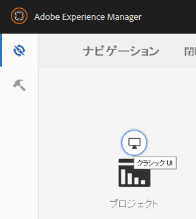
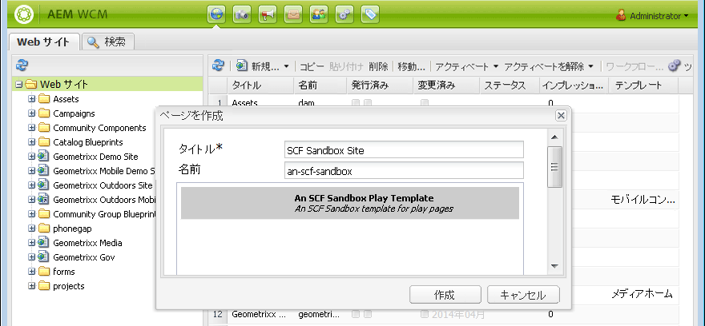
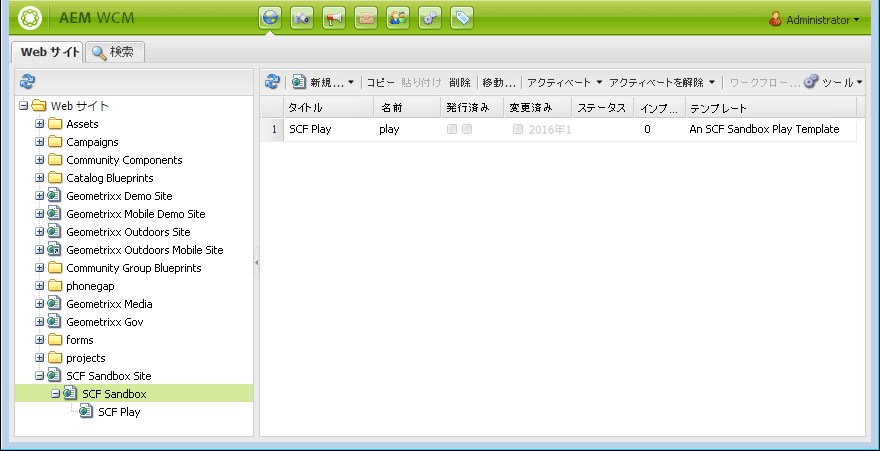
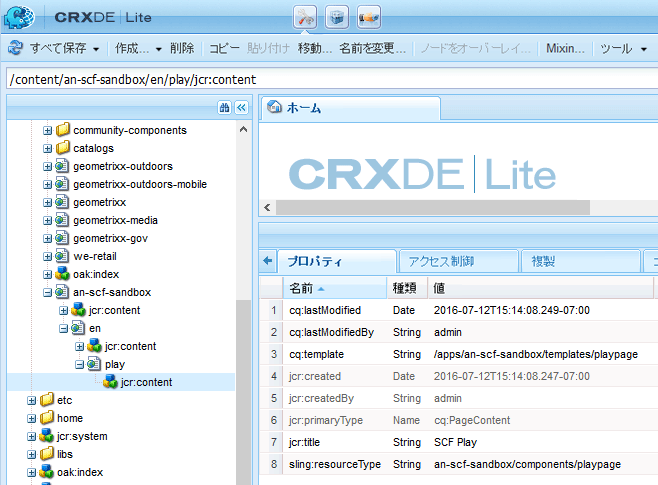
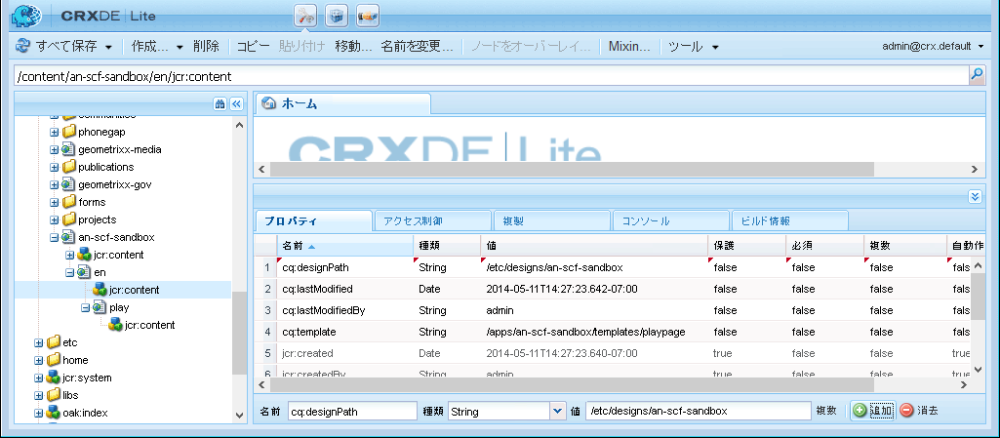

# 初期サンドボックスコンテンツ  {#initial-sandbox-content}

ここでは、次のページを作成します。これらのすべてのページで[ページテンプレート](initial-app.md#createthepagetemplate)を使用します。

* SCF Sandbox Site：メインページの英語バージョンにリダイレクトします。

   * SCFサンドボックス — サイトの英語バージョンのメインページ。

   * SCF Play — 再生するメインページの子。

このチュートリアルでは[言語コピー](../../help/sites-administering/tc-prep.md)については詳しく説明しませんが、HTML ヘッダーによるユーザーの優先言語の検出をルートページに実装し、その言語の適切なメインページにリダイレクトできるように設計されています。通常は、ページのノード名に2文字の国コードを使用します（例：英語の場合は「en」、フランス語の場合は「fr」）。

## 最初のページの作成 {#create-first-pages}

[ページテンプレート](initial-app.md#createthepagetemplate)を作成したので、ここでは、/content ディレクトリで Web サイトのルートページを設定できます。

1. 標準 UI では現在、サイトを作成するためのブループリントが提供されます。このチュートリアルでは簡単なサイトを作成するので、クラシックUIが便利です。

   クラシック UI に切り替えるには、グローバルナビゲーションを選択し、「プロジェクト」アイコンの右側にマウスカーソルを合わせます。表示される&#x200B;*クラシックUIに切り替え*&#x200B;アイコンを選択します。

   

   クラシック UI に切り替える機能は、[管理者が有効にする](../../help/sites-administering/enable-classic-ui.md)必要があります。

1. [クラシックUIのようこそページ](http://localhost:4502/welcome.html)から、「**[!UICONTROL Webサイト]**」を選択します。

   

   または、[/siteadmin](http://localhost:4502/siteadmin) を参照して、Web サイトのクラシック UI に直接アクセスします。

1. エクスプローラーウィンドウで、「**[!UICONTROL Webサイト]**」を選択し、ツールバーで「**[!UICONTROL 新規]**/**[!UICONTROL 新しいページ]**」を選択します。

   **[!UICONTROL ページを作成]**&#x200B;ダイアログで、次のように入力します。

   * タイトル: `SCF Sandbox Site`
   * 名前：`an-scf-sandbox`
   * 「**[!UICONTROL An SCF Sandbox Play Template]**」を選択します。
   * 「**[!UICONTROL 作成]**」をクリックします。

   

1. エクスプローラーウィンドウで、作成したページ`/Websites/SCF Sandbox Site`を選択し、**[!UICONTROL 新規]** / **[!UICONTROL 新規ページ]**&#x200B;をクリックします。

   * タイトル: `SCF Sandbox`
   * 名前：`en`
   * 「**[!UICONTROL An SCF Sandbox Play Template]**」を選択します。
   * 「**[!UICONTROL 作成]**」をクリックします。

1. エクスプローラーウィンドウで、作成したページ`/Websites/SCF Sandbox Site/SCF Sandbox`を選択し、**[!UICONTROL 新規]** / **[!UICONTROL 新規ページ]**&#x200B;をクリックします。

   * タイトル: `SCF Play`
   * 名前：`play`
   * 「**[!UICONTROL An SCF Sandbox Play Template]**」を選択します。
   * 「**[!UICONTROL 作成]**」をクリックします。

1. Web サイトコンソールに Web サイトが次のように表示されます。エクスプローラペインで選択したアイテムの子ページが、管理可能な右側のペインに表示されます。

   

   次に、Web サイトツールとテンプレートを使用して作成されたページのリポジトリビューを示します。

   

## デザインパスの追加 {#add-the-design-path}

` [/etc/designs/an-scf-sandbox](setup-website.md#setupthedesigntreeetcdesigns)`がツールコンソールのdesignsセクションを使用して作成された場合、「

* `cq:template="/libs/wcm/core/templates/designpage"`

が定義されました。このプロパティによって、`currentDesign.getPath()` () を使用してスクリプト内のデザインアセットを参照するオプション機能が提供されます。例：

* `% String favIcon = currentDesign.getPath() + "/favicon.ico"; %`

   * 名前：`cq:designPath`
   * 型：`String`
   * 値：`/etc/designs/an-scf-sandbox`

* 緑の`[+] Add`をクリックします。

リポジトリは次のようになります。

* 「**[!UICONTROL すべて保存]**」をクリックします。

設定の保存で問題が発生した場合は、再ログインして再度設定してください。

>[!NOTE]
>
>`cq:designPath`の使用はオプションで、clientlibs](develop-app.md#includeclientlibsintemplate)の使用とは無関係です。SCFコンポーネントはJSおよびCSSを管理するために[clientlibs](client-customize.md#clientlibs-for-scf)を使用するので、この使用は基本的に必要です。[
