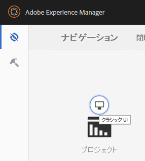
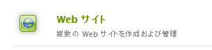
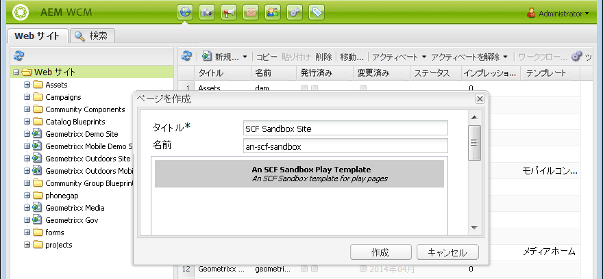
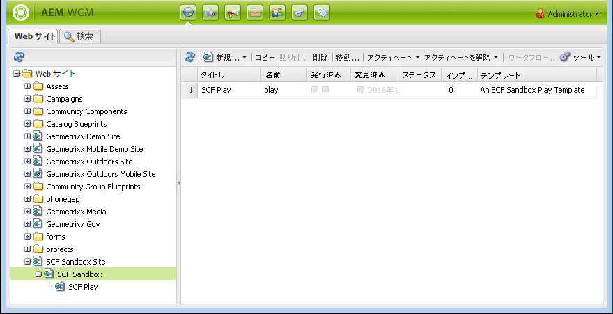
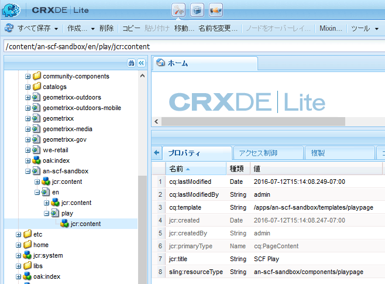
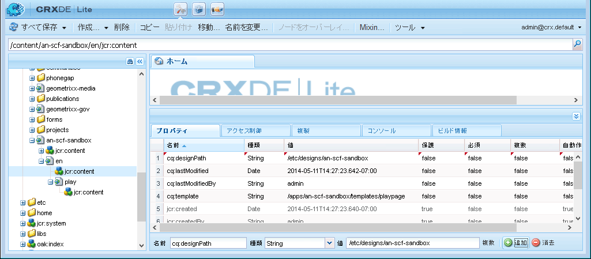

# 初期サンドボックスコンテンツ {#initial-sandbox-content}

このセクションでは、次のページを作成します。すべてのページで[ ページテンプレート ](initial-app.md#createthepagetemplate)を使用します。

* SCF サンドボックスサイト：英語バージョンのメインページにリダイレクトされます。

   * SCF Sandbox - サイトの英語版のメインページ。

   * SCF Play – 再生するメインページの子。

このチュートリアルでは、[言語コピー](../../help/sites-administering/tc-prep.md)について詳しく説明しません。 その代わりに、ルートページがHTML ヘッダーを通じてユーザーに適した言語を検出し、その言語に適したメインページにリダイレクトするように設計されています。 この規則では、ページのノード名に2文字の国コード（英語の場合は「en」、フランス語の場合は「fr」など）を使用します。

## 最初のページを作成 {#create-first-pages}

[ ページテンプレート ](initial-app.md#createthepagetemplate)が作成されたので、/content ディレクトリにweb サイトのルートページを設定できます。

1. 標準UIには、現在、サイトを作成するためのブループリントが用意されています。 このチュートリアルではシンプルなサイトを作成するので、クラシック UIが便利です。

   クラシック UIに切り替えるには、グローバルナビゲーションを選択し、プロジェクトアイコンの右側にカーソルを合わせます。 表示される「*クラシック UIに切り替え*」アイコンを選択します。

   

   クラシック UIに切り替える機能は、管理者](../../help/sites-administering/enable-classic-ui.md)が[有効にする必要があります。

1. [ クラシック UIようこそページ ](http://localhost:4502/welcome.html)から、**[!UICONTROL Web サイト]**&#x200B;を選択します。

   

   または、[/siteadminを参照して、Web サイトのクラシック UIに直接アクセスします。](http://localhost:4502/siteadmin)

1. エクスプローラーパネルで「**[!UICONTROL Web サイト]**」を選択し、ツールバーで「**[!UICONTROL 新規]** > **[!UICONTROL 新規ページ]**」を選択します。

   「**[!UICONTROL ページを作成]**」ダイアログで、次のように入力します。

   * タイトル: `SCF Sandbox Site`
   * 名前：`an-scf-sandbox`
   * **[!UICONTROL SCF サンドボックス再生テンプレートを選択]**
   * 「**[!UICONTROL 作成]**」をクリックします。

   

1. エクスプローラーパネルで、作成したページ「`/Websites/SCF Sandbox Site`」を選択し、**[!UICONTROL 新規]**/**[!UICONTROL 新規ページ]**&#x200B;をクリックします。

   * タイトル: `SCF Sandbox`
   * 名前：`en`
   * **[!UICONTROL SCF サンドボックス再生テンプレートを選択]**
   * 「**[!UICONTROL 作成]**」をクリックします。

1. エクスプローラーパネルで、作成したページ「`/Websites/SCF Sandbox Site/SCF Sandbox`」を選択し、**[!UICONTROL 新規]**/**[!UICONTROL 新規ページ]**&#x200B;をクリックします

   * タイトル: `SCF Play`
   * 名前：`play`
   * **[!UICONTROL SCF サンドボックス再生テンプレートを選択]**
   * 「**[!UICONTROL 作成]**」をクリックします。

1. これが、Web サイトコンソールでのweb サイトの表示方法です。 エクスプローラーペインで選択した項目の子ページが、管理可能な右側のペインに表示されます。

   

   Web サイトツールとテンプレートを使用して作成されたもののリポジトリビューです。

   

## デザインパスの追加 {#add-the-design-path}

` [/etc/designs/an-scf-sandbox](setup-website.md#setupthedesigntreeetcdesigns)`がツールコンソールのデザインセクションを使用して作成された場合、プロパティ「

* `cq:template="/libs/wcm/core/templates/designpage"`

が定義されました。`currentDesign.getPath()`を使用してスクリプト内のデザインアセットを参照するオプション機能を提供します。 例：

* `% String favIcon = currentDesign.getPath() + "/favicon.ico"; %`

   * 名前：`cq:designPath`
   * タイプ：`String`
   * 値：`/etc/designs/an-scf-sandbox`

* 緑の`[+] Add`をクリックします

リポジトリは次のように表示されます。

* 「**[!UICONTROL すべて保存]**」をクリック

設定の保存で問題が発生した場合は、再ログインして再設定します。

>[!NOTE]
>
>`cq:designPath`の使用はオプションであり、SCF コンポーネントが[clientlibs](client-customize.md#clientlibs-for-scf)を使用してJSとCSSを管理するため、[clientlibs](develop-app.md#includeclientlibsintemplate)の使用とは関係ありません。
