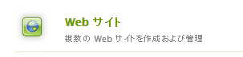

# 初期サンドボックスコンテンツ {#initial-sandbox-content}

この節では、次のページを作成します。これらのページはすべて [ ページテンプレート ](initial-app.md#createthepagetemplate) を使用します。

* メインページの英語版にリダイレクトされる SCF サンドボックスサイト。

   * SCF サンドボックス – サイトの英語版のメインページ。

   * SCF プレイ – 再生するメインページの子。

このチュートリアルでは、[ 言語コピー ](../../help/sites-administering/tc-prep.md) については説明しません。 代わりに、ルートページがHTMLヘッダーを介して利用者の優先言語を検出し、その言語の適切なメインページにリダイレクトするように設計される。 慣例により、ページのノード名には 2 文字の国コードを使用します。例えば、英語は「en」、フランス語は「fr」です。

## 最初のページを作成 {#create-first-pages}

[ ページテンプレート ](initial-app.md#createthepagetemplate) が用意されたので、/content ディレクトリに web サイトのルートページを設定できます。

1. 標準 UI は現在、サイトを作成するためのブループリントを提供しています。 このチュートリアルではシンプルなサイトを作成するので、クラシック UI が役立ちます。

   クラシック UI に切り替えるには、グローバルナビゲーションを選択して、プロジェクト アイコンの右側にカーソルを置きます。 表示される *クラシック UI に切り替える* アイコンを選択します。

   

   クラシック UI に切り替える機能は、[ 管理者が有効にする ](../../help/sites-administering/enable-classic-ui.md) 必要があります。

1. [ クラシック UI のようこそページ ](http://localhost:4502/welcome.html) から、「**[!UICONTROL Web サイト]**」を選択します。

   

   または、[/siteadmin.](http://localhost:4502/siteadmin) にブラウジングして、web サイトのクラシック UI に直接アクセスします。

1. エクスプローラーウィンドウで、「**[!UICONTROL Web サイト]**」を選択し、ツールバーで **[!UICONTROL 新規]**/**[!UICONTROL 新しいページ]** を選択します。

   **[!UICONTROL ページを作成]** ダイアログで、以下を入力します。

   * タイトル: `SCF Sandbox Site`
   * 名前：`an-scf-sandbox`
   * **[!UICONTROL SCF サンドボックス再生テンプレート]** を選択します
   * 「**[!UICONTROL 作成]**」をクリックします

   

1. エクスプローラーウィンドウで、作成したページを選択して `/Websites/SCF Sandbox Site` 成し、**[!UICONTROL 新規]**/**[!UICONTROL 新しいページ]** をクリックします。

   * タイトル: `SCF Sandbox`
   * 名前：`en`
   * **[!UICONTROL SCF サンドボックス再生テンプレート]** を選択します
   * 「**[!UICONTROL 作成]**」をクリックします

1. エクスプローラーウィンドウで、作成したページを選択して `/Websites/SCF Sandbox Site/SCF Sandbox` 成し、**[!UICONTROL 新規]**/**[!UICONTROL 新しいページ]** をクリックします

   * タイトル: `SCF Play`
   * 名前：`play`
   * **[!UICONTROL SCF サンドボックス再生テンプレート]** を選択します
   * 「**[!UICONTROL 作成]**」をクリックします

1. Web サイトコンソールに、web サイトがこのように表示されるようになりました。 エクスプローラーペインで選択された項目の子ページが右側のペインに表示され、そこで管理できます。

   

   これは、Web サイトツールとテンプレートを使用して作成された内容のリポジトリビューです。

   

## デザインパスを追加 {#add-the-design-path}

ツ ` [/etc/designs/an-scf-sandbox](setup-website.md#setupthedesigntreeetcdesigns)` ルコンソールの designs セクションを使用して作成した場合は、プロパティ「

* `cq:template="/libs/wcm/core/templates/designpage"`

を定義しました。これにより、`currentDesign.getPath()` を使用してスクリプトでデザインアセットを参照するオプション機能が提供されます。 例：

* `% String favIcon = currentDesign.getPath() + "/favicon.ico"; %`

   * 名前：`cq:designPath`
   * タイプ：`String`
   * 値：`/etc/designs/an-scf-sandbox`

* 緑の `[+] Add` をクリックします

リポジトリは次のように表示されます。

* **[!UICONTROL すべて保存]** をクリックします。

設定の保存で問題が発生した場合は、再度ログインして設定し直します。

>[!NOTE]
>
>`cq:designPath` の使用はオプションで、SCF コンポーネントが JS と CSS の管理に [clientlibs](develop-app.md#includeclientlibsintemplate) を使用するので必須である [clientlibs の使用 ](client-customize.md#clientlibs-for-scf) とは無関係です。
