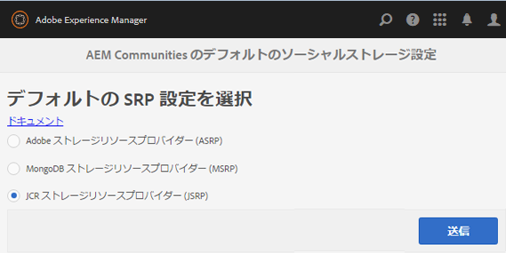

# JSRP - JCR ストレージリソースプロバイダー {#jsrp-jcr-storage-resource-provider}

## JSRP について {#about-jsrp}

AEM CommunitiesがJSRPをストレージオプション（デフォルト）として使用する場合、コミュニティコンテンツはJCRに保存され、ユーザー生成コンテンツ(UGC)は、投稿先のオーサーインスタンスまたはパブリッシュインスタンスからのみアクセスできます。

JSRP はデプロイメントが容易なので、一般的に、1 つのパブリッシュインスタンスと 1 つのオーサーインスタンスがあるデモ環境または開発環境に適しています。

[SRP オプションの特性](working-with-srp.md#characteristics-of-srp-options)と[推奨されるトポロジ](topologies.md)も参照してください。

## 設定 {#configuration}

### JSRP の選択  {#select-jsrp}

デフォルトでは、JSRP が UGC 用のストレージオプションとして選択されています。

[ストレージ設定コンソール](srp-config.md)では、使用するSRPの実装を指定するデフォルトのストレージ設定を選択できます。

オーサー環境でストレージ設定コンソールに移動するには、

* グローバルナビゲーションから：**[!UICONTROL ツール]** > **[!UICONTROL コミュニティ]** > **[!UICONTROL ストレージ設定]**

* **[!UICONTROL JCRストレージリソースプロバイダー(JSRP)]**&#x200B;を選択します。

* 「**[!UICONTROL 送信]**」を選択します。

### 設定の公開 {#publishing-the-configuration}

JSRP はデフォルト設定ですが、パブリッシュ環境で同じ設定が使用されていることを確認するには、以下の手順をおこないます。

* グローバルナビゲーションから：**[!UICONTROL ツール]** > **[!UICONTROL デプロイメント]** > **[!UICONTROL レプリケーション]**
* 「**[!UICONTROL ツリーをアクティベート]** > **[!UICONTROL 開始パス]**」を選択します。

   * `/conf/global/settings/community/srpc/`を参照します。

* **[!UICONTROL アクティブ化]**&#x200B;を選択します。

## ユーザーデータの管理 {#managing-user-data}

パブリッシュ環境で頻繁に入力される&#x200B;*ユーザー*、*ユーザープロファイル*、*ユーザーグループ*&#x200B;に関する情報については、以下を参照してください。

* [ユーザー同期](sync.md)
* [ユーザーとユーザーグループの管理](users.md)

## トラブルシューティング {#troubleshooting}

### UGC が JCR で表示されない  {#ugc-not-visible-in-jcr}

ストレージオプションの設定を確認し、JSRP がデフォルトのプロバイダーに設定されているかを確認してください。デフォルトでは、ストレージリソースプロバイダーはJSRPです。

すべてのオーサーインスタンスとパブリッシュAEMインスタンスで、ストレージ設定コンソールに再度アクセスするか、AEMリポジトリを確認します。

* JCRで、 [/conf/global/settings/community](http://localhost:4502/crx/de/index.jsp#/conf/global/settings/community)

   * [srpc](http://localhost:4502/crx/de/index.jsp#/conf/global/settings/community/srpc)ノードが含まれない場合は、ストレージプロバイダーがJSRPであることを意味します。
   * srpcノードが存在し、ノード[defaultconfiguration](http://localhost:4502/crx/de/index.jsp#/conf/global/settings/community/srpc/defaultconfiguration)が含まれる場合は、defaultconfigurationのプロパティでJSRPをデフォルトのプロバイダーとして定義する必要があります。

### UGC がオーサーインスタンスで表示されない {#ugc-not-visible-on-author-instance}

これはバグではありません。JSRPの特徴は、パブリッシュ環境に入力されたコミュニティコンテンツがパブリッシュ環境でのみ表示されることです。

### UGC がパブリッシュインスタンスで表示されない {#ugc-not-visible-on-publish-instance}

1 つのパブリッシュインスタンスまたはパブリッシュクラスターをデプロイした場合は、[UGC が JCR で表示されない](#ugc-not-visible-in-jcr)の手順に従ってください。

パブリッシュファームをデプロイした場合、JSRP の特性上、コミュニティコンテンツは、コンテンツが投稿されたパブリッシュインスタンス上でしか表示できません。

UGC をどのパブリッシュインスタンス上でも表示するには、パブリッシュクラスターが必要です。
