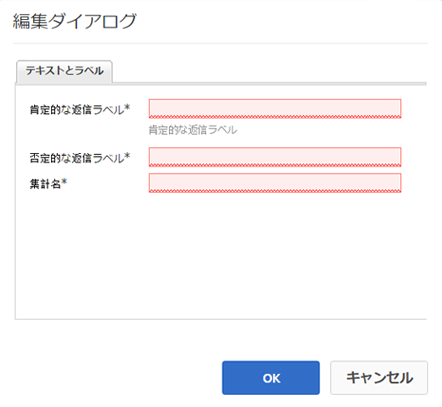

# 「いいね!」設定の使用 {#using-liking}

The `Liking` component is a useful tool that allows users to express an opinion about a particular piece of content, such as an comment within a forum. With the `Liking` component, members select the heart icon to indicate a positive opinion.

## ページへの「いいね!」設定の追加 {#adding-liking-to-a-page}

To add a `Liking` component to a page in author mode, use the component browser to locate

* `Communities / Liking`

を探し、ページ上の適切な位置（ユーザーに「いいね!」してもらう機能の近くなど）にドラッグします。

For necessary information, visit [Communities Components Basics](basics.md).

[必要なクライアント側のライブラリが含まれる場合](essentials-liking.md#essentials-for-client-side) 、これがコンポー `Liking` ネントの表示方法です。

## 「いいね!」の設定{#configuring-liking}

Select the placed `Liking` component to access and select the `Configure` icon which opens the edit dialog.

Under the **[!UICONTROL Texts &amp; Labels]** tab, specify the properties used to record likes.

* **[!UICONTROL 肯定的な返信ラベル]**

   (*必須*)ポジティブな反応を表すプロパティ名です。

* **[!UICONTROL 否定的な返信ラベル]**

   (*必須*)否定応答のプロパティ名。

* **[!UICONTROL 集計名]**

   (*Required*) The internal, identifiable property name for this instance of a voting component.

## サイト訪問者のエクスペリエンス {#site-visitor-experience}

### メンバー {#members}

メンバーは、いつでも「いいね!」を変更できます。

### 匿名 {#anonymous}

匿名での「いいね!」はサポートされていません。サイト訪問者は、「いいね！」に参加するには、登録（会員になる）し、サインインする必要があります。

## 追加情報 {#additional-information}

More information may be found on the [Liking Essentials](essentials-liking.md) page for developers.
