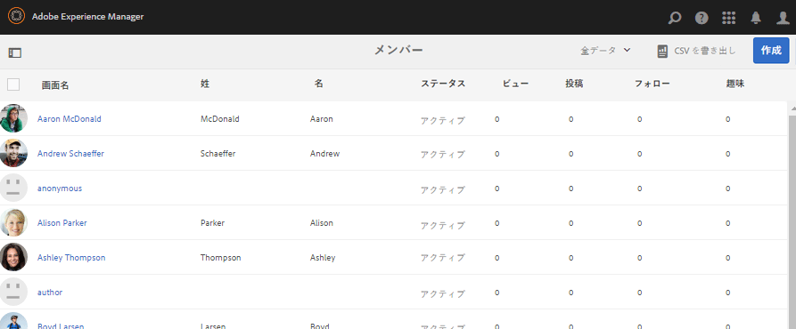
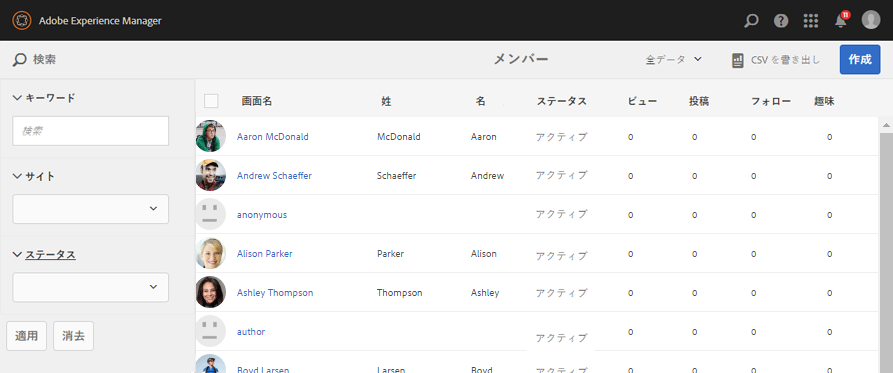
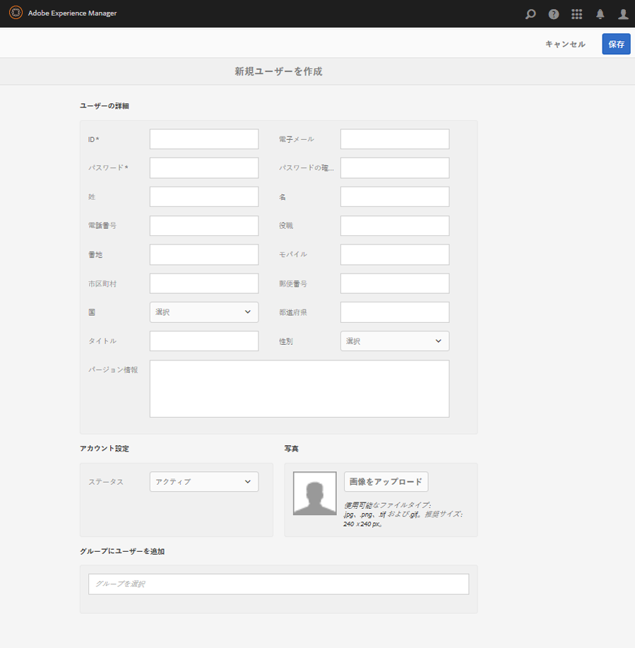
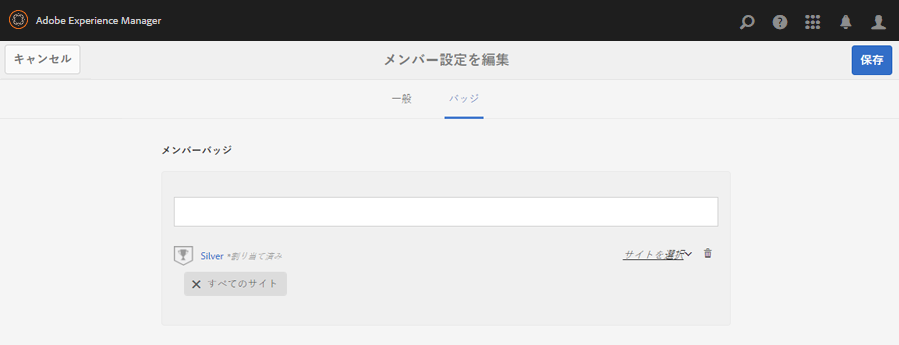
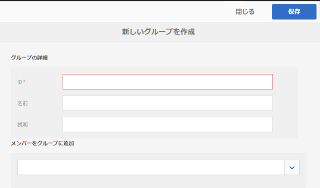

# メンバーコンソールとグループ管理コンソール {#members-groups-management-consoles}

## 概要 {#overview}

AEM Communities の機能の多くは、サイト訪問者に対して、パブリッシュ環境でコミュニティに参加する前に登録とサインインを求めます。Their user registration need only exist in the publish environment and they are commonly referred to as *members* to distinguish them from *users* registered in the author environment.

### パブリッシュ環境のメンバー（ユーザー） {#members-users-on-publish}

Using the Communities Members and Groups consoles, members and member groups registered in the *publish* environment may be created and managed from the *author* environment. This is only possible when the [tunnel service](deploy-communities.md#tunnel-service-on-author) is enabled.

### オーサー環境のユーザー {#users-on-author}

For managing users and groups registered in the *author* environment, is is necessary to use the platform&#39;s security console:

* From global navigation, select **[!UICONTROL Tools]** > **[!UICONTROL Security]** > **[!UICONTROL Users]**.
* From global navigation, select **[!UICONTROL Tools]** > **[!UICONTROL Security]** > **[!UICONTROL Groups]**.

>[!NOTE]
>
>サンプルコンテンツがデプロイされて有効になっていると、オーサー環境とパブリッシュ環境の両方に多数のサンプルユーザーが存在します。These users will not be present when running with [nosamplecontent runmode](../../help/sites-administering/production-ready.md).

## メンバーコンソール {#members-console}

パブリッシュ環境で登録されたメンバーをオーサー環境で管理するには、次の場所にあるメンバーコンソールを使用します。

* From global navigation, select **[!UICONTROL Navigation]** > **[!UICONTROL Communities]** > **[!UICONTROL Members]**

>[!CAUTION]
>
>It will not be possible to use the Members console if the [tunnel service](deploy-communities.md#tunnel-service-on-author) is not enabled.

### 検索 {#search-features}

Select the side panel icon on the left side of the `Members` header to toggle open the search side panel.

Select the search icon on the left side of the `Members` header to toggle the search side panel closed.

### メンバーの統計 {#member-statistics}

The columns displaying `Views`, `Posts`, `Follows` and `Likes` are updated when the user is a member of one or more community sites with Adobe Analytics [enabled](sites-console.md#analytics).

### CSV の書き出し {#export-csv}

Selecting the `Export CSV` link results in downloading all members as a list of comma-separated values, suitable for importing into a spreadsheet.

列ヘッダーは次のとおりです。

`| Screen Name |Last Name |First Name |Status |Views |Posts |Follows |Likes |`

## 新しいメンバーを作成 {#create-new-member}

Select `Create Member` in order to create a user in the publish environment.

### 一般 - メンバー詳細 {#general-member-details}

大部分のフィールドはオプションです。メンバーは後からフィールドに自分のプロファイルを入力できます。

* **[!UICONTROL ID]**

(*Required*) The authorizable ID is the member&#39;s sign-in ID.
デフォルトでは、ID は必須の電子メールアドレスの値に設定されています。*IDは作成後は変更できません*。

* **[!UICONTROL 電子メールアドレス]**

(*必須*)メンバーの電子メールアドレス。
メンバーは、プロファイルの更新時に自分の電子メールアドレスを変更できます。デフォルトで電子メールアドレスに設定されているIDの場合、電子メールアドレスが変更されても ** 、IDは変更されません。

* **[!UICONTROL パスワード]**

   (*Required*) The sign-in password.

* **[!UICONTROL パスワードの確認入力]**

   (*必須*)確認のためにパスワードを再入力します。

* **[!UICONTROL メンバーをサイトに追加]**

   (*Optional*) Select from existing community sites in order to add the member to the community site&#39;s members group.

* **[!UICONTROL メンバーをグループに追加]**

   (*Optional*) Select from existing member groups in order to add the member to that group.

* Select **[!UICONTROL Save]**

### 一般 - アカウント設定 {#general-account-settings}

アカウントの設定では、コミュニティ管理者は次のことができます。

* **[!UICONTROL ステータス]**
   * 禁止されたメンバーはサインインできず、ページを表示できないか、ログインが必要なアクティビティに参加できません。 未だにオープンコミュニティサイトを匿名で訪問している可能性がある。

   * 禁止されていないメンバーはコミュニティサイトのすべての機能にアクセスできます。

   デフォルトは `Not Banned` です。

* **[!UICONTROL 貢献度の制限]**

   オンにすると、メンバーがコンテンツを投稿する権限が制限されます。
初期設定は、貢献度の制限の設定によって異なります。[メンバーの貢献度の制限](limits.md)を参照してください。

* **[!UICONTROL パスワードを変更]**

   既存のメンバーの変更時に存在するリンク。 コミュニティ管理者がメンバーのパスワードをリセットする機能を提供します。

### 一般 - 写真 {#general-photo}

メンバーのアバターを設定するには、まず「**[!UICONTROL 画像をアップロード]**」を選択して、.jpg、.png、.tif、.gif のいずれかから画像の種類を選択します。画像の推奨されるサイズは、240 x 240ピクセル、72 dpiです。

### 一般 - メンバーをサイトに追加 {#general-add-member-to-sites}

1 つ以上のコミュニティサイトのメンバーグループにメンバーを追加できます。まず、テキストボックスにテキストを入力します。

### 一般 - メンバーをグループに追加 {#general-add-member-to-groups}

1 つ以上のメンバーグループにメンバーを追加できます。まず、テキストボックスにテキストを入力します。

### 「バッジ」タブ{#badges-tab}

The `BADGES` panel provides the ability to manually assign badges as well as revoke them. バッジは通常、獲得するものですが、役割の割り当てに使用することもできます。

[スコアとバッジ](implementing-scoring.md)も参照してください。

* **[!UICONTROL 追加バッジ]**
   * Begin typing to select from [available badges](badges.md). バッジを選択したら、各サイトまたはすべてのサイトを選択します。このサイト上に、会員のアバターと共にバッジを表示します。
   * 複数のバッジとサイトを選択できます。
* **[!UICONTROL バッジを削除]**
   * バッジの横にあるごみ箱アイコンを選択して、削除します。

## グループコンソール {#groups-console}

グループコンソールはオーサー環境から使用でき、パブリッシュ環境で登録されたメンバーグループの作成や管理をおこなうことができます。特に、以下の目的で使用されます。
* [特権を持つメンバーグループ](users.md#privilegedmembersgroups)
* Group-based assignment of [enablement resources](resources.md)

グループコンソールにアクセスするには：
* From global navigation, select **[!UICONTROL Navigation]** > **[!UICONTROL Communities]** > **[!UICONTROL Groups]**.

>[!CAUTION]
>
>[トンネルサービス](deploy-communities.md#tunnel-service-on-author)が有効でない場合、グループコンソールを使用することはできません。

### 新しいグループを作成 {#create-new-group}

Select `Add Group` in order to create a group in the publish environment.

パブリッシュ側の新しいメンバーグループを作成するには、以下のフィールドを指定します。

* **[!UICONTROL ID]**

   (*Required*) The group unique ID.

   *ID は一度作成すると変更できません。*

* **[!UICONTROL 名前]**

   (*Optional*) The display name for the group.

   デフォルトの値は ID です。

* **[!UICONTROL 説明]**

   (*Optional*) A description of the group&#39;s purpose and permissions.

* **[!UICONTROL メンバーをグループに追加]**

   (*Optional*) Select publish-side members to be included as initial members of the group.

* Select **[!UICONTROL Save]**

## 承認された管理者 {#authorized-administrators}

When working with members in the Communities members console, it is necessary to be signed in as a user with appropriate permissions, and for the replication agent used by the [tunnel service](deploy-communities.md#tunnel-service-on-author) to be correctly configured.

If not signed in as `admin`, then the signed in user must be a member of the `administrators` user group.

See also [Replication Agents on Author](deploy-communities.md#replication-agents-on-author).
