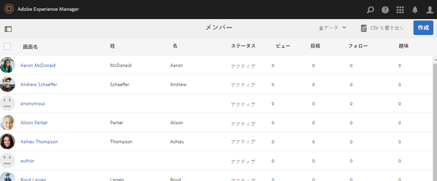
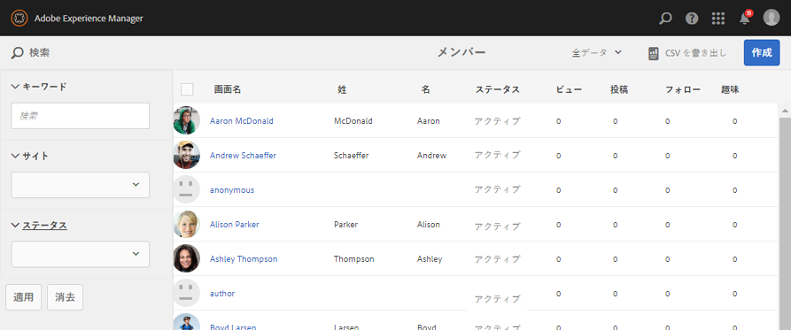
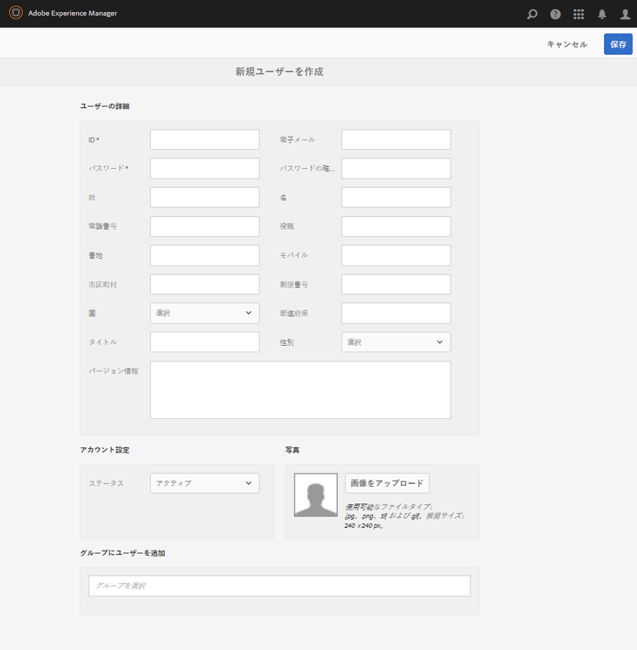
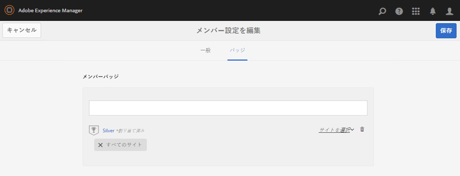
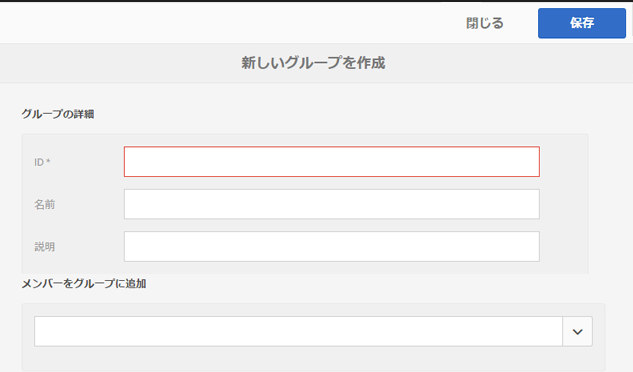

# メンバーコンソールとグループ管理コンソール {#members-groups-management-consoles}

## 概要 {#overview}

AEM Communitiesの機能では、多くの場合、パブリッシュ環境でコミュニティに参加する前に、サイト訪問者を登録してログインする必要があります。 ユーザー登録はパブリッシュ環境にのみ存在し、オーサー環境に登録されている&#x200B;*ユーザー*&#x200B;と区別するために、一般的に&#x200B;*メンバー*&#x200B;と呼ばれます。

### パブリッシュ時のメンバー（ユーザー） {#members-users-on-publish}

コミュニティ メンバーとグループ コンソールを使用して、*publish*&#x200B;環境で登録されたメンバーとメンバーグループを、*author*&#x200B;環境で作成および管理できます。 これは、[ トンネルサービス ](deploy-communities.md#tunnel-service-on-author)が有効になっている場合にのみ可能です。

### 作成者のユーザー {#users-on-author}

*author*&#x200B;環境に登録されているユーザーとグループを管理するには、プラットフォームのセキュリティコンソールを使用する必要があります。

* グローバルナビゲーションから、**[!UICONTROL ツール]** > **[!UICONTROL セキュリティ]** > **[!UICONTROL ユーザー]**&#x200B;を選択します。
* グローバルナビゲーションから、**[!UICONTROL ツール]**/**[!UICONTROL セキュリティ]**/**[!UICONTROL グループ]**&#x200B;を選択します。

>[!NOTE]
>
>サンプルコンテンツをデプロイして有効にすると、多くのサンプルユーザーがオーサー環境とパブリッシュ環境の両方に存在します。 これらのユーザーは、[nosamplecontent runmode](../../help/sites-administering/production-ready.md)で実行する場合は存在しません。

## メンバーコンソール {#members-console}

オーサー環境で、パブリッシュ環境に登録されたメンバーを管理するためのメンバーコンソールにアクセスするには、次の手順を実行します。

* グローバルナビゲーションから、**[!UICONTROL ナビゲーション]** > **[!UICONTROL コミュニティ]** > **[!UICONTROL メンバー]**&#x200B;を選択します

>[!CAUTION]
>
>[ トンネルサービス ](deploy-communities.md#tunnel-service-on-author)が有効になっていない場合、メンバーコンソールを使用することはできません。

### 検索 {#search-features}

`Members` ヘッダーの左側にあるサイドパネルアイコンを選択して、検索サイドパネルを開くように切り替えます。

`Members` ヘッダーの左側にある検索アイコンを選択して、検索サイドパネルを閉じるように切り替えます。

### メンバー統計 {#member-statistics}

`Views`、`Posts`、`Follows`および`Likes`を表示する列は、ユーザーがAdobe Analytics [が有効](sites-console.md#analytics)になっている1つ以上のコミュニティサイトのメンバーである場合に更新されます。

### CSV を書き出し {#export-csv}

`Export CSV` リンクを選択すると、すべてのメンバーがコンマ区切りの値のリストとしてダウンロードされます。これは、スプレッドシートに読み込むのに適しています。

列ヘッダーは

`| Screen Name |Last Name |First Name |Status |Views |Posts |Follows |Likes |`

## 新しいメンバーを作成 {#create-new-member}

パブリッシュ環境でユーザーを作成するには、`Create Member`を選択します。

### 一般 – メンバーの詳細 {#general-member-details}

ほとんどのフィールドは、メンバーが後でプロファイルに入力できるオプションのフィールドです。

* **[!UICONTROL ID]**

（*必須*）承認可能なIDは、メンバーのログイン IDです。
デフォルトでは、IDは必要なメールアドレスの値に設定されます。
*一度作成したIDは、変更できません*。

* **[!UICONTROL メールアドレス]**

（*必須*）メンバーの電子メールアドレス。
会員は、プロフィールを更新する際にメールアドレスを変更することができます。
IDがデフォルトで電子メールアドレスに設定されている場合、電子メールアドレスが変更されると、IDは*not*&#x200B;に変更されます。

* **[!UICONTROL パスワード]**

  （*必須*）ログイン パスワード。

* **[!UICONTROL パスワードを再入力]**

  （*必須*）確認のためにパスワードを再入力してください。

* **[!UICONTROL サイトにメンバーを追加]**

  （*オプション*）既存のコミュニティサイトから選択して、コミュニティサイトのメンバーグループにメンバーを追加します。

* **[!UICONTROL グループにメンバーを追加]**

  （*オプション*）既存のメンバーグループから選択して、そのグループにメンバーを追加します。

* 「**[!UICONTROL 保存]**」を選択します

### 一般 – アカウント設定 {#general-account-settings}

アカウント設定では、コミュニティ管理者は次のことができます。

* **[!UICONTROL ステータス]**
   * 禁止されている
メンバーはログインできず、ページの表示やログインが必要なアクティビティへの参加が妨げられます。 匿名でオープンコミュニティのサイトにアクセスすることもできます。

   * 禁止されていない
メンバーはコミュニティサイトに完全にアクセスできます。

  デフォルトは `Not Banned` です。

* **[!UICONTROL 貢献度の制限]**

  オンにした場合、コンテンツを投稿するメンバーの機能は制限されます。
デフォルトは、貢献度制限の設定によって異なります。
[ メンバーの貢献度の制限](limits.md)を参照してください。

* **[!UICONTROL パスワードの変更]**

  既存のメンバーを修正する際に存在するリンク。 コミュニティ管理者がメンバーのパスワードをリセットする機能を提供します。

### 一般 – 写真 {#general-photo}

メンバーにアバターを提供するには、まず&#x200B;**[!UICONTROL 画像をアップロード]**&#x200B;を選択し、.jpg、.png、.tif、または.gif タイプの画像を選択します。 画像の最適なサイズは、72 dpiの240 x 240 ピクセルです。

### 一般 – サイトへのメンバーの追加 {#general-add-member-to-sites}

メンバーは、1つ以上のコミュニティサイトのメンバーグループに追加できます。 最初に、テキストボックスにテキストを入力します。

### 一般 – グループへのメンバーの追加 {#general-add-member-to-groups}

メンバーは、1つ以上のメンバーグループに追加できます。 最初に、テキストボックスにテキストを入力します。

### 「バッジ」タブ {#badges-tab}

`BADGES` パネルには、バッジを手動で割り当てて取り消す機能が用意されています。 バッジは、割り当てられた役割と、通常獲得されるバッジに対して使用できます。

[ スコアリングとバッジ ](implementing-scoring.md)も参照してください。

* **[!UICONTROL バッジを追加]**
   * [使用可能なバッジ ](badges.md)から選択するために入力を開始します。 バッジを選択したら、メンバーのアバターと共にバッジを表示する各サイトまたはすべてのサイトを選択します。
   * 複数のバッジやサイトを選択できます。
* **[!UICONTROL バッジの削除]**
   * バッジの横にあるごみ箱アイコンを選択して削除します。

## グループコンソール {#groups-console}

オーサー環境から使用できるグループコンソールを使用すると、パブリッシュ環境に登録されたメンバーグループを作成および管理できます。 特に[特権メンバーグループ ](users.md#privilegedmembersgroups)に便利です。

グループコンソールにアクセスするには：
* グローバルナビゲーションから、**[!UICONTROL ナビゲーション]** > **[!UICONTROL コミュニティ]** > **[!UICONTROL グループ]**&#x200B;を選択します。

>[!CAUTION]
>
>[ トンネルサービス ](deploy-communities.md#tunnel-service-on-author)が有効になっていない場合、グループコンソールを使用できません。

### 新しいグループを作成 {#create-new-group}

パブリッシュ環境でグループを作成するには、`Add Group`を選択します。

パブリッシュサイドメンバーグループを作成するための必須フィールドは次のとおりです。

* **[!UICONTROL ID]**

  （*必須*） グループの一意のID。

  *一度作成したIDは変更できません。*

* **[!UICONTROL 名前]**

  （*オプション*） グループの表示名。

  デフォルト値はIDです。

* **[!UICONTROL 説明]**

  （*オプション*） グループの目的と権限の説明。

* **[!UICONTROL グループにメンバーを追加]**

  （*オプション*）グループの初期メンバーとして含めるパブリッシュサイドメンバーを選択します。

* 「**[!UICONTROL 保存]**」を選択します

## 承認済み管理者 {#authorized-administrators}

Communities メンバーコンソールでメンバーを操作する場合は、適切な権限を持つユーザーとしてサインインし、[ トンネルサービス ](deploy-communities.md#tunnel-service-on-author)で使用されるレプリケーションエージェントを正しく設定する必要があります。

`admin`としてサインインしていない場合、サインインしているユーザーは`administrators` ユーザーグループのメンバーである必要があります。

作成者](deploy-communities.md#replication-agents-on-author)の[ レプリケーションエージェントも参照してください。
