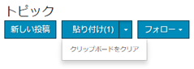
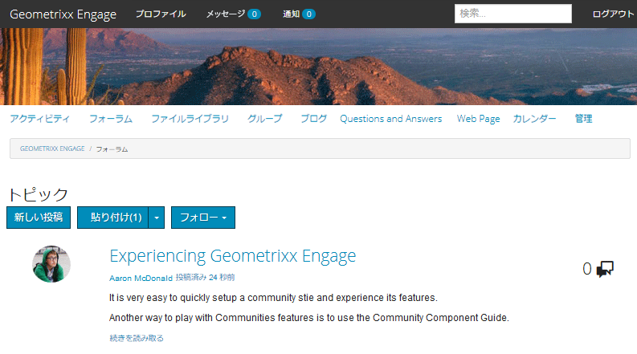

# コミュニティコンテンツのモデレート {#moderating-community-content}

## 概要 {#overview}

コミュニティコンテンツは、ユーザー生成コンテンツ（UGC）とも呼ばれ、メンバー（サイト訪問者にログイン）が次のコミュニティコンポーネントのいずれかとのインタラクションを通じて、公開済みのコミュニティサイトからコンテンツを投稿する際に作成されます。

* [ ブログ ](/help/communities/blog-feature.md)：メンバーがブログの記事やコメントを投稿します。
* [ カレンダー ](/help/communities/calendar.md)：メンバーがカレンダーイベントまたはコメントを投稿します。
* [ コメント ](/help/communities/comments.md)：メンバーがコメントを投稿したり、コメントに返信したりします。

* [ フォーラム ](/help/communities/forum.md)：メンバーが新しいトピックを投稿したり、トピックに返信したりします。
* [ アイディエーション ](/help/communities/ideation-feature.md)：メンバーがアイデアまたはコメントを投稿します。
* [QnA](/help/communities/working-with-qna.md)：メンバーが質問を作成したり、質問に回答したりします。
* [ レビュー ](/help/communities/reviews.md)：メンバーがアイテムを評価する際にコメントを投稿します。

UGC のモデレートは、肯定的な投稿を認識し、否定的な投稿（スパムや侮辱的な言葉など）を制限するのに役立ちます。 UGC は、次の複数の環境でモデレートできます。

* [コミュニティコンテンツストレージ](working-with-srp.md)

* [一括モデレートコンソール](moderation.md)

  モデレートコンソールには、パブリック環境の管理者および [ コミュニティモデレーター ](/help/communities/users.md) と、オーサー環境の管理者がアクセスできます。 これは、コミュニティコンテンツが [ 共通ストア ](/help/communities/working-with-srp.md) に保存されている場合に可能です。

* [コンテキスト内モデレート](in-context.md)

  Publishでのモデレートは、管理者およびコミュニティモデレーターが、コンテンツが投稿されたページで直接行うことができます。

## モデレートアクション {#moderation-actions}

投稿されたコンテンツ（UGC）に対して実行できるアクションは、ユーザー ID と環境に応じて異なります。 次の表では、以下の用語を使用して、ユーザー ID に応じた様々な役割について説明します。

* `Admin`

  [ コミュニティ管理者 ](users.md) グループのメンバーであるユーザー。

* `Moderator`

  [ コミュニティモデレーター ](users.md#publishenvironmentusersandgroups) グループのメンバー（[ モデレーター権限 ](in-context.md#moderatorpermissions) 持つ）。

* `Creator`

  コンテンツを投稿したユーザー。

* `Member`

  特別な権限のないログインユーザー。

* `Visitor`

  匿名ユーザー。

<table>
 <tbody>
  <tr>
   <td> </td>
   <td><strong>管理者</strong></td>
   <td><strong>モデレーター</strong></td>
   <td><strong>作成者</strong></td>
   <td><strong>メンバー</strong></td>
   <td><strong>訪問者</strong></td>
   <td><strong>イベント   トリガー</strong></td>
   <td><strong>前モデレート</strong></td>
  </tr>
  <tr>
   <td><strong>編集/  削除</strong></td>
   <td>X</td>
   <td>X</td>
   <td>X</td>
   <td> </td>
   <td> </td>
   <td> </td>
   <td> </td>
  </tr>
  <tr>
   <td><strong>カット</strong></td>
   <td>X</td>
   <td>X</td>
   <td> </td>
   <td> </td>
   <td> </td>
   <td> </td>
   <td> </td>
  </tr>
  <tr>
   <td><strong>拒否</strong></td>
   <td>X</td>
   <td>X</td>
   <td> </td>
   <td> </td>
   <td> </td>
   <td>X</td>
   <td> </td>
  </tr>
  <tr>
   <td><strong>Close/  Reopen</strong></td>
   <td>X</td>
   <td>X</td>
   <td> </td>
   <td> </td>
   <td> </td>
   <td>X</td>
   <td>X  </td>
  </tr>
  <tr>
   <td><strong>フラグ/  フラグ解除</strong></td>
   <td>X</td>
   <td>X</td>
   <td> </td>
   <td>X</td>
   <td> </td>
   <td>X</td>
   <td> </td>
  </tr>
  <tr>
   <td><strong>許可</strong></td>
   <td>X</td>
   <td>X</td>
   <td> </td>
   <td> </td>
   <td> </td>
   <td>X</td>
   <td>X</td>
  </tr>
 </tbody>
</table>

### 編集/削除 {#edit-delete}

投稿が作成された後、作成者、管理者またはコミュニティモデレーターが編集または削除する場合があります。

UGC を削除すると、リポジトリから削除され、復元されない場合があります。

### カット {#cut}

管理者またはコミュニティモデレーターは、1 つ以上のフォーラムトピックまたは QnA 質問をある場所から別の場所に移動できます。 これには、同じメンバーが両方のサイトでモデレート権限を持っている場合に、1 つのコミュニティサイトから別のコミュニティサイトへの移動が含まれます。

切り取りアクションを選択すると、コンテンツがクリップボードにコピーされます。 複数の支柱をコピーして、グループとして新しい位置に移動できます。

別の場所では、クリップボードにコンテンツが存在する場合、ニューPostの横に「貼り付け」ボタンが表示され、貼り付ける投稿の数を示す番号が表示されます。 「貼り付け」ボタンには、貼り付けではなくクリップボードをクリアするオプションが含まれます。

### 拒否 {#deny}

モデレーターが、公開されたサイトに UGC が表示されたままになることを許可しない場合があります。 管理者およびコミュニティモデレーターは、投稿を引き続き使用でき、スパムとして注釈が付けられます。

### 閉じる/再度開く {#close-reopen}

閉じるアクションは、会話のスレッド全体（フォーラムトピックまたは最初のコメント）に対して実行され、以降のすべての投稿または返信が含まれます。

クローズすると、それ以上の返信ができなくなるだけでなく、モデレーションアクションも許可されません。

操作を実行するには、トピックまたはコメントを再度開く必要があります。

管理者またはコミュニティモデレーターが Close/Reopen アクションを実行できます。

### フラグ/フラグ解除 {#flag-unflag}

フラグは、コンテンツの作成者以外のログインメンバーが、投稿のコンテンツに問題があることを示すための手段です。 フラグが設定されると、フラグ解除アイコンが表示され、同じメンバーがコンテンツのフラグを解除できます。

コンテキスト内モデレートを設定して、メンバーが投稿にフラグを設定する際に理由を選択できるようにすることができます。 選択可能なフラグ理由のリストは、カスタム理由を入力できるかどうかなど、設定可能です。 フラグの理由は UGC に保存されますが、理由は特定のアクションをトリガーするものではありません。 通知をトリガーするフラグの数のみ。 フラグの設定されたコンテンツには注釈が付けられるので、モデレーターが対応することができます。

システムは、フラグを設定したすべてのフラグ、フラグの設定された理由、およびしきい値に達した場合にイベントを送信します。 UGC がコミュニティモデレーターによって許可されている場合、これらのフラグはアーカイブされます。 を許可およびアーカイブした後、後続のフラグがある場合、以前のフラグがないかのようにアーカイブされます。

### 許可 {#allow}

「許可」アクションは、フラグが設定された、拒否された、または事前にモデレートされたシステムで承認されていない UGC のオプションです。 許可アクションは、フラグ付きまたは拒否/スパムのステータスが存在する場合はすべてクリアし、フラグ付きのデータをアーカイブします。

## モデレートの一般的な概念 {#common-moderation-concepts}

### 前モデレート {#premoderation}

UGC がプレモデレートされると、投稿は、モデレートアクションによって承認されるまで、公開されたサイトに表示されません。 [ コミュニティサイト ](/help/communities/sites-console.md) の作成時に、「コンテンツはプレモデレートされています [ ボックスをオンにすると、サイト全体でプレモデレートが有効 ](sites-console.md#moderation) なります。 コンポーネントをページに配置すると、モデレートをサポートするコンポーネントを、編集ダイアログの設定を使用してプレモデレート用に設定できます。

* [ コメント ](comments.md) および [ レビュー ](reviews.md)
**[!UICONTROL ユーザーモデレート]**/**[!UICONTROL プレモデレート]** で行います。

* [Forum](/help/communities/forum.md)、[ideation](/help/communities/ideation-feature.md)、[QnA](/help/communities/working-with-qna.md) および [calendar](/help/communities/calendar.md)
**[!UICONTROL 設定]**/**[!UICONTROL モデレート済み]** で行います。

### スパム検出 {#spam-detection}

スパム検出は、送信されたユーザー生成コンテンツの望ましくない部分をスパムとしてマークして除外する自動モデレート機能です。 有効にすると、事前に設定されたスパムワードのコレクションに基づいて、ユーザーが生成したコンテンツがスパムであるかどうかを識別します。 デフォルトのスパムワードは、次の場所で提供されています。

`/libs/settings/community/sites/moderation/spamdetector-conf/profiles/spam_words.txt`。

ただし、デフォルトのスパムワードをカスタマイズまたは拡張するには、[overlay](/help/communities/overlay-comments.md) を使用して、デフォルトのスパムワードの構造に従って/apps ディレクトリに一連のワードを作成します。

スパムワードを含むすべてのコンテンツタイプ（ブログ、フォーラム、コメントなど）でユーザーが生成した投稿には、投稿の上に「この投稿はスパムとして分類されました」というテキストが付きます。

モデレーターは、そのような投稿を表示し、同じことをマークして、サイトへの表示を許可または拒否できます。 これらの投稿に対するモデレートアクションは、コンテキスト内または一括モデレート UI を使用して実行できます。

スパム検出エンジンを有効にするには、次の手順に従います。

1. `/system/console/configMgr` に移動して、[Web コンソール ](https://localhost:4502/system/console/configMgr) を開きます。

1. **AEM Communities自動モデレート** 設定を見つけて、編集します。
1. **[!UICONTROL SpamProcess]** エントリを追加します。

>[!NOTE]
>
>スパム検出は英語のロケールにのみ実装されています。

### 好感度 {#sentiment}

センチメントは、投稿（UGC）に存在するポジティブおよびネガティブキーワード（[ ウォッチワード ](#configuringwatchwords)）の数に基づいて計算されます。

センチメント分析は、事前設定済みの一連のルールを使用し、UGC のセンチメントを計算します。 デフォルトのルールは `/libs/cq/workflow/components/workflow/social/sentiments/rules` です。

ルールが生成する値は、1 （すべての負、正の単語なし）から 10 （すべての正、負の単語なし）です。 センチメント値が 5 の場合、中立的なセンチメントであり、デフォルトです。

/libs コンポーネントで定義されるルールは次のとおりです。

* ルール 1：正の単語と少なくとも 1 つの負の単語がない場合、値を 1 に設定します。
* ルール 2：負の単語がなく、正の単語が 1 つ以上ある場合は、値を 10 に設定します。
* ルール 3：正の単語よりも負の単語の数が多い場合、値を 3 に設定する。
* ルール 4：負の単語よりも正の単語の数が多い場合は、値を 8 に設定します。

ルールを上書きまたは追加するには、デフォルトのルールの構造に従って、/apps ディレクトリに一連のルールを作成します。 センチメント設定を編集して、ルールの場所を特定できるようにします。

分析が完了すると、センチメントは UGC に保存されます。

[ 一括モデレートコンソール ](/help/communities/moderation.md) から、センチメントがネガティブ、ニュートラル、ポジティブのいずれに基づいて UGC をフィルタリングして表示することが可能です。

#### ウォッチワード {#watchwords}

*AEM Communitiesは、「センチメント* を評価するプロセスの一環として、[ ウォッチワードアナライザー ](#sentiment) を提供しています。 ウォッチワードによって提供されるセンチメント値への貢献は、投稿されたコンテンツで使用される負のウォッチワードと正のウォッチワード、および禁止されたワードの比較によるものです。

#### センチメントとウォッチワードの設定 {#configure-sentiment-and-watchwords}

ポジティブおよびネガティブウォッチワードのリストは、センチメントルールと同様にカスタマイズできます。

ウォッチワードのデフォルトのリストは、デフォルトの場合と同様に、リポジトリ内のノードのプロパティとして入力できます。また、ワードのリストを使用して OSGi サービス `sentimentprocess.name` を設定することで、デフォルトのリストを上書きできます。

**sentimentprocess.name** は、センチメントルールのカスタムセットの場所を参照するように変更することもできます。

センチメントとウォッチワードを設定するには：

* オーサーインスタンスに管理者としてログインします。
* [Web コンソール ](https://localhost:4502/system/console/configMgr) を開きます。
* `sentimentprocess.name` を見つけます。
* 設定を選択すると、編集モードで開くことができます。

* **ポジティブ・ウォッチワード**

  デフォルトを上書きする肯定的なセンチメントに貢献する単語のコンマ区切りリスト。 デフォルトは空のリストです。

* **ネガティブウォッチワード**

  デフォルトを上書きする負のセンチメントに貢献する単語のコンマ区切りリスト。 デフォルトは空のリストです。

* **ウォッチワードノードの明示的パス**

  デフォルトのウォッチワードと、デフォルトのウォッ `positive` ワードを指定するプロパティ `negative` 含むノードのリポジトリの場所。 デフォルトは `/libs/settings/community/watchwords/default` です。

* **センチメントルール**

  ポジティブおよびネガティブウォッチワードに基づいてセンチメントを計算するためのルールのリポジトリ場所。 デフォルトは `/libs/cq/workflow/components/workflow/social/sentiments/rules` です（ただし、関与するワークフローはありません）。

`Explicit Path to Watchwords Node` が `/libs/settings/community/watchwords/default` に設定されている場合の、デフォルトのウォッチワードのカスタムエントリの例を次に示します。

### モデレーター権限 {#moderator-permissions}

次の権限を同じリソースに割り当てた場合、総称して `moderator permissions` と呼びます。

* `Read`
* `Modify`
* `Create`
* `Delete`
* `Replicate`
